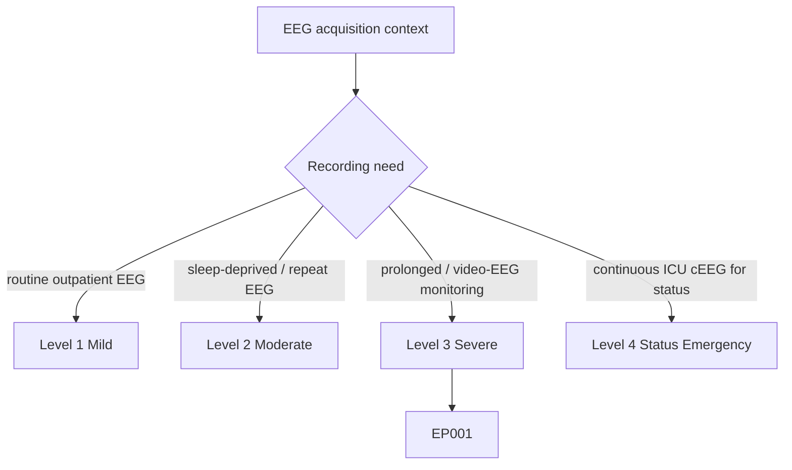
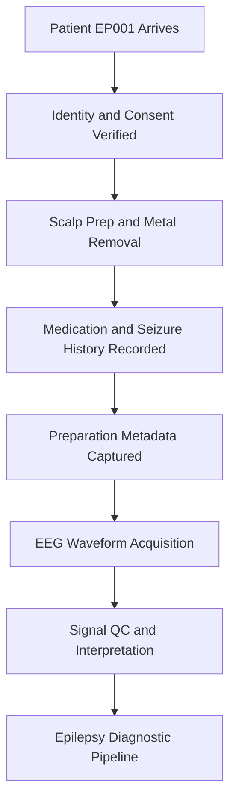
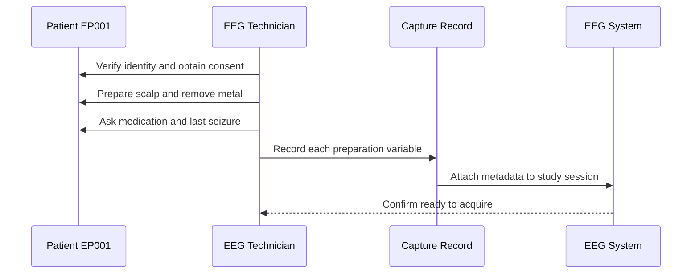
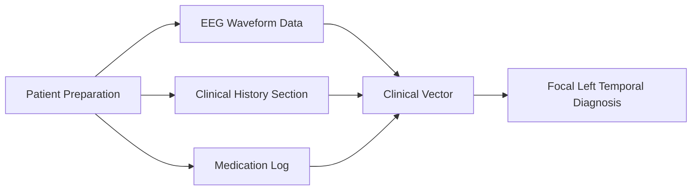
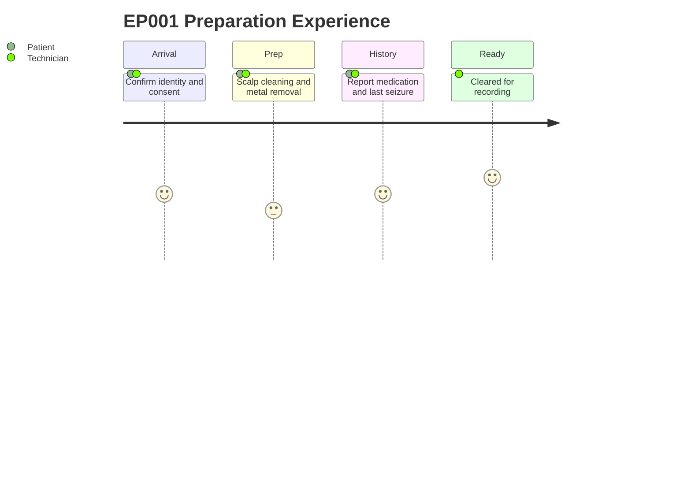

# EEG Technician Assessment — Patient Preparation (EP001)

> **Why (this doc):** Patient preparation is the acquisition-quality gate for the entire EEG study — verified identity, informed consent, clean low-impedance scalp, removed artifact sources, and documented medication/seizure/sleep state determine whether the downstream waveform is trustworthy or noise. **How:** The EEG technician completes a structured pre-recording checklist for patient EP001 (29M, focal impaired awareness seizures, left-temporal focus) and captures each item as a discrete, auditable variable before a single electrode goes live.

**Problem:** Uncontrolled preparation variables (poor skin prep, retained metal, unrecorded anti-seizure medication, unknown sleep state) introduce artifact and confounds that corrupt EEG interpretation and any model trained on it.

**Research Objective:** Capture standardized, machine-readable pre-EEG preparation metadata so acquisition quality and clinical context are reproducible inputs to the epilepsy diagnostic pipeline.

**Role:** EEG Technician · **Type:** Primary (acquisition / QC) data — *pre-EEG, not the waveform*

*Caption - Preparation checklist for EP001. Each row is a controlled acquisition precondition captured before recording; values are the technician's verified status for this study.*

| Variable | Value |
|---|---|
| Identity Verified | Yes |
| Consent Signed | Yes |
| Sleep Deprived Study | Yes |
| Hair Clean | Yes |
| Metal Objects Removed | Yes |
| Medication Recorded | Yes |
| Last Seizure Documented | Yes |
| Pregnancy Status | N/A |

## Questionnaire (Enterprise Form)

*Caption - The items the EEG technician records for this section, with response type, validation, EP001's example value, and the derived AI feature.*

| ID | Question | Response Type | Validation | EP001 (Example) | AI Feature |
|---|---|---|---|---|---|
| EEG-0101 | Has the patient's identity been verified against wristband/records? | Yes-No | Yes/No; must be Yes to proceed | Yes | identity_verified |
| EEG-0102 | Has informed consent been signed for the EEG study? | Yes-No | Yes/No; must be Yes to proceed | Yes | consent_signed |
| EEG-0103 | Is this a sleep-deprived study? | Yes-No | Yes/No | Yes | sleep_deprived_study |
| EEG-0104 | Is the patient's hair clean and free of product? | Yes-No | Yes/No | Yes | hair_clean |
| EEG-0105 | Have all metal objects been removed? | Yes-No | Yes/No | Yes | metal_objects_removed |
| EEG-0106 | Has current anti-seizure medication been recorded? | Yes-No | Yes/No | Yes | medication_recorded |
| EEG-0107 | Has the date/time of last seizure been documented? | Yes-No | Yes/No | Yes | last_seizure_documented |
| EEG-0108 | What is the patient's pregnancy status? | Dropdown[Yes, No, N/A] | Allowed set: Yes/No/N/A | N/A | pregnancy_status |

## Severity Scenario Model — EEG Technician View

*Caption - The same acquisition assessment across four epilepsy severity levels from the EEG technician's point of view; each variable shifts with severity and recording context. EP001 corresponds to Level 3 (Severe). Level 4 is the operational emergency — status epilepticus with seizures recurring about every 5 minutes, requiring continuous emergency EEG.*

### Level 1 — Mild (Well-Controlled)
| Variable | Value |
|---|---|
| Identity Verified | Yes |
| Consent Signed | Yes |
| Sleep Deprived Study | No |
| Hair Clean | Yes |
| Metal Objects Removed | Yes |
| Medication Recorded | Yes |
| Last Seizure Documented | Yes (remote) |
| Pregnancy Status | N/A |

### Level 2 — Moderate (Intermediate)
| Variable | Value |
|---|---|
| Identity Verified | Yes |
| Consent Signed | Yes |
| Sleep Deprived Study | Yes |
| Hair Clean | Yes |
| Metal Objects Removed | Yes |
| Medication Recorded | Yes |
| Last Seizure Documented | Yes |
| Pregnancy Status | N/A |

### Level 3 — Severe (Poorly Controlled) — EP001
| Variable | Value |
|---|---|
| Identity Verified | Yes |
| Consent Signed | Yes |
| Sleep Deprived Study | Yes |
| Hair Clean | Yes |
| Metal Objects Removed | Yes |
| Medication Recorded | Yes |
| Last Seizure Documented | Yes |
| Pregnancy Status | N/A |

### Level 4 — Refractory / Status Epilepticus (Operational Emergency)
| Variable | Value |
|---|---|
| Identity Verified | Yes (ICU wristband) |
| Consent Signed | Emergency / surrogate |
| Sleep Deprived Study | N/A (continuous cEEG) |
| Hair Clean | No (urgent bedside) |
| Metal Objects Removed | Partial (emergency) |
| Medication Recorded | Yes (IV anti-seizure / anesthetic) |
| Last Seizure Documented | Ongoing (~every 5 min) |
| Pregnancy Status | N/A |

### Severity Classification Logic

**Reason:** Preparation rigor scales with recording context, from a quick outpatient hookup to an emergency bedside cEEG. **Why:** Higher severity compresses the prep window and forces trade-offs (surrogate consent, no scalp cleaning) that the technician must document. **What is happening:** The same checklist is captured at each level but the achievable status of each item drops as urgency rises. **How it is happening:** The technician records the real preparation state per level rather than an idealized one, so downstream readers can weight signal trust. **Reference:** Fisher et al. (2017).

## Pipeline and Process Diagrams

**Reason:** Shows where preparation data sits upstream of every later stage. **Why:** If prep is skipped or unrecorded, all downstream signal quality is unverifiable. **What is happening:** Preparation metadata is captured as a gate before acquisition begins. **How it is happening:** The technician completes each checklist item and logs the value before enabling recording. **Reference:** Fisher et al. (2017).

**Reason:** Names the technician as the capturing role and the ordered interaction. **Why:** Accountability requires a clear actor and timestamped exchange. **What is happening:** The technician queries the patient and writes each verified value to the record. **How it is happening:** Each checklist item is a discrete message logged before acquisition. **Reference:** Topol (2019).

**Reason:** Links preparation to the other assessment sections and the composite clinical vector. **Why:** Preparation context is only meaningful when joined to signal and history. **What is happening:** Prep metadata feeds the shared clinical vector alongside waveform and history. **How it is happening:** Each captured variable becomes a feature aligned to patient EP001. **Reference:** American Psychological Association (2020).

**Reason:** Captures the lived experience of the preparation step for patient and technician. **Why:** Comfort and cooperation affect artifact levels and data quality. **What is happening:** The patient moves from arrival through prep to being cleared for recording. **How it is happening:** Each phase is scored for experience while the technician logs status. **Reference:** Fisher et al. (2017).

## Professor Readiness (Defense Q&A)

**Q1: Why capture preparation data separately from the EEG waveform?**
A: Preparation is acquisition-quality metadata; it explains and validates the signal. Recording it separately lets us audit whether artifact, medication, or sleep state confounds the waveform interpretation.

**Q2: Why is "Sleep Deprived Study" marked Yes for EP001?**
A: Sleep deprivation is a standard activation procedure that increases the yield of epileptiform discharges, improving diagnostic sensitivity for focal epilepsy such as EP001's left-temporal focus.

**Q3: Why is Pregnancy Status N/A here?**
A: EP001 is a 29-year-old male, so the variable is not applicable; it is retained in the schema for cross-patient consistency and completeness of the capture template.

## References

American Psychological Association. (2020). *Publication manual of the American Psychological Association* (7th ed.). American Psychological Association.

Fisher, R. S., Cross, J. H., French, J. A., Higurashi, N., Hirsch, E., Jansen, F. E., Lagae, L., Moshé, S. L., Peltola, J., Roulet Perez, E., Scheffer, I. E., & Zuberi, S. M. (2017). Operational classification of seizure types by the International League Against Epilepsy: Position paper of the ILAE Commission for Classification and Terminology. *Epilepsia, 58*(4), 522–530. https://doi.org/10.1111/epi.13670

Topol, E. J. (2019). High-performance medicine: The convergence of human and artificial intelligence. *Nature Medicine, 25*(1), 44–56. https://doi.org/10.1038/s41591-018-0300-7
