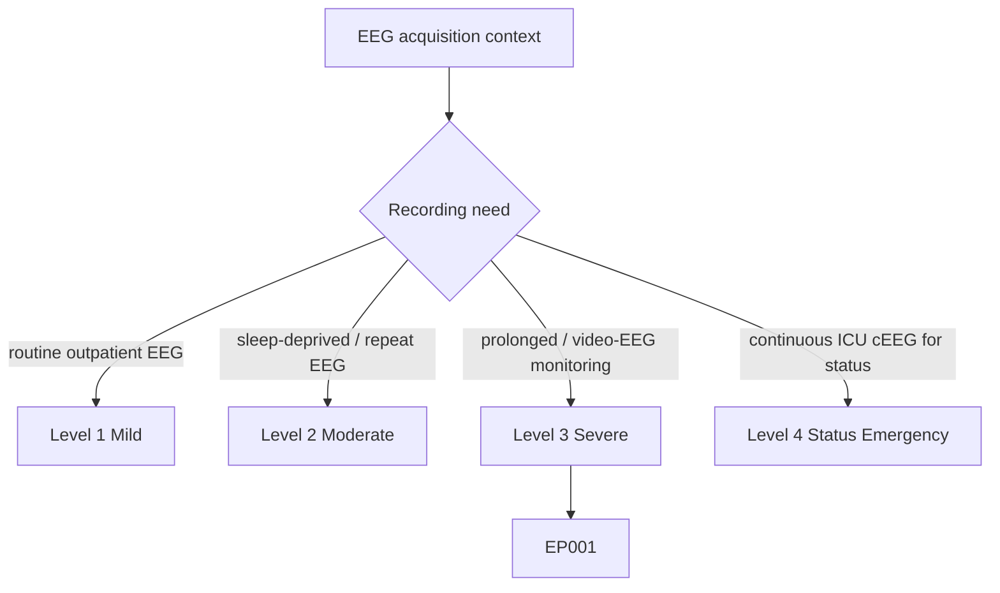
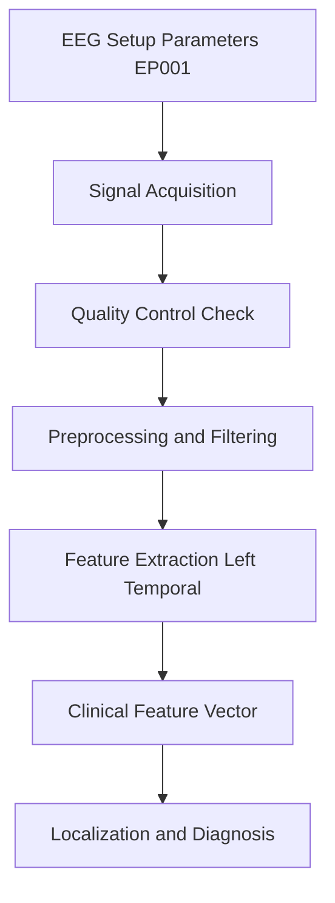
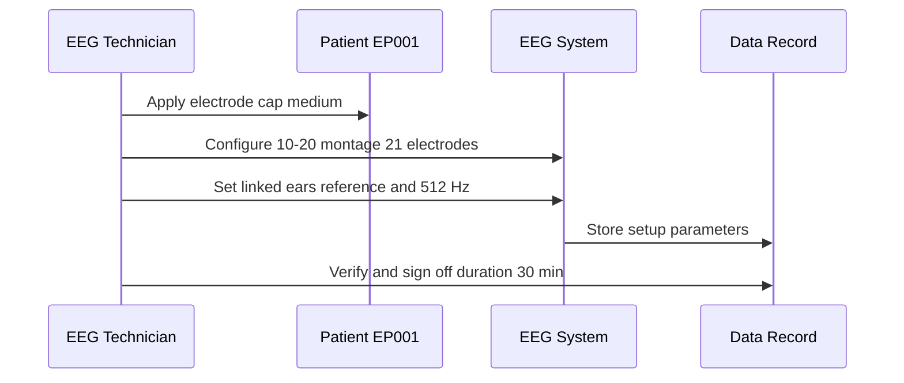
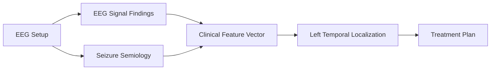
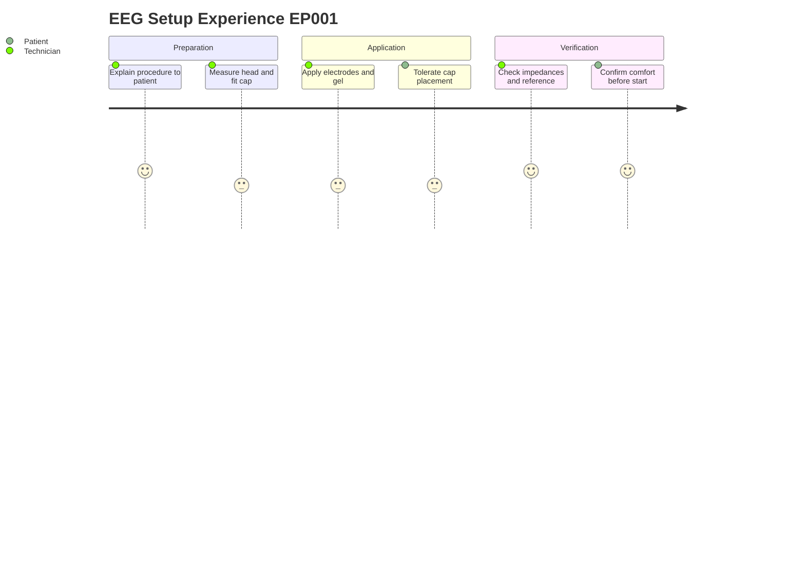

# EEG Technician Assessment — EEG Setup (EP001)

> **Why (this doc):** The EEG montage and acquisition parameters define the physical and technical basis for every downstream signal read on EP001, a 29M with focal impaired awareness seizures of suspected left-temporal origin; incorrect setup silently corrupts all later interpretation. **How:** The EEG technician records the standardized electrode system, count, cap size, reference, planned sampling rate, and duration before acquisition begins, capturing them as structured, auditable variables.

**Role:** EEG Technician · **Type:** Primary (acquisition / QC) data

**Problem:** Focal epilepsy localization depends on high-fidelity scalp EEG, yet inconsistent or undocumented setup parameters undermine reproducibility and cross-study comparison.

**Research Objective:** Capture standardized EEG setup metadata for EP001 so that acquisition conditions are reproducible, quality-controllable, and linkable to the clinical feature vector used for localization.

*Caption - The table below records the fixed EEG acquisition parameters for EP001. These values anchor montage geometry, reference scheme, and temporal resolution, and must be preserved verbatim for QC and reproducibility.*

| Variable | Value |
|---|---|
| Electrode System | 10–20 International |
| Number of Electrodes | 21 |
| Electrode Cap Size | Medium |
| Reference | Linked Ears |
| Sampling Rate Planned | 512 Hz |
| Recording Duration | 30 min |

## Questionnaire (Enterprise Form)

*Caption - The items the EEG technician records for this section, with response type, validation, EP001's example value, and the derived AI feature.*

| ID | Question | Response Type | Validation | EP001 (Example) | AI Feature |
|---|---|---|---|---|---|
| EEG-0201 | Which electrode placement system is used? | Dropdown[10–20 International, 10–10 Extended, High-density] | Allowed set | 10–20 International | electrode_system |
| EEG-0202 | How many electrodes are applied? | Number | Integer 19–256 | 21 | number_of_electrodes |
| EEG-0203 | What electrode cap size was fitted? | Dropdown[Small, Medium, Large] | Allowed set | Medium | electrode_cap_size |
| EEG-0204 | Which reference scheme is configured? | Dropdown[Linked Ears, Average, Cz, Bipolar] | Allowed set | Linked Ears | reference_scheme |
| EEG-0205 | What is the planned sampling rate? | Dropdown[256 Hz, 512 Hz, 1024 Hz] | Allowed set; ≥256 Hz | 512 Hz | sampling_rate_planned |
| EEG-0206 | What is the planned recording duration? | Number | Minutes; ≥20 min (or Continuous) | 30 min | recording_duration_min |

## Severity Scenario Model — EEG Technician View

*Caption - The same acquisition assessment across four epilepsy severity levels from the EEG technician's point of view; each variable shifts with severity and recording context. EP001 corresponds to Level 3 (Severe). Level 4 is the operational emergency — status epilepticus with seizures recurring about every 5 minutes, requiring continuous emergency EEG.*

### Level 1 — Mild (Well-Controlled)
| Variable | Value |
|---|---|
| Electrode System | 10–20 International |
| Number of Electrodes | 21 |
| Electrode Cap Size | Medium |
| Reference | Linked Ears |
| Sampling Rate Planned | 256 Hz |
| Recording Duration | 20–30 min |

### Level 2 — Moderate (Intermediate)
| Variable | Value |
|---|---|
| Electrode System | 10–20 International |
| Number of Electrodes | 21 |
| Electrode Cap Size | Medium |
| Reference | Linked Ears |
| Sampling Rate Planned | 256 Hz |
| Recording Duration | 60 min |

### Level 3 — Severe (Poorly Controlled) — EP001
| Variable | Value |
|---|---|
| Electrode System | 10–20 International |
| Number of Electrodes | 21 |
| Electrode Cap Size | Medium |
| Reference | Linked Ears |
| Sampling Rate Planned | 512 Hz |
| Recording Duration | 30 min |

### Level 4 — Refractory / Status Epilepticus (Operational Emergency)
| Variable | Value |
|---|---|
| Electrode System | 10–20 International (extended / full) |
| Number of Electrodes | 25+ (extended) |
| Electrode Cap Size | Medium |
| Reference | Average / Linked Ears |
| Sampling Rate Planned | 512 Hz |
| Recording Duration | Continuous (>24 h cEEG) |

### Severity Classification Logic

**Reason:** Montage geometry, sampling rate, and duration scale from a brief outpatient study to an extended continuous ICU montage. **Why:** Status monitoring needs full coverage, high sampling, and open-ended duration to catch recurring seizures. **What is happening:** The setup parameters expand in electrode count, reference, and recording length as severity rises. **How it is happening:** The technician configures and signs off the montage appropriate to each recording tier. **Reference:** Fisher et al. (2017).

## Data Flow in the Pipeline

**Reason:** Setup parameters are the first node in the pipeline and constrain all downstream processing. **Why:** Sampling rate and reference scheme determine which frequencies and spatial contrasts are recoverable. **What is happening:** Recorded montage metadata flows into acquisition, QC, and preprocessing before feature extraction. **How it is happening:** Each stage inherits the fixed parameters as configuration, ensuring consistent transformation of the raw signal. **Reference:** Fisher et al. (2017).

## Role Capturing the Data

**Reason:** The technician is the accountable role for accurate setup capture. **Why:** Human verification prevents silent misconfiguration of montage or reference. **What is happening:** The technician configures hardware and confirms each parameter into the record. **How it is happening:** Sequential manual steps are logged and signed off before recording starts. **Reference:** Fisher et al. (2017).

## Linkage to Other Assessment Sections

**Reason:** Setup metadata is not interpreted alone but linked to semiology and signal findings. **Why:** Localization requires converging evidence across assessment sections. **What is happening:** Setup feeds signal findings, which combine with semiology into the clinical vector. **How it is happening:** Shared patient identifiers join sections into one integrated record. **Reference:** Topol (2019).

## Patient and Role Experience

**Reason:** Setup quality depends on both technical accuracy and patient cooperation. **Why:** Discomfort or poor fit degrades signal and increases artifact. **What is happening:** The technician prepares and verifies while the patient tolerates and confirms readiness. **How it is happening:** Stepwise interaction balances electrode fidelity with patient comfort. **Reference:** APA (2020).

## Professor Readiness (Defense Q&A)

**Q1: Why plan a 512 Hz sampling rate for routine scalp EEG?**
A: 512 Hz comfortably exceeds the Nyquist requirement for clinically relevant EEG frequencies (up to ~70–100 Hz including gamma) and preserves fidelity for later filtering and any high-frequency analysis, while remaining storage-efficient for a 30 min record.

**Q2: Why choose a linked-ears reference for a suspected left-temporal focus?**
A: Linked ears provides a relatively neutral, low-activity reference near the temporal regions; however, its potential to attenuate temporal asymmetries is acknowledged, so re-referencing (e.g., average or bipolar) is applied downstream to confirm lateralization.

**Q3: Why does the 21-electrode 10–20 system suffice here?**
A: The standard 10–20 array with 21 electrodes gives reproducible, internationally comparable coverage adequate for lobar localization of a focal impaired-awareness seizure; higher-density arrays are reserved for presurgical source localization if needed.

## References

American Psychological Association. (2020). *Publication manual of the American Psychological Association* (7th ed.). American Psychological Association.

Fisher, R. S., Cross, J. H., French, J. A., Higurashi, N., Hirsch, E., Jansen, F. E., Lagae, L., Moshé, S. L., Peltola, J., Roulet Perez, E., Scheffer, I. E., & Zuberi, S. M. (2017). Operational classification of seizure types by the International League Against Epilepsy: Position paper of the ILAE Commission for Classification and Terminology. *Epilepsia, 58*(4), 522–530. https://doi.org/10.1111/epi.13670

Topol, E. J. (2019). *Deep medicine: How artificial intelligence can make healthcare human again*. Basic Books.
