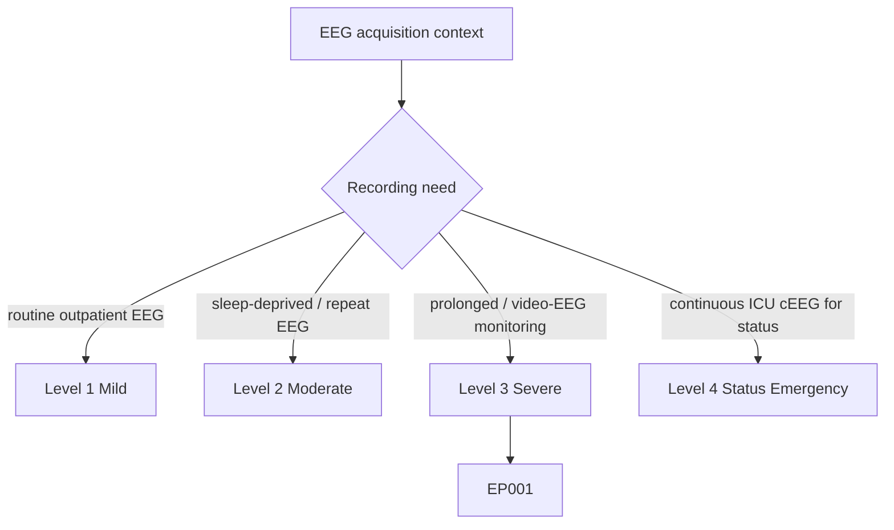
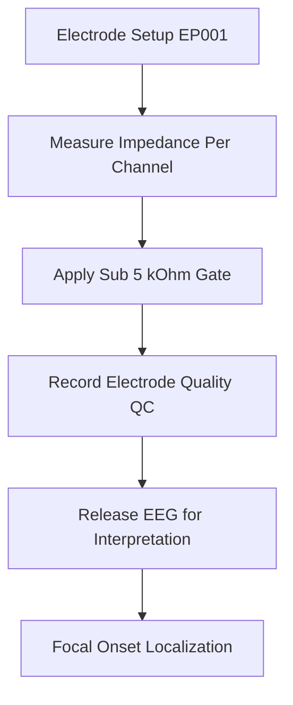
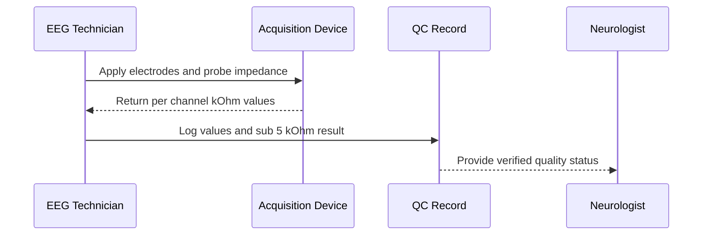
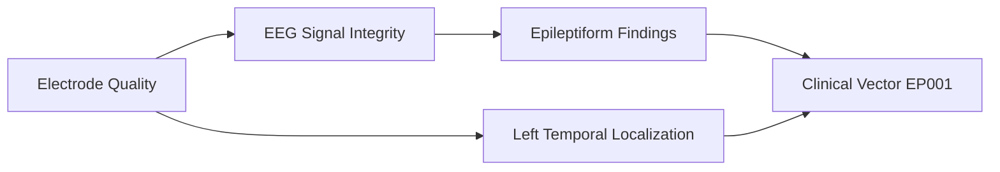
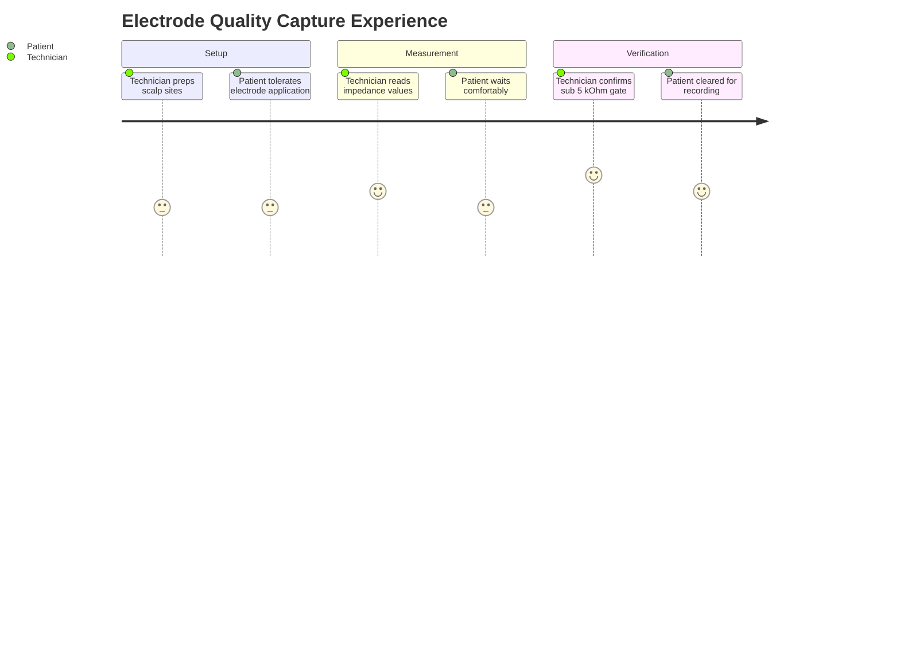

# EEG Technician Assessment — Electrode Quality (EP001)

> **Why (this doc):** Reliable EEG interpretation depends on clean scalp-electrode contact; poor impedance introduces artifact that can mimic or mask epileptiform activity. **How:** The technician records per-channel impedance values at setup, verifies all channels fall below the acceptance threshold, and captures the result as structured primary QC data for the epilepsy pipeline.

**Role:** EEG Technician · **Type:** Primary (acquisition / QC) data

**Problem:** Signal quality is the silent confounder in EEG-based epilepsy diagnosis — high electrode impedance degrades the recording before any epileptiform pattern can be read, yet it is often undocumented.

**Research Objective:** Capture per-electrode impedance as auditable, machine-readable QC evidence so that downstream focal-onset localization for EP001 rests on a verified clean signal.

*Caption - Per-channel and average electrode impedance at acquisition for EP001, with the acceptance check confirming all channels meet the sub-5 kΩ quality gate.*

| Variable | Value |
|---|---|
| Fp1 Impedance | 3.2 kΩ |
| Fp2 Impedance | 3.1 kΩ |
| F3 Impedance | 2.9 kΩ |
| F4 Impedance | 3.0 kΩ |
| Average Impedance | 3.1 kΩ |
| All Channels <5 kΩ | Yes |

## Questionnaire (Enterprise Form)

*Caption - The items the EEG technician records for this section, with response type, validation, EP001's example value, and the derived AI feature.*

| ID | Question | Response Type | Validation | EP001 (Example) | AI Feature |
|---|---|---|---|---|---|
| EEG-0301 | What is the measured impedance at Fp1? | Number | kΩ; target <5 kΩ | 3.2 kΩ | fp1_impedance_kohm |
| EEG-0302 | What is the measured impedance at Fp2? | Number | kΩ; target <5 kΩ | 3.1 kΩ | fp2_impedance_kohm |
| EEG-0303 | What is the measured impedance at F3? | Number | kΩ; target <5 kΩ | 2.9 kΩ | f3_impedance_kohm |
| EEG-0304 | What is the measured impedance at F4? | Number | kΩ; target <5 kΩ | 3.0 kΩ | f4_impedance_kohm |
| EEG-0305 | What is the average impedance across channels? | Read-only(Auto) | kΩ; mean of channels | 3.1 kΩ | average_impedance_kohm |
| EEG-0306 | Do all channels meet the <5 kΩ quality gate? | Yes-No | Yes/No; derived from channel values | Yes | all_channels_under_5kohm |

## Severity Scenario Model — EEG Technician View

*Caption - The same acquisition assessment across four epilepsy severity levels from the EEG technician's point of view; each variable shifts with severity and recording context. EP001 corresponds to Level 3 (Severe). Level 4 is the operational emergency — status epilepticus with seizures recurring about every 5 minutes, requiring continuous emergency EEG.*

### Level 1 — Mild (Well-Controlled)
| Variable | Value |
|---|---|
| Fp1 Impedance | 2.5 kΩ |
| Fp2 Impedance | 2.4 kΩ |
| F3 Impedance | 2.3 kΩ |
| F4 Impedance | 2.5 kΩ |
| Average Impedance | 2.4 kΩ |
| All Channels <5 kΩ | Yes |

### Level 2 — Moderate (Intermediate)
| Variable | Value |
|---|---|
| Fp1 Impedance | 2.8 kΩ |
| Fp2 Impedance | 2.7 kΩ |
| F3 Impedance | 2.6 kΩ |
| F4 Impedance | 2.8 kΩ |
| Average Impedance | 2.7 kΩ |
| All Channels <5 kΩ | Yes |

### Level 3 — Severe (Poorly Controlled) — EP001
| Variable | Value |
|---|---|
| Fp1 Impedance | 3.2 kΩ |
| Fp2 Impedance | 3.1 kΩ |
| F3 Impedance | 2.9 kΩ |
| F4 Impedance | 3.0 kΩ |
| Average Impedance | 3.1 kΩ |
| All Channels <5 kΩ | Yes |

### Level 4 — Refractory / Status Epilepticus (Operational Emergency)
| Variable | Value |
|---|---|
| Fp1 Impedance | 6.5 kΩ |
| Fp2 Impedance | 6.8 kΩ |
| F3 Impedance | 5.9 kΩ |
| F4 Impedance | 6.2 kΩ |
| Average Impedance | 6.4 kΩ |
| All Channels <5 kΩ | No (urgent bedside hookup) |

### Severity Classification Logic

**Reason:** Achievable impedance degrades as prep time shrinks, from an unhurried outpatient scrub to an emergency bedside hookup. **Why:** Elevated impedance in status recording is accepted because seizure capture cannot wait for the sub-5 kΩ gate. **What is happening:** Per-channel and average impedance rise with severity and the quality gate flips from pass to fail at Level 4. **How it is happening:** The technician probes and logs real impedance per tier, flagging when the clean-signal gate is not met. **Reference:** Fisher et al. (2017).

## Data Flow in the Pipeline

**Reason:** Shows where electrode-quality data enters the epilepsy workflow. **Why:** Interpretation must not begin on an unverified signal. **What is happening:** Impedance is measured, gated, logged, and only then does the record advance. **How it is happening:** The technician's QC record acts as a gate node before clinical reading. **Reference:** Fisher et al. (2017).

## Role Capturing the Data

**Reason:** Identifies who captures the measurement and how it is handed off. **Why:** Accountability for signal quality sits with the technician. **What is happening:** The technician probes, logs, and certifies quality before handoff. **How it is happening:** Device readings are transcribed into a structured QC record. **Reference:** Fisher et al. (2017).

## Linkage to Other Assessment Sections

**Reason:** Places electrode quality within the wider assessment graph. **Why:** QC feeds every downstream interpretive claim. **What is happening:** Quality gates signal integrity, which gates epileptiform findings and localization. **How it is happening:** Each node consumes the verified output of the prior node into the clinical vector. **Reference:** Topol (2019).

## Patient and Role Experience

**Reason:** Captures the lived experience of the QC step for both parties. **Why:** Comfort and cooperation directly affect achievable impedance. **What is happening:** Setup, measurement, and verification proceed with patient tolerance. **How it is happening:** The technician balances thorough prep against patient comfort to reach the gate. **Reference:** APA (2020).

## Professor Readiness (Defense Q&A)

**Q1: Why is a sub-5 kΩ threshold used?**
A1: Impedances at or below 5 kΩ minimize thermal and movement artifact and improve common-mode rejection, keeping the signal clean enough for reliable epileptiform detection.

**Q2: How does electrode quality affect focal localization for EP001?**
A2: Elevated or unbalanced impedance can produce false asymmetries; verified low impedance ensures the observed left-temporal focus reflects true cortical activity, not electrode noise.

**Q3: Why record impedance as structured data rather than a note?**
A3: Structured QC values are auditable, comparable across sessions, and can be programmatically gated, supporting reproducible epilepsy diagnostics.

## References

American Psychological Association. (2020). *Publication manual of the American Psychological Association* (7th ed.). American Psychological Association.

Fisher, R. S., Cross, J. H., French, J. A., Higurashi, N., Hirsch, E., Jansen, F. E., Lagae, L., Moshé, S. L., Peltola, J., Roulet Perez, E., Scheffer, I. E., & Zuberi, S. M. (2017). Operational classification of seizure types by the International League Against Epilepsy. *Epilepsia, 58*(4), 522–530. https://doi.org/10.1111/epi.13670

Topol, E. J. (2019). *Deep medicine: How artificial intelligence can make healthcare human again*. Basic Books.
