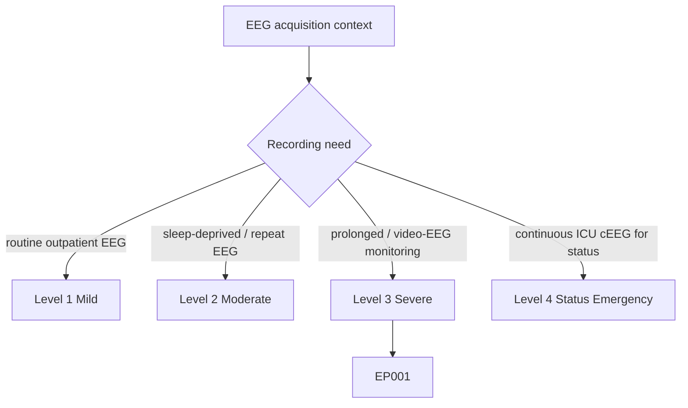
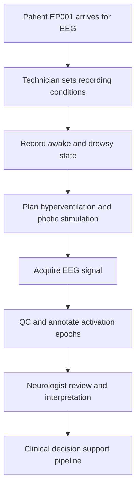
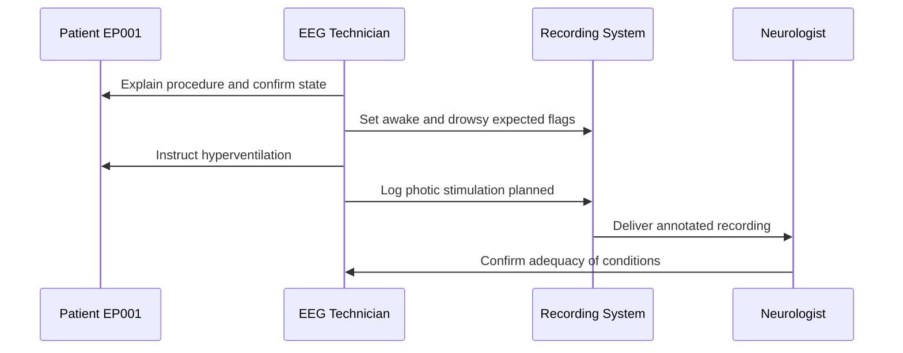
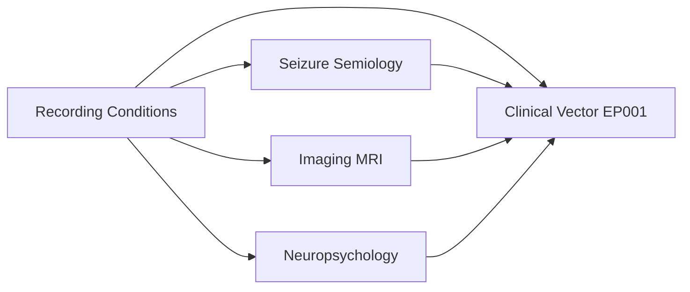
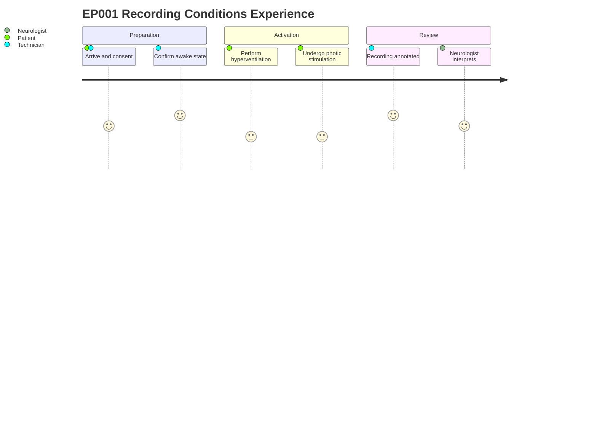

# EEG Technician Assessment — Recording Conditions (EP001)

> **Why (this doc):** Recording conditions and planned activation procedures determine whether an EEG can actually elicit and capture the epileptiform features that support a focal epilepsy diagnosis. **How:** The EEG technician records patient state (awake, drowsy, sleep) and planned activation methods (hyperventilation, photic stimulation) at acquisition so downstream readers and models can interpret yield and normalize findings.

**Role:** EEG Technician · **Type:** Primary (acquisition / QC) data

**Problem:** Interictal EEGs frequently miss focal epileptiform discharges when the patient state and activation procedures are not optimized or not documented, weakening diagnostic yield for focal impaired-awareness epilepsy.

**Research Objective:** Capture structured recording-condition metadata for EP001 so that acquisition context is machine-readable, reproducible, and available to a clinical decision-support pipeline for interpreting EEG yield.

*Caption - Recording conditions and planned activation procedures for EP001. These flags document the patient state during acquisition and which provocative maneuvers were planned to increase the probability of capturing left-temporal epileptiform activity.*

| Variable | Value |
|---|---|
| Awake | Yes |
| Drowsy Expected | Yes |
| Sleep Expected | No |
| Hyperventilation Planned | Yes |
| Photic Stimulation Planned | Yes |

## Questionnaire (Enterprise Form)

*Caption - The items the EEG technician records for this section, with response type, validation, EP001's example value, and the derived AI feature.*

| ID | Question | Response Type | Validation | EP001 (Example) | AI Feature |
|---|---|---|---|---|---|
| EEG-0401 | Is the patient awake at the start of recording? | Yes-No | Yes/No | Yes | awake_state |
| EEG-0402 | Is drowsiness expected during the recording? | Yes-No | Yes/No | Yes | drowsy_expected |
| EEG-0403 | Is sleep expected during the recording? | Yes-No | Yes/No | No | sleep_expected |
| EEG-0404 | Is hyperventilation planned as an activation procedure? | Yes-No | Yes/No | Yes | hyperventilation_planned |
| EEG-0405 | Is photic stimulation planned as an activation procedure? | Yes-No | Yes/No | Yes | photic_stimulation_planned |

## Severity Scenario Model — EEG Technician View

*Caption - The same acquisition assessment across four epilepsy severity levels from the EEG technician's point of view; each variable shifts with severity and recording context. EP001 corresponds to Level 3 (Severe). Level 4 is the operational emergency — status epilepticus with seizures recurring about every 5 minutes, requiring continuous emergency EEG.*

### Level 1 — Mild (Well-Controlled)
| Variable | Value |
|---|---|
| Awake | Yes |
| Drowsy Expected | No |
| Sleep Expected | No |
| Hyperventilation Planned | Yes |
| Photic Stimulation Planned | Yes |

### Level 2 — Moderate (Intermediate)
| Variable | Value |
|---|---|
| Awake | Yes |
| Drowsy Expected | Yes |
| Sleep Expected | Yes |
| Hyperventilation Planned | Yes |
| Photic Stimulation Planned | Yes |

### Level 3 — Severe (Poorly Controlled) — EP001
| Variable | Value |
|---|---|
| Awake | Yes |
| Drowsy Expected | Yes |
| Sleep Expected | No |
| Hyperventilation Planned | Yes |
| Photic Stimulation Planned | Yes |

### Level 4 — Refractory / Status Epilepticus (Operational Emergency)
| Variable | Value |
|---|---|
| Awake | No (obtunded / sedated) |
| Drowsy Expected | N/A |
| Sleep Expected | Yes (encephalopathic / sedated) |
| Hyperventilation Planned | No (unsafe in status) |
| Photic Stimulation Planned | No |

### Severity Classification Logic

**Reason:** Patient state and activation planning shift from an alert cooperative outpatient to a sedated, obtunded status patient. **Why:** Provocative maneuvers like hyperventilation become unsafe and unnecessary once seizures are already recurring every few minutes. **What is happening:** Awake/activation flags flip off and the recording relies on continuous capture rather than planned provocation as severity rises. **How it is happening:** The technician records the true acquisition state per tier so yield is interpreted in context. **Reference:** Fisher et al. (2017).

## Pipeline and Process Diagrams

**Reason:** Recording conditions sit at the front of the EEG pipeline and shape every downstream interpretation step. **Why:** Documenting state and activation planning lets readers weigh yield and lets models normalize findings across sessions. **What is happening:** Patient state is logged and activation maneuvers are planned before signal acquisition. **How it is happening:** The technician enters structured flags that travel with the recording into QC and neurologist review. **Reference:** Fisher et al. (2017).

**Reason:** The technician is the role that captures and encodes recording conditions. **Why:** Clear role sequencing prevents missing or inconsistent activation documentation. **What is happening:** The technician coordinates the patient, the recording system, and the neurologist around defined conditions. **How it is happening:** Each condition flag is set explicitly and passed forward with the signal. **Reference:** APA (2020).

**Reason:** Recording conditions are one component of the multi-section clinical assessment vector. **Why:** Linking sections shows how acquisition context contributes to the overall focal epilepsy picture. **What is happening:** Condition data joins semiology, imaging, and neuropsychology in the patient vector. **How it is happening:** Each section contributes normalized features that assemble into EP001's composite record. **Reference:** Topol (2019).

**Reason:** The journey captures the lived experience of acquisition for patient and technician. **Why:** Understanding friction points like hyperventilation tolerance improves data quality and patient comfort. **What is happening:** The patient moves through preparation, activation, and review stages. **How it is happening:** Each stage is scored for experience to surface where support is needed. **Reference:** Fisher et al. (2017).

## Professor Readiness (Defense Q&A)

**Q1: Why record drowsy state and plan sleep separately?** Drowsiness and sleep transitions activate temporal epileptiform discharges; documenting expected drowsiness while noting sleep was not expected clarifies the yield context for EP001's left-temporal focus.

**Q2: Why are hyperventilation and photic stimulation both planned?** They are standard activation procedures that increase the probability of eliciting epileptiform abnormalities; recording that both were planned lets the reader interpret a negative study appropriately.

**Q3: How does this data help a decision-support model?** Structured condition flags let the model condition its interpretation of EEG yield on acquisition context, reducing false-negative interpretations when activation was incomplete.

## References

American Psychological Association. (2020). *Publication manual of the American Psychological Association* (7th ed.). American Psychological Association.

Fisher, R. S., Cross, J. H., French, J. A., Higurashi, N., Hirsch, E., Jansen, F. E., Lagae, L., Moshé, S. L., Peltola, J., Roulet Perez, E., Scheffer, I. E., & Zuberi, S. M. (2017). Operational classification of seizure types by the International League Against Epilepsy. *Epilepsia, 58*(4), 522–530. https://doi.org/10.1111/epi.13670

Topol, E. J. (2019). High-performance medicine: The convergence of human and artificial intelligence. *Nature Medicine, 25*(1), 44–56. https://doi.org/10.1038/s41591-018-0300-7
