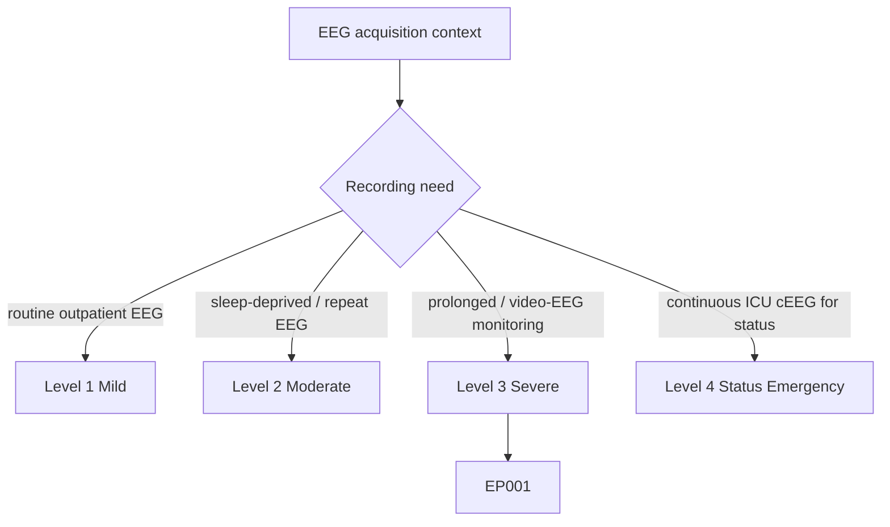
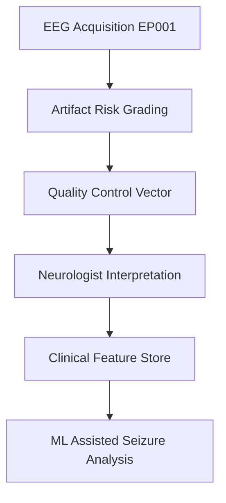
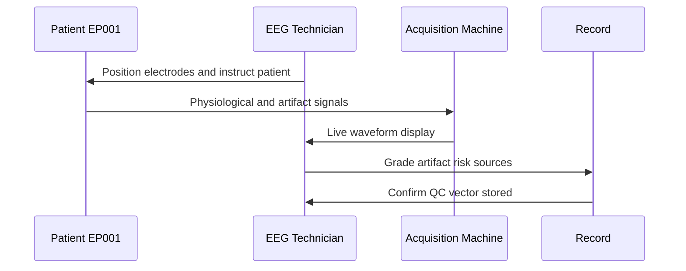
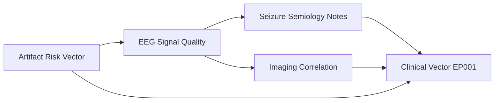
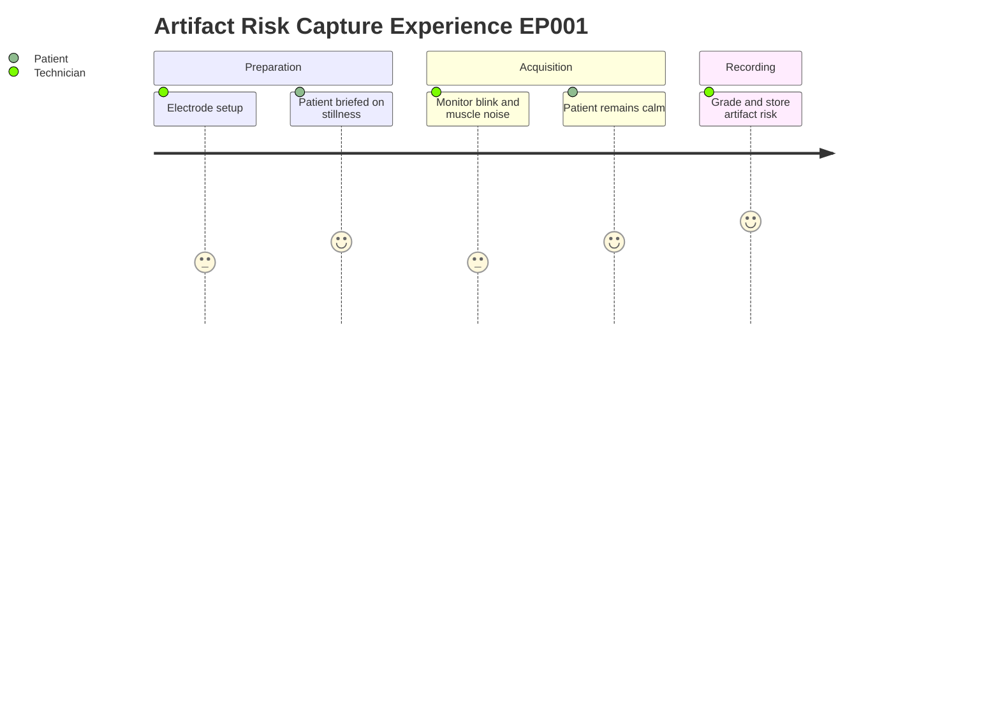

# EEG Technician Assessment — Artifact Risk Assessment (EP001)

> **Why (this doc):** Artifact risk flags tell the interpreting neurologist how much of the EEG signal can be trusted, so that physiological epileptiform activity is not confused with non-cerebral noise. **How:** During acquisition the EEG technician grades common artifact sources (eye blink, muscle, sweat, electrode noise, movement) for patient EP001 and records them here as a structured quality-control vector.

**Problem:** Focal impaired-awareness seizures in the left temporal region produce subtle epileptiform signatures that can be masked or mimicked by acquisition artifacts, leading to misinterpretation.

**Research Objective:** Capture a standardized artifact-risk profile at acquisition time so downstream interpretation and any machine-assisted analysis can weight or discard low-quality segments for EP001.

**Role:** EEG Technician · **Type:** Primary (acquisition / QC) data

*Caption - The table below records the EEG technician's per-source artifact grading for EP001; it is the quality-control ground truth that gates whether recorded activity can be read as cerebral in origin.*

| Variable | Value |
|---|---|
| Excess Eye Blink | Mild |
| Muscle Artifact Risk | Low |
| Sweating | No |
| Electrode Noise | None |
| Movement Risk | Low |

## Severity Scenario Model — EEG Technician View

*Caption - The same acquisition assessment across four epilepsy severity levels from the EEG technician's point of view; each variable shifts with severity and recording context. EP001 corresponds to Level 3 (Severe). Level 4 is the operational emergency — status epilepticus with seizures recurring about every 5 minutes, requiring continuous emergency EEG.*

### Level 1 — Mild (Well-Controlled)
| Variable | Value |
|---|---|
| Excess Eye Blink | None |
| Muscle Artifact Risk | Low |
| Sweating | No |
| Electrode Noise | None |
| Movement Risk | Low |

### Level 2 — Moderate (Intermediate)
| Variable | Value |
|---|---|
| Excess Eye Blink | Mild |
| Muscle Artifact Risk | Low |
| Sweating | No |
| Electrode Noise | Low |
| Movement Risk | Low |

### Level 3 — Severe (Poorly Controlled) — EP001
| Variable | Value |
|---|---|
| Excess Eye Blink | Mild |
| Muscle Artifact Risk | Low |
| Sweating | No |
| Electrode Noise | None |
| Movement Risk | Low |

### Level 4 — Refractory / Status Epilepticus (Operational Emergency)
| Variable | Value |
|---|---|
| Excess Eye Blink | Marked |
| Muscle Artifact Risk | High |
| Sweating | Yes |
| Electrode Noise | High |
| Movement Risk | High (seizure movement) |

### Severity Classification Logic

**Reason:** Artifact load climbs with severity, from a still cooperative outpatient to a convulsing status patient at the bedside. **Why:** Emergency conditions add sweat, muscle, and movement artifact that the technician must flag so cerebral activity is not confused with noise. **What is happening:** Each artifact source escalates from None/Low toward High as the recording moves into the ICU. **How it is happening:** The technician grades each source in real time per tier, preserving the raw record while marking low-trust segments. **Reference:** Fisher et al. (2017).

## Pipeline and Role Diagrams

**Reason:** To show where artifact-risk data enters the epilepsy diagnostic pipeline. **Why:** Interpretation quality depends on knowing signal trustworthiness before reading. **What is happening:** Acquisition feeds artifact grading, which produces a QC vector consumed by interpretation and analytics. **How it is happening:** The technician tags each artifact source at capture and the flags propagate downstream. **Reference:** Fisher et al. (2017).

**Reason:** To make explicit the role that captures the artifact-risk data. **Why:** The technician, not the interpreter, is best placed to judge acquisition conditions. **What is happening:** The technician observes live signals and records artifact grades. **How it is happening:** Real-time monitoring during acquisition drives each grading decision. **Reference:** Topol (2019).

**Reason:** To link artifact risk to the other assessment sections and the combined clinical vector. **Why:** No single section is diagnostic alone; they combine into one patient representation. **What is happening:** Artifact grades condition how signal, semiology, and imaging are weighted. **How it is happening:** Each section contributes features that merge into the EP001 clinical vector. **Reference:** Fisher et al. (2017).

**Reason:** To capture the lived experience of collecting this item for both patient and technician. **Why:** Comfort and cooperation directly reduce artifact load. **What is happening:** Setup, monitoring, and grading steps are experienced across the session. **How it is happening:** The technician guides EP001 while grading artifact sources in real time. **Reference:** Topol (2019).

## Professor Readiness (Defense Q&A)

**Q1: Why grade artifact risk separately instead of just filtering the signal?**
A: Filtering can remove genuine epileptiform activity along with noise; an explicit risk vector preserves the raw record while flagging segments that need cautious interpretation.

**Q2: Why does "Electrode Noise: None" matter for a left-temporal focus?**
A: Temporal electrodes are prone to contact noise; confirming none present increases confidence that any temporal sharp waves seen in EP001 are cerebral, not artifactual.

**Q3: How would these flags influence a machine-learning model?**
A: Segments with higher artifact risk can be down-weighted or excluded so the model learns from clean data, improving specificity for focal seizure detection.

## References

American Psychological Association. (2020). *Publication manual of the American Psychological Association* (7th ed.). https://doi.org/10.1037/0000165-000

Fisher, R. S., Cross, J. H., French, J. A., Higurashi, N., Hirsch, E., Jansen, F. E., Lagae, L., Moshé, S. L., Peltola, J., Roulet Perez, E., Scheffer, I. E., & Zuberi, S. M. (2017). Operational classification of seizure types by the International League Against Epilepsy. *Epilepsia, 58*(4), 522–530. https://doi.org/10.1111/epi.13670

Topol, E. J. (2019). High-performance medicine: The convergence of human and artificial intelligence. *Nature Medicine, 25*(1), 44–56. https://doi.org/10.1038/s41591-018-0300-7
