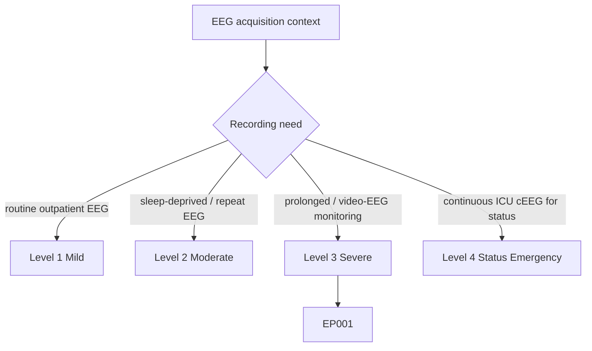
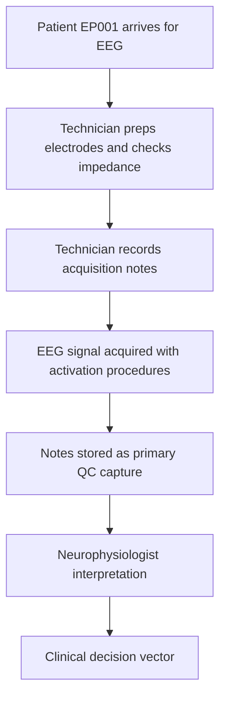
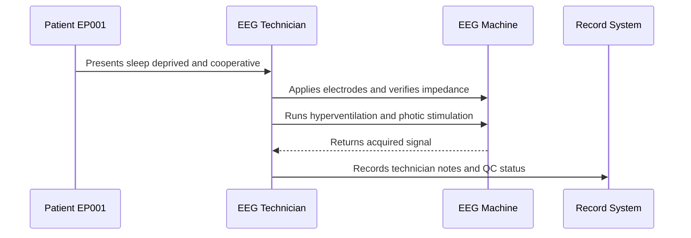
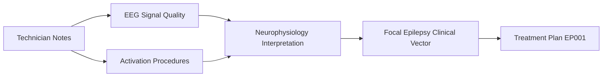
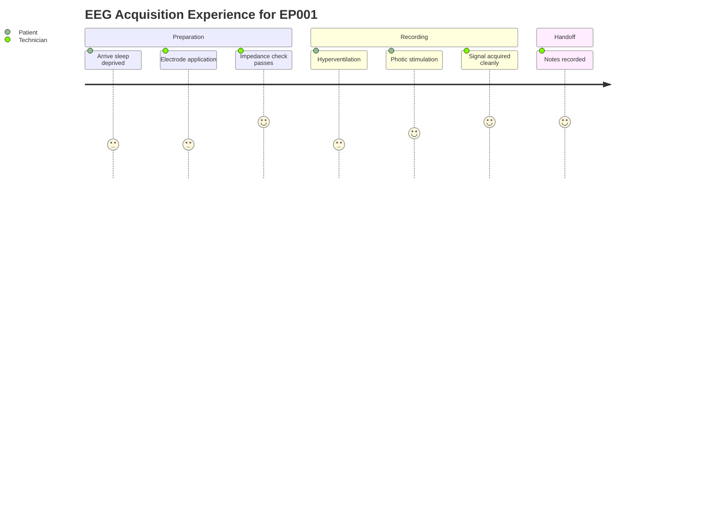

# EEG Technician Assessment — Technician Notes (EP001)

> **Why (this doc):** EEG technician notes capture the acquisition-side context (cooperation, impedance, activation procedures) that determines whether the recorded EEG can be trusted for epilepsy diagnosis. **How:** The technician documents free-text observations at the point of acquisition, which are preserved verbatim as structured capture rows for downstream review by the neurophysiologist and clinical pipeline.

**Role:** EEG Technician · **Type:** Primary (acquisition / QC) data

**Problem:** Focal epilepsy diagnosis depends on high-quality EEG, but acquisition conditions (poor impedance, patient state, missed activation) silently degrade signal and can produce false-negative or artifact-laden studies.

**Research Objective:** Capture technician-level acquisition and QC observations for EP001 so signal quality and activation adequacy can be verified before the recording feeds interpretation and the clinical decision vector.

*Caption - The table below records the technician's verbatim acquisition and quality-control notes for EP001, establishing that the study was performed under adequate conditions with appropriate activation procedures.*

| # | Note |
|---|---|
| 1 | Patient cooperative. |
| 2 | Good electrode impedance. |
| 3 | Sleep deprivation confirmed. |
| 4 | No technical issues anticipated. |
| 5 | Suitable for routine EEG with hyperventilation and photic stimulation. |

## Severity Scenario Model — EEG Technician View

*Caption - The same acquisition assessment across four epilepsy severity levels from the EEG technician's point of view; each variable shifts with severity and recording context. EP001 corresponds to Level 3 (Severe). Level 4 is the operational emergency — status epilepticus with seizures recurring about every 5 minutes, requiring continuous emergency EEG.*

### Level 1 — Mild (Well-Controlled)
| # | Note |
|---|---|
| 1 | Patient cooperative. |
| 2 | Excellent electrode impedance. |
| 3 | Routine outpatient study; patient well rested. |
| 4 | No technical issues. |
| 5 | Suitable for routine 20–30 min EEG with hyperventilation and photic stimulation. |

### Level 2 — Moderate (Intermediate)
| # | Note |
|---|---|
| 1 | Patient cooperative. |
| 2 | Good electrode impedance. |
| 3 | Sleep deprivation confirmed; repeat EEG. |
| 4 | Minor drowsiness expected. |
| 5 | Suitable for standard sleep-deprived EEG with activation procedures. |

### Level 3 — Severe (Poorly Controlled) — EP001
| # | Note |
|---|---|
| 1 | Patient cooperative. |
| 2 | Good electrode impedance. |
| 3 | Sleep deprivation confirmed. |
| 4 | No technical issues anticipated. |
| 5 | Suitable for routine EEG with hyperventilation and photic stimulation. |

### Level 4 — Refractory / Status Epilepticus (Operational Emergency)
| # | Note |
|---|---|
| 1 | Patient obtunded; seizures recurring about every 5 minutes. |
| 2 | Elevated impedance from urgent bedside hookup. |
| 3 | Continuous ICU cEEG initiated for status epilepticus. |
| 4 | High artifact under emergency conditions; real-time monitoring and alarms active. |
| 5 | Extended full montage; activation procedures not appropriate. |

### Severity Classification Logic

**Reason:** The technician's free-text notes shift from a clean, routine study to an emergency continuous cEEG under status. **Why:** Notes are the only eyewitness record of acquisition conditions, which degrade sharply as severity rises. **What is happening:** Cooperation, impedance, and activation notes turn from favorable at Level 1 to emergency-qualified at Level 4. **How it is happening:** The technician records the true acquisition narrative per tier so interpreters can weight signal trust. **Reference:** Fisher et al. (2017).

## Data Flow in the Pipeline

**Reason:** To show where acquisition-side notes enter the diagnostic pipeline. **Why:** Signal quality context must travel with the raw EEG so interpreters can weigh findings correctly. **What is happening:** Technician observations are captured at acquisition and persisted as QC metadata. **How it is happening:** Free-text notes are structured into capture rows that flow to interpretation and onward to the clinical vector. **Reference:** ILAE operational classification (Fisher et al., 2017).

## Role Capturing This Data

**Reason:** To clarify who observes and records each acquisition fact. **Why:** The technician is the sole eyewitness to acquisition conditions that are not otherwise recoverable. **What is happening:** The technician mediates between patient state, machine, and the record system. **How it is happening:** Each observed condition is entered as a note tied to the session. **Reference:** Topol (2019) on human-in-the-loop capture of clinical signal quality.

## Linkage to Other Assessment Sections

**Reason:** To position technician notes within the wider assessment graph. **Why:** QC notes gain meaning only when linked to interpretation and the clinical vector. **What is happening:** Notes connect to signal quality and activation, which feed interpretation. **How it is happening:** Shared session identifiers link this section to downstream assessment sections. **Reference:** APA (2020) standards for linking source data to clinical conclusions.

## Patient and Role Experience

**Reason:** To capture the lived experience behind each note. **Why:** Patient comfort and cooperation directly affect artifact levels and study validity. **What is happening:** The patient moves through prep, activation, and handoff while the technician records state. **How it is happening:** Each step is scored for experience and mapped to the corresponding note. **Reference:** Topol (2019) on patient-centered acquisition workflows.

## Professor Readiness (Defense Q&A)

**Q1: Why record sleep deprivation as a technician note rather than assume it?**
A: Sleep deprivation is an activation strategy that raises the yield of epileptiform discharges in focal epilepsy; documenting that it was confirmed lets the interpreter attribute or discount findings accordingly.

**Q2: Why do impedance and cooperation belong in primary QC data?**
A: Both are non-recoverable acquisition conditions. Good impedance excludes electrode artifact and cooperation excludes movement artifact, so they qualify whether a normal or abnormal result is trustworthy.

**Q3: How do these notes influence the clinical decision vector for EP001?**
A: They gate interpretation confidence. Adequate impedance plus completed hyperventilation and photic stimulation mean a normal EEG cannot be dismissed as technically limited, strengthening the focal impaired-awareness assessment.

## References

American Psychological Association. (2020). *Publication manual of the American Psychological Association* (7th ed.). https://doi.org/10.1037/0000165-000

Fisher, R. S., Cross, J. H., French, J. A., Higurashi, N., Hirsch, E., Jansen, F. E., Lagae, L., Moshé, S. L., Peltola, J., Roulet Perez, E., Scheffer, I. E., & Zuberi, S. M. (2017). Operational classification of seizure types by the International League Against Epilepsy: Position paper of the ILAE Commission for Classification and Terminology. *Epilepsia, 58*(4), 522–530. https://doi.org/10.1111/epi.13670

Topol, E. J. (2019). High-performance medicine: The convergence of human and artificial intelligence. *Nature Medicine, 25*(1), 44–56. https://doi.org/10.1038/s41591-018-0300-7
