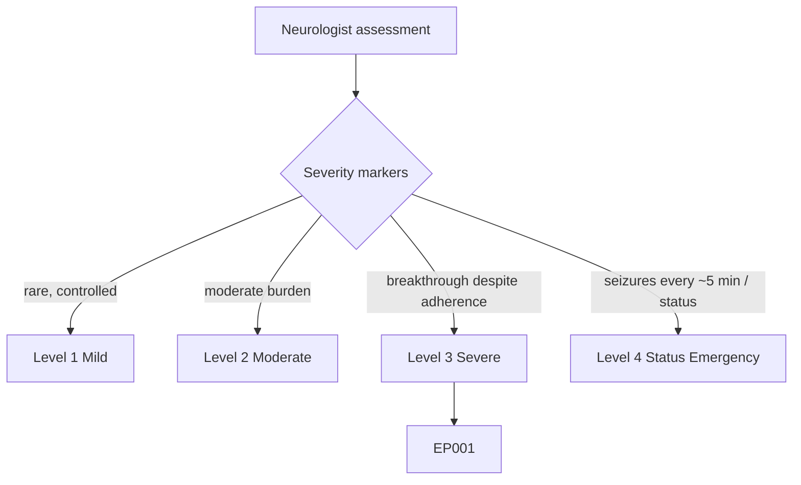
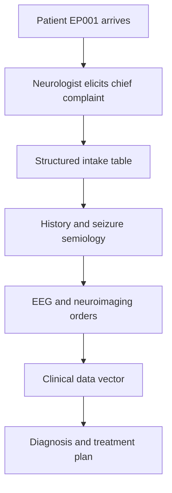
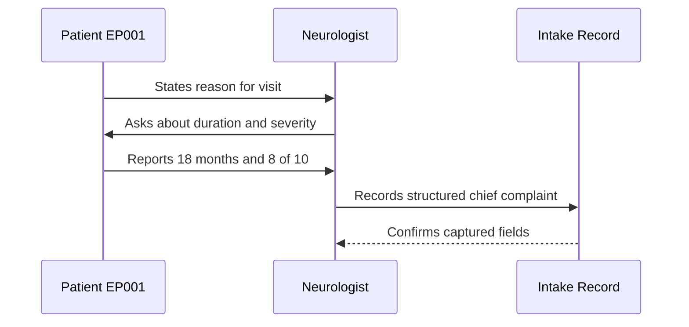
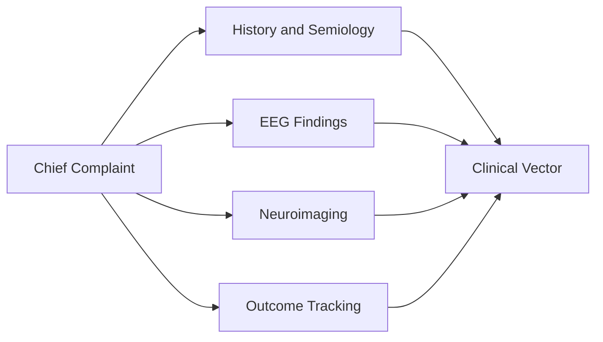
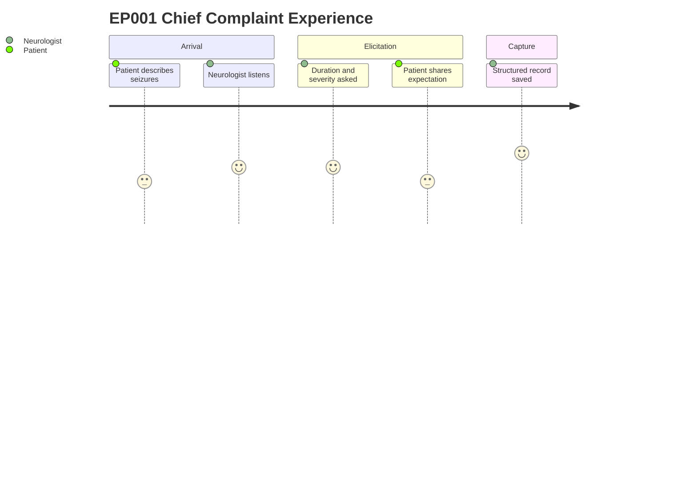

# Neurologist Assessment — Section 1: Chief Complaint (EP001)

> **Why (this doc):** The chief complaint is the patient's own reason for the encounter and the anchor for the entire epilepsy work-up; capturing it verbatim preserves the clinical starting point for EP001. **How:** A neurologist records the presenting concern, duration, severity, and prior acute utilisation in a structured question-answer table that feeds the downstream diagnostic pipeline.

**Role:** Neurologist · **Type:** Primary (clinical) data

**Problem:** Uncontrolled recurrent focal seizures in a 29-year-old male degrade quality of life, and the initial complaint is often unstructured and hard to compare across visits.

**Research Objective:** Capture the chief complaint as discrete, machine-readable fields so it can be linked to seizure semiology, EEG, imaging, and outcome data for reproducible analysis.

*Caption - The table below records EP001's chief complaint exactly as elicited by the neurologist; it is the primary intake record that seeds every later assessment section.*

| Question | Answer |
|---|---|
| Why are you here today? | Recurrent seizures over the last 18 months |
| Primary concern | Increasing seizure frequency |
| Duration of problem | 18 months |
| Severity | 8/10 |
| Emergency visits | 2 |
| Hospital admission | 1 |
| Patient expectation | Better seizure control |

## Severity Scenario Model — Neurologist View

*Caption - The same assessment answered across four epilepsy severity levels from the neurologist's point of view; each variable shifts with severity. EP001 corresponds to Level 3 (Severe). Level 4 is the operational emergency — status epilepticus with seizures recurring about every 5 minutes.*

### Level 1 — Mild (Well-Controlled)
| Question | Answer |
|---|---|
| Why are you here today? | Routine review, seizures well controlled |
| Primary concern | Maintaining seizure freedom |
| Duration of problem | 24 months |
| Severity | 2/10 |
| Emergency visits | 0 |
| Hospital admission | 0 |
| Patient expectation | Continue current control |

### Level 2 — Moderate (Intermediate)
| Question | Answer |
|---|---|
| Why are you here today? | Occasional breakthrough seizures |
| Primary concern | Intermittent seizures despite treatment |
| Duration of problem | 18 months |
| Severity | 5/10 |
| Emergency visits | 1 |
| Hospital admission | 0 |
| Patient expectation | Fewer seizures |

### Level 3 — Severe (Poorly Controlled) — EP001
| Question | Answer |
|---|---|
| Why are you here today? | Recurrent seizures over the last 18 months |
| Primary concern | Increasing seizure frequency |
| Duration of problem | 18 months |
| Severity | 8/10 |
| Emergency visits | 2 |
| Hospital admission | 1 |
| Patient expectation | Better seizure control |

### Level 4 — Refractory / Status Epilepticus (Operational Emergency)
| Question | Answer |
|---|---|
| Why are you here today? | Brought in with continuous seizures |
| Primary concern | Seizures every ~5 minutes without recovery |
| Duration of problem | 18 months, acute crisis today |
| Severity | 10/10 |
| Emergency visits | 5+ |
| Hospital admission | 4 (current, ICU) |
| Patient expectation | Emergency seizure termination |

### Severity Classification Logic

**Reason:** The chief complaint moves along a severity ladder rather than sitting at one fixed point. **Why:** Placing EP001 on the ladder sets the urgency, work-up depth, and expectation-setting for the visit. **What is happening:** Concern, severity rating, and acute utilisation all rise from mild follow-up to a status emergency. **How it is happening:** The neurologist reads the presenting pattern against level thresholds. **Reference:** Fisher et al. (2017) ILAE operational classification.

## Data Flow and Context Diagrams

**Reason:** To show where the chief complaint sits at the head of the epilepsy assessment pipeline. **Why:** Every later data point is interpreted against this presenting concern. **What is happening:** The verbal complaint is converted into a structured record that flows into history, EEG, and imaging. **How it is happening:** The neurologist captures fields at intake and passes them forward to downstream sections. **Reference:** Fisher et al. (2017) ILAE operational classification.

**Reason:** To show the role and turn-taking that produces the captured complaint. **Why:** The neurologist is the accountable role for accurate first-line capture. **What is happening:** A structured dialogue extracts duration, severity, and expectation. **How it is happening:** Question-answer exchange is transcribed directly into the intake record. **Reference:** Topol (2019) on high-quality clinical data capture.

**Reason:** To show how the chief complaint links to other assessment sections. **Why:** The complaint provides the clinical thread that unifies separate modalities. **What is happening:** Each section contributes features to a shared clinical vector. **How it is happening:** Fields keyed to patient EP001 join across sections into one feature space. **Reference:** Fisher et al. (2017) framework for multimodal seizure characterisation.

**Reason:** To depict the lived experience of capturing this item. **Why:** Understanding patient and clinician effort improves data quality and rapport. **What is happening:** The patient recounts a distressing history while the clinician structures it. **How it is happening:** Empathic questioning maps subjective concern into recorded fields. **Reference:** APA (2020) guidance on patient-centred documentation.

## Professor Readiness (Defense Q&A)

**Q1: Why capture the chief complaint verbatim rather than a diagnosis?**
The complaint is the patient's own framing and is diagnostically neutral; it preserves the raw signal before clinician interpretation, supporting reproducibility.

**Q2: How does an 8/10 severity rating add value if it is subjective?**
It provides a self-reported baseline that can be tracked longitudinally to measure treatment response, even though it is not an objective seizure count.

**Q3: Why record emergency visits and admissions in the chief complaint section?**
Acute utilisation quantifies disease burden and urgency, informing risk stratification and prioritisation of the work-up.

## References

American Psychological Association. (2020). *Publication manual of the American Psychological Association* (7th ed.). American Psychological Association.

Fisher, R. S., Cross, J. H., French, J. A., Higurashi, N., Hirsch, E., Jansen, F. E., Lagae, L., Moshé, S. L., Peltola, J., Roulet Perez, E., Scheffer, I. E., & Zuberi, S. M. (2017). Operational classification of seizure types by the International League Against Epilepsy: Position paper of the ILAE Commission for Classification and Terminology. *Epilepsia, 58*(4), 522–530. https://doi.org/10.1111/epi.13670

Topol, E. J. (2019). *Deep medicine: How artificial intelligence can make healthcare human again*. Basic Books.
