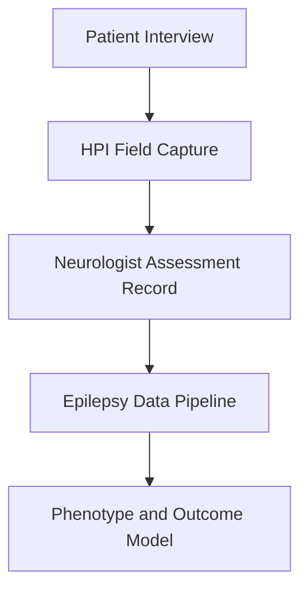
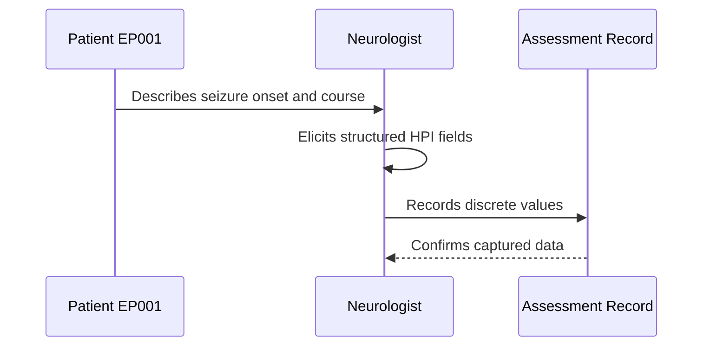
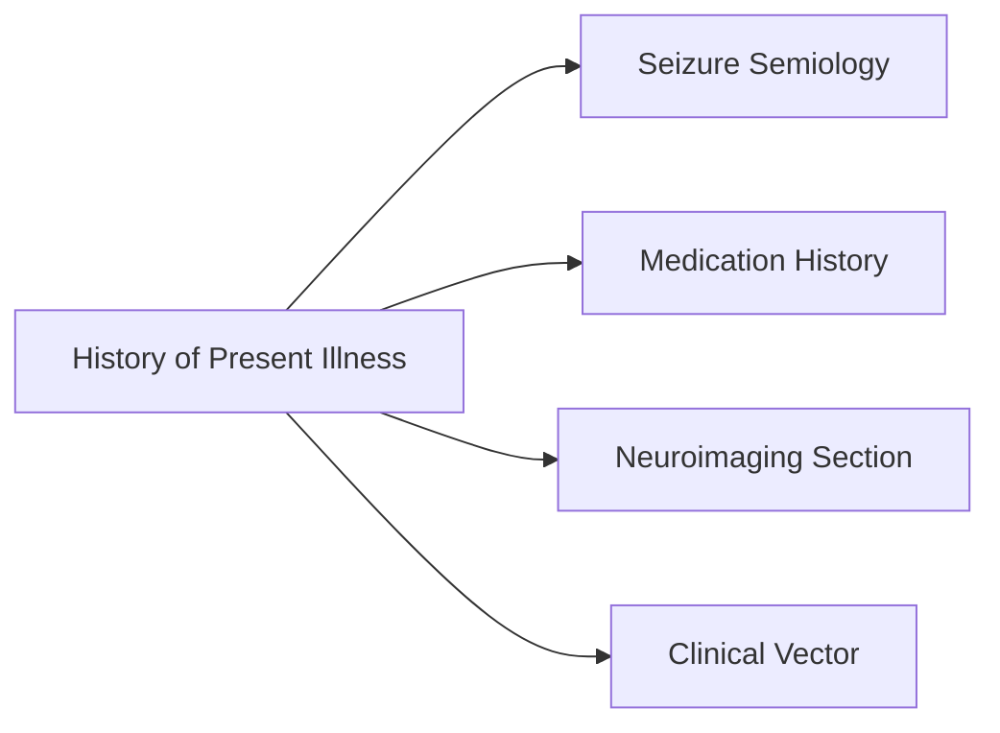
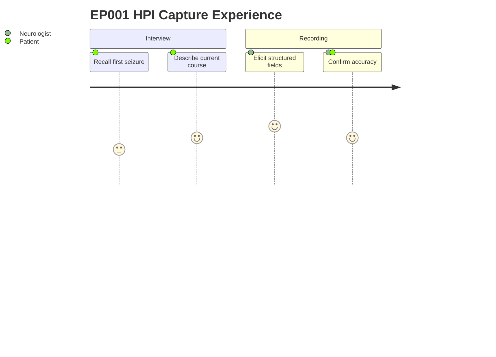

# Neurologist Assessment — Section 2: History of Present Illness (EP001)

> **Why (this doc):** The history of present illness (HPI) captures the onset, evolution, and current trajectory of the seizure disorder, which anchors every downstream diagnostic and treatment decision for patient EP001 (29M, focal impaired awareness, left-temporal). **How:** The neurologist elicits structured onset, frequency, and modifier data during the clinical interview and records it as discrete key-value fields for the epilepsy data pipeline.

**Problem:** Focal epilepsy trajectories are only interpretable when onset and course are captured consistently; free-text narratives lose the structured signals needed for longitudinal modeling.

**Research Objective:** Encode the HPI as machine-readable fields so seizure onset, frequency change, and treatment-response markers can feed reproducible epilepsy phenotyping and outcome analysis.

**Role:** Neurologist · **Type:** Primary (clinical) data

*Caption - Structured HPI fields for EP001 documenting first-seizure timing, initial semiology, and current disease-course modifiers used to classify severity and treatment responsiveness.*

| Question | Answer |
|---|---|
| First seizure date | 2024-01-14 |
| Age at first seizure | 27 |
| Initial presentation | Sudden loss of awareness followed by right arm jerking |
| Frequency increasing | Yes |
| Breakthrough seizures | Yes |
| Recent infection | No |
| Medication recently changed | Yes |

## Pipeline and Context Diagrams

**Reason:** Shows where HPI data enters the clinical pipeline. **Why:** Onset and course fields are foundational inputs, so their flow must be explicit. **What is happening:** Interview responses are captured as structured fields and routed into the assessment record and modeling stages. **How it is happening:** The neurologist transcribes discrete answers that the pipeline ingests as typed variables. **Reference:** Fisher et al., 2017.

**Reason:** Identifies the role capturing the HPI. **Why:** Accountability for data provenance requires naming who elicits and records each field. **What is happening:** The neurologist interviews the patient and writes structured values to the record. **How it is happening:** A guided clinical interview maps narrative to key-value fields. **Reference:** Fisher et al., 2017.

**Reason:** Shows how HPI links to other assessment sections. **Why:** Onset and course fields inform semiology, medication, and imaging interpretation. **What is happening:** The HPI feeds multiple downstream sections that compose the clinical vector. **How it is happening:** Shared patient identifiers join HPI fields to related assessment records. **Reference:** Topol, 2019.

**Reason:** Depicts the patient and role experience for this item. **Why:** Data quality depends on how comfortably the patient recalls and confirms details. **What is happening:** The patient recounts onset and course while the neurologist structures and verifies it. **How it is happening:** Iterative question-and-confirm steps produce validated fields. **Reference:** Topol, 2019.

## Professor Readiness (Defense Q&A)

**Q1: Why capture the HPI as discrete fields rather than free text?**
Discrete fields make onset, frequency, and treatment-response signals machine-readable, enabling reproducible longitudinal analysis that free-text narratives cannot support.

**Q2: How do these HPI fields support the focal epilepsy classification for EP001?**
Fields such as initial presentation and breakthrough seizures document focal semiology and pharmacoresistance markers consistent with the ILAE operational classification.

**Q3: What is the significance of "Medication recently changed" being Yes alongside "Breakthrough seizures" Yes?**
Together they flag a possible treatment-response or adherence event, prompting review of drug levels and regimen adequacy before escalating to advanced workup.

## References

American Psychological Association. (2020). *Publication manual of the American Psychological Association* (7th ed.). American Psychological Association.

Fisher, R. S., Cross, J. H., French, J. A., Higurashi, N., Hirsch, E., Jansen, F. E., Lagae, L., Moshé, S. L., Peltola, J., Roulet Perez, E., Scheffer, I. E., & Zuberi, S. M. (2017). Operational classification of seizure types by the International League Against Epilepsy: Position paper of the ILAE Commission for Classification and Terminology. *Epilepsia, 58*(4), 522–530. https://doi.org/10.1111/epi.13670

Topol, E. J. (2019). *Deep medicine: How artificial intelligence can make healthcare human again*. Basic Books.
