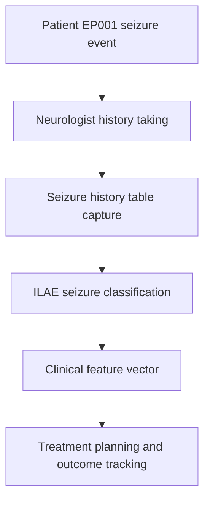
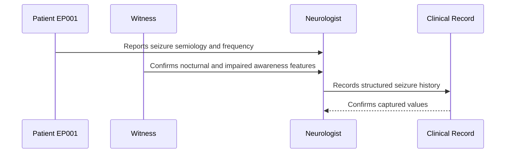
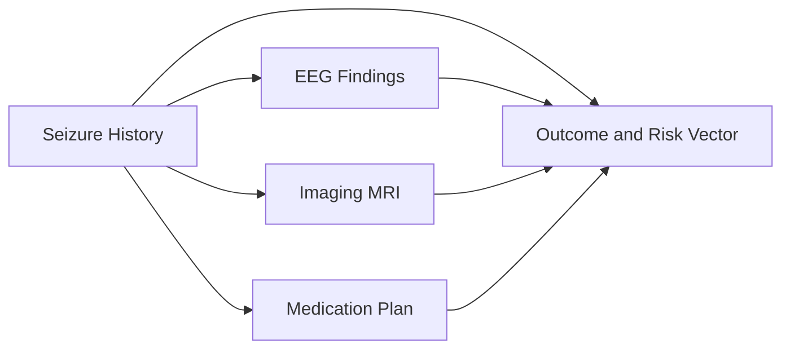
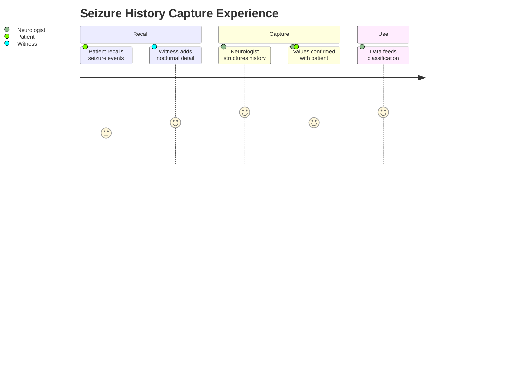

# Neurologist Assessment — Section 3: Seizure History (EP001)

> **Why (this doc):** Seizure history is the semiological backbone of the epilepsy record; it fixes seizure type, burden, and risk features that drive classification, treatment, and prognosis. **How:** The neurologist captures structured seizure descriptors for patient EP001 into a fixed variable/value table that feeds the downstream clinical vector and analytics pipeline.

**Problem:** Unstructured or missing seizure-history detail leads to misclassification and poor treatment targeting in focal epilepsy.

**Research Objective:** Capture standardized, ILAE-aligned seizure-history variables for EP001 so they can be reliably linked to diagnostic, therapeutic, and outcome data across the assessment.

**Role:** Neurologist · **Type:** Primary (clinical) data

*Caption - Core seizure-history variables for EP001, recorded by the neurologist. These values anchor seizure classification, burden quantification, and risk stratification for the rest of the epilepsy workup.*

| Variable | Value |
|---|---|
| Epilepsy Type | Focal Epilepsy |
| Seizure Type | Focal Impaired Awareness |
| Frequency | 5/month |
| Average Duration | 90 sec |
| Longest Seizure | 3 min |
| Last Seizure | 2026-06-18 |
| Cluster Seizures | No |
| Status Epilepticus | No |
| Nocturnal Seizures | Yes |
| Witnessed | Yes |
| Seizure Diary | Mobile App |

## Data Flow in the Pipeline

**Reason:** To show where seizure-history data enters and travels through the epilepsy data pipeline. **Why:** Because classification and treatment depend on this being captured before any downstream step. **What is happening:** Raw seizure events become structured, classified variables that populate the clinical vector. **How it is happening:** The neurologist elicits history, records it in the fixed table, and the values are mapped to ILAE categories and passed forward. **Reference:** Fisher et al. (2017).

## Role Capturing the Data

**Reason:** To make explicit which role captures each element of the seizure history. **Why:** Because accountability and provenance matter for clinical and research use. **What is happening:** The neurologist integrates patient and witness input into a single verified record. **How it is happening:** Structured interview plus witness corroboration is transcribed into the record and read back for confirmation. **Reference:** Fisher et al. (2017).

## Linkage to Other Assessment Sections

**Reason:** To show how seizure history connects to the wider clinical vector. **Why:** Because seizure semiology must correlate with EEG and imaging for a valid diagnosis. **What is happening:** History links laterally to investigations and treatment and feeds the composite risk vector. **How it is happening:** Shared patient identifiers and classification codes join these sections into one record. **Reference:** Topol (2019).

## Patient and Role Experience

**Reason:** To surface the lived experience of capturing this data item. **Why:** Because recall difficulty and witness dependence affect data quality. **What is happening:** Patient and witness recall is shaped into a confirmed, usable record. **How it is happening:** A guided interview plus mobile seizure-diary data reduces recall gaps and improves accuracy. **Reference:** APA (2020).

## Professor Readiness (Defense Q&A)

**Q1: Why record impaired awareness explicitly?** Awareness status is a core ILAE 2017 classifier that distinguishes focal aware from focal impaired-awareness seizures and drives management.

**Q2: Why capture nocturnal and witnessed status?** Nocturnal and unwitnessed seizures relate to SUDEP risk and to diagnostic reliability, so both are risk-relevant flags.

**Q3: Why use a mobile seizure diary?** Prospective app-based logging reduces recall bias in frequency estimates compared with retrospective clinic recall, improving burden quantification.

## References

American Psychological Association. (2020). *Publication manual of the American Psychological Association* (7th ed.). American Psychological Association.

Fisher, R. S., Cross, J. H., French, J. A., Higurashi, N., Hirsch, E., Jansen, F. E., Lagae, L., Moshé, S. L., Peltola, J., Roulet Perez, E., Scheffer, I. E., & Zuberi, S. M. (2017). Operational classification of seizure types by the International League Against Epilepsy. *Epilepsia, 58*(4), 522–530. https://doi.org/10.1111/epi.13670

Topol, E. J. (2019). *Deep medicine: How artificial intelligence can make healthcare human again*. Basic Books.
