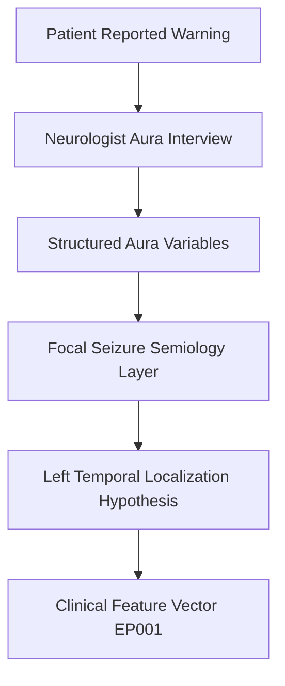
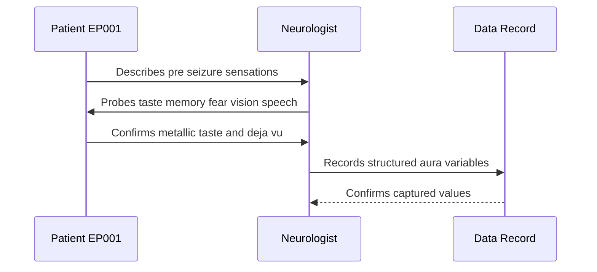
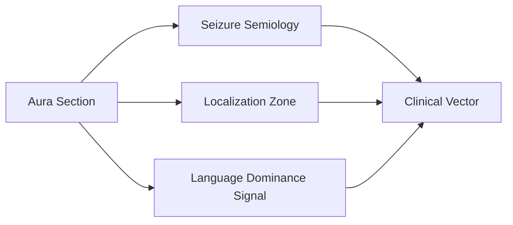
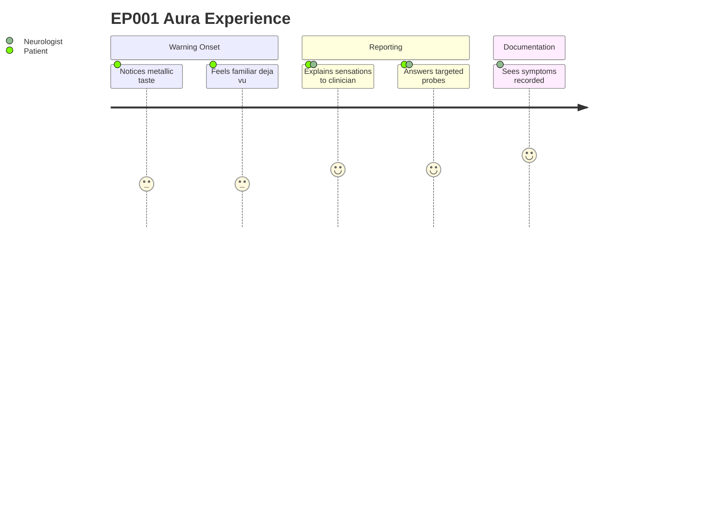

# Neurologist Assessment — Section 4: Aura (EP001)

> **Why (this doc):** The aura is the patient-reported warning phase of a focal seizure and, in focal impaired awareness epilepsy, offers direct localizing evidence about seizure onset before consciousness is lost. **How:** The neurologist structures the reported pre-ictal symptoms of EP001 (29M, focal impaired awareness, left-temporal) into discrete, machine-readable variables so they can feed the downstream localization and classification pipeline.

**Problem:** Aura symptoms are often described in free narrative, making them hard to compare across visits or link to an anatomical onset zone.

**Research Objective:** Capture EP001's aura semiology as standardized variables that support ILAE-consistent focal seizure classification and left-temporal localization.

**Role:** Neurologist · **Type:** Primary (clinical) data

*Caption - Structured aura semiology for EP001. The metallic taste, déjà vu, mild speech difficulty, and left-hand numbness together form a semiological signature consistent with a left (dominant) temporal onset with early perisylvian and mesial-temporal involvement.*

| Variable | Value |
|---|---|
| Aura Present | Yes |
| Metallic Taste | Yes |
| Déjà vu | Yes |
| Fear | No |
| Visual Aura | No |
| Auditory Aura | No |
| Speech Difficulty | Mild |
| Numbness | Left Hand |

## Data Flow and Context Diagrams

**Reason:** Shows where aura data enters the assessment pipeline. **Why:** Aura is the earliest evidence in the ictal timeline and anchors later localization. **What is happening:** Narrative warning symptoms are converted into structured variables that flow toward a localization hypothesis. **How it is happening:** The interview normalizes each symptom into a named field that joins the patient feature vector. **Reference:** Fisher et al. (2017).

**Reason:** Documents the role that captures the aura. **Why:** Accurate elicitation depends on targeted probing by the neurologist. **What is happening:** The clinician queries each symptom domain and records confirmed responses. **How it is happening:** A structured question set maps patient replies to discrete fields. **Reference:** Fisher et al. (2017).

**Reason:** Shows how aura links to other assessment sections. **Why:** Aura variables are not isolated and reinforce semiology, localization, and language findings. **What is happening:** The aura node fans out into related clinical dimensions that all converge on the vector. **How it is happening:** Shared variables cross-reference the aura record with adjacent sections. **Reference:** Fisher et al. (2017).

**Reason:** Captures the lived experience of the aura item. **Why:** Understanding the patient perspective improves elicitation fidelity. **What is happening:** EP001 moves from noticing warning signs to seeing them documented. **How it is happening:** The clinician guides the patient through recall and confirmation. **Reference:** Topol (2019).

## Professor Readiness (Defense Q&A)

**Q1: Why does the aura matter for localization in EP001?**
A: The aura reflects the seizure onset zone before spread. Metallic taste and déjà vu point to mesial and perisylvian temporal structures, consistent with a left-temporal focus.

**Q2: Why is mild speech difficulty significant here?**
A: Early ictal language disturbance suggests involvement of the dominant (left) hemisphere, supporting left-temporal lateralization rather than right.

**Q3: Why record negatives such as no visual or auditory aura?**
A: Documented negatives narrow the differential, arguing against occipital or lateral-temporal onset and strengthening the mesial left-temporal hypothesis.

## References

American Psychological Association. (2020). *Publication manual of the American Psychological Association* (7th ed.). American Psychological Association.

Fisher, R. S., Cross, J. H., French, J. A., Higurashi, N., Hirsch, E., Jansen, F. E., Lagae, L., Moshé, S. L., Peltola, J., Roulet Perez, E., Scheffer, I. E., & Zuberi, S. M. (2017). Operational classification of seizure types by the International League Against Epilepsy. *Epilepsia, 58*(4), 522-530. https://doi.org/10.1111/epi.13670

Topol, E. J. (2019). *Deep medicine: How artificial intelligence can make healthcare human again*. Basic Books.
