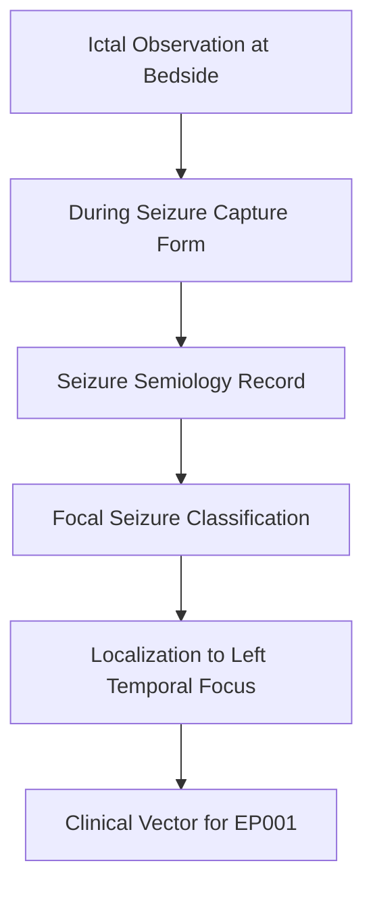
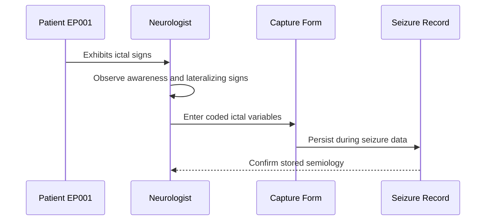
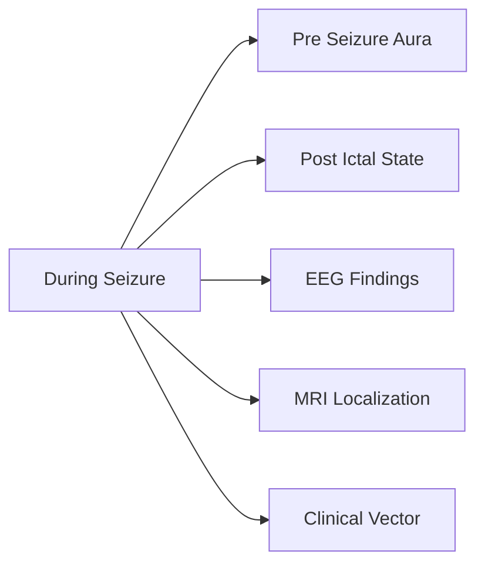
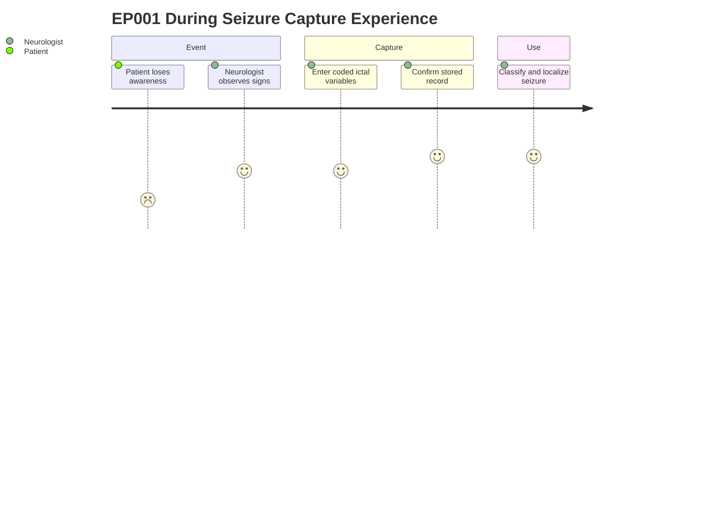

# Neurologist Assessment — Section 5: During Seizure (EP001)

> **Why (this doc):** Ictal (during-seizure) semiology is the single most localizing clinical
> signal in a focal epilepsy work-up, so it must be captured in a structured, comparable form.
> **How:** The neurologist records discrete observed ictal features for patient EP001 as
> controlled-vocabulary variables that feed the seizure-classification and localization pipeline.

**Problem:** Free-text seizure descriptions are inconsistent and non-comparable across
encounters, obscuring the lateralizing and localizing signs needed to classify focal seizures.

**Research Objective:** Capture standardized ictal semiology for EP001 so that lateralizing
signs (eye/limb) and impaired awareness can be reliably linked to the left-temporal focus and
used downstream for classification and treatment decisions.

**Role:** Neurologist · **Type:** Primary (clinical) data

*Caption - Structured ictal feature set observed during EP001's focal impaired-awareness
seizures; right-sided eye deviation and right arm jerking are contralateral lateralizing signs
consistent with the left-temporal focus, with no secondary generalization recorded.*

| Variable | Value |
|---|---|
| Loss of Awareness | Yes |
| Tongue Biting | Yes |
| Urinary Incontinence | No |
| Eye Deviation | Right |
| Limb Jerking | Right Arm |
| Generalization | No |

## Data Flow in the Pipeline

**Reason:** To show where during-seizure data enters and travels through the assessment pipeline.
**Why:** Ictal features only gain diagnostic value once routed into classification and localization.
**What is happening:** Bedside observations are structured, stored, then classified and localized.
**How it is happening:** The capture form normalizes each feature into a coded variable that
downstream classification and localization stages consume.
**Reference:** Fisher et al. (2017) operational classification of seizure types.

## Role Capturing It

**Reason:** To clarify who observes and records the during-seizure data and in what order.
**Why:** Accountability and fidelity of ictal capture depend on a defined observer workflow.
**What is happening:** The neurologist observes the event and enters coded variables.
**How it is happening:** Each observed sign is mapped to a controlled-vocabulary field and persisted.
**Reference:** Topol (2019) on structured clinician data capture in high-performance medicine.

## Links to Other Assessment Sections

**Reason:** To show how ictal features integrate with adjacent assessment sections.
**Why:** Localization is strongest when semiology converges with EEG and imaging evidence.
**What is happening:** During-seizure data cross-references aura, post-ictal, EEG and MRI data.
**How it is happening:** Shared patient keys join each section into a unified clinical vector.
**Reference:** Fisher et al. (2017) framework linking semiology to seizure classification.

## Patient and Role Experience

**Reason:** To surface the lived experience of the patient and clinician during ictal capture.
**Why:** Understanding friction points improves capture completeness and data quality.
**What is happening:** The patient experiences impaired awareness while the clinician records signs.
**How it is happening:** The clinician translates a distressing event into structured coded data.
**Reference:** Topol (2019) on patient-centered, data-rich clinical encounters.

## Professor Readiness (Defense Q&A)

**Q1: Why are right eye deviation and right arm jerking meaningful for EP001?**
A: Both are contralateral lateralizing signs pointing to the left hemisphere, consistent with
the documented left-temporal focus.

**Q2: Why record Generalization as a discrete variable?**
A: Absence of secondary generalization keeps the classification as focal impaired-awareness and
directly influences treatment and safety counseling.

**Q3: Why use controlled vocabulary instead of free text?**
A: Coded variables are comparable across encounters and machine-readable for downstream
classification, which free-text narratives cannot guarantee.

## References

American Psychological Association. (2020). *Publication manual of the American Psychological
Association* (7th ed.). American Psychological Association.

Fisher, R. S., Cross, J. H., French, J. A., Higurashi, N., Hirsch, E., Jansen, F. E., Lagae, L.,
Moshé, S. L., Peltola, J., Roulet Perez, E., Scheffer, I. E., & Zuberi, S. M. (2017).
Operational classification of seizure types by the International League Against Epilepsy:
Position paper of the ILAE Commission for Classification and Terminology. *Epilepsia, 58*(4),
522-530. https://doi.org/10.1111/epi.13670

Topol, E. J. (2019). *Deep medicine: How artificial intelligence can make healthcare human
again*. Basic Books.
