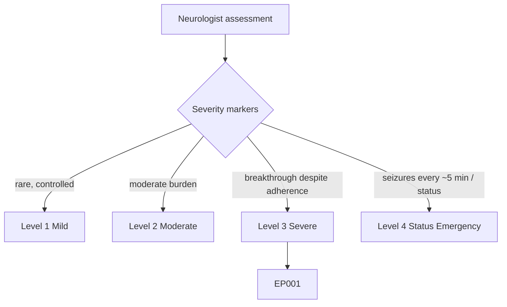
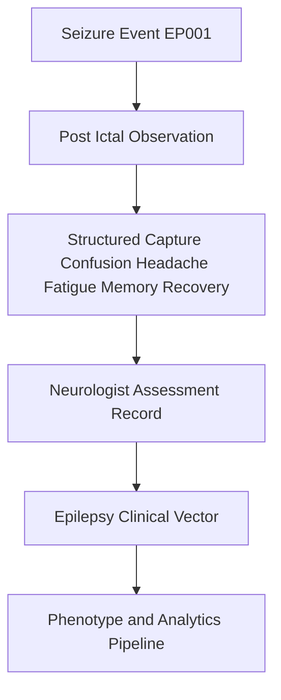
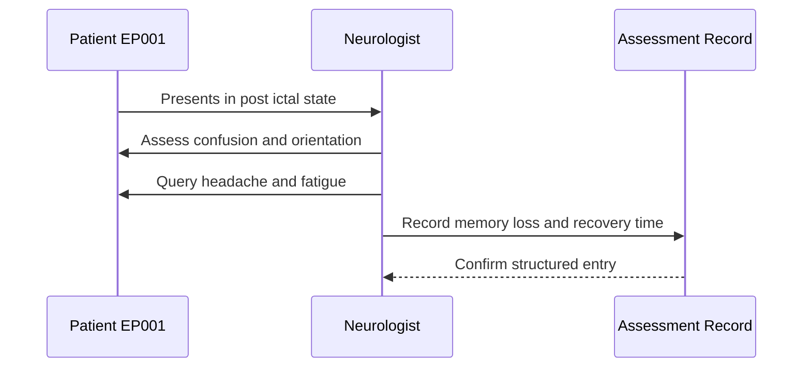
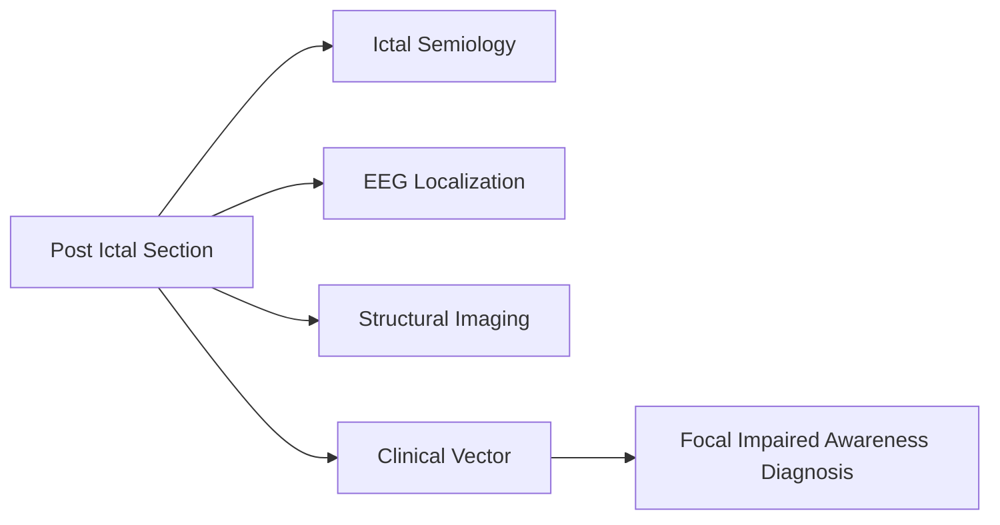
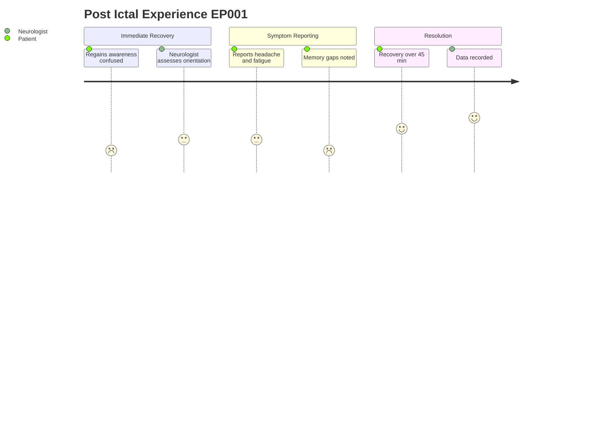

# Neurologist Assessment — Section 6: Post-Ictal (EP001)

> **Why (this doc):** The post-ictal state is a clinically informative window that reflects seizure severity, localization, and recovery burden for patient EP001 (29M, focal impaired awareness, left-temporal). **How:** The neurologist captures structured post-ictal signs (confusion, headache, fatigue, memory loss, recovery time) at the bedside and records them as discrete variables that feed the epilepsy clinical vector.

**Role:** Neurologist · **Type:** Primary (clinical) data

**Problem:** Post-ictal features are often recorded as free-text narrative, making them hard to compare across seizures and impossible to feed into a structured epilepsy phenotype.

**Research Objective:** Standardize post-ictal capture into discrete, machine-readable variables so recovery dynamics can be quantified and linked to seizure type and localization for EP001.

*Caption - Post-ictal signs recorded for EP001 immediately following a focal impaired awareness seizure. These values quantify the recovery burden and support left-temporal localization, and are preserved verbatim as the canonical data record.*

| Variable | Value |
|---|---|
| Confusion | 20 min |
| Headache | Mild |
| Fatigue | Severe |
| Memory Loss | Temporary |
| Recovery Time | 45 min |

## Questionnaire (Enterprise Form)

*Caption - The patient-facing questions the neurologist asks to capture this section, with response type, validation, EP001's example answer, and the derived AI feature.*

| ID | Question | Response Type | Validation | EP001 (Example) | AI Feature |
|---|---|---|---|---|---|
| NEU-0601 | How long are you confused after a seizure? | Number | 0-1440 min | 20 min | postictal_confusion_min |
| NEU-0602 | Do you get a headache afterwards, and how bad? | Dropdown[None|Mild|Moderate|Severe] | one-of[...] | Mild | postictal_headache |
| NEU-0603 | How tired do you feel afterwards? | Dropdown[None|Mild|Moderate|Severe|Profound] | one-of[...] | Severe | postictal_fatigue |
| NEU-0604 | Do you have any memory loss after a seizure? | Dropdown[None|Brief|Temporary|Prolonged] | one-of[...] | Temporary | postictal_memory_loss |
| NEU-0605 | How long until you feel back to normal? | Number | 0-1440 min | 45 min | recovery_time_min |

## Severity Scenario Model — Neurologist View

*Caption - The same assessment answered across four epilepsy severity levels from the neurologist's point of view; each variable shifts with severity. EP001 corresponds to Level 3 (Severe). Level 4 is the operational emergency — status epilepticus with seizures recurring about every 5 minutes.*

### Level 1 — Mild (Well-Controlled)
| Variable | Value |
|---|---|
| Confusion | <5 min |
| Headache | None |
| Fatigue | Mild |
| Memory Loss | None |
| Recovery Time | 10 min |

### Level 2 — Moderate (Intermediate)
| Variable | Value |
|---|---|
| Confusion | 10 min |
| Headache | Mild |
| Fatigue | Moderate |
| Memory Loss | Brief |
| Recovery Time | 25 min |

### Level 3 — Severe (Poorly Controlled) — EP001
| Variable | Value |
|---|---|
| Confusion | 20 min |
| Headache | Mild |
| Fatigue | Severe |
| Memory Loss | Temporary |
| Recovery Time | 45 min |

### Level 4 — Refractory / Status Epilepticus (Operational Emergency)
| Variable | Value |
|---|---|
| Confusion | Prolonged / obtunded (hours) |
| Headache | Severe |
| Fatigue | Profound |
| Memory Loss | Prolonged / dense amnesia |
| Recovery Time | No recovery between seizures (post-status coma) |

### Severity Classification Logic

**Reason:** Recovery burden grades along a severity ladder. **Why:** Duration of confusion and recovery indexes seizure severity and localization for EP001. **What is happening:** Confusion, fatigue, and recovery lengthen from minutes to no recovery between seizures. **How it is happening:** The neurologist reads post-ictal recovery variables against level thresholds. **Reference:** Fisher et al. (2017).

## Data Flow and Context Diagrams

**Reason:** To show where post-ictal data enters the overall assessment pipeline. **Why:** A data-capture doc must make its downstream destination explicit so values are not treated as isolated notes. **What is happening:** The seizure event triggers observation, which is structured into discrete variables and folded into the clinical vector. **How it is happening:** The neurologist transcribes bedside signs into typed fields that flow to the analytics layer. **Reference:** Fisher et al. (2017).

**Reason:** To clarify the human role capturing the data. **Why:** Provenance matters for clinical trust and reproducibility. **What is happening:** The neurologist observes and interrogates the patient, then commits structured values to the record. **How it is happening:** A sequenced bedside interaction converts observed signs into recorded fields. **Reference:** Fisher et al. (2017).

**Reason:** To show how this section links to other assessment areas. **Why:** Post-ictal features gain meaning when cross-referenced with ictal and imaging data. **What is happening:** The section connects to semiology, EEG, and imaging and converges on the clinical vector. **How it is happening:** Shared patient identity EP001 joins these sections into one diagnostic picture. **Reference:** Fisher et al. (2017).

**Reason:** To capture the lived experience of the post-ictal window. **Why:** Understanding patient burden guides care and contextualizes the numbers. **What is happening:** The patient moves from confusion through symptom reporting to resolution while the neurologist records data. **How it is happening:** Time-ordered recovery is mapped to both patient and clinician actions. **Reference:** Fisher et al. (2017).

## Professor Readiness (Defense Q&A)

**Q1: Why record post-ictal confusion duration as a discrete variable?**
A: Prolonged post-ictal confusion correlates with seizure severity and temporal-lobe involvement; quantifying it (20 min for EP001) supports left-temporal localization and enables cross-seizure comparison.

**Q2: How does this section support the focal impaired awareness diagnosis?**
A: The combination of temporary memory loss, marked fatigue, and a 45-minute recovery is consistent with impaired awareness of temporal origin, reinforcing the ILAE 2017 classification for EP001.

**Q3: Why standardize these fields instead of using narrative notes?**
A: Structured fields are machine-readable and feed the clinical vector, allowing reproducible analytics and phenotype linkage that free-text narrative cannot provide (Topol, 2019).

## References

American Psychological Association. (2020). *Publication manual of the American Psychological Association* (7th ed.). https://doi.org/10.1037/0000165-000

Fisher, R. S., Cross, J. H., French, J. A., Higurashi, N., Hirsch, E., Jansen, F. E., Lagae, L., Moshé, S. L., Peltola, J., Roulet Perez, E., Scheffer, I. E., & Zuberi, S. M. (2017). Operational classification of seizure types by the International League Against Epilepsy: Position paper of the ILAE Commission for Classification and Terminology. *Epilepsia, 58*(4), 522–530. https://doi.org/10.1111/epi.13670

Topol, E. J. (2019). High-performance medicine: The convergence of human and artificial intelligence. *Nature Medicine, 25*(1), 44–56. https://doi.org/10.1038/s41591-018-0300-7
