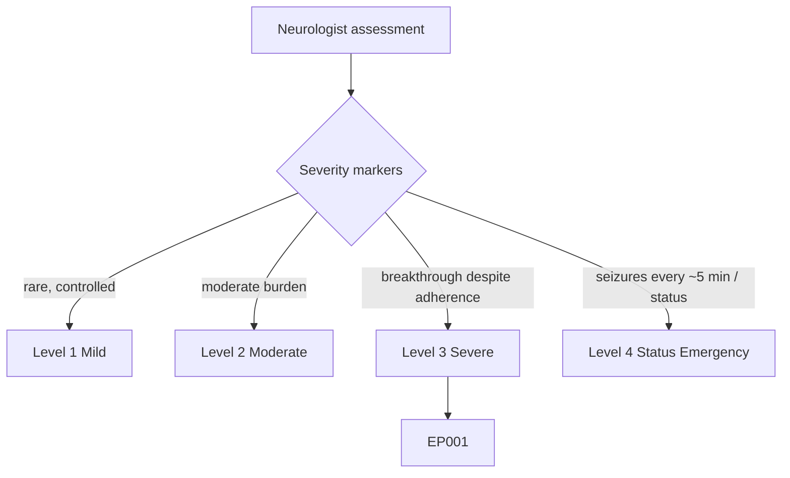
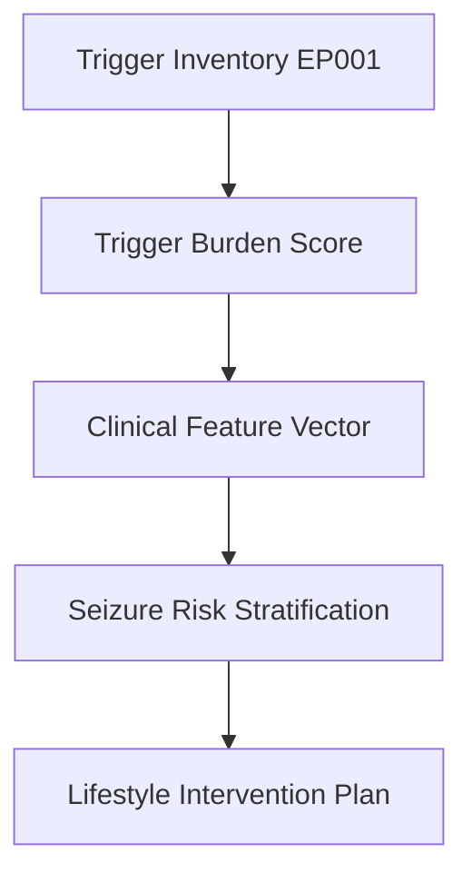
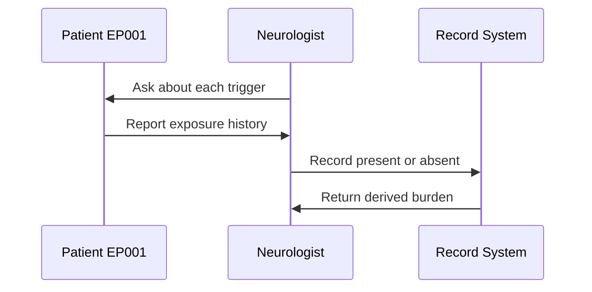
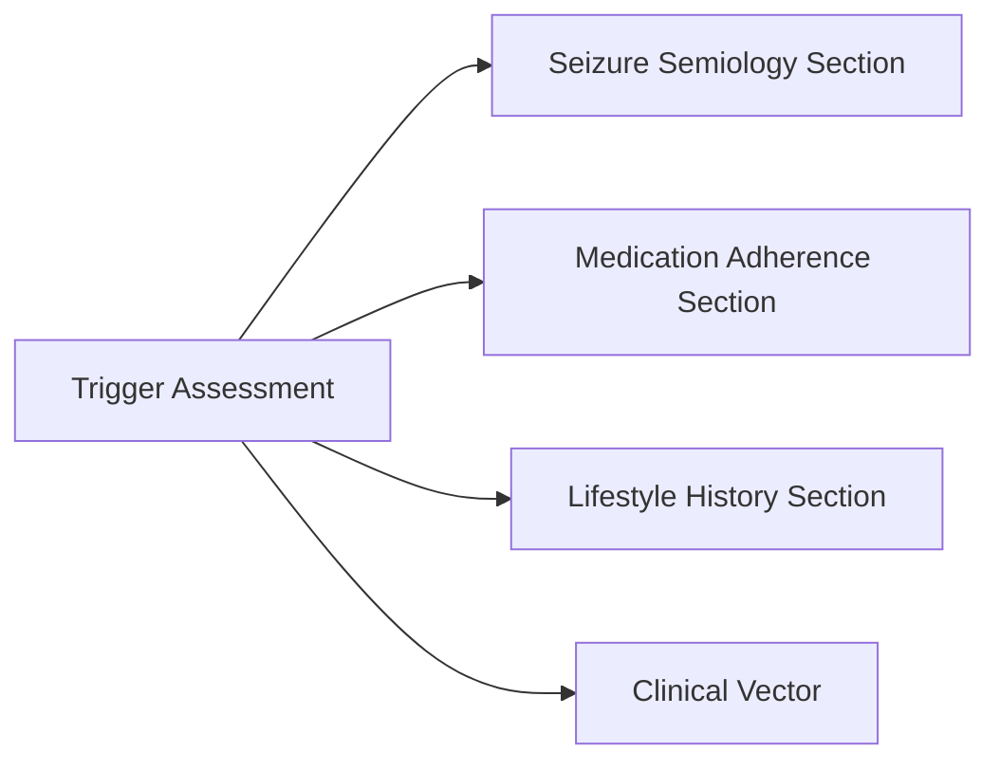
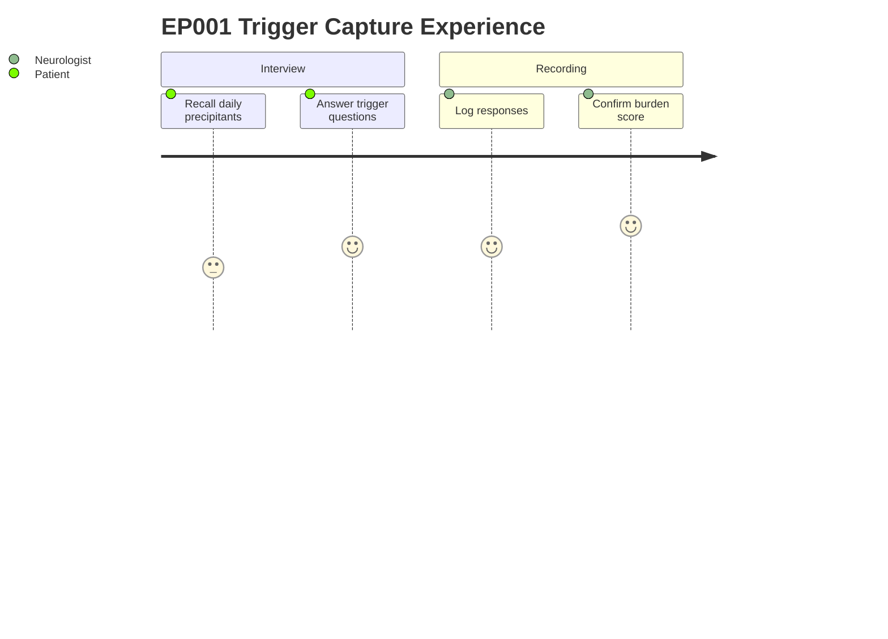

# Neurologist Assessment — Section 7: Trigger Assessment (EP001)

> **Why (this doc):** Seizure triggers are modifiable precipitants; capturing them structures targeted counselling and risk reduction for this focal epilepsy patient. **How:** The neurologist records presence/absence of established triggers and derives a Trigger Burden score that feeds the downstream clinical vector.

**Role:** Neurologist · **Type:** Primary (clinical) data

**Problem:** Recurrent focal impaired-awareness seizures in a 29M with left-temporal onset are worsened by avoidable daily precipitants that are inconsistently documented.

**Research Objective:** Standardise trigger capture so precipitant burden becomes a reproducible feature for seizure-risk stratification and personalised lifestyle intervention.

*Caption - Structured trigger inventory for EP001, recording each established precipitant as present/absent and summarising overall precipitant load. Present to make modifiable risk factors explicit and machine-readable.*

| Trigger | Present |
|---|---|
| Sleep Deprivation | Yes |
| Stress | Yes |
| Flashing Lights | No |
| Fever | No |
| Alcohol | Occasionally |
| Missed Medication | Yes |
| Emotional Stress | Yes |
| Fasting | No |

**Derived:** Trigger Burden = 4 (High)

## Severity Scenario Model — Neurologist View

*Caption - The same assessment answered across four epilepsy severity levels from the neurologist's point of view; each variable shifts with severity. EP001 corresponds to Level 3 (Severe). Level 4 is the operational emergency — status epilepticus with seizures recurring about every 5 minutes.*

### Level 1 — Mild (Well-Controlled)
| Trigger | Present |
|---|---|
| Sleep Deprivation | No |
| Stress | No |
| Flashing Lights | No |
| Fever | No |
| Alcohol | No |
| Missed Medication | No |
| Emotional Stress | No |
| Fasting | No |

**Derived:** Trigger Burden = 0 (Low)

### Level 2 — Moderate (Intermediate)
| Trigger | Present |
|---|---|
| Sleep Deprivation | Yes |
| Stress | Yes |
| Flashing Lights | No |
| Fever | No |
| Alcohol | No |
| Missed Medication | No |
| Emotional Stress | No |
| Fasting | No |

**Derived:** Trigger Burden = 2 (Moderate)

### Level 3 — Severe (Poorly Controlled) — EP001
| Trigger | Present |
|---|---|
| Sleep Deprivation | Yes |
| Stress | Yes |
| Flashing Lights | No |
| Fever | No |
| Alcohol | Occasionally |
| Missed Medication | Yes |
| Emotional Stress | Yes |
| Fasting | No |

**Derived:** Trigger Burden = 4 (High)

### Level 4 — Refractory / Status Epilepticus (Operational Emergency)
| Trigger | Present |
|---|---|
| Sleep Deprivation | Yes |
| Stress | Yes |
| Flashing Lights | No |
| Fever | Yes |
| Alcohol | No |
| Missed Medication | Yes (abrupt ASM withdrawal) |
| Emotional Stress | Yes |
| Fasting | Yes |

**Derived:** Trigger Burden = 6 (Very High — status precipitants)

### Severity Classification Logic

**Reason:** Precipitant load grades along a severity ladder. **Why:** Trigger burden indexes modifiable risk and predicts breakthrough for EP001. **What is happening:** The count rises from zero triggers to a stack of status precipitants including ASM withdrawal and fever. **How it is happening:** The neurologist sums present triggers against burden thresholds. **Reference:** Fisher et al. (2017).

## Pipeline and Role Diagrams

**Reason:** To show where trigger data enters the assessment pipeline. **Why:** Downstream risk models depend on a clean upstream precipitant feature. **What is happening:** The raw inventory is scored into a burden value, joined to the clinical vector, and consumed by risk and intervention stages. **How it is happening:** Each Yes trigger increments the burden count, which is thresholded into a categorical level. **Reference:** Fisher et al. (2017).

**Reason:** To document who captures the trigger data and in what order. **Why:** Attribution and sequencing protect data provenance. **What is happening:** The neurologist elicits each precipitant, the patient reports, and the record system stores and derives the score. **How it is happening:** Structured interview questions map one-to-one onto record fields. **Reference:** Topol (2019).

**Reason:** To show how triggers link to other assessment sections. **Why:** Precipitants overlap with adherence and lifestyle features and must not be siloed. **What is happening:** The trigger node connects to semiology, medication, and lifestyle sections and into the shared vector. **How it is happening:** Shared patient identifiers join these sections at the feature layer. **Reference:** Fisher et al. (2017).

**Reason:** To capture the lived experience of the trigger review for both roles. **Why:** Patient recall effort and clinician confidence affect data quality. **What is happening:** The patient recalls and answers while the neurologist logs and confirms the derived burden. **How it is happening:** A guided checklist lowers recall burden and raises completeness. **Reference:** Topol (2019).

## Professor Readiness (Defense Q&A)

**Q1: Why score Alcohol as a trigger when it is only occasional?** Occasional exposure still contributes to cumulative precipitant load; it is recorded honestly but the burden count reflects consistently present triggers, keeping the score conservative.

**Q2: How is Trigger Burden = 4 (High) derived?** Four triggers are marked Yes (Sleep Deprivation, Stress, Missed Medication, Emotional Stress); the count crosses the pre-set High threshold, making the category reproducible.

**Q3: Why does trigger assessment matter for a left-temporal focal patient specifically?** Focal impaired-awareness seizures are strongly sleep- and stress-sensitive, so modifiable triggers offer high-yield, non-pharmacological risk reduction.

## References

American Psychological Association. (2020). *Publication manual of the American Psychological Association* (7th ed.). https://doi.org/10.1037/0000165-000

Fisher, R. S., Cross, J. H., French, J. A., Higurashi, N., Hirsch, E., Jansen, F. E., Lagae, L., Moshé, S. L., Peltola, J., Roulet Perez, E., Scheffer, I. E., & Zuberi, S. M. (2017). Operational classification of seizure types by the International League Against Epilepsy: Position paper of the ILAE Commission for Classification and Terminology. *Epilepsia, 58*(4), 522–530. https://doi.org/10.1111/epi.13670

Topol, E. J. (2019). High-performance medicine: The convergence of human and artificial intelligence. *Nature Medicine, 25*(1), 44–56. https://doi.org/10.1038/s41591-018-0300-7
