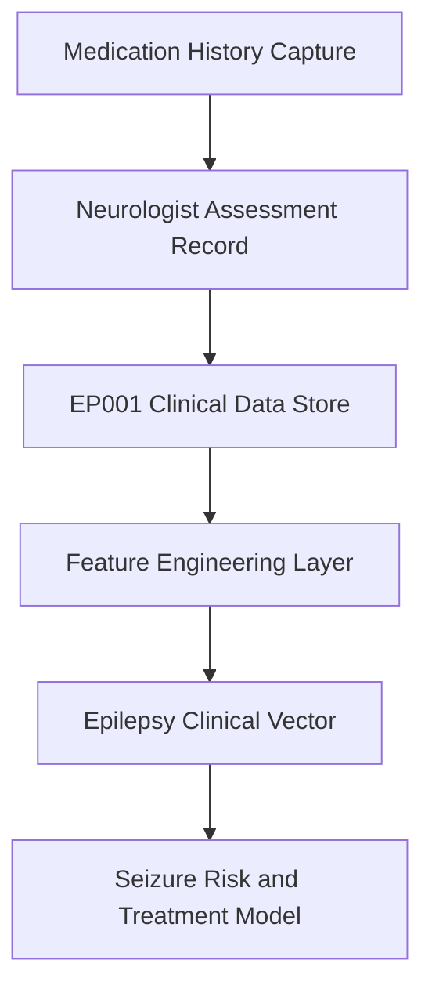
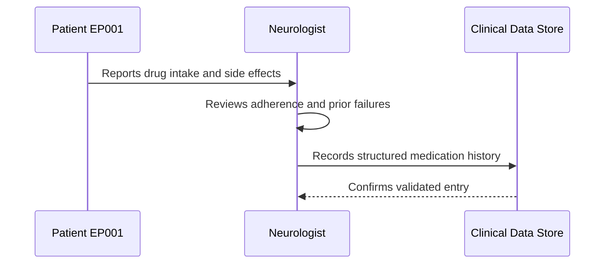
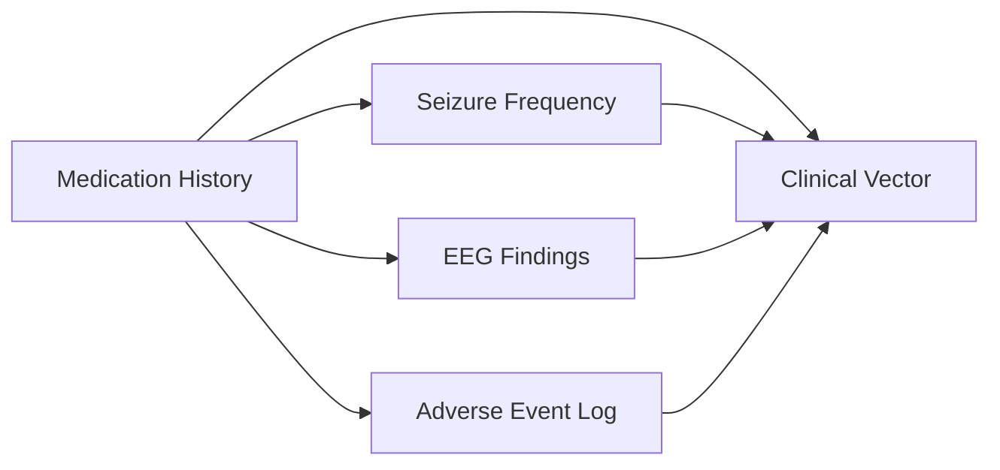
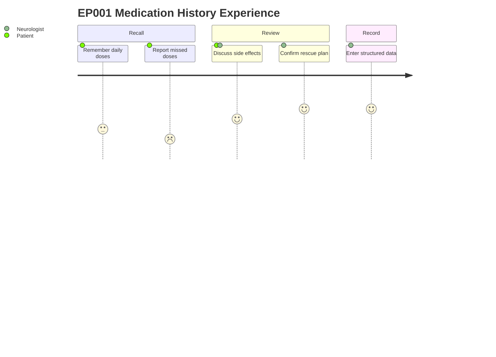

# Neurologist Assessment — Section 8: Medication History (EP001)

> **Why (this doc):** Antiseizure medication history is the backbone of epilepsy management — it records what has controlled seizures, what failed, and how reliably the patient takes therapy. **How:** The neurologist captures current drug, dose, duration, adherence, side effects, rescue therapy, and prior drug failures into a structured, machine-readable record for EP001.

**Problem:** Focal impaired-awareness seizures in EP001 (29M, left-temporal) require ongoing pharmacological control, yet adherence gaps and side effects can silently undermine seizure freedom.

**Research Objective:** Capture a complete, structured medication history so drug response, adherence, and tolerability can be modelled as features in the epilepsy clinical vector.

**Role:** Neurologist · **Type:** Primary (clinical) data

*Caption - Current antiseizure medication profile for EP001: it records the active drug regimen, adherence, tolerability, rescue therapy, and treatment history that together drive management decisions.*

| Variable | Value |
|---|---|
| Current Medication | Levetiracetam |
| Dose | 1000 mg BID |
| Duration | 12 months |
| Adherence | 88% |
| Missed Doses | 3/month |
| Side Effects | Irritability |
| Rescue Medication | Midazolam Nasal Spray |
| Previous Drug Failure | Carbamazepine |

## Data Flow in the Pipeline

**Reason:** To show where captured medication data travels once recorded. **Why:** Downstream models need drug, adherence, and tolerability as structured inputs. **What is happening:** Raw medication fields flow from capture into the clinical store, then into engineered features. **How it is happening:** Each variable is normalised and joined into EP001's clinical vector for modelling. **Reference:** Topol (2019).

## Role Capturing the Data

**Reason:** To document who elicits and records the medication history. **Why:** Accountability and provenance matter for clinical data quality. **What is happening:** The neurologist interviews EP001 and writes a validated record. **How it is happening:** Patient-reported intake is reconciled with clinical judgement before storage. **Reference:** Fisher et al. (2017).

## Links to Other Assessment Sections

**Reason:** To place medication data among related assessment sections. **Why:** Drug response is interpreted alongside seizure and EEG data. **What is happening:** Medication history connects to seizure frequency, EEG, and adverse events. **How it is happening:** Shared EP001 identifiers link each section into one clinical vector. **Reference:** Fisher et al. (2017).

## Patient and Role Experience

**Reason:** To capture the lived experience of collecting this item. **Why:** Adherence data quality depends on honest, low-friction recall. **What is happening:** EP001 recalls doses and side effects while the neurologist confirms the plan. **How it is happening:** A guided interview eases recall and structures the final record. **Reference:** Topol (2019).

## Professor Readiness (Defense Q&A)

**Q1: Why record adherence as a percentage rather than a yes/no field?**
A: Adherence is continuous; 88% with 3 missed doses/month quantifies risk and predicts breakthrough seizures better than a binary flag.

**Q2: Why capture previous drug failures?**
A: Carbamazepine failure documents the treatment pathway, guides future drug selection, and flags EP001 toward possible drug-resistant epilepsy per ILAE criteria.

**Q3: How does side-effect data affect modelling?**
A: Irritability on levetiracetam is a tolerability signal that can predict discontinuation and is weighted in the clinical vector alongside efficacy.

## References

American Psychological Association. (2020). *Publication manual of the American Psychological Association* (7th ed.). https://doi.org/10.1037/0000165-000

Fisher, R. S., Cross, J. H., French, J. A., Higurashi, N., Hirsch, E., Jansen, F. E., Lagae, L., Moshé, S. L., Peltola, J., Roulet Perez, E., Scheffer, I. E., & Zuberi, S. M. (2017). Operational classification of seizure types by the International League Against Epilepsy. *Epilepsia, 58*(4), 522–530. https://doi.org/10.1111/epi.13670

Topol, E. J. (2019). High-performance medicine: The convergence of human and artificial intelligence. *Nature Medicine, 25*(1), 44–56. https://doi.org/10.1038/s41591-018-0300-7
