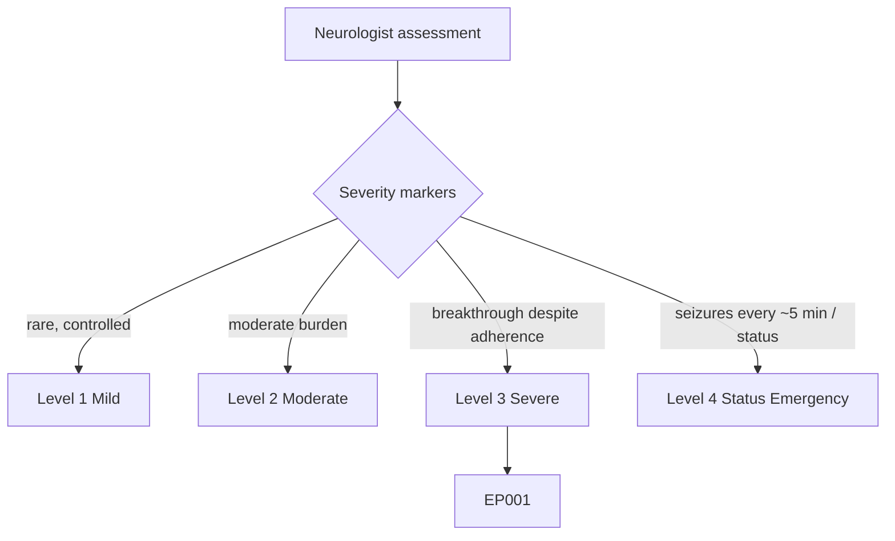
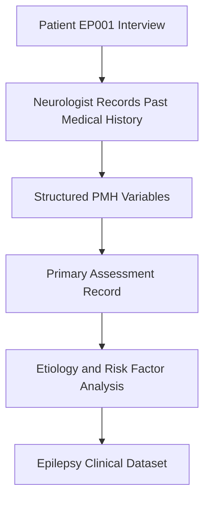
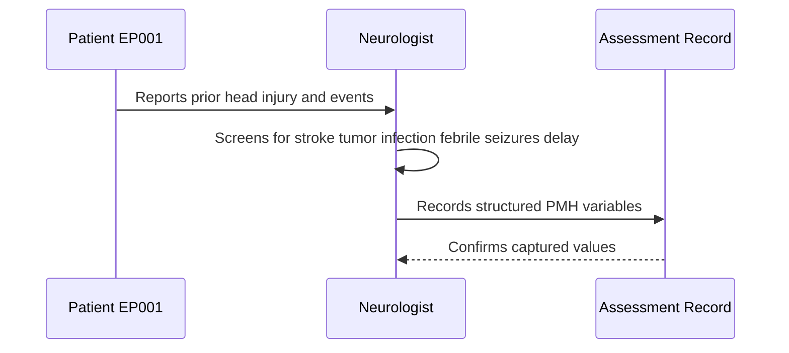
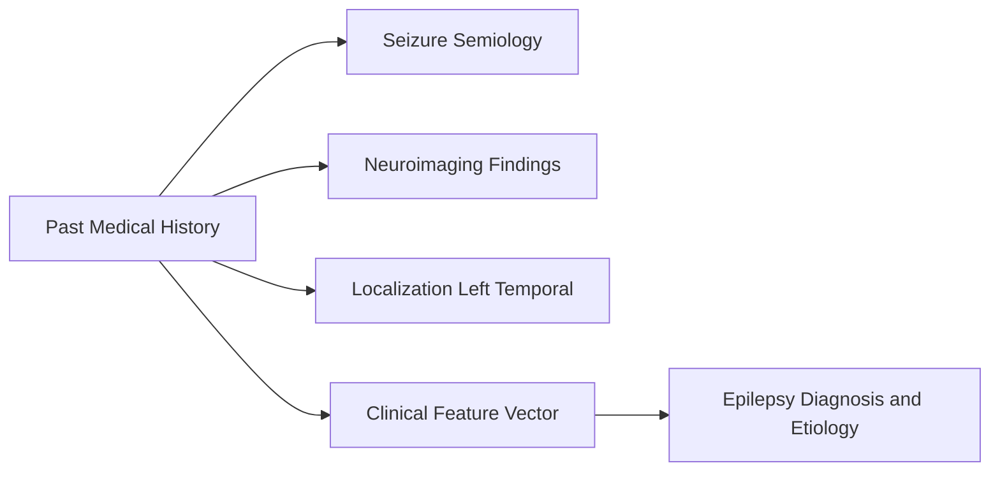
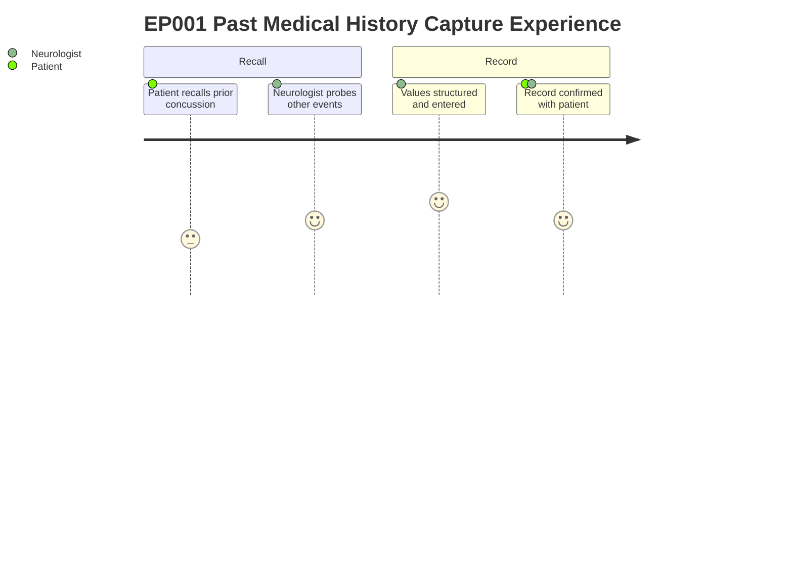

# Neurologist Assessment — Section 9: Past Medical History (EP001)

> **Why (this doc):** Past medical history establishes structural and acquired risk factors (e.g., prior head injury) that can underpin a focal epilepsy syndrome and shape etiological reasoning. **How:** The neurologist captures a concise, structured history of neurologically relevant prior events for patient EP001 (29M, focal impaired awareness seizures, left-temporal onset), stored as discrete variables for downstream analysis.

**Role:** Neurologist · **Type:** Primary (clinical) data

**Problem:** Focal epilepsy etiology is often multifactorial, and prior neurological insults are easily under-documented when history-taking is unstructured.

**Research Objective:** Capture a standardized past medical history vector for EP001 so acquired/structural risk factors can be linked to seizure semiology and localization in the epilepsy dataset.

*Caption - Structured past medical history for EP001. Each row is a discrete, analyzable clinical variable; the positive head-injury finding is the salient risk factor for a left-temporal focal epilepsy.*

| Variable | Value |
|---|---|
| Head Injury | Mild concussion (2019) |
| Stroke | No |
| Brain Tumor | No |
| CNS Infection | No |
| Febrile Seizures | No |
| Developmental Delay | No |

## Questionnaire (Enterprise Form)

*Caption - The patient-facing questions the neurologist asks to capture this section, with response type, validation, EP001's example answer, and the derived AI feature.*

| ID | Question | Response Type | Validation | EP001 (Example) | AI Feature |
|---|---|---|---|---|---|
| NEU-0901 | Have you ever had a head injury or concussion? If so, when? | Dropdown[None, Mild concussion, Moderate TBI, Severe TBI] + Date | Allowed set; year 1900-present | Mild concussion (2019) | head_injury_history |
| NEU-0902 | Have you ever been told you had a stroke? | Yes-No | Yes/No | No | prior_stroke_flag |
| NEU-0903 | Have you ever been diagnosed with a brain tumor? | Yes-No | Yes/No | No | brain_tumor_flag |
| NEU-0904 | Have you had any infection of the brain or spinal cord (e.g., meningitis, encephalitis)? | Yes-No | Yes/No | No | cns_infection_flag |
| NEU-0905 | As a child, did you have seizures with fever (febrile seizures)? | Dropdown[No, Simple, Complex/prolonged] | Allowed set | No | febrile_seizure_history |
| NEU-0906 | Were you ever told you had developmental delay as a child? | Yes-No | Yes/No | No | developmental_delay_flag |

## Severity Scenario Model — Neurologist View

*Caption - The same assessment answered across four epilepsy severity levels from the neurologist's point of view; each variable shifts with severity. EP001 corresponds to Level 3 (Severe). Level 4 is the operational emergency — status epilepticus with seizures recurring about every 5 minutes.*

### Level 1 — Mild (Well-Controlled)
| Variable | Value |
|---|---|
| Head Injury | No |
| Stroke | No |
| Brain Tumor | No |
| CNS Infection | No |
| Febrile Seizures | No |
| Developmental Delay | No |

### Level 2 — Moderate (Intermediate)
| Variable | Value |
|---|---|
| Head Injury | Remote mild concussion (childhood) |
| Stroke | No |
| Brain Tumor | No |
| CNS Infection | No |
| Febrile Seizures | Simple (childhood) |
| Developmental Delay | No |

### Level 3 — Severe (Poorly Controlled) — EP001
| Variable | Value |
|---|---|
| Head Injury | Mild concussion (2019) |
| Stroke | No |
| Brain Tumor | No |
| CNS Infection | No |
| Febrile Seizures | No |
| Developmental Delay | No |

### Level 4 — Refractory / Status Epilepticus (Operational Emergency)
| Variable | Value |
|---|---|
| Head Injury | Severe TBI with contusion |
| Stroke | Prior ischemic stroke |
| Brain Tumor | Low-grade glioma (resected) |
| CNS Infection | Prior encephalitis |
| Febrile Seizures | Complex, prolonged |
| Developmental Delay | Yes |

### Severity Classification Logic

**Reason:** Acquired structural insults grade the epileptogenic risk carried by past medical history. **Why:** More prior CNS injury predicts a more refractory focal syndrome. **What is happening:** The history moves from clean (L1) to a single mild insult (L3, EP001) to multiple structural lesions (L4). **How it is happening:** Each risk-factor row is scored and the aggregate places the patient on the ladder. **Reference:** Fisher et al. (2017).

## Data Flow and Context Diagrams

**Reason:** To show where past medical history enters the assessment pipeline. **Why:** Risk-factor data must be traceable from interview to dataset. **What is happening:** History is elicited, structured into variables, and merged into the primary record for etiological analysis. **How it is happening:** The neurologist encodes each historical item as a discrete field feeding the clinical dataset. **Reference:** Fisher et al. (2017).

**Reason:** To depict the role capturing this data. **Why:** Accurate attribution and verification reduce recall and transcription error. **What is happening:** The neurologist interrogates each risk domain and commits values to the record. **How it is happening:** A question-and-confirm exchange populates the structured PMH fields. **Reference:** Fisher et al. (2017).

**Reason:** To show linkage to other assessment sections. **Why:** History gains meaning only alongside semiology, imaging, and localization. **What is happening:** PMH connects to related domains and feeds the combined clinical vector. **How it is happening:** Shared patient identifiers join sections into a single feature vector. **Reference:** Topol (2019).

**Reason:** To capture the lived experience of this item. **Why:** History-taking quality depends on patient recall and clinician prompting. **What is happening:** The patient recalls events while the neurologist structures and confirms them. **How it is happening:** A guided recall-and-confirm interaction produces reliable data. **Reference:** APA (2020).

## Professor Readiness (Defense Q&A)

**Q1: Why is the 2019 concussion clinically relevant for EP001?** Post-traumatic mechanisms can contribute to focal epileptogenesis; a prior mild head injury is a plausible acquired risk factor consistent with left-temporal focal onset.

**Q2: Why record negatives (stroke, tumor, infection) explicitly?** Documented negatives narrow the etiological differential and confirm the domain was screened rather than omitted, supporting data completeness.

**Q3: How does past medical history support ILAE-aligned classification?** It informs the etiology axis (structural, infectious, etc.) of the ILAE framework, complementing seizure type and epilepsy type determination.

## References

American Psychological Association. (2020). *Publication manual of the American Psychological Association* (7th ed.). https://doi.org/10.1037/0000165-000

Fisher, R. S., Cross, J. H., French, J. A., Higurashi, N., Hirsch, E., Jansen, F. E., Lagae, L., Moshé, S. L., Peltola, J., Roulet Perez, E., Scheffer, I. E., & Zuberi, S. M. (2017). Operational classification of seizure types by the International League Against Epilepsy: Position paper of the ILAE Commission for Classification and Terminology. *Epilepsia, 58*(4), 522–530. https://doi.org/10.1111/epi.13670

Topol, E. J. (2019). *Deep medicine: How artificial intelligence can make healthcare human again.* Basic Books.
