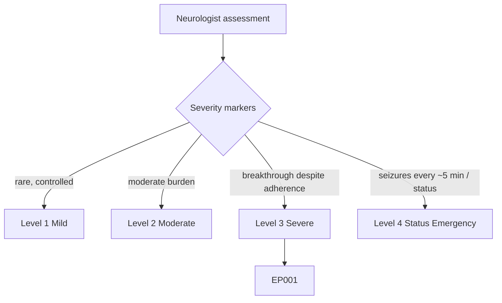
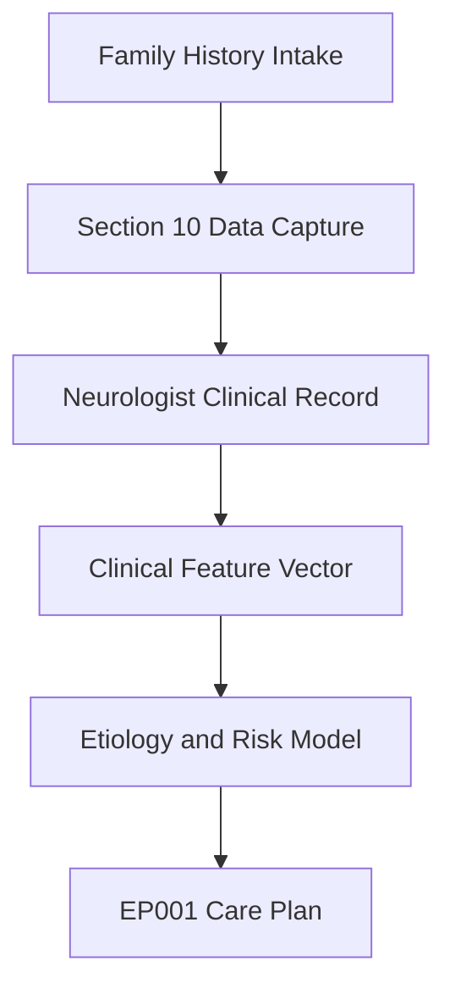
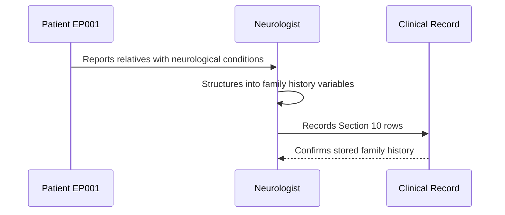
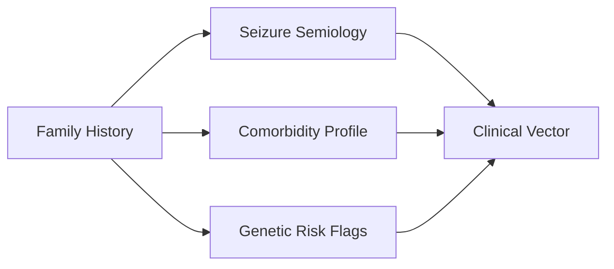
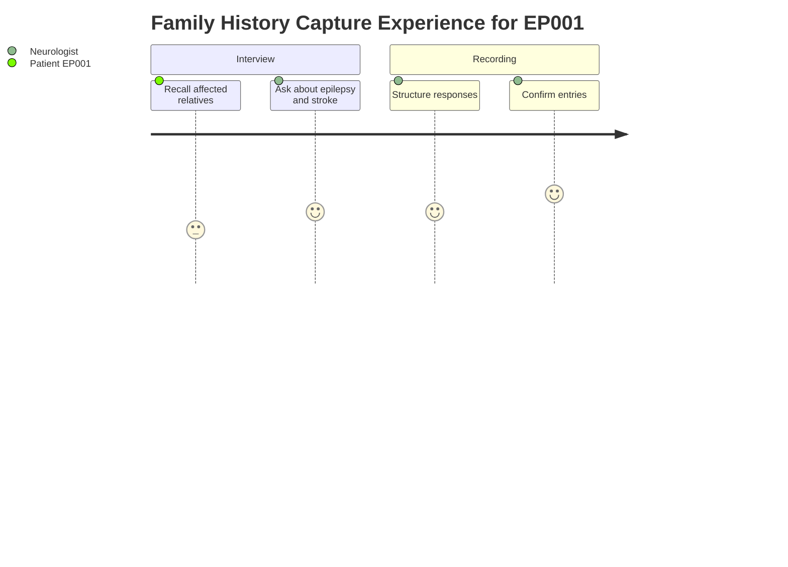

# Neurologist Assessment — Section 10: Family History (EP001)

> **Why (this doc):** Family history captures heritable and shared-environment risk signals that refine the differential and etiological workup for EP001 (29M, focal impaired awareness epilepsy, left-temporal). **How:** The neurologist records first- and second-degree relative conditions during structured intake, one variable per row, for downstream clinical-vector modeling.

**Role:** Neurologist · **Type:** Primary (clinical) data

**Problem:** Epilepsy etiology is often multifactorial, and undocumented familial neurological disease leaves genetic and comorbidity risk unquantified.

**Research Objective:** Capture a concise, structured family-history vector for EP001 so heritable epilepsy risk and comorbid neurovascular patterns can be linked to phenotype and treatment response.

*Caption - Family-history variables for EP001, recorded one condition per row with the affected relative. Preserved verbatim as the primary data of record for this section.*

| Variable | Value |
|---|---|
| Family Epilepsy | Maternal Uncle |
| Migraine | Mother |
| Stroke | None |
| Dementia | None |

## Questionnaire (Enterprise Form)

*Caption - The patient-facing questions the neurologist asks to capture this section, with response type, validation, EP001's example answer, and the derived AI feature.*

| ID | Question | Response Type | Validation | EP001 (Example) | AI Feature |
|---|---|---|---|---|---|
| NEU-1001 | Does anyone in your family have epilepsy or seizures? If so, which relative? | Dropdown[None, First-degree, Second-degree, Distant] + Text | Allowed set; relative label | Maternal Uncle | family_epilepsy_relative |
| NEU-1002 | Does any close relative have migraines? | Dropdown[None, Mother, Father, Sibling, Other] | Allowed set | Mother | family_migraine_relative |
| NEU-1003 | Has any family member had a stroke? | Dropdown[None, First-degree, Second-degree, Grandparent] | Allowed set | None | family_stroke_relative |
| NEU-1004 | Is there any family history of dementia? | Dropdown[None, First-degree, Second-degree, Grandparent] | Allowed set | None | family_dementia_relative |

## Severity Scenario Model — Neurologist View

*Caption - The same assessment answered across four epilepsy severity levels from the neurologist's point of view; each variable shifts with severity. EP001 corresponds to Level 3 (Severe). Level 4 is the operational emergency — status epilepticus with seizures recurring about every 5 minutes.*

### Level 1 — Mild (Well-Controlled)
| Variable | Value |
|---|---|
| Family Epilepsy | None |
| Migraine | None |
| Stroke | None |
| Dementia | None |

### Level 2 — Moderate (Intermediate)
| Variable | Value |
|---|---|
| Family Epilepsy | Distant cousin |
| Migraine | Mother |
| Stroke | None |
| Dementia | None |

### Level 3 — Severe (Poorly Controlled) — EP001
| Variable | Value |
|---|---|
| Family Epilepsy | Maternal Uncle |
| Migraine | Mother |
| Stroke | None |
| Dementia | None |

### Level 4 — Refractory / Status Epilepticus (Operational Emergency)
| Variable | Value |
|---|---|
| Family Epilepsy | Father and sibling (first-degree) |
| Migraine | Mother |
| Stroke | Grandparent |
| Dementia | Grandparent |

### Severity Classification Logic

**Reason:** Density and proximity of affected relatives index heritable epilepsy risk. **Why:** First-degree clustering signals higher penetrance and more refractory phenotypes. **What is happening:** Family history moves from none (L1) to a second-degree uncle (L3, EP001) to first-degree plus neurovascular load (L4). **Why it is happening:** Closer relatives and multiple neurological diagnoses raise the genetic-risk weighting. **How it is happening:** Each relative row is coded by degree and diagnosis into an aggregate risk flag. **Reference:** Fisher et al. (2017).

## Data Flow in the Pipeline

**Reason:** To show where family-history data enters and travels through the assessment pipeline. **Why:** Downstream etiology models depend on knowing the provenance of each heritable-risk feature. **What is happening:** Intake data is captured in Section 10, merged into the clinical record, and vectorized for risk modeling. **How it is happening:** The neurologist enters structured rows that flow into the shared clinical feature store. **Reference:** Fisher et al. (2017).

## Role Capturing the Data

**Reason:** To make explicit which role elicits and records the family-history data. **Why:** Accountability and data quality depend on a defined capturing role. **What is happening:** The neurologist interviews EP001 and encodes responses into structured variables. **How it is happening:** Verbal report is translated into standardized rows and committed to the record. **Reference:** Topol (2019).

## Linkage to Other Assessment Sections

**Reason:** To position family history within the broader assessment graph. **Why:** No single section is diagnostic alone; linkage creates the composite clinical vector. **What is happening:** Family-history signals feed semiology, comorbidity, and genetic-risk nodes that converge on the clinical vector. **How it is happening:** Shared identifiers join Section 10 to sibling assessment sections. **Reference:** Fisher et al. (2017).

## Patient and Role Experience

**Reason:** To surface the lived experience of capturing this item. **Why:** Recall burden and interview quality affect data completeness. **What is happening:** EP001 recalls relatives while the neurologist probes and records. **How it is happening:** A guided interview turns memory into confirmed structured entries. **Reference:** APA (2020).

## Professor Readiness (Defense Q&A)

**Q1: Why record second-degree relatives such as a maternal uncle rather than only first-degree?**
A1: Focal epilepsies can show incomplete penetrance and inheritance through unaffected carriers, so a maternal uncle with epilepsy is a meaningful heritable-risk signal for EP001.

**Q2: Why include non-epilepsy conditions like migraine, stroke, and dementia?**
A2: These neurovascular and neurodegenerative comorbidities share genetic and vascular pathways with epilepsy and help contextualize etiology and long-term risk.

**Q3: How does "None" for stroke and dementia add value?**
A3: Explicit negatives document that the domains were assessed rather than missed, improving data completeness and the reliability of the clinical vector.

## References

American Psychological Association. (2020). *Publication manual of the American Psychological Association* (7th ed.). American Psychological Association.

Fisher, R. S., Cross, J. H., French, J. A., Higurashi, N., Hirsch, E., Jansen, F. E., Lagae, L., Moshé, S. L., Peltola, J., Roulet Perez, E., Scheffer, I. E., & Zuberi, S. M. (2017). Operational classification of seizure types by the International League Against Epilepsy. *Epilepsia, 58*(4), 522–530. https://doi.org/10.1111/epi.13670

Topol, E. J. (2019). *Deep medicine: How artificial intelligence can make healthcare human again*. Basic Books.
