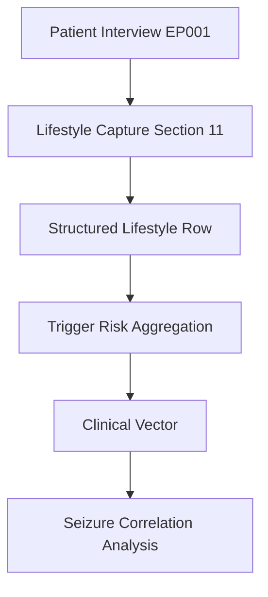
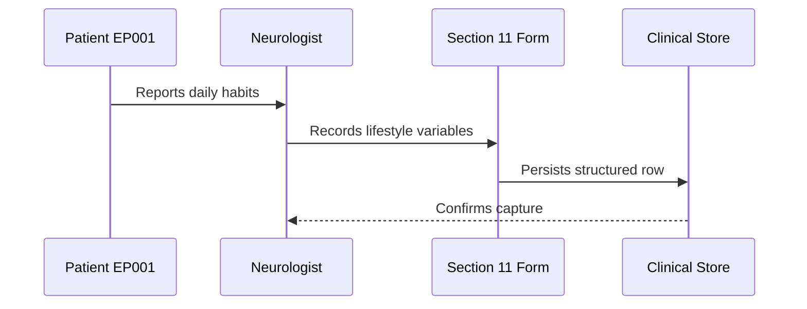
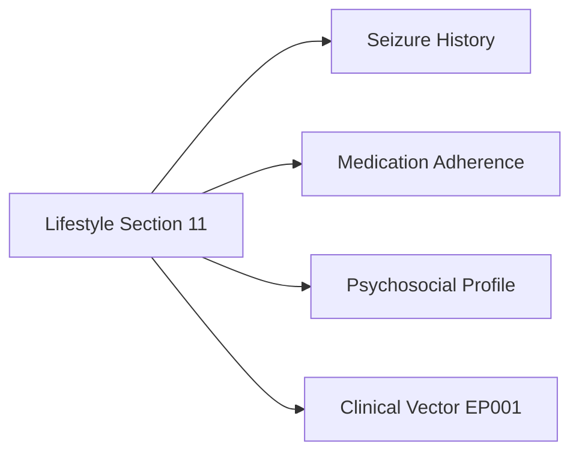
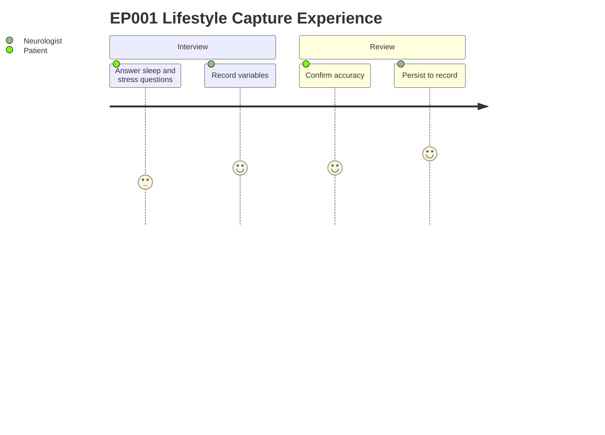

# Neurologist Assessment — Section 11: Lifestyle (EP001)

> **Why (this doc):** Lifestyle factors — sleep, stimulants, stress — are among the strongest modifiable seizure triggers in focal epilepsy, so capturing them structures targeted counselling and risk reduction for EP001. **How:** The neurologist records standardized lifestyle variables during the primary clinical interview and stores them as a discrete, machine-readable row feeding the patient's downstream clinical vector.

**Role:** Neurologist · **Type:** Primary (clinical) data

**Problem:** Modifiable lifestyle triggers (sleep deprivation, high caffeine, occupational stress) frequently precipitate focal impaired-awareness seizures yet are under-documented in routine capture.

**Research Objective:** Capture EP001's lifestyle profile in a structured form so trigger burden can be quantified, tracked, and linked to seizure frequency across the assessment pipeline.

*Caption - The table below records EP001's captured lifestyle variables verbatim from the primary neurology interview; it is present to anchor trigger-risk analysis to concrete, auditable values.*

| Variable | Value |
|---|---|
| Sleep | 5.2 hrs/day |
| Sleep Quality | Poor |
| Smoking | No |
| Alcohol | Social |
| Exercise | Twice/week |
| Caffeine | 4 cups/day |
| Occupation Stress | High |

## Data Flow and Context

**Reason:** To show where lifestyle data originates and where it terminates in the pipeline. **Why:** Downstream trigger-risk modelling depends on this section being captured first. **What is happening:** Interview responses are normalized into a structured row and aggregated into trigger risk. **How it is happening:** The neurologist enters values that flow forward into the patient clinical vector for correlation. **Reference:** Fisher et al. (2017).

**Reason:** To identify the role responsible for capturing this data. **Why:** Accountability and data provenance require a named capturing role. **What is happening:** The neurologist elicits and records lifestyle values during the encounter. **How it is happening:** Verbal responses are transcribed into the structured form and persisted to the clinical store. **Reference:** APA (2020).

**Reason:** To show how lifestyle links to other assessment sections and the clinical vector. **Why:** Triggers gain meaning only when cross-referenced with seizure and medication data. **What is happening:** The lifestyle node feeds and connects to adjacent assessment domains. **How it is happening:** Shared patient identifier EP001 joins these sections into one clinical vector. **Reference:** Topol (2019).

**Reason:** To surface the lived experience of capturing this item. **Why:** Understanding friction improves data quality and patient trust. **What is happening:** The patient reports habits and confirms accuracy while the neurologist records. **How it is happening:** A short guided exchange produces a validated, persisted row. **Reference:** Topol (2019).

## Professor Readiness (Defense Q&A)

**Q1: Why capture caffeine and sleep as discrete variables rather than free text?**
A: Discrete variables allow quantitative trigger-burden scoring and correlation with seizure frequency; free text cannot be aggregated reliably.

**Q2: How do these lifestyle values connect to EP001's focal impaired-awareness seizures?**
A: Sleep deprivation (5.2 hrs) and high stress are established precipitants of focal seizures; capturing them enables targeted, modifiable-risk counselling.

**Q3: Why is this a primary clinical data section rather than patient self-report only?**
A: The neurologist validates and contextualizes responses during the encounter, giving the data clinical provenance and reliability for downstream modelling.

## References

American Psychological Association. (2020). *Publication manual of the American Psychological Association* (7th ed.). American Psychological Association.

Fisher, R. S., Cross, J. H., French, J. A., Higurashi, N., Hirsch, E., Jansen, F. E., ... Zuberi, S. M. (2017). Operational classification of seizure types by the International League Against Epilepsy. *Epilepsia, 58*(4), 522–530.

Topol, E. J. (2019). *Deep medicine: How artificial intelligence can make healthcare human again*. Basic Books.
