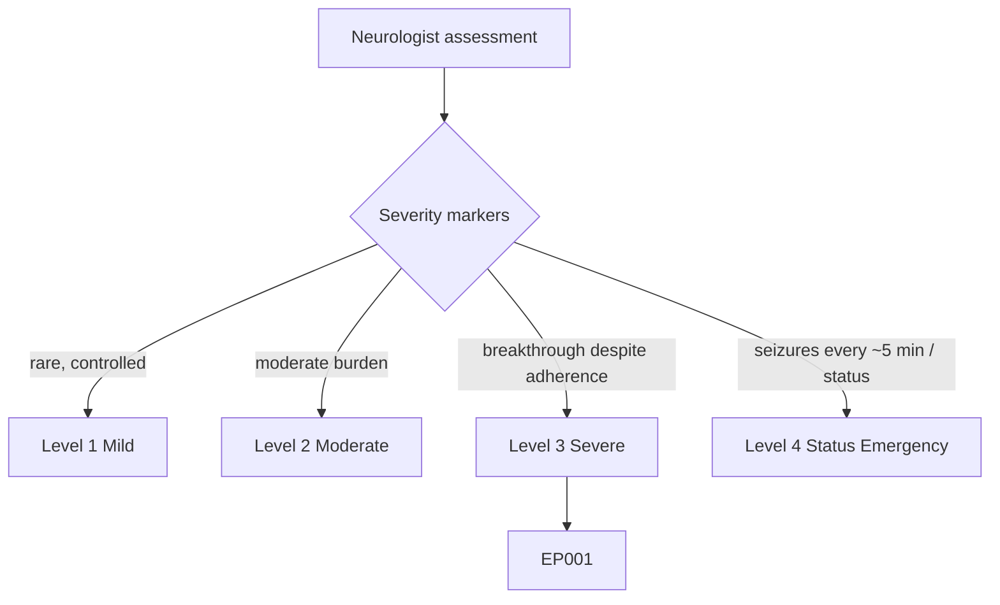
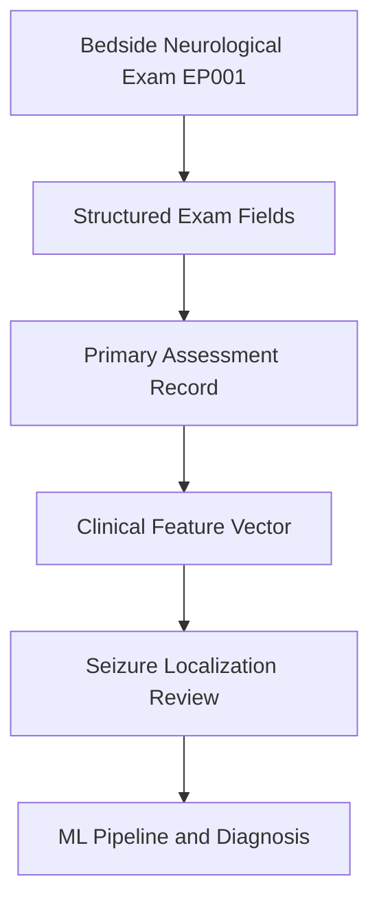
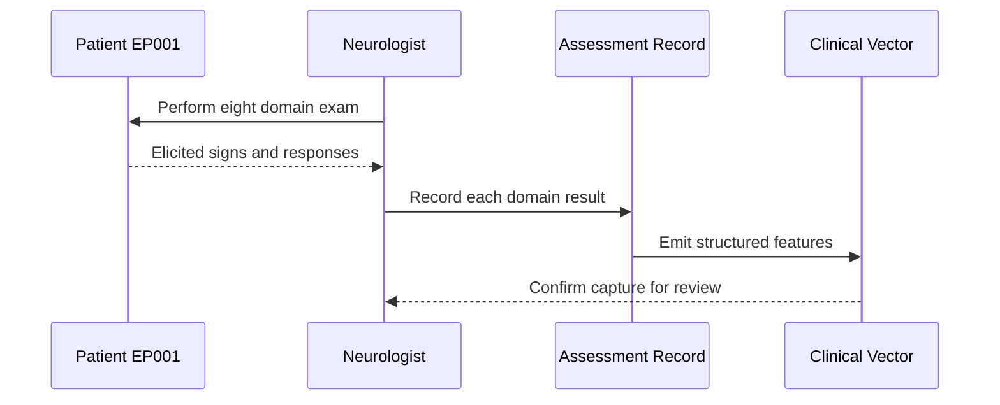
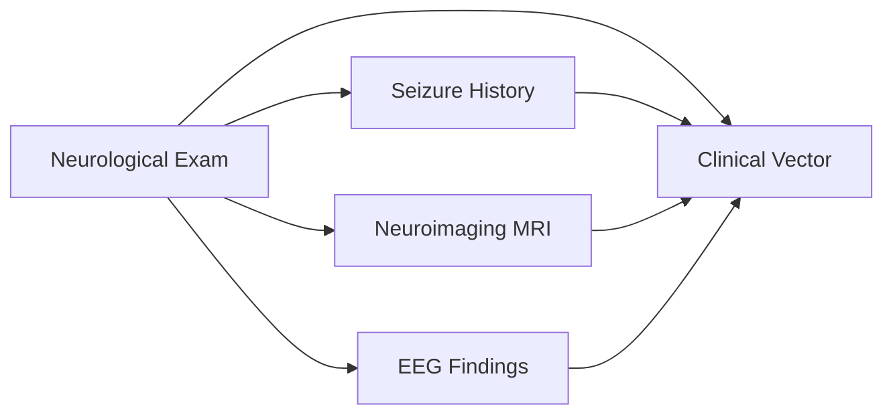
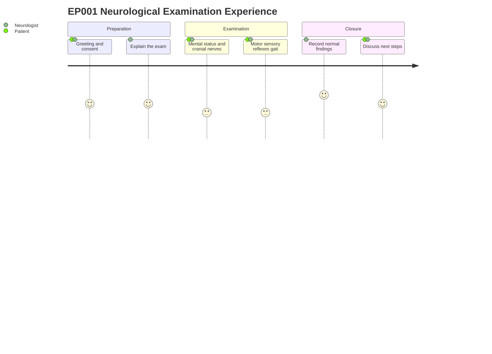

# Neurologist Assessment — Section 12: Neurological Examination (EP001)

> **Why (this doc):** A structured, bedside neurological examination localizes or excludes fixed structural deficits and anchors the epilepsy diagnosis in objective clinical signs rather than history alone. **How:** The neurologist performs a standardized eight-domain interictal exam on EP001 (29M, focal impaired awareness seizures, left-temporal) and records each finding as a discrete, machine-readable field for the clinical vector.

**Problem:** Focal epilepsy can present with a normal interictal examination, so the absence of fixed deficits must be documented deliberately to distinguish an epileptic network disorder from a progressive structural lesion.

**Research Objective:** Capture a reproducible baseline neurological examination for EP001 that supports seizure localization, tracks longitudinal change, and feeds structured features into the downstream diagnostic and machine-learning pipeline.

**Role:** Neurologist · **Type:** Primary (clinical) data

*Caption - Interictal neurological examination for EP001 across eight standardized domains. A uniformly normal exam with a negative Romberg is expected in focal impaired-awareness epilepsy and helps exclude a fixed or progressive structural deficit.*

| Test | Result |
|---|---|
| Mental Status | Normal |
| Cranial Nerves | Normal |
| Motor | Normal |
| Sensory | Normal |
| Reflexes | Normal |
| Coordination | Normal |
| Gait | Normal |
| Romberg | Negative |

## Questionnaire (Enterprise Form)

*Caption - The patient-facing questions the neurologist asks to capture this section, with response type, validation, EP001's example answer, and the derived AI feature.*

| ID | Question | Response Type | Validation | EP001 (Example) | AI Feature |
|---|---|---|---|---|---|
| NEU-1201 | Mental status testing — are orientation, memory, and attention intact? | Dropdown[Normal, Abnormal, Post-ictal confusion/obtunded] | Allowed set | Normal | mental_status_exam |
| NEU-1202 | Cranial nerve examination — any deficit (e.g., gaze deviation)? | Dropdown[Normal, Abnormal, Gaze deviation] | Allowed set | Normal | cranial_nerve_exam |
| NEU-1203 | Motor examination — any weakness or paresis? | Dropdown[Normal, Abnormal, Todd's paresis] | Allowed set | Normal | motor_exam_result |
| NEU-1204 | Sensory examination — any sensory loss? | Dropdown[Normal, Reduced, Absent] | Allowed set | Normal | sensory_exam_result |
| NEU-1205 | Reflexes — are deep tendon reflexes normal and symmetric? | Dropdown[Normal, Mildly brisk, Asymmetric brisk] | Allowed set | Normal | reflex_exam_result |
| NEU-1206 | Coordination testing — any dysmetria or incoordination? | Dropdown[Normal, Impaired] | Allowed set | Normal | coordination_exam_result |
| NEU-1207 | Gait assessment — is walking steady and normal? | Dropdown[Normal, Unsteady, Unable] | Allowed set | Normal | gait_exam_result |
| NEU-1208 | Romberg test — does the patient sway or fall with eyes closed? | Dropdown[Negative, Positive, Untestable] | Allowed set | Negative | romberg_test_result |

## Severity Scenario Model — Neurologist View

*Caption - The same assessment answered across four epilepsy severity levels from the neurologist's point of view; each variable shifts with severity. EP001 corresponds to Level 3 (Severe). Level 4 is the operational emergency — status epilepticus with seizures recurring about every 5 minutes.*

### Level 1 — Mild (Well-Controlled)
| Variable | Value |
|---|---|
| Mental Status | Normal |
| Cranial Nerves | Normal |
| Motor | Normal |
| Sensory | Normal |
| Reflexes | Normal |
| Coordination | Normal |
| Gait | Normal |
| Romberg | Negative |

### Level 2 — Moderate (Intermediate)
| Variable | Value |
|---|---|
| Mental Status | Normal |
| Cranial Nerves | Normal |
| Motor | Normal |
| Sensory | Normal |
| Reflexes | Mildly brisk (right) |
| Coordination | Normal |
| Gait | Normal |
| Romberg | Negative |

### Level 3 — Severe (Poorly Controlled) — EP001
| Variable | Value |
|---|---|
| Mental Status | Normal |
| Cranial Nerves | Normal |
| Motor | Normal |
| Sensory | Normal |
| Reflexes | Normal |
| Coordination | Normal |
| Gait | Normal |
| Romberg | Negative |

### Level 4 — Refractory / Status Epilepticus (Operational Emergency)
| Variable | Value |
|---|---|
| Mental Status | Post-ictal confusion / obtunded |
| Cranial Nerves | Gaze deviation |
| Motor | Left-arm Todd's paresis |
| Sensory | Reduced left |
| Reflexes | Asymmetric brisk (right) |
| Coordination | Impaired |
| Gait | Unsteady / unable |
| Romberg | Positive / untestable |

### Severity Classification Logic

**Reason:** The interictal exam grades fixed and post-ictal focal signs. **Why:** Focal epilepsy typically shows a normal interictal exam until status produces gross deficits. **What is happening:** The exam stays normal through L1-L3 (EP001), with only a soft reflex asymmetry at L2, then breaks down with Todd's paresis, gaze deviation, and obtundation at L4. **How it is happening:** Each domain result is coded normal/abnormal and the pattern of focal signs sets the level. **Reference:** Fisher et al. (2017).

## Data Flow and Context Diagrams

**Reason:** To show where the neurological examination sits in the overall data pipeline. **Why:** The exam is an upstream primary-data source whose fields must reach the diagnostic model intact. **What is happening:** Bedside findings are encoded as discrete fields, stored in the assessment record, and aggregated into the clinical vector. **How it is happening:** Each domain result is captured as a controlled value and passed downstream for localization and modeling. **Reference:** Fisher et al. (2017).

**Reason:** To make explicit the role that captures this data. **Why:** Provenance and examiner accountability matter for clinical and research validity. **What is happening:** The neurologist elicits signs, interprets them, and writes structured results. **How it is happening:** Ordered interactions move findings from bedside to the persistent record and feature store. **Reference:** Fisher et al. (2017).

**Reason:** To show how the exam links to other assessment sections. **Why:** Localization is a multimodal inference, not a single-test result. **What is happening:** Exam findings are cross-referenced with history, imaging, and EEG before contributing to the vector. **How it is happening:** Each section feeds shared clinical features that converge on the left-temporal hypothesis. **Reference:** Fisher et al. (2017).

**Reason:** To capture the lived experience of the examination for patient and clinician. **Why:** A calm, well-explained exam improves cooperation and data quality. **What is happening:** EP001 is guided through preparation, testing, and closure. **How it is happening:** The neurologist sequences tasks to reduce fatigue and records findings at the end. **Reference:** Topol (2019).

## Professor Readiness (Defense Q&A)

**Q1: Why is a normal neurological examination still clinically informative in focal epilepsy?**
A: A normal interictal exam is expected in focal impaired-awareness epilepsy and helps exclude a fixed or progressive structural lesion, supporting a network rather than mass-lesion diagnosis while remaining consistent with the left-temporal localization.

**Q2: Why capture each domain as a discrete field rather than a single narrative note?**
A: Discrete controlled values are reproducible, comparable across visits, and directly usable as features in the clinical vector and downstream machine-learning pipeline, whereas free text is not.

**Q3: What does a negative Romberg add here?**
A: A negative Romberg indicates intact proprioceptive and vestibular contributions to balance, arguing against a dorsal-column or peripheral sensory cause of unsteadiness and keeping the focus on the epileptic network.

## References

American Psychological Association. (2020). *Publication manual of the American Psychological Association* (7th ed.). American Psychological Association.

Fisher, R. S., Cross, J. H., French, J. A., Higurashi, N., Hirsch, E., Jansen, F. E., Lagae, L., Moshé, S. L., Peltola, J., Roulet Perez, E., Scheffer, I. E., & Zuberi, S. M. (2017). Operational classification of seizure types by the International League Against Epilepsy: Position paper of the ILAE Commission for Classification and Terminology. *Epilepsia, 58*(4), 522–530. https://doi.org/10.1111/epi.13670

Topol, E. J. (2019). *Deep medicine: How artificial intelligence can make healthcare human again*. Basic Books.
