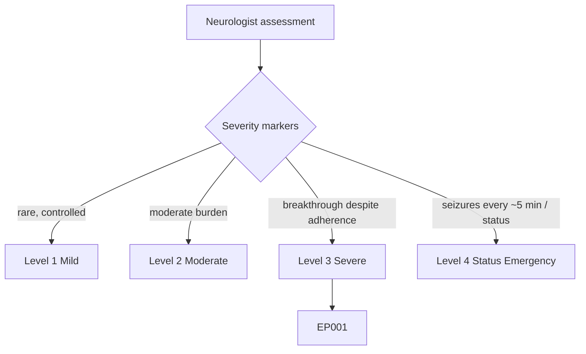
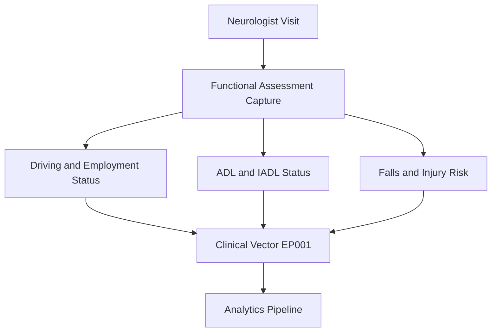
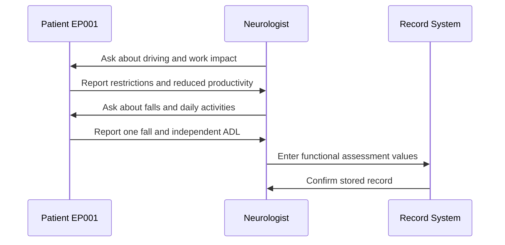
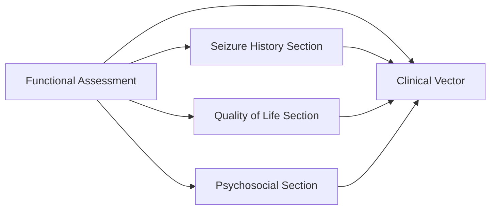
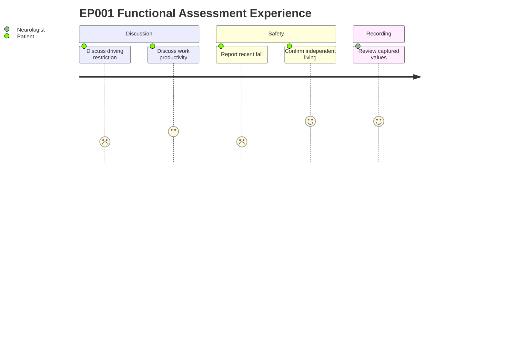

# Neurologist Assessment — Section 13: Functional Assessment (EP001)

> **Why (this doc):** Epilepsy affects daily life beyond seizure counts; functional status captures how focal impaired awareness seizures constrain driving, work, and safety for EP001. **How:** The neurologist records structured functional variables during the primary clinical visit, which feed the patient's composite clinical vector for downstream analysis.

**Problem:** Seizure frequency alone underrepresents the real-world burden of focal epilepsy, leaving functional impairment and injury risk poorly quantified.

**Research Objective:** Capture standardized functional-assessment variables for EP001 so that everyday-life impact and safety risk can be modeled alongside neurological findings.

**Role:** Neurologist · **Type:** Primary (clinical) data

*Caption - This table records EP001's functional status across driving, occupational impact, activities of daily living, and injury risk. It is present because these variables translate seizure burden into measurable real-world function.*

| Variable | Value |
|---|---|
| Driving | Restricted |
| Employment Impact | Moderate |
| ADL | Independent |
| IADL | Independent |
| Work Productivity | Reduced |
| Falls | 1 |
| Injury Risk | Moderate |

## Questionnaire (Enterprise Form)

*Caption - The patient-facing questions the neurologist asks to capture this section, with response type, validation, EP001's example answer, and the derived AI feature.*

| ID | Question | Response Type | Validation | EP001 (Example) | AI Feature |
|---|---|---|---|---|---|
| NEU-1301 | What is your current driving status given your seizures? | Dropdown[Permitted, Conditional, Restricted, Prohibited] | Allowed set | Restricted | driving_status |
| NEU-1302 | How much has epilepsy affected your work or employment? | Dropdown[None, Mild, Moderate, Severe/unable to work] | Allowed set | Moderate | employment_impact_level |
| NEU-1303 | Can you manage basic daily self-care (bathing, dressing, eating) independently? | Dropdown[Independent, Assisted, Dependent] | Allowed set | Independent | adl_status |
| NEU-1304 | Can you manage complex daily tasks (finances, shopping, medication) independently? | Dropdown[Independent, Assisted, Dependent] | Allowed set | Independent | iadl_status |
| NEU-1305 | Has your productivity at work been affected? | Dropdown[Normal, Slightly reduced, Reduced, Severely impaired] | Allowed set | Reduced | work_productivity_level |
| NEU-1306 | How many falls have you had in the recent period? | Number | Integer 0-99 | 1 | fall_count |
| NEU-1307 | What is your overall risk of injury from seizures? | Dropdown[Low, Low-Moderate, Moderate, High] | Allowed set | Moderate | injury_risk_level |

## Severity Scenario Model — Neurologist View

*Caption - The same assessment answered across four epilepsy severity levels from the neurologist's point of view; each variable shifts with severity. EP001 corresponds to Level 3 (Severe). Level 4 is the operational emergency — status epilepticus with seizures recurring about every 5 minutes.*

### Level 1 — Mild (Well-Controlled)
| Variable | Value |
|---|---|
| Driving | Permitted |
| Employment Impact | None |
| ADL | Independent |
| IADL | Independent |
| Work Productivity | Normal |
| Falls | 0 |
| Injury Risk | Low |

### Level 2 — Moderate (Intermediate)
| Variable | Value |
|---|---|
| Driving | Conditional |
| Employment Impact | Mild |
| ADL | Independent |
| IADL | Independent |
| Work Productivity | Slightly reduced |
| Falls | 0 |
| Injury Risk | Low-Moderate |

### Level 3 — Severe (Poorly Controlled) — EP001
| Variable | Value |
|---|---|
| Driving | Restricted |
| Employment Impact | Moderate |
| ADL | Independent |
| IADL | Independent |
| Work Productivity | Reduced |
| Falls | 1 |
| Injury Risk | Moderate |

### Level 4 — Refractory / Status Epilepticus (Operational Emergency)
| Variable | Value |
|---|---|
| Driving | Prohibited |
| Employment Impact | Severe / unable to work |
| ADL | Assisted |
| IADL | Dependent |
| Work Productivity | Severely impaired |
| Falls | 4+ |
| Injury Risk | High |

### Severity Classification Logic

**Reason:** Functional status translates seizure burden into driving, work, and safety risk. **Why:** Loss of awareness during seizures escalates real-world disability and injury exposure. **What is happening:** Function declines from unrestricted (L1) to restricted driving with one fall and moderate injury risk (L3, EP001) to prohibited driving, dependence, and recurrent falls (L4). **How it is happening:** Driving, ADL/IADL, falls, and injury-risk rows are aggregated into a functional-severity tier. **Reference:** Fisher et al. (2017).

## Data Flow and Context Diagrams

**Reason:** To show where functional data enters the epilepsy data pipeline. **Why:** Readers must see that functional variables are not isolated but converge into the patient clinical vector. **What is happening:** Captured items flow from the visit into structured fields and then into the composite vector. **How it is happening:** The neurologist records each variable, which is normalized and merged with other sections. **Reference:** Fisher et al. (2017).

**Reason:** To document the role interaction that produces this data. **Why:** The reliability of functional data depends on the structured clinician-patient exchange. **What is happening:** The neurologist elicits functional status and records it. **How it is happening:** Through directed questioning during the primary assessment and entry into the record system. **Reference:** Topol (2019).

**Reason:** To map how functional data links to other assessment sections. **Why:** Functional impairment is interpreted in context with seizure and quality-of-life data. **What is happening:** This section cross-connects to related domains and the clinical vector. **How it is happening:** Shared patient identifiers link section outputs into one integrated vector. **Reference:** Fisher et al. (2017).

**Reason:** To convey the lived experience of capturing this item. **Why:** Understanding patient sentiment highlights sensitive topics like driving loss. **What is happening:** EP001 moves through discussion, safety, and recording steps. **How it is happening:** The neurologist guides the patient through each functional topic and confirms values. **Reference:** APA (2020).

## Professor Readiness (Defense Q&A)

**Q1: Why capture functional status when seizure frequency is already recorded?**
A: Seizure counts do not reflect real-world impact; functional variables like driving restriction and injury risk quantify the everyday burden that drives clinical decisions.

**Q2: Why is EP001 listed as Independent for ADL but with Restricted driving?**
A: Basic self-care is preserved, but focal impaired awareness seizures create sudden risk during driving, so a safety-based restriction applies independent of self-care ability.

**Q3: How does one fall translate to Moderate injury risk?**
A: Injury risk integrates fall history with seizure type and awareness impairment; even a single fall in a patient with impaired-awareness seizures signals meaningful ongoing risk.

## References

American Psychological Association. (2020). *Publication manual of the American Psychological Association* (7th ed.). American Psychological Association.

Fisher, R. S., Cross, J. H., French, J. A., Higurashi, N., Hirsch, E., Jansen, F. E., Lagae, L., Moshé, S. L., Peltola, J., Roulet Perez, E., Scheffer, I. E., & Zuberi, S. M. (2017). Operational classification of seizure types by the International League Against Epilepsy. *Epilepsia, 58*(4), 522-530. https://doi.org/10.1111/epi.13670

Topol, E. J. (2019). *Deep medicine: How artificial intelligence can make healthcare human again*. Basic Books.
