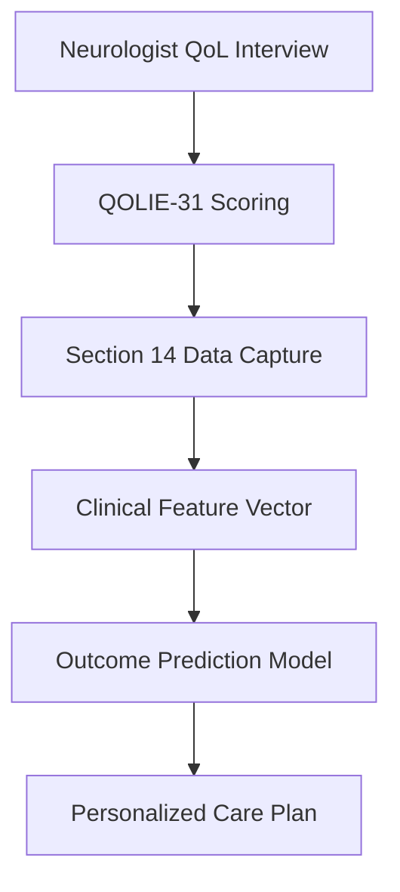
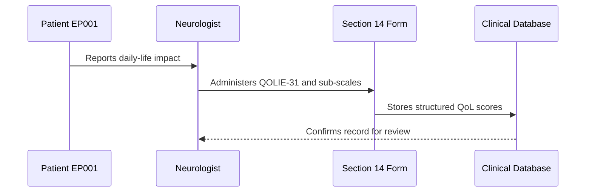
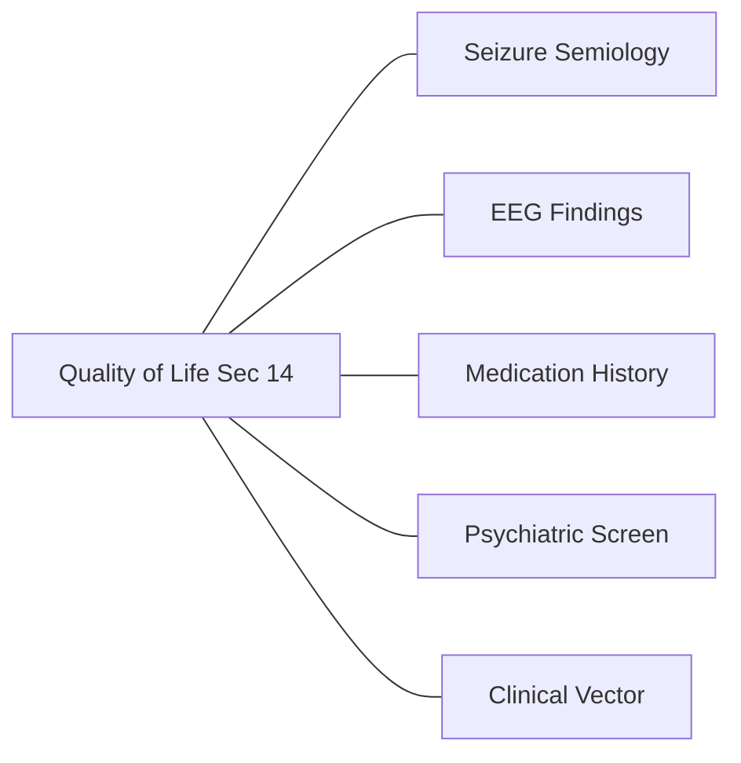
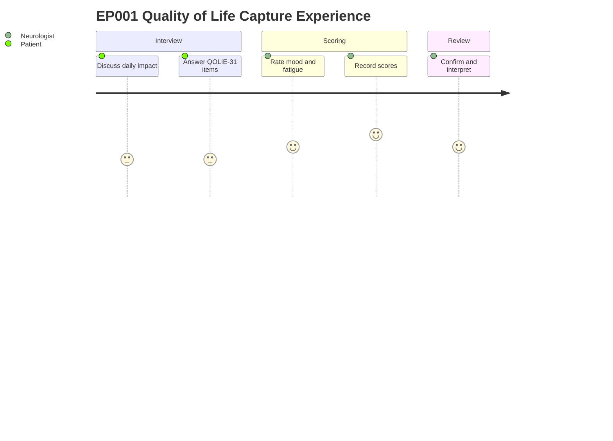

# Neurologist Assessment — Section 14: Quality of Life (EP001)

> **Why (this doc):** Quality-of-life (QoL) scores tell us how epilepsy affects EP001's daily living beyond seizure counts, capturing the burden that raw seizure frequency misses. **How:** The neurologist administers the validated QOLIE-31 instrument plus mood, social, and fatigue sub-ratings, then records the structured values below for downstream analysis.

**Problem:** Seizure frequency alone underestimates disease burden; patients with controlled counts can still suffer disabling anxiety, low mood, social restriction, and fatigue that determine real-world outcomes.

**Research Objective:** Capture standardized, machine-readable QoL metrics for EP001 so they can be modeled alongside clinical, imaging, and EEG features to predict outcome and personalize care.

**Role:** Neurologist · **Type:** Primary (clinical) data

*Caption - QOLIE-31 composite score and four burden dimensions for EP001, recorded by the neurologist. These values quantify patient-reported impact and feed the multi-domain clinical vector.*

| Scale | Score |
|---|---|
| QOLIE-31 | 56/100 |
| Anxiety | Mild |
| Depression | Mild |
| Social Limitation | Moderate |
| Fatigue | High |

## Data Flow and Context Diagrams

**Reason:** To show where QoL data enters and moves through the epilepsy assessment pipeline. **Why:** A traceable path proves the score is not an isolated note but a modeled feature. **What is happening:** The neurologist's interview is scored, captured in Section 14, and folded into the clinical vector feeding prediction. **How it is happening:** Structured Markdown values are extracted and joined with other sections into a unified patient record. **Reference:** Fisher et al. (2017).

**Reason:** To make explicit which role captures QoL and how the hand-off occurs. **Why:** Accountability and provenance require a named capturer. **What is happening:** The neurologist elicits impact from EP001, scores it, and persists it. **How it is happening:** Standardized instrument administration writes validated values into the shared database. **Reference:** APA (2020).

**Reason:** To position QoL relative to other assessment sections. **Why:** QoL gains meaning when linked to seizure, EEG, medication, and mood data. **What is happening:** Section 14 connects laterally to peer sections and converges on the clinical vector. **How it is happening:** Shared patient identifier EP001 links all sections into one integrated feature space. **Reference:** Topol (2019).

**Reason:** To surface the lived experience of capturing this item. **Why:** Understanding patient and clinician effort improves data quality and empathy. **What is happening:** EP001 reflects on impact while the neurologist scores and reviews. **How it is happening:** A guided instrument structures the conversation into ratings. **Reference:** Fisher et al. (2017).

## Professor Readiness (Defense Q&A)

**Q1: Why use QOLIE-31 rather than a generic QoL scale?** QOLIE-31 is epilepsy-specific and validated, capturing seizure worry and medication effects that generic instruments miss.

**Q2: A composite of 56/100 with "High" fatigue — what does that signal?** Moderate overall QoL with fatigue as the dominant driver, flagging a target for intervention independent of seizure count.

**Q3: How does this subjective score fit an ML pipeline?** It is encoded as ordinal and continuous features in the clinical vector, contributing patient-reported burden as a predictor of outcome.

## References

American Psychological Association. (2020). *Publication manual of the American Psychological Association* (7th ed.). American Psychological Association.

Fisher, R. S., Cross, J. H., French, J. A., Higurashi, N., Hirsch, E., Jansen, F. E., ... Zuberi, S. M. (2017). Operational classification of seizure types by the International League Against Epilepsy: Position paper of the ILAE Commission for Classification and Terminology. *Epilepsia, 58*(4), 522–530. https://doi.org/10.1111/epi.13670

Topol, E. J. (2019). High-performance medicine: The convergence of human and artificial intelligence. *Nature Medicine, 25*(1), 44–56. https://doi.org/10.1038/s41591-018-0300-7
