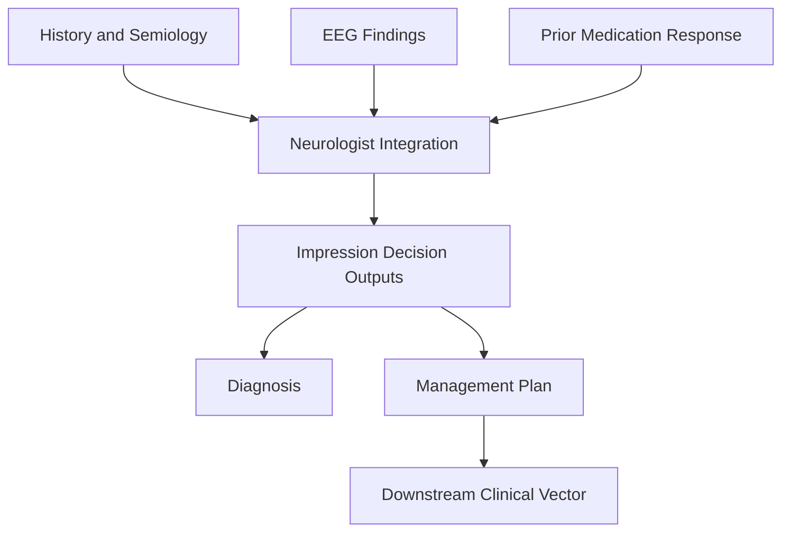
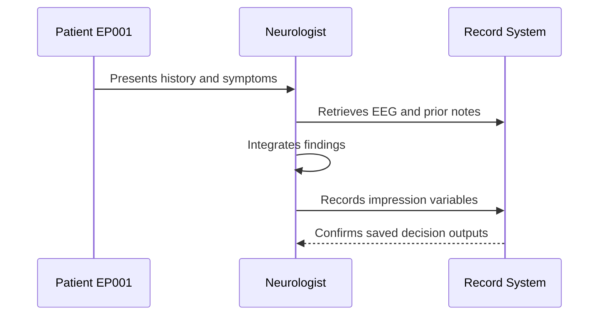
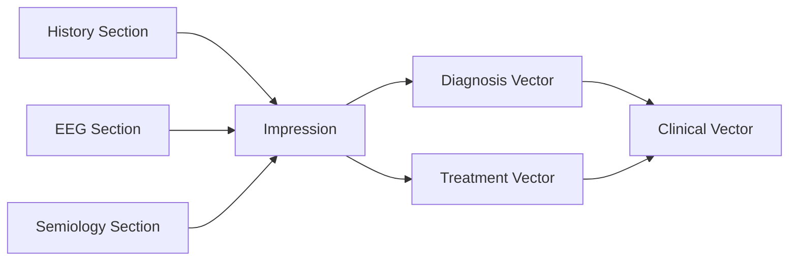
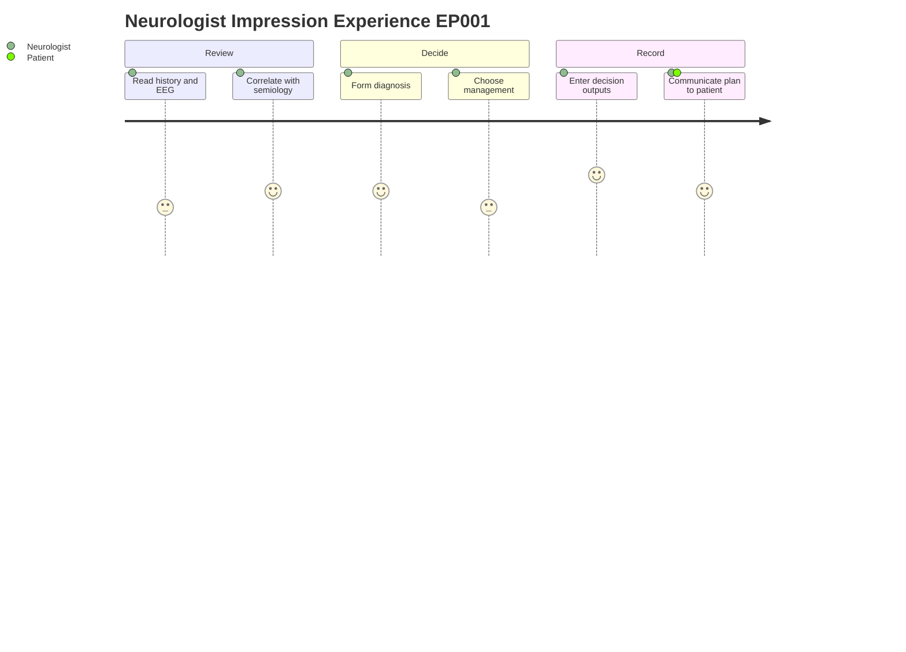

# Neurologist Assessment — Neurologist Impression (EP001)

> **Why (this doc):** The neurologist impression is the synthesizing clinical judgment that converts raw history, EEG, and semiology into a diagnosis and an actionable management plan for EP001. **How:** It captures the neurologist's structured decision outputs (diagnosis, surgical candidacy, imaging, EEG, medication, follow-up) as discrete variables that feed the downstream clinical vector and care pathway.

**Problem:** Fragmented assessment data (history, EEG, semiology) has limited value until a clinician integrates it into a single, defensible diagnostic and treatment decision.

**Research Objective:** Capture the neurologist's impression as structured, machine-readable decision variables so the epilepsy pipeline can link expert judgment to observed features and support reproducible outcome analysis for focal epilepsy (EP001, 29M, focal impaired awareness, left-temporal).

**Role:** Neurologist · **Type:** Primary (clinical) data · **Decision output**

*Caption - The neurologist impression table records the final integrated decision outputs for EP001. Each row is a discrete clinical decision variable that closes the primary assessment and drives the management plan.*

| Variable | Value |
|---|---|
| Diagnosis | Drug-responsive focal epilepsy with breakthrough seizures |
| Surgical Candidate | No |
| MRI Recommended | No |
| Repeat EEG | Yes |
| Medication Adjustment | Increase Levetiracetam |
| Follow-up | 3 months |

## Pipeline and Process Diagrams

*Caption - The flowchart below shows where the neurologist impression sits in the data pipeline, receiving integrated assessment inputs and emitting the decision outputs.*

**Reason:** The impression is a convergence node where multiple assessment streams are fused. **Why:** Showing the flow clarifies that the impression depends on upstream data completeness. **What is happening:** History, EEG, and medication response are combined into diagnosis and plan. **How it is happening:** The neurologist reviews each input and records discrete decision variables. **Reference:** Fisher et al. (2017) operational classification of seizure types.

*Caption - The sequence diagram shows the role interaction by which the neurologist captures the impression into the record.*

**Reason:** Capture must be traceable to a responsible clinician. **Why:** The sequence makes authorship and timing of the decision explicit. **What is happening:** The neurologist reads inputs and writes structured outputs. **How it is happening:** Each decision is entered as a keyed variable in the record system. **Reference:** Topol (2019) on clinician-in-the-loop data capture.

*Caption - The graph below links the impression to the other assessment sections it consumes and to the clinical vector it produces.*

**Reason:** The impression is not standalone; it aggregates prior sections. **Why:** Explicit links show data provenance and reuse. **What is happening:** Assessment sections feed the impression, which feeds the clinical vector. **How it is happening:** Structured variables are mapped into diagnosis and treatment vector fields. **Reference:** Fisher et al. (2017) framework linking features to classification.

*Caption - The journey diagram captures the neurologist and patient experience of reaching and recording the impression.*

**Reason:** Decision quality depends on clinician workload and clarity. **Why:** The journey exposes friction points in reaching a confident impression. **What is happening:** The neurologist moves from review to decision to recording. **How it is happening:** Each step raises confidence until the plan is communicated. **Reference:** Topol (2019) on the clinician experience in data-rich care.

## Professor Readiness (Defense Q&A)

**Q1: Why is the surgical candidate flag recorded as No for EP001?** Because the diagnosis is drug-responsive focal epilepsy; breakthrough seizures are addressed by medication adjustment first, and surgical workup is reserved for drug-resistant cases per ILAE criteria.

**Q2: Why capture the impression as discrete variables rather than free text?** Structured variables are machine-readable, link cleanly to the clinical vector, and enable reproducible downstream analysis and audit.

**Q3: What justifies increasing Levetiracetam rather than adding a new agent?** With a drug-responsive profile and breakthrough seizures, dose optimization of the current effective agent is the guideline-preferred first step before polytherapy.

## References

American Psychological Association. (2020). *Publication manual of the American Psychological Association* (7th ed.). American Psychological Association.

Fisher, R. S., Cross, J. H., French, J. A., Higurashi, N., Hirsch, E., Jansen, F. E., Lagae, L., Moshé, S. L., Peltola, J., Roulet Perez, E., Scheffer, I. E., & Zuberi, S. M. (2017). Operational classification of seizure types by the International League Against Epilepsy: Position paper of the ILAE Commission for Classification and Terminology. *Epilepsia, 58*(4), 522–530. https://doi.org/10.1111/epi.13670

Topol, E. J. (2019). *Deep medicine: How artificial intelligence can make healthcare human again*. Basic Books.
