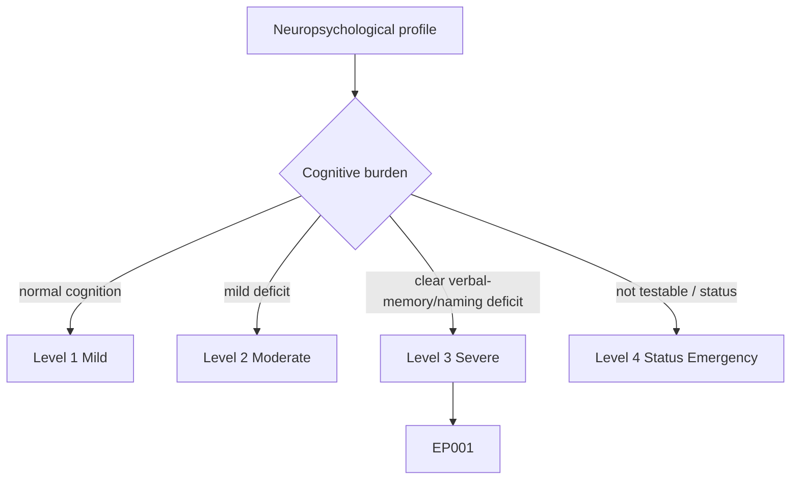
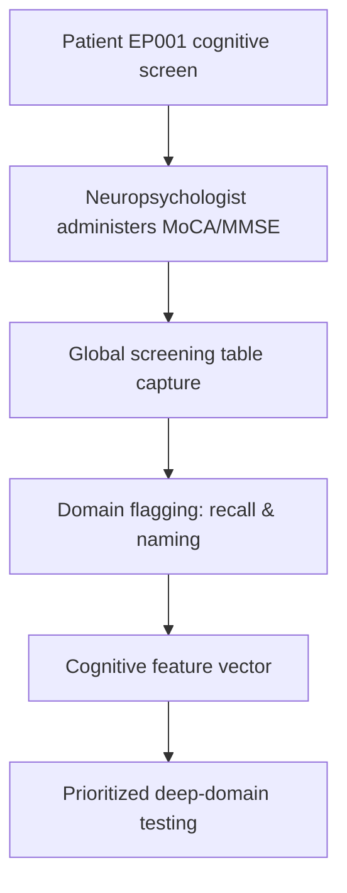
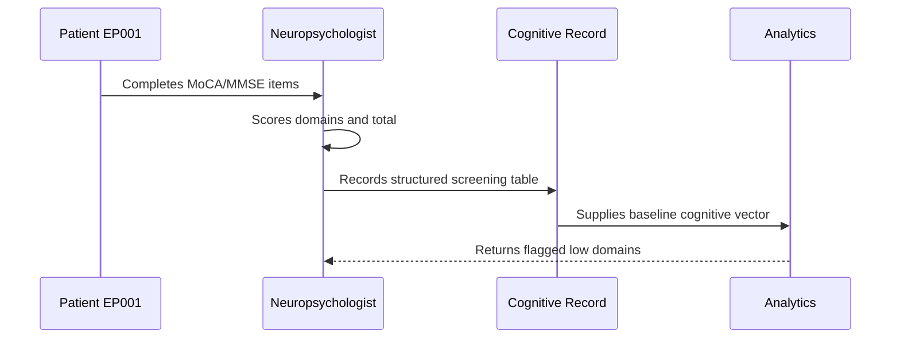
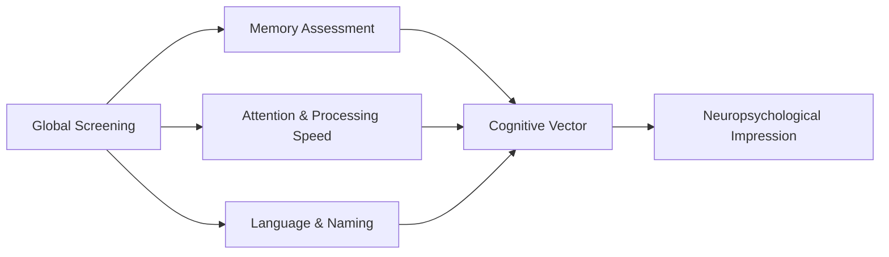
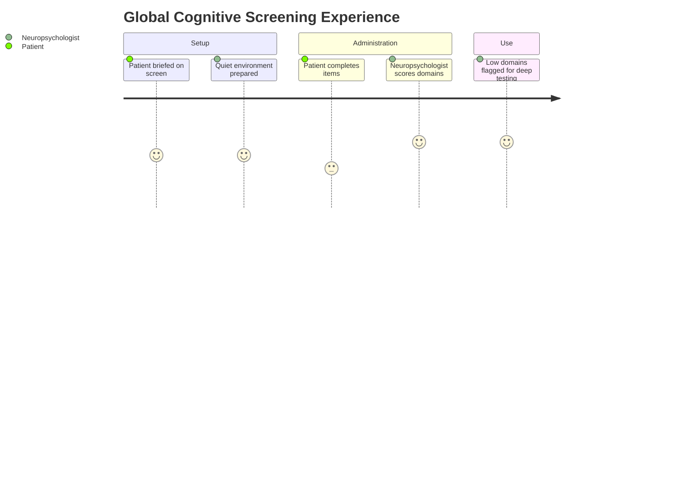

# Neuropsychologist Assessment — Section 1: Global Cognitive Screening (EP001)

> **Why (this doc):** A global cognitive screen establishes an overall baseline of mental status and flags domains that warrant deeper testing; in left-temporal focal epilepsy it is the entry gate that detects subtle verbal/mnemonic slippage before it is quantified. **How:** The neuropsychologist administers a standardized bedside screen (MoCA/MMSE) to patient EP001 and records item-level and total scores in a fixed variable/value table that seeds the downstream cognitive vector.

**Problem:** Without a standardized global screen, early cognitive change in focal epilepsy is missed or attributed to seizures alone, delaying targeted assessment and intervention.

**Research Objective:** Capture a standardized global cognitive baseline for EP001 so that domain-specific weaknesses (expected verbal memory and naming) can be prioritized and tracked over time.

**Role:** Neuropsychologist · **Type:** Primary (cognitive) data

*Caption - Global cognitive screening variables for EP001, recorded by the neuropsychologist. These values set the baseline against which memory, attention, executive, and language testing are prioritized and interpreted.*

| Variable | Value |
|---|---|
| Screening Instrument | MoCA (v8.1) |
| Total Score | 26/30 |
| Education Adjustment Applied | No (16 yrs, not required) |
| Visuospatial/Executive | 5/5 |
| Naming | 2/3 (lion missed) |
| Attention | 5/6 |
| Language (repetition/fluency) | 2/3 |
| Abstraction | 2/2 |
| Delayed Recall | 3/5 (2 with cue) |
| Orientation | 6/6 |
| Confounding MMSE Total | 28/30 |
| Effort/Engagement | Adequate |
| Interpretation | Borderline-normal; recall & naming soft signs |

## Severity Scenario Model — Neuropsychologist View

*Caption - The same cognitive assessment across four epilepsy severity levels from the neuropsychologist's point of view; each score shifts with severity. EP001 corresponds to Level 3 (Severe). Level 4 is the operational emergency — status epilepticus with seizures recurring about every 5 minutes.*

### Level 1 — Mild (Well-Controlled)

| Variable | Value |
|---|---|
| Screening Instrument | MoCA (v8.1) |
| Total Score | 30/30 |
| Education Adjustment Applied | No |
| Visuospatial/Executive | 5/5 |
| Naming | 3/3 |
| Attention | 6/6 |
| Language (repetition/fluency) | 3/3 |
| Abstraction | 2/2 |
| Delayed Recall | 5/5 |
| Orientation | 6/6 |
| Confounding MMSE Total | 30/30 |
| Effort/Engagement | Adequate |
| Interpretation | Normal cognition, no deficit |

### Level 2 — Moderate (Intermediate)

| Variable | Value |
|---|---|
| Screening Instrument | MoCA (v8.1) |
| Total Score | 28/30 |
| Education Adjustment Applied | No |
| Visuospatial/Executive | 5/5 |
| Naming | 3/3 |
| Attention | 6/6 |
| Language (repetition/fluency) | 2/3 |
| Abstraction | 2/2 |
| Delayed Recall | 4/5 (1 with cue) |
| Orientation | 6/6 |
| Confounding MMSE Total | 29/30 |
| Effort/Engagement | Adequate |
| Interpretation | Borderline; soft recall dip |

### Level 3 — Severe (Poorly Controlled) — EP001

| Variable | Value |
|---|---|
| Screening Instrument | MoCA (v8.1) |
| Total Score | 26/30 |
| Education Adjustment Applied | No (16 yrs, not required) |
| Visuospatial/Executive | 5/5 |
| Naming | 2/3 (lion missed) |
| Attention | 5/6 |
| Language (repetition/fluency) | 2/3 |
| Abstraction | 2/2 |
| Delayed Recall | 3/5 (2 with cue) |
| Orientation | 6/6 |
| Confounding MMSE Total | 28/30 |
| Effort/Engagement | Adequate |
| Interpretation | Borderline-normal; recall & naming soft signs |

### Level 4 — Refractory / Status Epilepticus (Operational Emergency)

| Variable | Value |
|---|---|
| Screening Instrument | MoCA — not administrable |
| Total Score | Not testable (deferred) |
| Education Adjustment Applied | N/A |
| Visuospatial/Executive | Not testable |
| Naming | Not testable |
| Attention | Impaired consciousness |
| Language (repetition/fluency) | Not testable |
| Abstraction | Not testable |
| Delayed Recall | Not testable |
| Orientation | Disoriented / obtunded |
| Confounding MMSE Total | Not testable (deferred) |
| Effort/Engagement | Unable — seizures ~every 5 min |
| Interpretation | Assessment deferred; expect marked post-status cognitive impairment |

### Severity Classification Logic

**Reason:** To scale the global cognitive screen across epilepsy severity from the neuropsychologist's view. **Why:** Because screen totals and domain losses track disease burden and guide depth of testing. **What is happening:** MoCA total and recall/naming subscores degrade from Level 1 to the not-testable Level 4. **How it is happening:** Rising seizure burden and impaired consciousness progressively erode measurable cognition until testing is deferred. **Reference:** Baxendale & Thompson (2010).

## Data Flow in the Pipeline

**Reason:** To show where the global cognitive screen enters and travels through the epilepsy data pipeline. **Why:** Because deeper domain testing and interpretation depend on a captured baseline. **What is happening:** A bedside screen becomes structured, flagged variables that populate the cognitive vector. **How it is happening:** The neuropsychologist administers the screen, records item scores, and maps low domains to downstream test selection. **Reference:** Fisher et al. (2017).

## Role Capturing the Data

**Reason:** To make explicit which role captures each element of the cognitive screen. **Why:** Because provenance and scoring accountability matter for clinical and research use. **What is happening:** The neuropsychologist converts item responses into a verified, scored record. **How it is happening:** Standardized administration and scoring are transcribed and passed to analytics for domain flagging. **Reference:** Baxendale & Thompson (2010).

## Linkage to Other Assessment Sections

**Reason:** To show how the global screen connects to the wider cognitive vector. **Why:** Because screening flags direct which deep domains are tested and weighted. **What is happening:** The screen links laterally to memory, attention, and language testing and feeds the composite cognitive vector. **How it is happening:** Shared patient identifiers and domain codes join these sections into one record. **Reference:** Topol (2019).

## Patient and Role Experience

**Reason:** To surface the lived experience of the cognitive screen. **Why:** Because fatigue and anxiety affect screening performance and data quality. **What is happening:** Patient effort is shaped into a scored, usable baseline. **How it is happening:** A brief, structured administration with rest as needed reduces state effects and improves validity. **Reference:** APA (2020).

## Professor Readiness (Defense Q&A)

**Q1: Why use MoCA rather than MMSE alone for epilepsy?** The MoCA is more sensitive to mild deficits in executive function, attention, and delayed recall, which are the domains most vulnerable in focal epilepsy, whereas the MMSE can show ceiling effects.

**Q2: Why is a 26/30 clinically meaningful here?** A borderline total combined with points lost specifically on delayed recall and naming is consistent with the expected left-temporal profile and justifies deeper verbal memory and naming testing.

**Q3: How do you separate screening dips from state effects?** Effort and engagement are documented, testing occurs in a quiet setting away from the post-ictal window, and screening flags are confirmed with standardized domain tests before interpretation.

## References

American Psychological Association. (2020). *Publication manual of the American Psychological Association* (7th ed.). American Psychological Association. https://doi.org/10.1037/0000165-000

Baxendale, S., & Thompson, P. (2010). Beyond localization: The role of traditional neuropsychological tests in an age of imaging. *Epilepsia, 51*(11), 2225–2230. https://doi.org/10.1111/j.1528-1167.2010.02710.x

Topol, E. J. (2019). High-performance medicine: The convergence of human and artificial intelligence. *Nature Medicine, 25*(1), 44–56. https://doi.org/10.1038/s41591-018-0300-7
