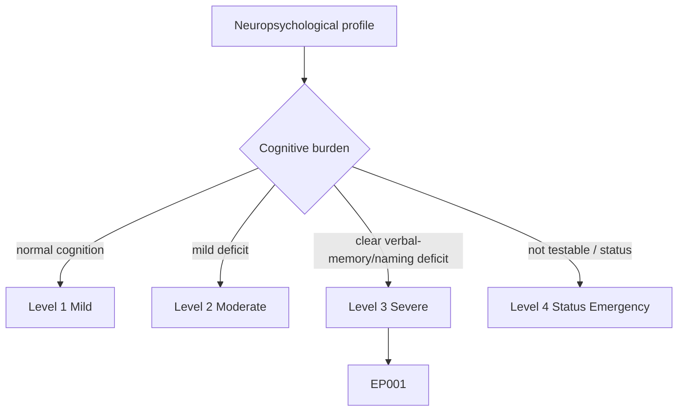
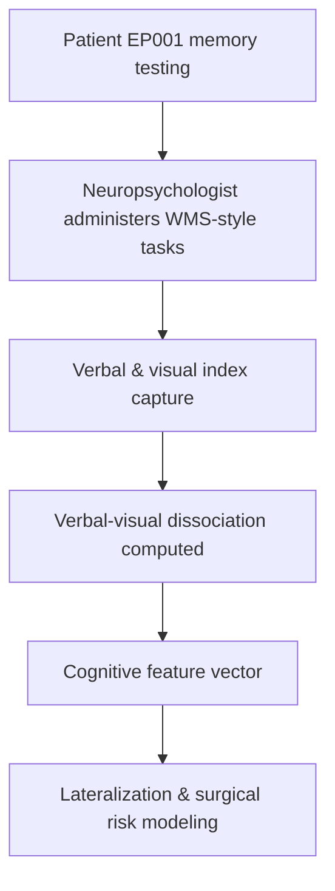
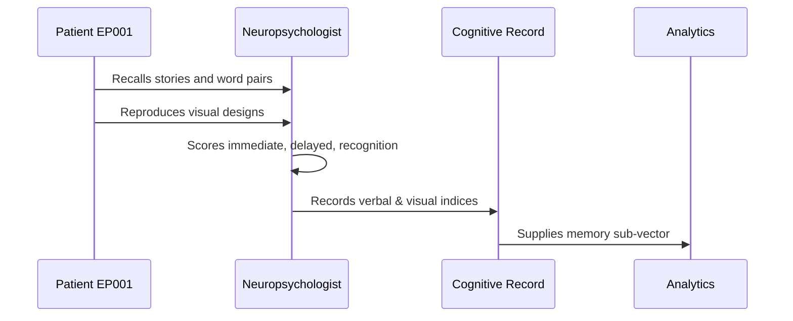
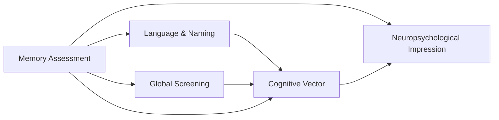
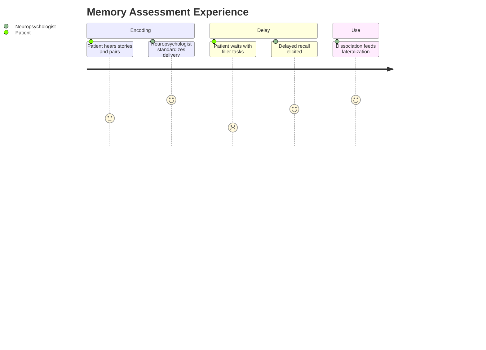

# Neuropsychologist Assessment — Section 2: Verbal & Visual Memory Assessment (EP001)

> **Why (this doc):** Material-specific memory testing is the highest-yield neuropsychological probe in temporal lobe epilepsy; the verbal–visual dissociation helps lateralize dysfunction and predict surgical and daily-function risk. **How:** The neuropsychologist administers Wechsler Memory Scale-style verbal and visual paradigms to EP001 and records immediate, delayed, and recognition indices in a fixed variable/value table feeding the cognitive vector.

**Problem:** Global screens under-detect material-specific memory loss; without lateralized verbal versus visual indices, left-temporal memory decline is missed and misattributed.

**Research Objective:** Quantify EP001's verbal and visual memory with WMS-style indices so the expected left-temporal verbal-memory weakness (with preserved visuospatial memory) is documented and trackable.

**Role:** Neuropsychologist · **Type:** Primary (cognitive) data

*Caption - Verbal and visual memory indices for EP001. The verbal–visual dissociation is the core lateralizing signal for left-temporal epilepsy and anchors the memory contribution to the cognitive vector.*

| Variable | Value |
|---|---|
| Battery | WMS-IV (Adult) |
| Auditory (Verbal) Memory Index | 84 (Low Average) |
| Logical Memory I (Immediate) | Scaled 6 |
| Logical Memory II (Delayed) | Scaled 5 |
| Verbal Paired Associates II | Scaled 6 |
| Verbal Recognition | 22/30 |
| Visual Memory Index | 102 (Average) |
| Designs I / II | Scaled 10 / 10 |
| Visual Reproduction II | Scaled 11 |
| Visual Recognition | 27/30 |
| Verbal–Visual Discrepancy | 18 pts (verbal < visual) |
| Retention (% retained, verbal) | 74% |
| Interpretation | Selective verbal-memory weakness, visuospatial preserved |

## Severity Scenario Model — Neuropsychologist View

*Caption - The same cognitive assessment across four epilepsy severity levels from the neuropsychologist's point of view; each score shifts with severity. EP001 corresponds to Level 3 (Severe). Level 4 is the operational emergency — status epilepticus with seizures recurring about every 5 minutes.*

### Level 1 — Mild (Well-Controlled)

| Variable | Value |
|---|---|
| Battery | WMS-IV (Adult) |
| Auditory (Verbal) Memory Index | 104 (Average) |
| Logical Memory I (Immediate) | Scaled 11 |
| Logical Memory II (Delayed) | Scaled 11 |
| Verbal Paired Associates II | Scaled 11 |
| Verbal Recognition | 29/30 |
| Visual Memory Index | 106 (Average) |
| Designs I / II | Scaled 11 / 11 |
| Visual Reproduction II | Scaled 12 |
| Visual Recognition | 29/30 |
| Verbal–Visual Discrepancy | 2 pts (no dissociation) |
| Retention (% retained, verbal) | 92% |
| Interpretation | Normal memory, no material-specific deficit |

### Level 2 — Moderate (Intermediate)

| Variable | Value |
|---|---|
| Battery | WMS-IV (Adult) |
| Auditory (Verbal) Memory Index | 92 (Average low) |
| Logical Memory I (Immediate) | Scaled 8 |
| Logical Memory II (Delayed) | Scaled 7 |
| Verbal Paired Associates II | Scaled 8 |
| Verbal Recognition | 25/30 |
| Visual Memory Index | 104 (Average) |
| Designs I / II | Scaled 10 / 11 |
| Visual Reproduction II | Scaled 11 |
| Visual Recognition | 28/30 |
| Verbal–Visual Discrepancy | 12 pts (emerging) |
| Retention (% retained, verbal) | 82% |
| Interpretation | Borderline-low verbal memory, early dissociation |

### Level 3 — Severe (Poorly Controlled) — EP001

| Variable | Value |
|---|---|
| Battery | WMS-IV (Adult) |
| Auditory (Verbal) Memory Index | 84 (Low Average) |
| Logical Memory I (Immediate) | Scaled 6 |
| Logical Memory II (Delayed) | Scaled 5 |
| Verbal Paired Associates II | Scaled 6 |
| Verbal Recognition | 22/30 |
| Visual Memory Index | 102 (Average) |
| Designs I / II | Scaled 10 / 10 |
| Visual Reproduction II | Scaled 11 |
| Visual Recognition | 27/30 |
| Verbal–Visual Discrepancy | 18 pts (verbal < visual) |
| Retention (% retained, verbal) | 74% |
| Interpretation | Selective verbal-memory weakness, visuospatial preserved |

### Level 4 — Refractory / Status Epilepticus (Operational Emergency)

| Variable | Value |
|---|---|
| Battery | WMS-IV — not administrable |
| Auditory (Verbal) Memory Index | Not testable (deferred) |
| Logical Memory I (Immediate) | Not testable |
| Logical Memory II (Delayed) | Not testable |
| Verbal Paired Associates II | Not testable |
| Verbal Recognition | Not testable |
| Visual Memory Index | Not testable (deferred) |
| Designs I / II | Not testable |
| Visual Reproduction II | Not testable |
| Visual Recognition | Not testable |
| Verbal–Visual Discrepancy | Not computable |
| Retention (% retained, verbal) | Not testable |
| Interpretation | Assessment deferred; impaired consciousness, expect marked post-status memory impairment |

### Severity Classification Logic

**Reason:** To scale material-specific memory across epilepsy severity from the neuropsychologist's view. **Why:** Because the verbal–visual dissociation widens as left-temporal burden increases. **What is happening:** Verbal indices fall and the discrepancy grows from Level 1 to the not-testable Level 4 while visual memory lags behind. **How it is happening:** Progressive left-temporal dysfunction and, at Level 4, impaired consciousness erode measurable memory until testing is deferred. **Reference:** Baxendale & Thompson (2010).

## Data Flow in the Pipeline

**Reason:** To show where memory indices enter and travel through the pipeline. **Why:** Because lateralization and risk modeling depend on captured material-specific scores. **What is happening:** Raw recall and recognition responses become structured indices and a computed dissociation. **How it is happening:** The neuropsychologist scores each paradigm, derives indices, and passes the discrepancy forward. **Reference:** Baxendale & Thompson (2010).

## Role Capturing the Data

**Reason:** To make explicit who captures each memory element. **Why:** Because standardized scoring provenance is required for valid lateralization. **What is happening:** The neuropsychologist integrates verbal and visual task performance into indexed records. **How it is happening:** Administration, timed delays, and recognition trials are scored and transcribed for analytics. **Reference:** Baxendale & Thompson (2010).

## Linkage to Other Assessment Sections

**Reason:** To show how memory indices connect to the cognitive vector. **Why:** Because verbal memory and naming co-lateralize and must be read together. **What is happening:** Memory links to screening and naming and feeds the integrated impression. **How it is happening:** Shared patient keys and domain codes join the sections. **Reference:** Topol (2019).

## Patient and Role Experience

**Reason:** To surface the lived experience of memory testing. **Why:** Because delay intervals and effort strongly affect memory data quality. **What is happening:** Encoding and delayed recall are shaped into indexed, comparable scores. **How it is happening:** Controlled delays and standardized cues reduce noise and improve reliability. **Reference:** APA (2020).

## Professor Readiness (Defense Q&A)

**Q1: Why emphasize the verbal–visual discrepancy?** A material-specific dissociation (verbal below visual) is a stronger lateralizing indicator for left-temporal dysfunction than either index alone, aligning with EP001's seizure onset.

**Q2: Why include recognition trials, not just free recall?** Recognition helps separate an encoding/storage deficit from a retrieval deficit; relatively low verbal recognition here supports a genuine consolidation weakness consistent with mesial temporal involvement.

**Q3: How do medications confound memory scores?** Carbamazepine and levetiracetam can mildly slow processing and attention, so memory is interpreted alongside attention/processing-speed results to avoid over-attributing loss to the temporal focus.

## References

American Psychological Association. (2020). *Publication manual of the American Psychological Association* (7th ed.). American Psychological Association. https://doi.org/10.1037/0000165-000

Baxendale, S., & Thompson, P. (2010). Beyond localization: The role of traditional neuropsychological tests in an age of imaging. *Epilepsia, 51*(11), 2225–2230. https://doi.org/10.1111/j.1528-1167.2010.02710.x

Topol, E. J. (2019). High-performance medicine: The convergence of human and artificial intelligence. *Nature Medicine, 25*(1), 44–56. https://doi.org/10.1038/s41591-018-0300-7
