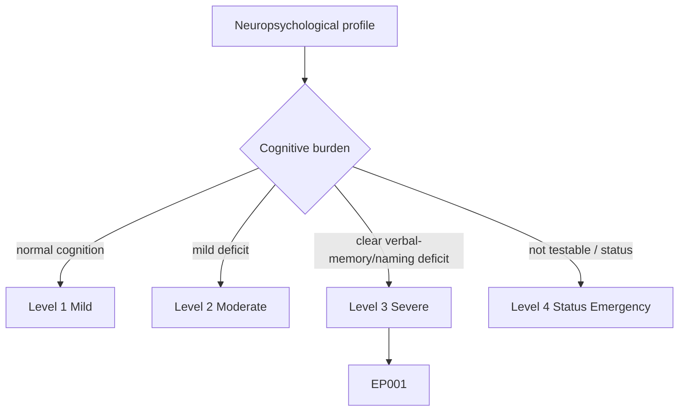
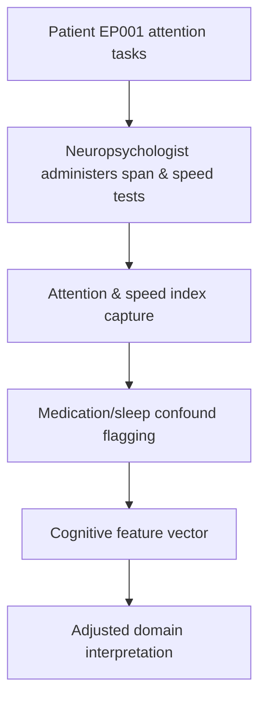
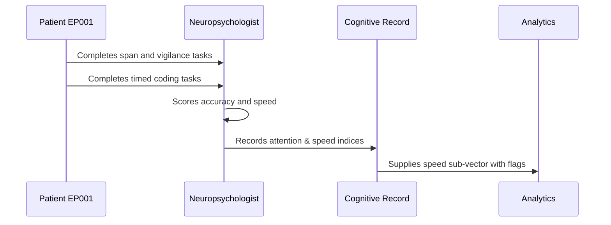
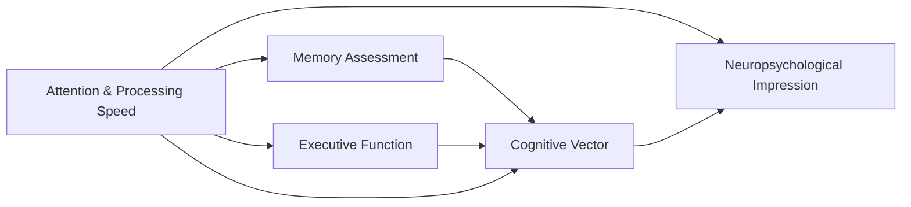
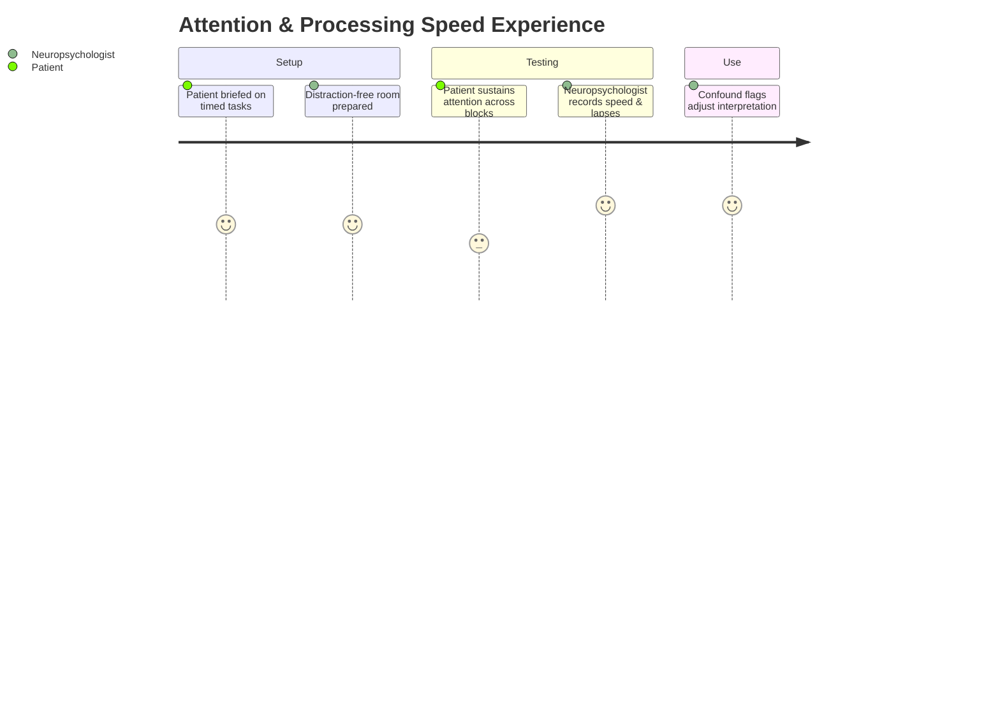

# Neuropsychologist Assessment — Section 3: Attention & Processing Speed (EP001)

> **Why (this doc):** Attention and processing speed are the substrate on which every other cognitive domain rests and are the domains most sensitive to antiseizure medication load and sleep deficit; measuring them prevents over-attributing memory loss to the temporal focus. **How:** The neuropsychologist administers standardized attention and speed tasks to EP001 and records span, vigilance, and speed indices in a fixed variable/value table feeding the cognitive vector.

**Problem:** Slowed processing and attention lapses inflate apparent memory and executive deficits; without isolating them, downstream interpretation and treatment decisions are biased.

**Research Objective:** Quantify EP001's attention span, vigilance, and processing speed so that medication- and sleep-related slowing can be separated from material-specific temporal-lobe deficits.

**Role:** Neuropsychologist · **Type:** Primary (cognitive) data

*Caption - Attention and processing-speed indices for EP001. These values calibrate interpretation of every other domain and flag likely medication/sleep contributions to cognitive performance.*

| Variable | Value |
|---|---|
| Digit Span Forward | 6 (Scaled 9) |
| Digit Span Backward | 4 (Scaled 8) |
| Digit Span Sequencing | Scaled 8 |
| Spatial Span | Scaled 10 |
| Symbol Search (WAIS-IV) | Scaled 8 |
| Coding / Digit Symbol | Scaled 7 |
| Processing Speed Index | 88 (Low Average) |
| Continuous Performance (omissions) | 6 (mild) |
| Continuous Performance (commissions) | 4 (WNL) |
| Reaction Time (mean) | 412 ms (mildly slowed) |
| Sustained Attention Lapses | Mild, late-block |
| Interpretation | Mild slowing; likely ASM + sleep-deficit related |

## Severity Scenario Model — Neuropsychologist View

*Caption - The same cognitive assessment across four epilepsy severity levels from the neuropsychologist's point of view; each score shifts with severity. EP001 corresponds to Level 3 (Severe). Level 4 is the operational emergency — status epilepticus with seizures recurring about every 5 minutes.*

### Level 1 — Mild (Well-Controlled)

| Variable | Value |
|---|---|
| Digit Span Forward | 8 (Scaled 11) |
| Digit Span Backward | 6 (Scaled 11) |
| Digit Span Sequencing | Scaled 11 |
| Spatial Span | Scaled 11 |
| Symbol Search (WAIS-IV) | Scaled 11 |
| Coding / Digit Symbol | Scaled 11 |
| Processing Speed Index | 104 (Average) |
| Continuous Performance (omissions) | 1 (WNL) |
| Continuous Performance (commissions) | 2 (WNL) |
| Reaction Time (mean) | 340 ms (WNL) |
| Sustained Attention Lapses | None |
| Interpretation | Normal attention and speed |

### Level 2 — Moderate (Intermediate)

| Variable | Value |
|---|---|
| Digit Span Forward | 7 (Scaled 10) |
| Digit Span Backward | 5 (Scaled 9) |
| Digit Span Sequencing | Scaled 9 |
| Spatial Span | Scaled 10 |
| Symbol Search (WAIS-IV) | Scaled 9 |
| Coding / Digit Symbol | Scaled 8 |
| Processing Speed Index | 94 (Average low) |
| Continuous Performance (omissions) | 3 (mild) |
| Continuous Performance (commissions) | 3 (WNL) |
| Reaction Time (mean) | 375 ms (mild) |
| Sustained Attention Lapses | Occasional |
| Interpretation | Mildly reduced speed, occasional lapses |

### Level 3 — Severe (Poorly Controlled) — EP001

| Variable | Value |
|---|---|
| Digit Span Forward | 6 (Scaled 9) |
| Digit Span Backward | 4 (Scaled 8) |
| Digit Span Sequencing | Scaled 8 |
| Spatial Span | Scaled 10 |
| Symbol Search (WAIS-IV) | Scaled 8 |
| Coding / Digit Symbol | Scaled 7 |
| Processing Speed Index | 88 (Low Average) |
| Continuous Performance (omissions) | 6 (mild) |
| Continuous Performance (commissions) | 4 (WNL) |
| Reaction Time (mean) | 412 ms (mildly slowed) |
| Sustained Attention Lapses | Mild, late-block |
| Interpretation | Mild slowing; likely ASM + sleep-deficit related |

### Level 4 — Refractory / Status Epilepticus (Operational Emergency)

| Variable | Value |
|---|---|
| Digit Span Forward | Not testable (deferred) |
| Digit Span Backward | Not testable |
| Digit Span Sequencing | Not testable |
| Spatial Span | Not testable |
| Symbol Search (WAIS-IV) | Not testable |
| Coding / Digit Symbol | Not testable |
| Processing Speed Index | Not testable (deferred) |
| Continuous Performance (omissions) | Not testable |
| Continuous Performance (commissions) | Not testable |
| Reaction Time (mean) | Not measurable — impaired consciousness |
| Sustained Attention Lapses | Unable to sustain — seizures ~every 5 min |
| Interpretation | Assessment deferred; expect marked post-status attention/speed impairment |

### Severity Classification Logic

**Reason:** To scale attention and processing speed across epilepsy severity from the neuropsychologist's view. **Why:** Because speed and vigilance are the domains most sensitive to medication load, sleep, and seizure burden. **What is happening:** PSI and vigilance degrade from Level 1 to the not-measurable Level 4. **How it is happening:** Rising seizure and ASM burden slow processing, and at Level 4 impaired consciousness prevents any timed measurement. **Reference:** Baxendale & Thompson (2010).

## Data Flow in the Pipeline

**Reason:** To show where attention/speed data enter and travel through the pipeline. **Why:** Because valid interpretation of memory and executive scores depends on knowing baseline speed. **What is happening:** Task performance becomes structured indices plus confound flags. **How it is happening:** The neuropsychologist scores span and speed tasks and marks likely medication/sleep effects for downstream adjustment. **Reference:** Baxendale & Thompson (2010).

## Role Capturing the Data

**Reason:** To make explicit who captures the attention data. **Why:** Because timed-task scoring provenance affects all downstream domain reads. **What is happening:** The neuropsychologist converts timed performance into indexed, flagged records. **How it is happening:** Standardized timing and accuracy scoring are transcribed and passed to analytics. **Reference:** Baxendale & Thompson (2010).

## Linkage to Other Assessment Sections

**Reason:** To show how attention/speed connect to the cognitive vector. **Why:** Because speed moderates memory and executive scores. **What is happening:** Attention links to memory and executive testing and feeds the impression as a correction factor. **How it is happening:** Shared patient keys and confound flags join the sections. **Reference:** Topol (2019).

## Patient and Role Experience

**Reason:** To surface the lived experience of timed attention testing. **Why:** Because fatigue and poor sleep (5.2 hrs/day) directly reduce vigilance. **What is happening:** Timed effort is shaped into indexed scores with fatigue context. **How it is happening:** Short blocks with monitored effort limit late-block drift and improve validity. **Reference:** APA (2020).

## Professor Readiness (Defense Q&A)

**Q1: Why measure processing speed before interpreting memory?** Slowed speed reduces encoding opportunity, so a low Processing Speed Index can masquerade as a memory deficit; measuring it first lets us adjust the memory interpretation.

**Q2: How do EP001's medications factor in?** Carbamazepine and levetiracetam are associated with mild psychomotor slowing and attentional effects, consistent with the Low Average speed index; this is flagged rather than read as fixed impairment.

**Q3: Why note late-block lapses specifically?** Late-block vigilance decline points to a sustained-attention/fatigue mechanism (aggravated by 5.2 hrs sleep) rather than a structural deficit, informing counselling rather than localization.

## References

American Psychological Association. (2020). *Publication manual of the American Psychological Association* (7th ed.). American Psychological Association. https://doi.org/10.1037/0000165-000

Baxendale, S., & Thompson, P. (2010). Beyond localization: The role of traditional neuropsychological tests in an age of imaging. *Epilepsia, 51*(11), 2225–2230. https://doi.org/10.1111/j.1528-1167.2010.02710.x

Topol, E. J. (2019). High-performance medicine: The convergence of human and artificial intelligence. *Nature Medicine, 25*(1), 44–56. https://doi.org/10.1038/s41591-018-0300-7
