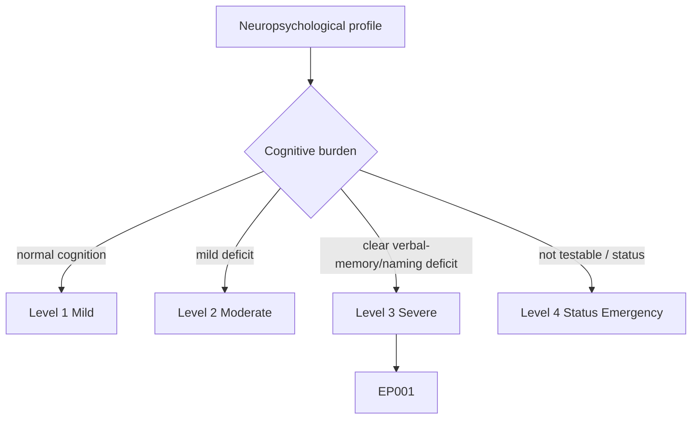
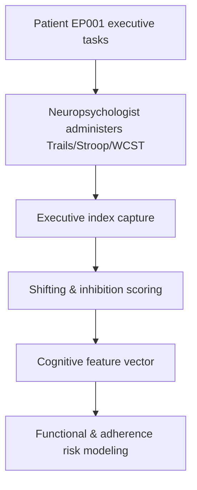
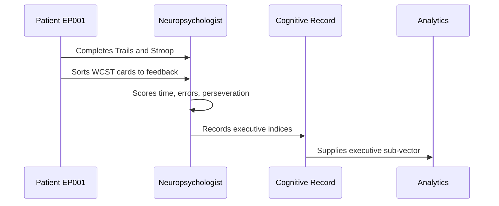
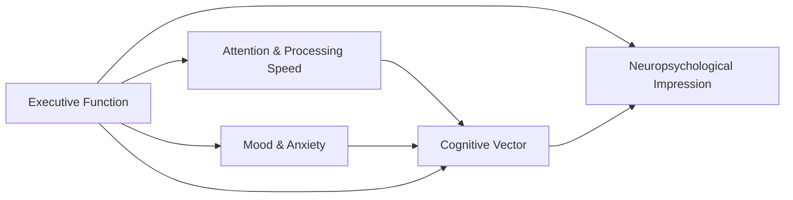
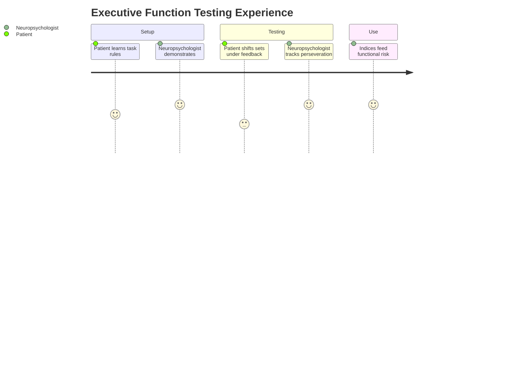

# Neuropsychologist Assessment — Section 4: Executive Function (EP001)

> **Why (this doc):** Executive function governs planning, set-shifting, inhibition, and mental flexibility — capacities essential for medication adherence, employment, and safety in epilepsy; deficits here predict functional disability beyond seizure count. **How:** The neuropsychologist administers Trail Making, Stroop, and Wisconsin Card Sorting paradigms to EP001 and records timed and error-based indices in a fixed variable/value table feeding the cognitive vector.

**Problem:** Executive weaknesses are easily masked by preserved IQ yet drive real-world failures (missed doses, workplace errors); without formal testing they go undocumented.

**Research Objective:** Quantify EP001's executive control (shifting, inhibition, concept formation) so functional and adherence risks can be linked to measurable cognitive mechanisms.

**Role:** Neuropsychologist · **Type:** Primary (cognitive) data

*Caption - Executive-function indices for EP001 across shifting, inhibition, and concept-formation tasks. These values connect cognition to real-world adherence (88%) and occupational demands.*

| Variable | Value |
|---|---|
| Trail Making A (time) | 28 sec (Scaled 10) |
| Trail Making B (time) | 78 sec (Scaled 8) |
| Trail B–A Difference | 50 sec (mildly elevated) |
| Stroop Word | T = 52 |
| Stroop Color | T = 49 |
| Stroop Color-Word (interference) | T = 43 (mild) |
| WCST Categories Completed | 5/6 |
| WCST Perseverative Errors | T = 41 (mild) |
| WCST Failure to Maintain Set | 1 |
| Verbal Fluency (FAS) | 34 (Low Average) |
| Category Fluency (Animals) | 16 (Low Average) |
| Interpretation | Mild shifting/inhibition weakness; concept formation intact |

## Severity Scenario Model — Neuropsychologist View

*Caption - The same cognitive assessment across four epilepsy severity levels from the neuropsychologist's point of view; each score shifts with severity. EP001 corresponds to Level 3 (Severe). Level 4 is the operational emergency — status epilepticus with seizures recurring about every 5 minutes.*

### Level 1 — Mild (Well-Controlled)

| Variable | Value |
|---|---|
| Trail Making A (time) | 22 sec (Scaled 12) |
| Trail Making B (time) | 55 sec (Scaled 11) |
| Trail B–A Difference | 33 sec (WNL) |
| Stroop Word | T = 55 |
| Stroop Color | T = 54 |
| Stroop Color-Word (interference) | T = 52 (WNL) |
| WCST Categories Completed | 6/6 |
| WCST Perseverative Errors | T = 52 (WNL) |
| WCST Failure to Maintain Set | 0 |
| Verbal Fluency (FAS) | 44 (Average) |
| Category Fluency (Animals) | 22 (Average) |
| Interpretation | Normal executive function |

### Level 2 — Moderate (Intermediate)

| Variable | Value |
|---|---|
| Trail Making A (time) | 25 sec (Scaled 11) |
| Trail Making B (time) | 66 sec (Scaled 9) |
| Trail B–A Difference | 41 sec (borderline) |
| Stroop Word | T = 53 |
| Stroop Color | T = 51 |
| Stroop Color-Word (interference) | T = 47 (borderline) |
| WCST Categories Completed | 6/6 |
| WCST Perseverative Errors | T = 46 (borderline) |
| WCST Failure to Maintain Set | 1 |
| Verbal Fluency (FAS) | 39 (Low Average) |
| Category Fluency (Animals) | 18 (Low Average) |
| Interpretation | Mild set-shifting/inhibition dip |

### Level 3 — Severe (Poorly Controlled) — EP001

| Variable | Value |
|---|---|
| Trail Making A (time) | 28 sec (Scaled 10) |
| Trail Making B (time) | 78 sec (Scaled 8) |
| Trail B–A Difference | 50 sec (mildly elevated) |
| Stroop Word | T = 52 |
| Stroop Color | T = 49 |
| Stroop Color-Word (interference) | T = 43 (mild) |
| WCST Categories Completed | 5/6 |
| WCST Perseverative Errors | T = 41 (mild) |
| WCST Failure to Maintain Set | 1 |
| Verbal Fluency (FAS) | 34 (Low Average) |
| Category Fluency (Animals) | 16 (Low Average) |
| Interpretation | Mild shifting/inhibition weakness; concept formation intact |

### Level 4 — Refractory / Status Epilepticus (Operational Emergency)

| Variable | Value |
|---|---|
| Trail Making A (time) | Not testable (deferred) |
| Trail Making B (time) | Not testable |
| Trail B–A Difference | Not computable |
| Stroop Word | Not testable |
| Stroop Color | Not testable |
| Stroop Color-Word (interference) | Not testable |
| WCST Categories Completed | Not testable |
| WCST Perseverative Errors | Not testable |
| WCST Failure to Maintain Set | Not testable |
| Verbal Fluency (FAS) | Not testable |
| Category Fluency (Animals) | Not testable |
| Interpretation | Assessment deferred; impaired consciousness, expect marked post-status executive impairment |

### Severity Classification Logic

**Reason:** To scale executive control across epilepsy severity from the neuropsychologist's view. **Why:** Because shifting and inhibition weaknesses predict adherence and occupational risk that worsen with disease burden. **What is happening:** Trails B, Stroop interference, and WCST perseveration degrade from Level 1 to the not-testable Level 4. **How it is happening:** Increasing seizure and mood/ASM burden erode flexibility, and at Level 4 impaired consciousness prevents rule-based testing. **Reference:** Baxendale & Thompson (2010).

## Data Flow in the Pipeline

**Reason:** To show where executive data enter and travel through the pipeline. **Why:** Because functional and adherence risk models need measurable executive indices. **What is happening:** Timed and error-based performance becomes structured executive indices. **How it is happening:** The neuropsychologist scores each paradigm and forwards shifting/inhibition metrics. **Reference:** Baxendale & Thompson (2010).

## Role Capturing the Data

**Reason:** To make explicit who captures executive data. **Why:** Because error-scoring provenance underpins functional risk claims. **What is happening:** The neuropsychologist converts task behavior into indexed executive records. **How it is happening:** Standardized timing and perseveration scoring are transcribed for analytics. **Reference:** Baxendale & Thompson (2010).

## Linkage to Other Assessment Sections

**Reason:** To show how executive indices connect to the cognitive vector. **Why:** Because attention and mood both modulate executive performance. **What is happening:** Executive links to attention and mood and feeds the impression and functional risk. **How it is happening:** Shared patient keys and domain codes join the sections. **Reference:** Topol (2019).

## Patient and Role Experience

**Reason:** To surface the lived experience of executive testing. **Why:** Because frustration and mood affect flexibility and effort. **What is happening:** Rule-based effort is shaped into indexed, comparable scores. **How it is happening:** Clear instruction and feedback reduce learning confounds and improve validity. **Reference:** APA (2020).

## Professor Readiness (Defense Q&A)

**Q1: Why use three executive tasks rather than one?** Trail Making (shifting/speed), Stroop (inhibition), and WCST (concept formation/perseveration) tap distinct executive components, so convergent evidence is more reliable than any single measure.

**Q2: How does executive function relate to EP001's 88% adherence?** Mild set-shifting and inhibition weakness can contribute to routine lapses in medication timing; documenting it justifies practical adherence supports rather than assuming pure non-motivation.

**Q3: Why is concept formation described as intact?** Five of six WCST categories completed with only mild perseveration indicates preserved abstraction and rule discovery, localizing the weakness to shifting/inhibition rather than frontal concept-formation failure.

## References

American Psychological Association. (2020). *Publication manual of the American Psychological Association* (7th ed.). American Psychological Association. https://doi.org/10.1037/0000165-000

Baxendale, S., & Thompson, P. (2010). Beyond localization: The role of traditional neuropsychological tests in an age of imaging. *Epilepsia, 51*(11), 2225–2230. https://doi.org/10.1111/j.1528-1167.2010.02710.x

Topol, E. J. (2019). High-performance medicine: The convergence of human and artificial intelligence. *Nature Medicine, 25*(1), 44–56. https://doi.org/10.1038/s41591-018-0300-7
