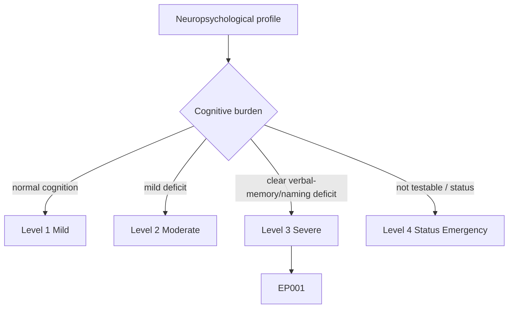
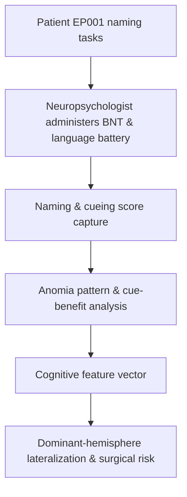
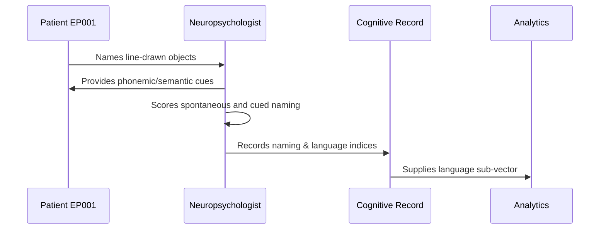
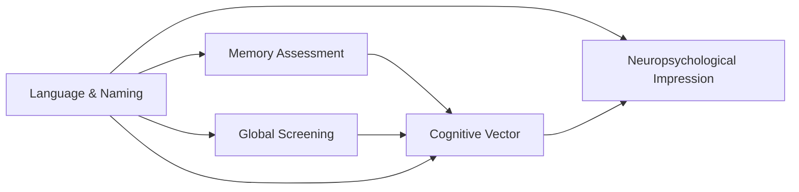
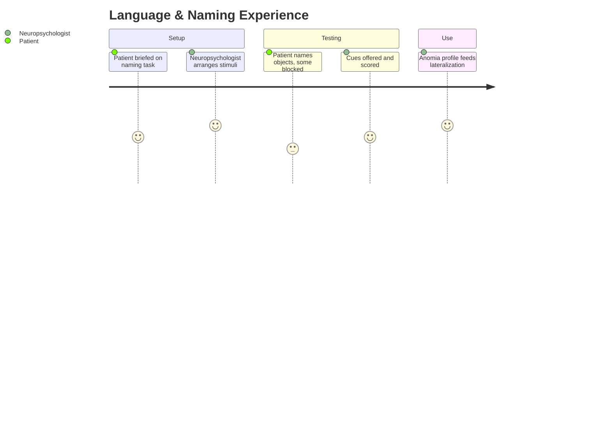

# Neuropsychologist Assessment — Section 5: Language & Confrontation Naming (EP001)

> **Why (this doc):** Confrontation naming and word retrieval are exquisitely sensitive to left (dominant) temporal dysfunction; naming decline is one of the most robust neuropsychological markers of left-temporal epilepsy and a key surgical-risk consideration. **How:** The neuropsychologist administers the Boston Naming Test and allied language tasks to EP001 and records naming, cueing, and comprehension scores in a fixed variable/value table feeding the cognitive vector.

**Problem:** Word-finding difficulty is often dismissed as tip-of-the-tongue nuisance; without standardized naming testing, dominant-temporal language decline is undocumented and surgical risk is underestimated.

**Research Objective:** Quantify EP001's confrontation naming and language function so the expected left-temporal (dominant-hemisphere) naming weakness is documented and linked to lateralization and functional impact.

**Role:** Neuropsychologist · **Type:** Primary (cognitive) data

*Caption - Language and confrontation-naming scores for EP001. In a right-handed patient with left-temporal onset these values are a primary dominant-hemisphere lateralizing signal and inform surgical-risk discussion.*

| Variable | Value |
|---|---|
| Handedness / Dominance | Right-handed / left-dominant (presumed) |
| Boston Naming Test (BNT, /60) | 48 (mildly reduced) |
| BNT — Phonemic Cue Benefit | +6 items |
| BNT — Semantic Cue Benefit | +1 item |
| Tip-of-the-Tongue Frequency | Elevated |
| Auditory Comprehension (Token Test) | 42/44 (WNL) |
| Repetition | Intact |
| Category Fluency (Animals) | 16 (Low Average) |
| Letter Fluency (FAS) | 34 (Low Average) |
| Reading / Writing | Functionally intact |
| Interpretation | Anomia with phonemic-cue responsiveness; comprehension spared |

## Severity Scenario Model — Neuropsychologist View

*Caption - The same cognitive assessment across four epilepsy severity levels from the neuropsychologist's point of view; each score shifts with severity. EP001 corresponds to Level 3 (Severe). Level 4 is the operational emergency — status epilepticus with seizures recurring about every 5 minutes.*

### Level 1 — Mild (Well-Controlled)

| Variable | Value |
|---|---|
| Handedness / Dominance | Right-handed / left-dominant (presumed) |
| Boston Naming Test (BNT, /60) | 58 (WNL) |
| BNT — Phonemic Cue Benefit | +1 item |
| BNT — Semantic Cue Benefit | +0 items |
| Tip-of-the-Tongue Frequency | Normal |
| Auditory Comprehension (Token Test) | 44/44 (WNL) |
| Repetition | Intact |
| Category Fluency (Animals) | 22 (Average) |
| Letter Fluency (FAS) | 44 (Average) |
| Reading / Writing | Intact |
| Interpretation | Normal naming and language |

### Level 2 — Moderate (Intermediate)

| Variable | Value |
|---|---|
| Handedness / Dominance | Right-handed / left-dominant (presumed) |
| Boston Naming Test (BNT, /60) | 53 (borderline) |
| BNT — Phonemic Cue Benefit | +3 items |
| BNT — Semantic Cue Benefit | +1 item |
| Tip-of-the-Tongue Frequency | Mildly elevated |
| Auditory Comprehension (Token Test) | 43/44 (WNL) |
| Repetition | Intact |
| Category Fluency (Animals) | 18 (Low Average) |
| Letter Fluency (FAS) | 39 (Low Average) |
| Reading / Writing | Intact |
| Interpretation | Mildly reduced naming, early anomia |

### Level 3 — Severe (Poorly Controlled) — EP001

| Variable | Value |
|---|---|
| Handedness / Dominance | Right-handed / left-dominant (presumed) |
| Boston Naming Test (BNT, /60) | 48 (mildly reduced) |
| BNT — Phonemic Cue Benefit | +6 items |
| BNT — Semantic Cue Benefit | +1 item |
| Tip-of-the-Tongue Frequency | Elevated |
| Auditory Comprehension (Token Test) | 42/44 (WNL) |
| Repetition | Intact |
| Category Fluency (Animals) | 16 (Low Average) |
| Letter Fluency (FAS) | 34 (Low Average) |
| Reading / Writing | Functionally intact |
| Interpretation | Anomia with phonemic-cue responsiveness; comprehension spared |

### Level 4 — Refractory / Status Epilepticus (Operational Emergency)

| Variable | Value |
|---|---|
| Handedness / Dominance | Right-handed / left-dominant (presumed) |
| Boston Naming Test (BNT, /60) | Not testable (deferred) |
| BNT — Phonemic Cue Benefit | Not testable |
| BNT — Semantic Cue Benefit | Not testable |
| Tip-of-the-Tongue Frequency | Not assessable |
| Auditory Comprehension (Token Test) | Not testable — impaired consciousness |
| Repetition | Not testable |
| Category Fluency (Animals) | Not testable |
| Letter Fluency (FAS) | Not testable |
| Reading / Writing | Not testable |
| Interpretation | Assessment deferred; expect marked post-status language/naming impairment |

### Severity Classification Logic

**Reason:** To scale confrontation naming across epilepsy severity from the neuropsychologist's view. **Why:** Because naming decline is one of the most robust dominant-temporal markers and tracks disease burden. **What is happening:** BNT scores fall and cue-dependence rises from Level 1 to the not-testable Level 4 while comprehension is spared longest. **How it is happening:** Progressive left-temporal dysfunction impairs lexical retrieval, and at Level 4 impaired consciousness precludes language testing. **Reference:** Baxendale & Thompson (2010).

## Data Flow in the Pipeline

**Reason:** To show where language data enter and travel through the pipeline. **Why:** Because lateralization and surgical-risk modeling depend on captured naming scores. **What is happening:** Naming responses become structured scores plus a cue-benefit profile. **How it is happening:** The neuropsychologist scores spontaneous and cued naming and forwards the anomia pattern. **Reference:** Baxendale & Thompson (2010).

## Role Capturing the Data

**Reason:** To make explicit who captures language data. **Why:** Because cue-benefit scoring provenance underpins lateralization claims. **What is happening:** The neuropsychologist converts naming behavior into indexed records with cue profiles. **How it is happening:** Standardized cueing hierarchy and scoring are transcribed for analytics. **Reference:** Baxendale & Thompson (2010).

## Linkage to Other Assessment Sections

**Reason:** To show how language connects to the cognitive vector. **Why:** Because naming and verbal memory co-lateralize to the dominant temporal lobe. **What is happening:** Language links to verbal memory and screening and feeds the impression. **How it is happening:** Shared patient keys and domain codes join the sections. **Reference:** Topol (2019).

## Patient and Role Experience

**Reason:** To surface the lived experience of naming testing. **Why:** Because word-finding failures are frustrating and can trigger anxiety that affects effort. **What is happening:** Retrieval attempts are shaped into scored, comparable records. **How it is happening:** A supportive cueing hierarchy reduces distress and yields interpretable cue-benefit data. **Reference:** APA (2020).

## Professor Readiness (Defense Q&A)

**Q1: Why is confrontation naming a strong left-temporal marker?** Naming reliably engages dominant anterior/lateral temporal cortex, so anomia in a right-handed (left-dominant) patient with left-temporal onset is a specific and expected lateralizing sign.

**Q2: What does phonemic-cue responsiveness tell you?** A robust phonemic-cue benefit indicates a retrieval/access problem with intact semantic representations, typical of temporal-lobe anomia rather than a semantic-store degradation.

**Q3: Why does this matter for surgery?** Documented dominant-temporal naming weakness raises the risk of post-resection naming decline, so it is central to pre-surgical counselling and Wada/fMRI language-mapping decisions.

## References

American Psychological Association. (2020). *Publication manual of the American Psychological Association* (7th ed.). American Psychological Association. https://doi.org/10.1037/0000165-000

Baxendale, S., & Thompson, P. (2010). Beyond localization: The role of traditional neuropsychological tests in an age of imaging. *Epilepsia, 51*(11), 2225–2230. https://doi.org/10.1111/j.1528-1167.2010.02710.x

Topol, E. J. (2019). High-performance medicine: The convergence of human and artificial intelligence. *Nature Medicine, 25*(1), 44–56. https://doi.org/10.1038/s41591-018-0300-7
