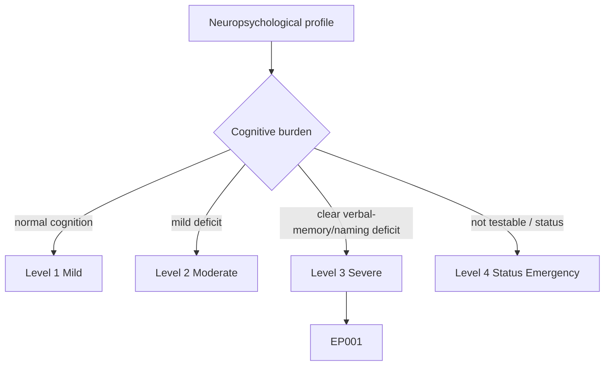
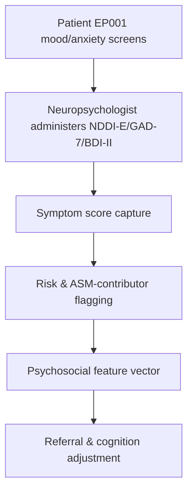
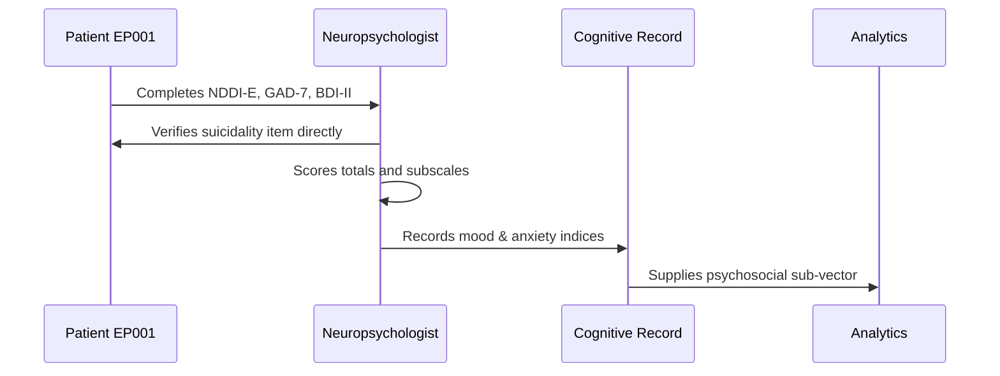
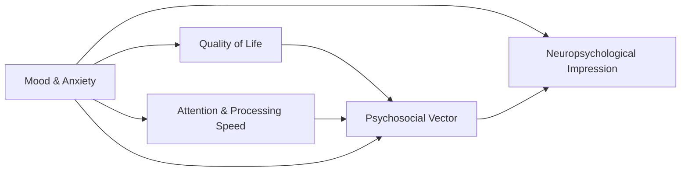
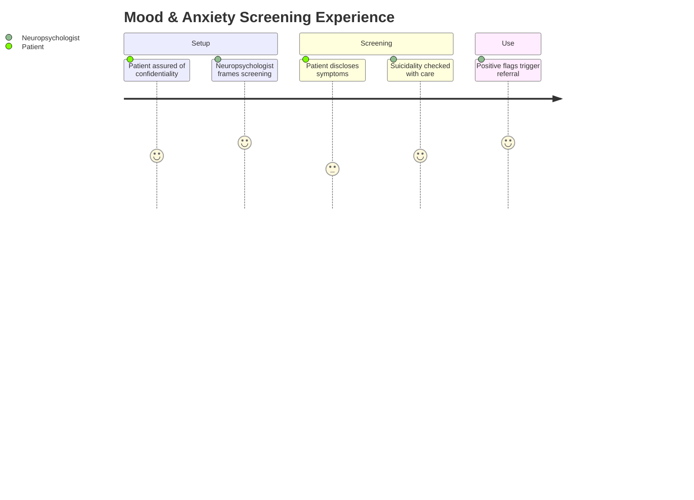

# Neuropsychologist Assessment — Section 6: Mood & Anxiety (EP001)

> **Why (this doc):** Depression and anxiety are the most common and most under-treated comorbidities in epilepsy, independently degrade quality of life and cognition, and can be worsened by antiseizure medications; screening them is essential to valid neuropsychological interpretation. **How:** The neuropsychologist administers validated mood/anxiety instruments (NDDI-E, GAD-7, BDI-II) to EP001 and records item and total scores in a fixed variable/value table feeding the psychosocial vector.

**Problem:** Untreated mood and anxiety symptoms suppress cognitive performance and quality of life, yet are routinely missed in seizure-focused epilepsy care.

**Research Objective:** Quantify EP001's depressive and anxiety symptom burden with epilepsy-validated tools so mood contributions to cognition and QoL are documented and actionable.

**Role:** Neuropsychologist · **Type:** Primary (cognitive) data

*Caption - Mood and anxiety screening scores for EP001. These values contextualize cognitive findings and flag levetiracetam-related irritability and low mood for the treatment team.*

| Variable | Value |
|---|---|
| NDDI-E Total (/24) | 14 (screen positive threshold ≥15 → borderline) |
| NDDI-E Suicidality Item | Denies active ideation |
| GAD-7 Total (/21) | 9 (mild–moderate anxiety) |
| BDI-II Total (/63) | 17 (mild depression) |
| BDI-II Cognitive Subscale | Mildly elevated |
| BDI-II Somatic Subscale | Elevated (sleep/fatigue driven) |
| Irritability (self-report) | Present, ASM-linked |
| Sleep (hrs/day) | 5.2 (poor) |
| Suspected ASM Contributor | Levetiracetam (mood/irritability) |
| Perceived Stigma | Mild |
| Interpretation | Mild-moderate anxiety + mild depression; monitor & refer |

## Questionnaire (Enterprise Form)

*Caption - The items/tests the neuropsychologist administers for this section, with response type, validation, EP001's example score, and the derived AI feature.*

| ID | Question | Response Type | Validation | EP001 (Example) | AI Feature |
|---|---|---|---|---|---|
| NPS-0601 | NDDI-E total score (/24)? | Score | NDDI-E 6-24 | 14 (screen positive threshold ≥15 → borderline) | nddie_total |
| NPS-0602 | NDDI-E suicidality item response? | Dropdown[Denies ideation, Passive ideation, Active ideation] | Escalate if positive | Denies active ideation | nddie_suicidality_item |
| NPS-0603 | GAD-7 total score (/21)? | Score | GAD-7 0-21 | 9 (mild–moderate anxiety) | gad7_total |
| NPS-0604 | BDI-II total score (/63)? | Score | BDI-II 0-63 | 17 (mild depression) | bdi_ii_total |
| NPS-0605 | BDI-II cognitive subscale level? | Dropdown[WNL, Slightly elevated, Mildly elevated, Elevated] | Categorical | Mildly elevated | bdi_cognitive_subscale |
| NPS-0606 | BDI-II somatic subscale level? | Dropdown[WNL, Mildly elevated, Elevated] | Categorical | Elevated (sleep/fatigue driven) | bdi_somatic_subscale |
| NPS-0607 | Self-reported irritability? | Dropdown[Absent, Occasional, Present] | Categorical | Present, ASM-linked | irritability_self_report |
| NPS-0608 | Average sleep (hrs/day)? | Number | hours 0-24 | 5.2 (poor) | sleep_hours_per_day |
| NPS-0609 | Suspected ASM contributor? | Text | Medication name | Levetiracetam (mood/irritability) | suspected_asm_contributor |
| NPS-0610 | Perceived stigma level? | Dropdown[None, Minimal, Mild, Moderate, Severe] | Categorical | Mild | perceived_stigma |
| NPS-0611 | Clinical interpretation of mood/anxiety? | Text | Free-text summary | Mild-moderate anxiety + mild depression; monitor & refer | mood_anxiety_interpretation |

## Severity Scenario Model — Neuropsychologist View

*Caption - The same cognitive assessment across four epilepsy severity levels from the neuropsychologist's point of view; each score shifts with severity. EP001 corresponds to Level 3 (Severe). Level 4 is the operational emergency — status epilepticus with seizures recurring about every 5 minutes.*

### Level 1 — Mild (Well-Controlled)

| Variable | Value |
|---|---|
| NDDI-E Total (/24) | 8 (screen negative) |
| NDDI-E Suicidality Item | Denies ideation |
| GAD-7 Total (/21) | 3 (minimal anxiety) |
| BDI-II Total (/63) | 6 (minimal) |
| BDI-II Cognitive Subscale | WNL |
| BDI-II Somatic Subscale | WNL |
| Irritability (self-report) | Absent |
| Sleep (hrs/day) | 7.5 (adequate) |
| Suspected ASM Contributor | None |
| Perceived Stigma | None |
| Interpretation | Normal mood, no clinical anxiety |

### Level 2 — Moderate (Intermediate)

| Variable | Value |
|---|---|
| NDDI-E Total (/24) | 11 (subthreshold) |
| NDDI-E Suicidality Item | Denies ideation |
| GAD-7 Total (/21) | 6 (mild anxiety) |
| BDI-II Total (/63) | 12 (minimal–mild) |
| BDI-II Cognitive Subscale | Slightly elevated |
| BDI-II Somatic Subscale | Mildly elevated |
| Irritability (self-report) | Occasional |
| Sleep (hrs/day) | 6.3 (borderline) |
| Suspected ASM Contributor | Possible (monitor) |
| Perceived Stigma | Minimal |
| Interpretation | Mild mood impact, subthreshold |

### Level 3 — Severe (Poorly Controlled) — EP001

| Variable | Value |
|---|---|
| NDDI-E Total (/24) | 14 (screen positive threshold ≥15 → borderline) |
| NDDI-E Suicidality Item | Denies active ideation |
| GAD-7 Total (/21) | 9 (mild–moderate anxiety) |
| BDI-II Total (/63) | 17 (mild depression) |
| BDI-II Cognitive Subscale | Mildly elevated |
| BDI-II Somatic Subscale | Elevated (sleep/fatigue driven) |
| Irritability (self-report) | Present, ASM-linked |
| Sleep (hrs/day) | 5.2 (poor) |
| Suspected ASM Contributor | Levetiracetam (mood/irritability) |
| Perceived Stigma | Mild |
| Interpretation | Mild-moderate anxiety + mild depression; monitor & refer |

### Level 4 — Refractory / Status Epilepticus (Operational Emergency)

| Variable | Value |
|---|---|
| NDDI-E Total (/24) | Not testable — impaired consciousness (deferred) |
| NDDI-E Suicidality Item | Not assessable acutely |
| GAD-7 Total (/21) | Not testable (deferred) |
| BDI-II Total (/63) | Not testable (deferred) |
| BDI-II Cognitive Subscale | Not testable |
| BDI-II Somatic Subscale | Not testable |
| Irritability (self-report) | Unable to self-report |
| Sleep (hrs/day) | Disrupted — status epilepticus |
| Suspected ASM Contributor | Under acute review |
| Perceived Stigma | Not assessable |
| Interpretation | Screening deferred; anticipate severe post-status mood/QoL burden, screen when stable |

### Severity Classification Logic

**Reason:** To scale mood and anxiety burden across epilepsy severity from the neuropsychologist's view. **Why:** Because depression and anxiety rise with seizure burden and ASM load and independently degrade cognition and QoL. **What is happening:** NDDI-E, GAD-7, and BDI-II climb from Level 1 to a not-assessable Level 4. **How it is happening:** Worsening control, poor sleep, and levetiracetam effects elevate symptoms until, in status, self-report is impossible. **Reference:** Baxendale & Thompson (2010).

## Data Flow in the Pipeline

**Reason:** To show where mood data enter and travel through the pipeline. **Why:** Because cognition and QoL interpretation depend on documented mood burden. **What is happening:** Self-report responses become structured scores plus risk flags. **How it is happening:** The neuropsychologist scores each instrument and forwards symptom severity and ASM-contributor flags. **Reference:** Baxendale & Thompson (2010).

## Role Capturing the Data

**Reason:** To make explicit who captures mood data. **Why:** Because safety verification and scoring provenance are clinically critical. **What is happening:** The neuropsychologist converts self-report into scored, safety-checked records. **How it is happening:** Standardized scoring plus direct suicidality follow-up are transcribed for analytics. **Reference:** APA (2020).

## Linkage to Other Assessment Sections

**Reason:** To show how mood connects to the psychosocial vector. **Why:** Because mood modulates attention, QoL, and self-reported cognition. **What is happening:** Mood links to QoL and attention and feeds the integrated impression. **How it is happening:** Shared patient keys and domain codes join the sections. **Reference:** Topol (2019).

## Patient and Role Experience

**Reason:** To surface the lived experience of mood screening. **Why:** Because stigma and disclosure reluctance affect honesty and data quality. **What is happening:** Sensitive disclosure is shaped into scored, actionable records. **How it is happening:** A confidential, non-judgmental frame improves disclosure and screening validity. **Reference:** APA (2020).

## Professor Readiness (Defense Q&A)

**Q1: Why use the NDDI-E rather than a generic depression scale?** The NDDI-E was designed to screen for depression in epilepsy while minimizing overlap with antiseizure-medication side effects and seizure symptoms, reducing false positives from somatic items.

**Q2: How might levetiracetam be involved?** Levetiracetam is associated with irritability, anxiety, and low mood in a subset of patients; EP001's reported irritability and borderline mood scores make it a plausible contributor worth flagging for the neurologist.

**Q3: How does mood affect the cognitive interpretation?** Mild-moderate anxiety and depression can depress attention, processing speed, and subjective memory, so cognitive findings are interpreted with mood as a partial, modifiable contributor rather than fixed deficit.

## References

American Psychological Association. (2020). *Publication manual of the American Psychological Association* (7th ed.). American Psychological Association. https://doi.org/10.1037/0000165-000

Baxendale, S., & Thompson, P. (2010). Beyond localization: The role of traditional neuropsychological tests in an age of imaging. *Epilepsia, 51*(11), 2225–2230. https://doi.org/10.1111/j.1528-1167.2010.02710.x

Topol, E. J. (2019). High-performance medicine: The convergence of human and artificial intelligence. *Nature Medicine, 25*(1), 44–56. https://doi.org/10.1038/s41591-018-0300-7
