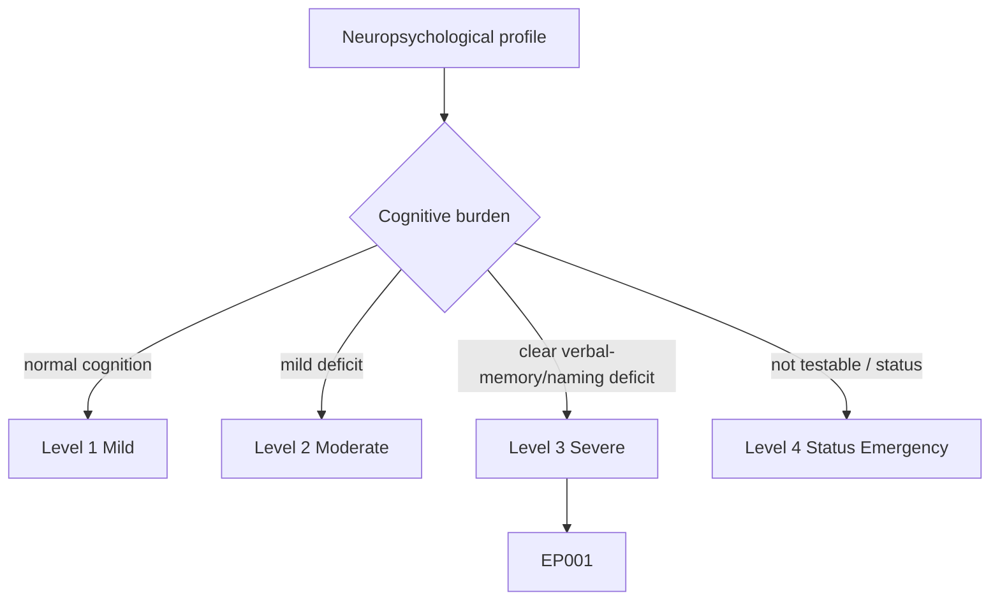
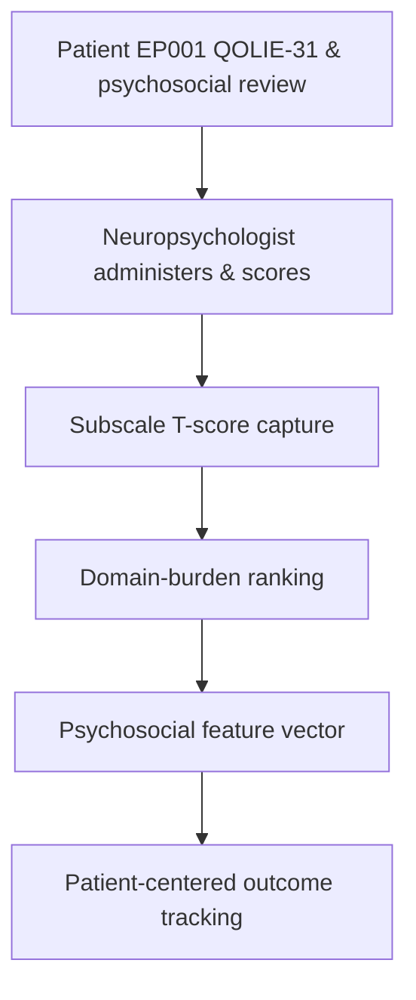
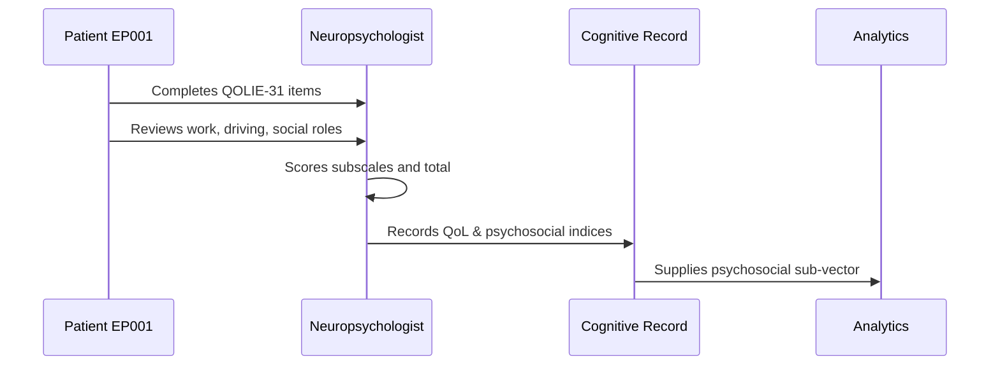
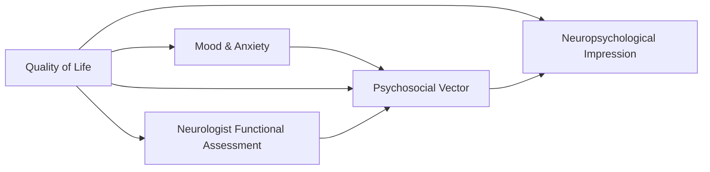
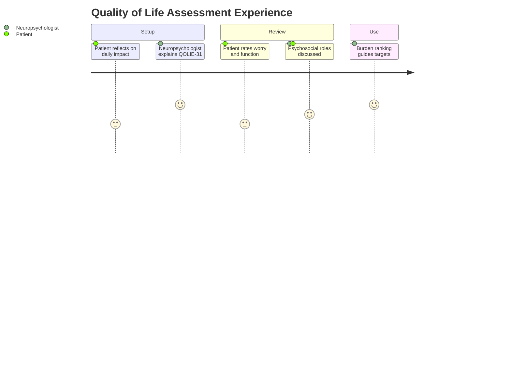

# Neuropsychologist Assessment — Section 7: Quality of Life & Psychosocial Function (EP001)

> **Why (this doc):** Quality of life integrates seizure burden, mood, cognition, and social role into the outcome that matters most to patients; the QOLIE-31 is the epilepsy-specific standard and captures domains that seizure counts miss. **How:** The neuropsychologist administers the QOLIE-31 and a psychosocial-function review to EP001 and records subscale and total T-scores in a fixed variable/value table feeding the psychosocial vector.

**Problem:** Seizure-frequency metrics alone do not capture disability; without a validated QoL and psychosocial measure, the real-world impact on work, relationships, and independence is invisible.

**Research Objective:** Quantify EP001's epilepsy-specific quality of life and psychosocial function so treatment can target the domains (seizure worry, cognition, social role) that most reduce his wellbeing.

**Role:** Neuropsychologist · **Type:** Primary (cognitive) data

*Caption - QOLIE-31 subscales and psychosocial-function fields for EP001. These values are the patient-centered outcome layer that integrates seizure, mood, and cognitive burden.*

| Variable | Value |
|---|---|
| QOLIE-31 Overall T-score | 58 (moderately reduced) |
| Seizure Worry | 44 (reduced) |
| Overall Quality of Life | 60 |
| Emotional Wellbeing | 55 |
| Energy/Fatigue | 48 (reduced) |
| Cognitive Function (self-rated) | 50 |
| Medication Effects | 52 |
| Social Function | 56 |
| Employment Status | Employed (software engineer) |
| Driving Status | Restricted per seizure control |
| Marital/Social Support | Married, supportive spouse |
| Interpretation | Moderate QoL reduction; seizure worry & fatigue dominant |

## Severity Scenario Model — Neuropsychologist View

*Caption - The same cognitive assessment across four epilepsy severity levels from the neuropsychologist's point of view; each score shifts with severity. EP001 corresponds to Level 3 (Severe). Level 4 is the operational emergency — status epilepticus with seizures recurring about every 5 minutes.*

### Level 1 — Mild (Well-Controlled)

| Variable | Value |
|---|---|
| QOLIE-31 Overall T-score | 78 (good) |
| Seizure Worry | 74 (low worry) |
| Overall Quality of Life | 80 |
| Emotional Wellbeing | 76 |
| Energy/Fatigue | 74 |
| Cognitive Function (self-rated) | 76 |
| Medication Effects | 78 |
| Social Function | 80 |
| Employment Status | Employed, unrestricted |
| Driving Status | Unrestricted (seizure-free) |
| Marital/Social Support | Married, supportive spouse |
| Interpretation | Good QoL, minimal disease impact |

### Level 2 — Moderate (Intermediate)

| Variable | Value |
|---|---|
| QOLIE-31 Overall T-score | 66 (mildly reduced) |
| Seizure Worry | 58 |
| Overall Quality of Life | 68 |
| Emotional Wellbeing | 64 |
| Energy/Fatigue | 60 |
| Cognitive Function (self-rated) | 62 |
| Medication Effects | 62 |
| Social Function | 66 |
| Employment Status | Employed, minor accommodations |
| Driving Status | Conditional |
| Marital/Social Support | Married, supportive spouse |
| Interpretation | Mild QoL reduction, emerging worry |

### Level 3 — Severe (Poorly Controlled) — EP001

| Variable | Value |
|---|---|
| QOLIE-31 Overall T-score | 58 (moderately reduced) |
| Seizure Worry | 44 (reduced) |
| Overall Quality of Life | 60 |
| Emotional Wellbeing | 55 |
| Energy/Fatigue | 48 (reduced) |
| Cognitive Function (self-rated) | 50 |
| Medication Effects | 52 |
| Social Function | 56 |
| Employment Status | Employed (software engineer) |
| Driving Status | Restricted per seizure control |
| Marital/Social Support | Married, supportive spouse |
| Interpretation | Moderate QoL reduction; seizure worry & fatigue dominant |

### Level 4 — Refractory / Status Epilepticus (Operational Emergency)

| Variable | Value |
|---|---|
| QOLIE-31 Overall T-score | Not testable — impaired consciousness (deferred) |
| Seizure Worry | Not self-reportable acutely |
| Overall Quality of Life | Not testable (deferred) |
| Emotional Wellbeing | Not testable |
| Energy/Fatigue | Not testable |
| Cognitive Function (self-rated) | Not testable |
| Medication Effects | Under acute review |
| Social Function | Not assessable |
| Employment Status | On medical leave / hospitalized |
| Driving Status | Prohibited |
| Marital/Social Support | Family engaged in acute care |
| Interpretation | QoL assessment deferred; anticipate severe post-status QoL/psychosocial burden |

### Severity Classification Logic

**Reason:** To scale patient-centered quality of life across epilepsy severity from the neuropsychologist's view. **Why:** Because QoL integrates seizure, mood, and cognitive burden and is the outcome that matters most to patients. **What is happening:** QOLIE-31 subscales fall from Level 1 to a not-assessable Level 4, with seizure worry and fatigue leading the decline. **How it is happening:** Rising seizure frequency and restrictions erode roles and wellbeing until, in status, self-report is impossible. **Reference:** Baxendale & Thompson (2010).

## Data Flow in the Pipeline

**Reason:** To show where QoL data enter and travel through the pipeline. **Why:** Because patient-centered outcome tracking depends on captured subscale scores. **What is happening:** Self-report responses become structured T-scores plus a domain-burden ranking. **How it is happening:** The neuropsychologist scores QOLIE-31 subscales and forwards the ranked burden profile. **Reference:** Baxendale & Thompson (2010).

## Role Capturing the Data

**Reason:** To make explicit who captures QoL data. **Why:** Because subscale-scoring provenance underpins outcome claims. **What is happening:** The neuropsychologist converts self-report into scored, ranked records. **How it is happening:** Standardized QOLIE-31 scoring and a structured psychosocial interview are transcribed for analytics. **Reference:** APA (2020).

## Linkage to Other Assessment Sections

**Reason:** To show how QoL connects to the psychosocial vector. **Why:** Because QoL integrates mood and functional-status inputs from multiple roles. **What is happening:** QoL links to mood and neurologist functional data and feeds the impression. **How it is happening:** Shared patient keys and domain codes join the sections. **Reference:** Topol (2019).

## Patient and Role Experience

**Reason:** To surface the lived experience of QoL assessment. **Why:** Because reflecting on disability can be emotionally taxing and shape responses. **What is happening:** Personal impact is shaped into scored, ranked outcomes. **How it is happening:** An empathetic, structured review improves candor and yields actionable targets. **Reference:** APA (2020).

## Professor Readiness (Defense Q&A)

**Q1: Why QOLIE-31 rather than a generic QoL measure?** The QOLIE-31 is epilepsy-specific and captures seizure worry and medication effects that generic instruments omit, giving a more valid picture of disease-related quality of life.

**Q2: Why is seizure worry the lowest subscale for EP001?** With ~5 seizures/month and restricted driving, unpredictability dominates daily life; the low seizure-worry score quantifies this and identifies it as a primary intervention target.

**Q3: How does QoL close the assessment loop?** QoL integrates seizure, mood, and cognitive burden into the patient-centered outcome, letting the team judge whether treatment changes improve what the patient actually experiences, not just seizure counts.

## References

American Psychological Association. (2020). *Publication manual of the American Psychological Association* (7th ed.). American Psychological Association. https://doi.org/10.1037/0000165-000

Baxendale, S., & Thompson, P. (2010). Beyond localization: The role of traditional neuropsychological tests in an age of imaging. *Epilepsia, 51*(11), 2225–2230. https://doi.org/10.1111/j.1528-1167.2010.02710.x

Topol, E. J. (2019). High-performance medicine: The convergence of human and artificial intelligence. *Nature Medicine, 25*(1), 44–56. https://doi.org/10.1038/s41591-018-0300-7
