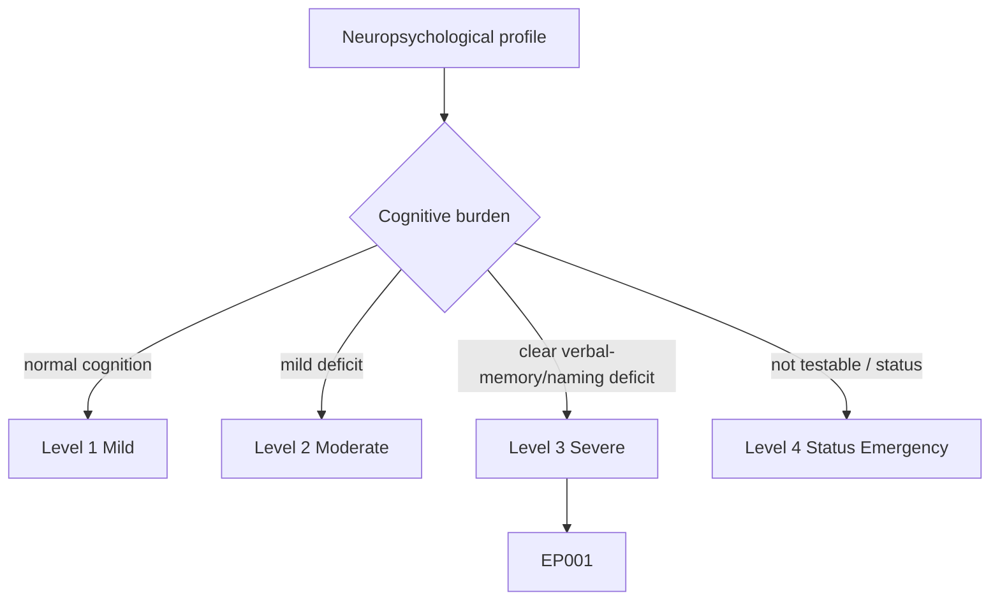
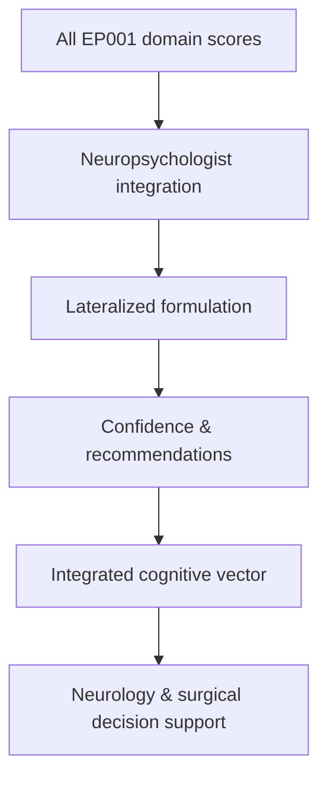
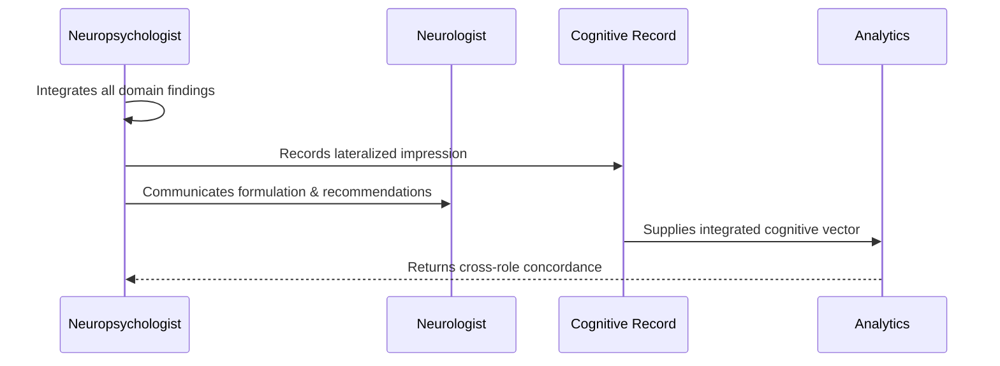
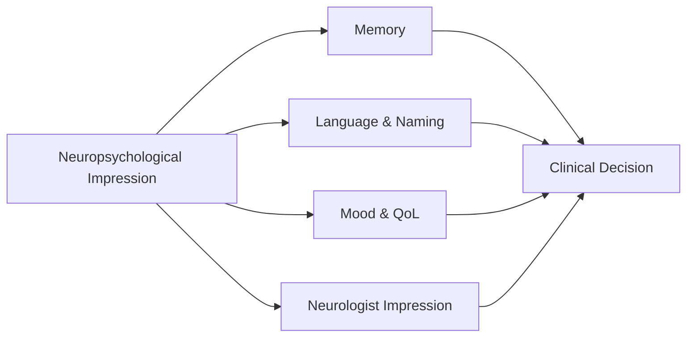
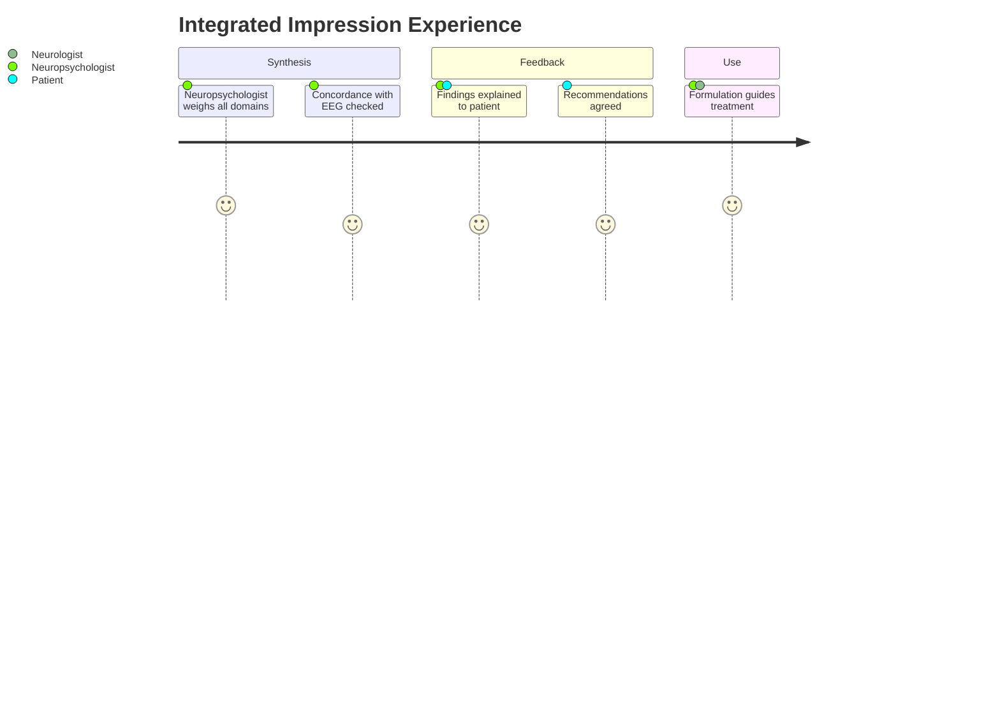

# Neuropsychologist Assessment — Section 8: Integrated Neuropsychological Impression (EP001)

> **Why (this doc):** The integrated impression synthesizes every cognitive, mood, and QoL domain into a single lateralized formulation with recommendations; it is the deliverable that converts test scores into clinical and surgical decisions. **How:** The neuropsychologist consolidates EP001's screening, memory, attention, executive, language, mood, and QoL findings into a fixed variable/value table capturing the integrated impression and its downstream actions.

**Problem:** Isolated test scores are non-actionable; without an integrated, lateralized formulation, the neurology and surgical teams cannot use neuropsychology to guide treatment.

**Research Objective:** Synthesize EP001's domain findings into a coherent left-temporal cognitive profile with mood/QoL context and concrete recommendations that feed clinical decision-making.

**Role:** Neuropsychologist · **Type:** Primary (cognitive) data

*Caption - Integrated neuropsychological impression for EP001, consolidating all domains into a lateralized formulation, confidence, and recommendation set. This is the neuropsychology deliverable to the clinical team.*

| Variable | Value |
|---|---|
| Global Screen (MoCA) | 26/30 (borderline) |
| Verbal Memory | Low Average (selectively weak) |
| Visual Memory | Average (preserved) |
| Verbal–Visual Dissociation | Present (verbal < visual) |
| Attention/Processing Speed | Low Average (ASM/sleep related) |
| Executive Function | Mild shifting/inhibition weakness |
| Confrontation Naming (BNT) | 48/60 (mild anomia) |
| Mood/Anxiety | GAD-7 = 9; BDI-II = 17; NDDI-E borderline |
| Quality of Life (QOLIE-31) | Moderately reduced |
| Lateralizing Formulation | Left (dominant) temporal profile |
| Confidence | Moderate–High (convergent) |
| Primary Recommendations | Verbal memory strategy training; mood referral; sleep/ASM review |

## Questionnaire (Enterprise Form)

*Caption - The items/tests the neuropsychologist administers for this section, with response type, validation, EP001's example score, and the derived AI feature.*

| ID | Question | Response Type | Validation | EP001 (Example) | AI Feature |
|---|---|---|---|---|---|
| NPS-0801 | Global screen (MoCA) summary? | Read-only(Auto) | MoCA 0-30 | 26/30 (borderline) | global_screen_moca |
| NPS-0802 | Verbal memory summary? | Dropdown[Impaired, Low Average, Average, Above Average] | Categorical | Low Average (selectively weak) | verbal_memory_summary |
| NPS-0803 | Visual memory summary? | Dropdown[Impaired, Low Average, Average, Above Average] | Categorical | Average (preserved) | visual_memory_summary |
| NPS-0804 | Verbal–visual dissociation present? | Dropdown[Absent, Emerging, Present] | Categorical | Present (verbal < visual) | verbal_visual_dissociation |
| NPS-0805 | Attention/processing speed summary? | Dropdown[Impaired, Low Average, Average, Above Average] | Categorical | Low Average (ASM/sleep related) | attention_speed_summary |
| NPS-0806 | Executive function summary? | Text | Free-text summary | Mild shifting/inhibition weakness | executive_summary |
| NPS-0807 | Confrontation naming (BNT) summary? | Read-only(Auto) | 0-60 | 48/60 (mild anomia) | confrontation_naming_summary |
| NPS-0808 | Mood/anxiety composite summary? | Read-only(Auto) | Composite scores | GAD-7 = 9; BDI-II = 17; NDDI-E borderline | mood_anxiety_summary |
| NPS-0809 | Quality of life (QOLIE-31) summary? | Dropdown[Good, Mildly reduced, Moderately reduced, Severely reduced] | Categorical | Moderately reduced | qol_summary |
| NPS-0810 | Lateralizing formulation? | Dropdown[No lateralizing deficit, Possible left-temporal, Left temporal, Right temporal] | Categorical | Left (dominant) temporal profile | lateralizing_formulation |
| NPS-0811 | Confidence in the formulation? | Dropdown[Low, Moderate, Moderate–High, High] | Categorical | Moderate–High (convergent) | formulation_confidence |
| NPS-0812 | Primary recommendations? | Text | Free-text list | Verbal memory strategy training; mood referral; sleep/ASM review | primary_recommendations |

## Severity Scenario Model — Neuropsychologist View

*Caption - The same cognitive assessment across four epilepsy severity levels from the neuropsychologist's point of view; each score shifts with severity. EP001 corresponds to Level 3 (Severe). Level 4 is the operational emergency — status epilepticus with seizures recurring about every 5 minutes.*

### Level 1 — Mild (Well-Controlled)

| Variable | Value |
|---|---|
| Global Screen (MoCA) | 30/30 (normal) |
| Verbal Memory | Average |
| Visual Memory | Average |
| Verbal–Visual Dissociation | Absent |
| Attention/Processing Speed | Average |
| Executive Function | Normal |
| Confrontation Naming (BNT) | 58/60 (WNL) |
| Mood/Anxiety | GAD-7 = 3; BDI-II = 6; NDDI-E negative |
| Quality of Life (QOLIE-31) | Good |
| Lateralizing Formulation | No lateralizing deficit |
| Confidence | High |
| Primary Recommendations | Routine monitoring |

### Level 2 — Moderate (Intermediate)

| Variable | Value |
|---|---|
| Global Screen (MoCA) | 28/30 (borderline) |
| Verbal Memory | Borderline-low |
| Visual Memory | Average |
| Verbal–Visual Dissociation | Emerging |
| Attention/Processing Speed | Average low |
| Executive Function | Mild dip |
| Confrontation Naming (BNT) | 53/60 (borderline) |
| Mood/Anxiety | GAD-7 = 6; BDI-II = 12; NDDI-E subthreshold |
| Quality of Life (QOLIE-31) | Mildly reduced |
| Lateralizing Formulation | Possible left-temporal (soft) |
| Confidence | Moderate |
| Primary Recommendations | Repeat testing; monitor mood |

### Level 3 — Severe (Poorly Controlled) — EP001

| Variable | Value |
|---|---|
| Global Screen (MoCA) | 26/30 (borderline) |
| Verbal Memory | Low Average (selectively weak) |
| Visual Memory | Average (preserved) |
| Verbal–Visual Dissociation | Present (verbal < visual) |
| Attention/Processing Speed | Low Average (ASM/sleep related) |
| Executive Function | Mild shifting/inhibition weakness |
| Confrontation Naming (BNT) | 48/60 (mild anomia) |
| Mood/Anxiety | GAD-7 = 9; BDI-II = 17; NDDI-E borderline |
| Quality of Life (QOLIE-31) | Moderately reduced |
| Lateralizing Formulation | Left (dominant) temporal profile |
| Confidence | Moderate–High (convergent) |
| Primary Recommendations | Verbal memory strategy training; mood referral; sleep/ASM review |

### Level 4 — Refractory / Status Epilepticus (Operational Emergency)

| Variable | Value |
|---|---|
| Global Screen (MoCA) | Not testable (deferred) |
| Verbal Memory | Not testable |
| Visual Memory | Not testable |
| Verbal–Visual Dissociation | Not computable |
| Attention/Processing Speed | Not measurable — impaired consciousness |
| Executive Function | Not testable |
| Confrontation Naming (BNT) | Not testable |
| Mood/Anxiety | Not self-reportable acutely |
| Quality of Life (QOLIE-31) | Not testable (deferred) |
| Lateralizing Formulation | Deferred pending stabilization |
| Confidence | N/A — assessment deferred |
| Primary Recommendations | Emergency seizure control; re-assess when stable; expect marked post-status impairment |

### Severity Classification Logic

**Reason:** To scale the integrated cognitive formulation across epilepsy severity from the neuropsychologist's view. **Why:** Because the lateralized impression and its confidence depend on the burden captured across all domains. **What is happening:** The formulation strengthens from "no deficit" to a convergent left-temporal profile, then becomes deferred at Level 4. **How it is happening:** Accumulating verbal-memory, naming, mood, and QoL burden sharpens lateralization until status epilepticus makes testing impossible. **Reference:** Baxendale & Thompson (2010).

## Data Flow in the Pipeline

**Reason:** To show where the integrated impression enters and travels through the pipeline. **Why:** Because clinical and surgical decisions consume the synthesized formulation, not raw scores. **What is happening:** Domain scores become a single lateralized impression with recommendations. **How it is happening:** The neuropsychologist weights convergent findings and forwards the formulation and actions. **Reference:** Baxendale & Thompson (2010).

## Role Capturing the Data

**Reason:** To make explicit who owns the integration. **Why:** Because the impression is the accountable neuropsychology deliverable to the team. **What is happening:** The neuropsychologist synthesizes and communicates a formulation to the neurologist. **How it is happening:** Weighted integration is transcribed, shared, and checked against clinical/EEG data. **Reference:** Fisher et al. (2017).

## Linkage to Other Assessment Sections

**Reason:** To show how the impression connects across the record. **Why:** Because it must reconcile with neurologist and EEG lateralization. **What is happening:** The impression links to component domains and the neurologist's impression and feeds the clinical decision. **How it is happening:** Shared patient keys and lateralization codes join the sections. **Reference:** Topol (2019).

## Patient and Role Experience

**Reason:** To surface the lived experience of receiving the impression. **Why:** Because feedback quality affects patient understanding and adherence to recommendations. **What is happening:** A synthesized formulation is shared and jointly acted on. **How it is happening:** Plain-language feedback plus agreed recommendations improve engagement. **Reference:** APA (2020).

## Professor Readiness (Defense Q&A)

**Q1: How confident is the left-temporal formulation?** Confidence is moderate–high because three independent signals converge — selective verbal-memory weakness, mild confrontation-naming anomia, and a verbal-below-visual dissociation — all consistent with the reported left-temporal seizure onset.

**Q2: How do you separate fixed deficit from modifiable factors?** Attention/processing-speed slowing, mild mood symptoms, and 5.2-hour sleep are flagged as modifiable contributors, so recommendations target ASM/sleep/mood review before attributing all weakness to the temporal focus.

**Q3: How does this impression support surgical decision-making?** Documented dominant-temporal verbal-memory and naming weakness quantifies the cognitive risk of a left-temporal resection, informing language mapping, counselling, and the risk-benefit discussion with the surgical team.

## References

American Psychological Association. (2020). *Publication manual of the American Psychological Association* (7th ed.). American Psychological Association. https://doi.org/10.1037/0000165-000

Baxendale, S., & Thompson, P. (2010). Beyond localization: The role of traditional neuropsychological tests in an age of imaging. *Epilepsia, 51*(11), 2225–2230. https://doi.org/10.1111/j.1528-1167.2010.02710.x

Fisher, R. S., Cross, J. H., French, J. A., Higurashi, N., Hirsch, E., Jansen, F. E., Lagae, L., Moshé, S. L., Peltola, J., Roulet Perez, E., Scheffer, I. E., & Zuberi, S. M. (2017). Operational classification of seizure types by the International League Against Epilepsy. *Epilepsia, 58*(4), 522–530. https://doi.org/10.1111/epi.13670
