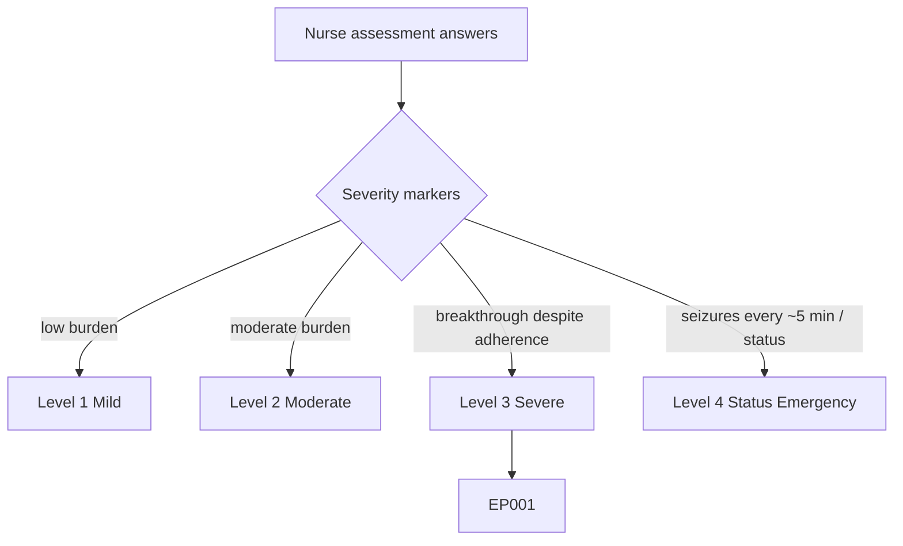
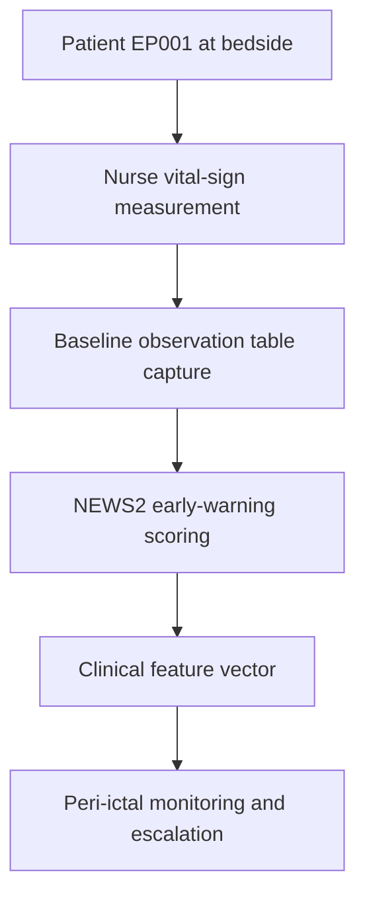
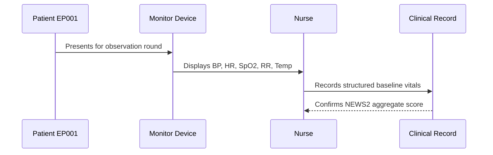
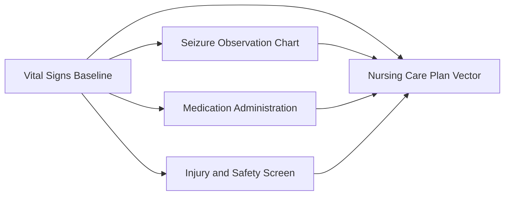
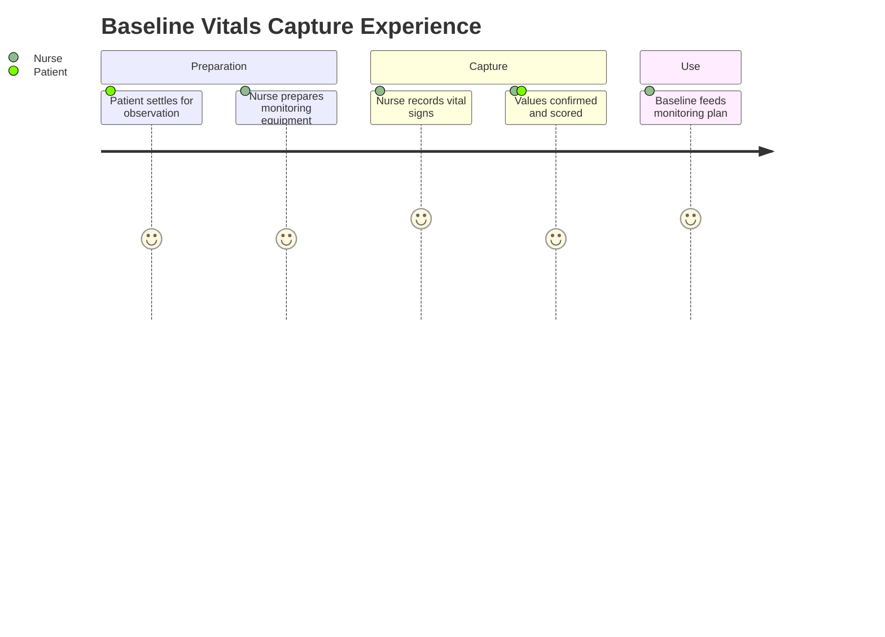

# Nurse Assessment — Section 1: Vital Signs & Baseline Observations (EP001)

> **Why (this doc):** Baseline vital signs are the nursing anchor of the epilepsy record; they establish the patient's physiological starting point, flag autonomic instability, and provide the comparison values needed to detect peri-ictal and post-ictal deterioration. **How:** The epilepsy nurse records structured baseline observations for patient EP001 into a fixed variable/value table that feeds the downstream clinical vector and monitoring pipeline.

**Problem:** Without a documented physiological baseline, nurses cannot reliably distinguish normal variation from peri-ictal deterioration or medication side effects in focal epilepsy.

**Research Objective:** Capture standardized, NEWS2-aligned baseline vital-sign variables for EP001 so peri-ictal changes and ASM tolerability can be reliably tracked against a known reference across the assessment.

**Role:** Nurse · **Type:** Primary (nursing) data

*Caption - Core baseline vital-sign variables for EP001, recorded by the epilepsy nurse. These values anchor peri-ictal monitoring, early-warning scoring, and medication-tolerability tracking for the rest of the nursing workup.*

| Variable | Value |
|---|---|
| Blood Pressure | 124/78 mmHg |
| Heart Rate | 72 bpm |
| Temperature | 36.7 C |
| Oxygen Saturation (SpO2) | 98% |
| Respiratory Rate | 16 /min |
| NEWS2 Aggregate Score | 0 (Low) |
| Weight | 78 kg |
| Height | 178 cm |
| BMI | 24.6 (Normal) |
| Pain Score (0-10) | 2 (post-ictal headache) |
| Level of Consciousness (ACVPU) | Alert |
| Capillary Blood Glucose | 5.4 mmol/L |

## Severity Scenario Model — Nurse View

*Caption - The same assessment answered across four epilepsy severity levels from the nurse's point of view; each variable shifts with severity. EP001 corresponds to Level 3 (Severe). Level 4 is the operational emergency — status epilepticus with seizures recurring about every 5 minutes.*

### Level 1 — Mild (Well-Controlled)
| Variable | Value |
|---|---|
| Blood Pressure | 118/74 mmHg |
| Heart Rate | 66 bpm |
| Temperature | 36.6 C |
| Oxygen Saturation (SpO2) | 99% |
| Respiratory Rate | 14 /min |
| NEWS2 Aggregate Score | 0 (Low) |
| Weight | 78 kg |
| Height | 178 cm |
| BMI | 24.6 (Normal) |
| Pain Score (0-10) | 0 |
| Level of Consciousness (ACVPU) | Alert |
| Capillary Blood Glucose | 5.0 mmol/L |

### Level 2 — Moderate (Intermediate)
| Variable | Value |
|---|---|
| Blood Pressure | 122/76 mmHg |
| Heart Rate | 78 bpm |
| Temperature | 36.7 C |
| Oxygen Saturation (SpO2) | 97% |
| Respiratory Rate | 16 /min |
| NEWS2 Aggregate Score | 1 (Low) |
| Weight | 78 kg |
| Height | 178 cm |
| BMI | 24.6 (Normal) |
| Pain Score (0-10) | 1 (occasional post-ictal) |
| Level of Consciousness (ACVPU) | Alert |
| Capillary Blood Glucose | 5.2 mmol/L |

### Level 3 — Severe (Poorly Controlled) — EP001
| Variable | Value |
|---|---|
| Blood Pressure | 124/78 mmHg |
| Heart Rate | 72 bpm |
| Temperature | 36.7 C |
| Oxygen Saturation (SpO2) | 98% |
| Respiratory Rate | 16 /min |
| NEWS2 Aggregate Score | 0 (Low) |
| Weight | 78 kg |
| Height | 178 cm |
| BMI | 24.6 (Normal) |
| Pain Score (0-10) | 2 (post-ictal headache) |
| Level of Consciousness (ACVPU) | Alert |
| Capillary Blood Glucose | 5.4 mmol/L |

### Level 4 — Refractory / Status Epilepticus (Operational Emergency)
| Variable | Value |
|---|---|
| Blood Pressure | 150/96 mmHg (rising) |
| Heart Rate | 124 bpm (tachycardic) |
| Temperature | 38.2 C (hyperthermia) |
| Oxygen Saturation (SpO2) | 87% (hypoxic — apply O2) |
| Respiratory Rate | 26 /min (peri-ictal) |
| NEWS2 Aggregate Score | 10+ (High — continuous monitoring) |
| Weight | 78 kg |
| Height | 178 cm |
| BMI | 24.6 (Normal) |
| Pain Score (0-10) | Not assessable (obtunded) |
| Level of Consciousness (ACVPU) | Unresponsive (P/U) |
| Capillary Blood Glucose | 4.1 mmol/L (recheck — exclude hypo) |

### Severity Classification Logic

**Reason:** To let the nurse read one physiological baseline across the full severity range. **Why:** Because the same vitals signify safety at Level 1 but a peri-arrest emergency at Level 4. **What is happening:** Stable baseline values deteriorate into tachycardia, hypoxia, and reduced consciousness as severity rises. **How it is happening:** The nurse continuously re-scores NEWS2 and applies oxygen and rapid-response escalation at Level 4. **Reference:** Fisher et al. (2017).

## Data Flow in the Pipeline

**Reason:** To show where baseline vital-sign data enters and travels through the epilepsy data pipeline. **Why:** Because peri-ictal deterioration can only be detected against a recorded physiological reference. **What is happening:** Raw bedside measurements become structured, scored variables that populate the clinical vector. **How it is happening:** The nurse measures each vital sign, records it in the fixed table, and the values are aggregated into a NEWS2 score and passed forward. **Reference:** Fisher et al. (2017).

## Role Capturing the Data

**Reason:** To make explicit which role captures each baseline observation. **Why:** Because provenance and timing of vitals are critical for peri-ictal interpretation. **What is happening:** The nurse integrates device readings and clinical judgment into a single verified record. **How it is happening:** Automated device output plus manual respiratory and consciousness assessment is transcribed into the record and scored. **Reference:** Topol (2019).

## Linkage to Other Assessment Sections

**Reason:** To show how baseline vitals connect to the wider nursing vector. **Why:** Because ASM tolerability and peri-ictal safety both depend on a shared physiological baseline. **What is happening:** Baseline vitals link laterally to observation, medication, and safety data and feed the composite care-plan vector. **How it is happening:** Shared patient identifiers and timestamps join these sections into one record. **Reference:** Topol (2019).

## Patient and Role Experience

**Reason:** To surface the lived experience of capturing baseline observations. **Why:** Because comfort and cooperation during rounds affect measurement accuracy. **What is happening:** Patient cooperation is shaped into a confirmed, usable baseline record. **How it is happening:** A calm bedside routine plus automated monitoring reduces measurement error and patient distress. **Reference:** APA (2020).

## Professor Readiness (Defense Q&A)

**Q1: Why record a physiological baseline before any seizure event?** Because peri-ictal and post-ictal deterioration (tachycardia, hypoxia, apnea) can only be identified as abnormal relative to a documented patient-specific reference, which also supports SUDEP-risk vigilance.

**Q2: Why use NEWS2 aggregate scoring for an epilepsy patient?** NEWS2 standardizes deterioration detection across staff and shifts, converting individual vitals into a single escalation trigger that reduces failure-to-rescue during post-ictal states.

**Q3: Why does the nurse capture SpO2 and respiratory rate specifically?** Peri-ictal respiratory compromise and hypoxia are implicated in SUDEP risk, so oxygenation and ventilation are the highest-value nursing observations around seizure activity.

## References

American Psychological Association. (2020). *Publication manual of the American Psychological Association* (7th ed.). American Psychological Association. https://doi.org/10.1037/0000165-000

Fisher, R. S., Cross, J. H., French, J. A., Higurashi, N., Hirsch, E., Jansen, F. E., Lagae, L., Moshé, S. L., Peltola, J., Roulet Perez, E., Scheffer, I. E., & Zuberi, S. M. (2017). Operational classification of seizure types by the International League Against Epilepsy. *Epilepsia, 58*(4), 522–530. https://doi.org/10.1111/epi.13670

Topol, E. J. (2019). *Deep medicine: How artificial intelligence can make healthcare human again*. Basic Books.
