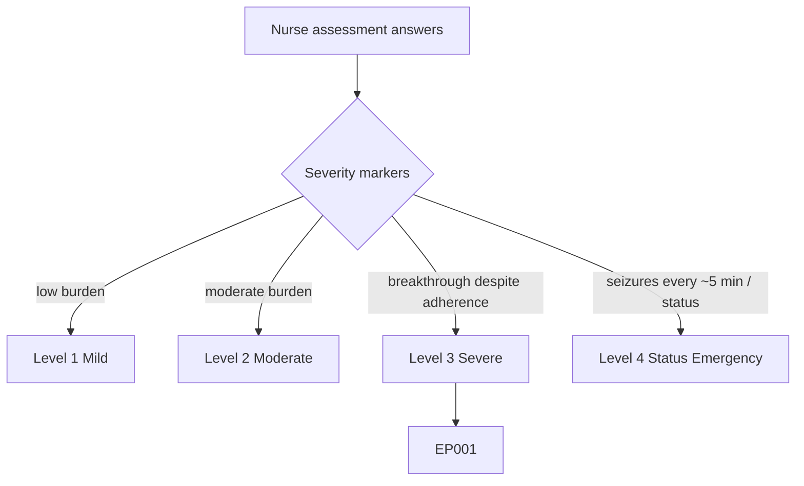
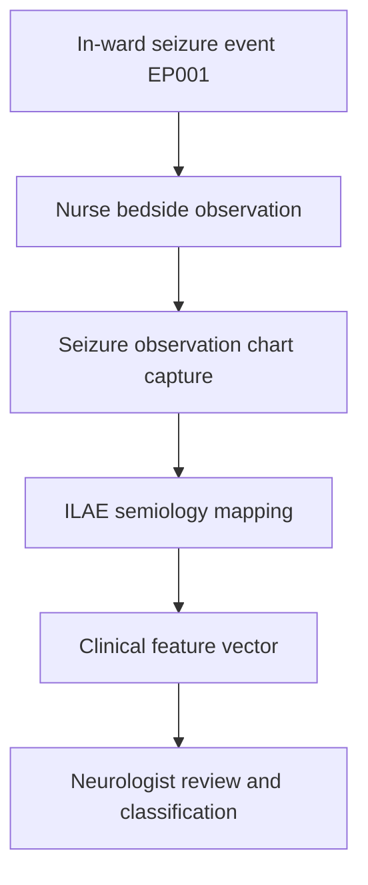
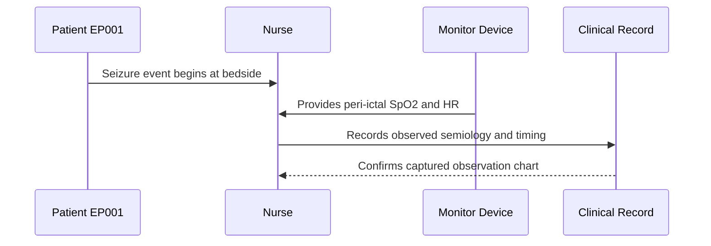
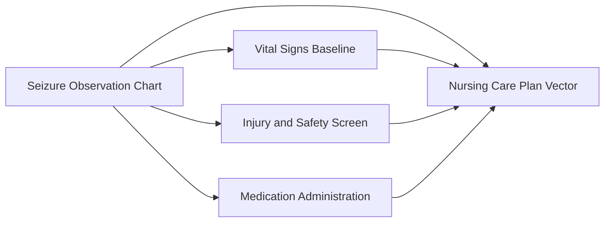
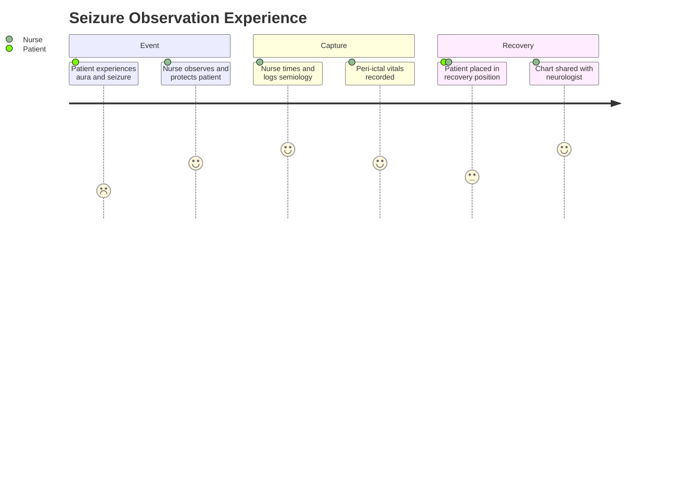

# Nurse Assessment — Section 2: Seizure Observation Chart (EP001)

> **Why (this doc):** The nursing seizure observation chart is the real-time, witnessed record of in-ward events; it captures objective semiology, timing, and peri-ictal vitals that the patient cannot self-report, complementing the neurologist's history. **How:** The epilepsy nurse logs each observed seizure for patient EP001 into a fixed variable/value table that feeds the downstream clinical vector and analytics pipeline.

**Problem:** Retrospective, patient-reported seizure counts are recall-biased; without a witnessed nursing observation chart, in-ward seizure semiology and duration are lost.

**Research Objective:** Capture standardized, ILAE-aligned witnessed seizure-observation variables for EP001 so objective in-ward event data can be reliably linked to diagnostic and therapeutic records.

**Role:** Nurse · **Type:** Primary (nursing) data

*Caption - Core witnessed seizure-observation variables for EP001, recorded by the epilepsy nurse during an in-ward event. These values provide objective semiology and timing that anchor classification and peri-ictal safety review.*

| Variable | Value |
|---|---|
| Observed Event Date/Time | 2026-07-10 03:14 |
| Seizure Type (observed) | Focal Impaired Awareness |
| Onset Lateralization Signs | Left temporal (right-hand automatisms) |
| Duration (observed) | 85 sec |
| Aura Reported Before | Metallic taste, déjà vu |
| Motor Features | Lip-smacking, right-hand fumbling |
| Awareness During | Impaired (unresponsive to voice) |
| Head/Eye Deviation | Rightward |
| Incontinence | No |
| Tongue Biting | Lateral (minor) |
| Post-Ictal Duration | 12 min |
| Peri-Ictal SpO2 (lowest) | 93% |
| Recovery Position Applied | Yes |
| Witnessed By | Night-shift nurse |

## Severity Scenario Model — Nurse View

*Caption - The same assessment answered across four epilepsy severity levels from the nurse's point of view; each variable shifts with severity. EP001 corresponds to Level 3 (Severe). Level 4 is the operational emergency — status epilepticus with seizures recurring about every 5 minutes.*

### Level 1 — Mild (Well-Controlled)
| Variable | Value |
|---|---|
| Observed Event Date/Time | None this admission |
| Seizure Type (observed) | Not observed (<1/yr) |
| Onset Lateralization Signs | Not applicable |
| Duration (observed) | Not applicable |
| Aura Reported Before | None |
| Motor Features | None observed |
| Awareness During | Preserved |
| Head/Eye Deviation | None |
| Incontinence | No |
| Tongue Biting | No |
| Post-Ictal Duration | Not applicable |
| Peri-Ictal SpO2 (lowest) | 98% |
| Recovery Position Applied | Not required |
| Witnessed By | Routine observation only |

### Level 2 — Moderate (Intermediate)
| Variable | Value |
|---|---|
| Observed Event Date/Time | 2026-07-08 22:40 |
| Seizure Type (observed) | Focal Aware |
| Onset Lateralization Signs | Subtle (right-hand) |
| Duration (observed) | 45 sec |
| Aura Reported Before | Metallic taste |
| Motor Features | Brief lip-smacking |
| Awareness During | Partially preserved |
| Head/Eye Deviation | Minimal |
| Incontinence | No |
| Tongue Biting | No |
| Post-Ictal Duration | 4 min |
| Peri-Ictal SpO2 (lowest) | 96% |
| Recovery Position Applied | Precautionary |
| Witnessed By | Day-shift nurse |

### Level 3 — Severe (Poorly Controlled) — EP001
| Variable | Value |
|---|---|
| Observed Event Date/Time | 2026-07-10 03:14 |
| Seizure Type (observed) | Focal Impaired Awareness |
| Onset Lateralization Signs | Left temporal (right-hand automatisms) |
| Duration (observed) | 85 sec |
| Aura Reported Before | Metallic taste, déjà vu |
| Motor Features | Lip-smacking, right-hand fumbling |
| Awareness During | Impaired (unresponsive to voice) |
| Head/Eye Deviation | Rightward |
| Incontinence | No |
| Tongue Biting | Lateral (minor) |
| Post-Ictal Duration | 12 min |
| Peri-Ictal SpO2 (lowest) | 93% |
| Recovery Position Applied | Yes |
| Witnessed By | Night-shift nurse |

### Level 4 — Refractory / Status Epilepticus (Operational Emergency)
| Variable | Value |
|---|---|
| Observed Event Date/Time | 2026-07-10 04:02 (ongoing) |
| Seizure Type (observed) | Focal to bilateral tonic-clonic, recurring |
| Onset Lateralization Signs | Left temporal, secondarily generalized |
| Duration (observed) | Recurring every ~5 min, no full recovery |
| Aura Reported Before | Not reportable (obtunded) |
| Motor Features | Generalized convulsion, jerking |
| Awareness During | Absent between events |
| Head/Eye Deviation | Sustained rightward |
| Incontinence | Yes |
| Tongue Biting | Deep lateral |
| Post-Ictal Duration | No return to baseline (status) |
| Peri-Ictal SpO2 (lowest) | 84% (O2 + suction applied) |
| Recovery Position Applied | Yes + airway support, rapid response called |
| Witnessed By | Nurse + resuscitation team (buccal midazolam given) |

### Severity Classification Logic

**Reason:** To let the nurse read observed seizure semiology across the full severity range. **Why:** Because event frequency, duration, and recovery are the sharpest severity discriminators the nurse witnesses. **What is happening:** Brief self-limiting events at Level 1 escalate to non-recovering recurrent convulsions at Level 4. **How it is happening:** The nurse times events, tracks SpO2, and at Level 4 administers buccal midazolam and calls rapid response. **Reference:** Fisher et al. (2017).

## Data Flow in the Pipeline

**Reason:** To show where witnessed seizure-observation data enters and travels through the epilepsy data pipeline. **Why:** Because objective in-ward semiology corroborates or corrects patient-reported history. **What is happening:** Raw observed events become structured, classified variables that populate the clinical vector. **How it is happening:** The nurse witnesses the event, records timing and semiology in the fixed table, and the values are mapped to ILAE categories and passed forward. **Reference:** Fisher et al. (2017).

## Role Capturing the Data

**Reason:** To make explicit which role captures each observed element. **Why:** Because witnessed provenance is what distinguishes objective from self-reported seizure data. **What is happening:** The nurse integrates direct observation and monitor data into a single verified record. **How it is happening:** Real-time bedside observation plus device readings are transcribed and time-stamped into the record. **Reference:** Fisher et al. (2017).

## Linkage to Other Assessment Sections

**Reason:** To show how the observation chart connects to the wider nursing vector. **Why:** Because observed seizures drive peri-ictal vitals interpretation, injury screening, and PRN medication decisions. **What is happening:** The chart links laterally to baseline, safety, and medication data and feeds the composite care-plan vector. **How it is happening:** Shared patient identifiers and event timestamps join these sections into one record. **Reference:** Topol (2019).

## Patient and Role Experience

**Reason:** To surface the lived experience of witnessing and capturing a seizure. **Why:** Because the patient is impaired during the event and depends entirely on nursing observation. **What is happening:** An unwitnessable-by-patient event is converted into a confirmed, usable record. **How it is happening:** Structured bedside observation and monitoring fill the recall gap the patient cannot. **Reference:** APA (2020).

## Professor Readiness (Defense Q&A)

**Q1: Why is a nursing observation chart more reliable than patient recall for in-ward events?** Because impaired-awareness seizures render the patient unable to self-observe; the witnessed nursing record captures objective semiology, precise timing, and peri-ictal vitals that patient recall cannot provide.

**Q2: Why record lateralizing signs like head deviation and hand automatisms?** Lateralizing and localizing signs (rightward deviation, right-hand automatisms) support a left-temporal onset hypothesis and help the neurologist correlate semiology with EEG and imaging.

**Q3: Why log the lowest peri-ictal SpO2?** Peri-ictal hypoxia is a modifiable SUDEP-risk marker, so documenting oxygen desaturation triggers oxygen therapy and informs the neurologist's risk assessment.

## References

American Psychological Association. (2020). *Publication manual of the American Psychological Association* (7th ed.). American Psychological Association. https://doi.org/10.1037/0000165-000

Fisher, R. S., Cross, J. H., French, J. A., Higurashi, N., Hirsch, E., Jansen, F. E., Lagae, L., Moshé, S. L., Peltola, J., Roulet Perez, E., Scheffer, I. E., & Zuberi, S. M. (2017). Operational classification of seizure types by the International League Against Epilepsy. *Epilepsia, 58*(4), 522–530. https://doi.org/10.1111/epi.13670

Topol, E. J. (2019). *Deep medicine: How artificial intelligence can make healthcare human again*. Basic Books.
