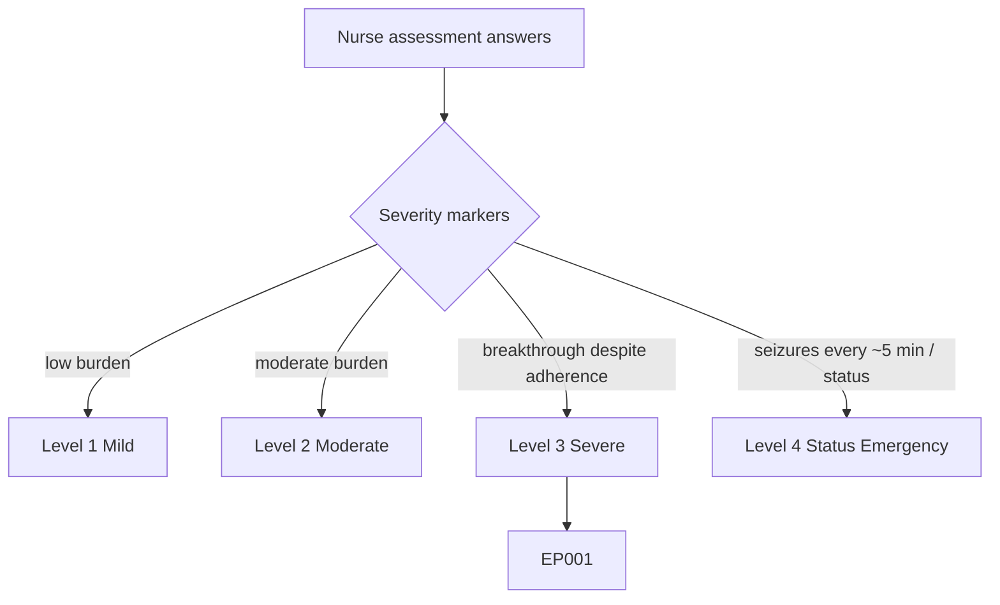
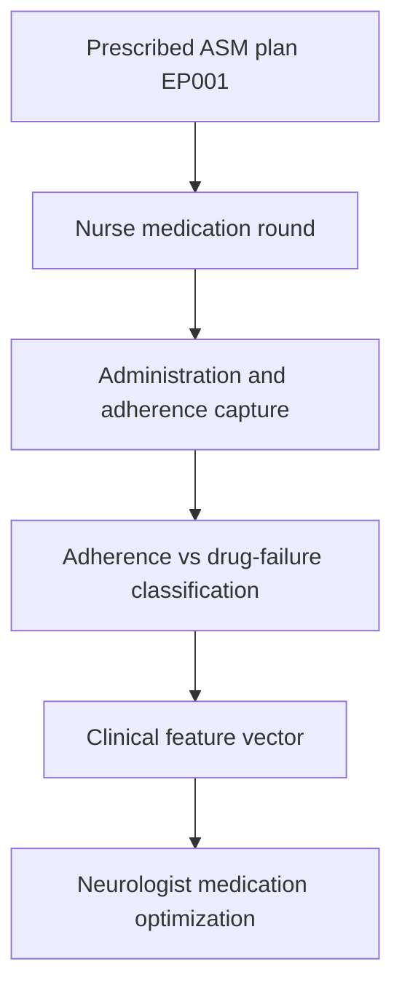
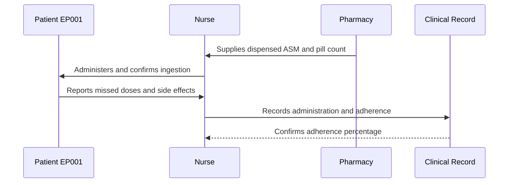
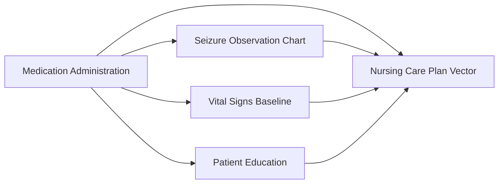
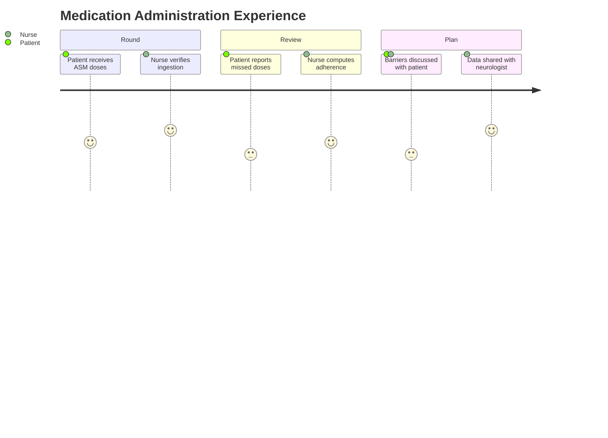

# Nurse Assessment — Section 3: Medication Administration & Adherence Check (EP001)

> **Why (this doc):** ASM administration and adherence are the nursing safeguard of the treatment plan; accurate dosing, timing, and adherence verification determine whether therapeutic drug levels are achieved and whether breakthrough seizures reflect drug failure or missed doses. **How:** The epilepsy nurse records structured medication-administration variables for patient EP001 into a fixed variable/value table that feeds the downstream clinical vector and analytics pipeline.

**Problem:** Ambiguity between true drug failure and non-adherence leads to inappropriate ASM escalation; without a nursing administration and adherence record, the cause of breakthrough seizures cannot be resolved.

**Research Objective:** Capture standardized ASM administration, timing, and adherence variables for EP001 so breakthrough events can be attributed to either pharmacological failure or missed doses across the assessment.

**Role:** Nurse · **Type:** Primary (nursing) data

*Caption - Core medication-administration and adherence variables for EP001, recorded by the epilepsy nurse. These values distinguish drug failure from non-adherence and anchor therapeutic-level and side-effect review.*

| Variable | Value |
|---|---|
| ASM 1 | Carbamazepine 400 mg BID |
| ASM 2 | Levetiracetam 500 mg BID |
| Administration Route | Oral |
| Morning Dose Given | Yes (08:00) |
| Evening Dose Given | Yes (20:00) |
| Doses Missed (last 30 days) | 7 |
| Measured Adherence | 88% |
| Adherence Method | Pill count + self-report |
| Last Serum Level Check | Carbamazepine 7.2 mg/L (therapeutic) |
| Reported Side Effects | Dizziness, mild drowsiness |
| PRN/Rescue Medication | Buccal midazolam (available, not used) |
| Barriers to Adherence | Shift work, forgetfulness |
| Patient Self-Admin Capable | Yes (supervised) |

## Questionnaire (Enterprise Form)

*Caption - The questions/observations the nurse records for this section, with response type, validation, EP001's example value, and the derived AI feature.*

| ID | Question | Response Type | Validation | EP001 (Example) | AI Feature |
|---|---|---|---|---|---|
| NUR-0301 | What is the first ASM and dose? | Text | Drug name + dose + frequency | Carbamazepine 400 mg BID | asm_1_regimen |
| NUR-0302 | What is the second ASM and dose? | Text | Drug name + dose + frequency, or "None" | Levetiracetam 500 mg BID | asm_2_regimen |
| NUR-0303 | What is the administration route? | Dropdown[Oral, IV, Buccal, IV / buccal] | Allowed set only | Oral | administration_route |
| NUR-0304 | Was the morning dose given (and when)? | Yes-No | Yes/No + time HH:MM (or Withheld) | Yes (08:00) | morning_dose_given |
| NUR-0305 | Was the evening dose given (and when)? | Yes-No | Yes/No + time HH:MM (or Withheld) | Yes (20:00) | evening_dose_given |
| NUR-0306 | How many doses were missed in the last 30 days? | Number | 0-60 | 7 | doses_missed_30d |
| NUR-0307 | What is the measured adherence percentage? | Number | 0-100 % | 88% | measured_adherence_pct |
| NUR-0308 | What method was used to assess adherence? | Dropdown[Self-report, Pill count + self-report, Self-report + app reminder, Emergency medication chart] | Allowed set only | Pill count + self-report | adherence_method |
| NUR-0309 | What was the last serum ASM level check? | Text | Drug + level (mg/L) + interpretation | Carbamazepine 7.2 mg/L (therapeutic) | last_serum_level |
| NUR-0310 | What side effects were reported? | Text | Free text or "None" | Dizziness, mild drowsiness | reported_side_effects |
| NUR-0311 | What PRN/rescue medication is in place? | Text | Drug + status (available/given) | Buccal midazolam (available, not used) | prn_rescue_medication |
| NUR-0312 | What are the barriers to adherence? | Text | Free text or "None" | Shift work, forgetfulness | adherence_barriers |
| NUR-0313 | Is the patient capable of self-administration? | Dropdown[Yes (independent), Yes (supervised), No (fully dependent)] | Allowed set only | Yes (supervised) | self_admin_capable |

## Severity Scenario Model — Nurse View

*Caption - The same assessment answered across four epilepsy severity levels from the nurse's point of view; each variable shifts with severity. EP001 corresponds to Level 3 (Severe). Level 4 is the operational emergency — status epilepticus with seizures recurring about every 5 minutes.*

### Level 1 — Mild (Well-Controlled)
| Variable | Value |
|---|---|
| ASM 1 | Levetiracetam 500 mg BID (monotherapy) |
| ASM 2 | None |
| Administration Route | Oral |
| Morning Dose Given | Yes (08:00) |
| Evening Dose Given | Yes (20:00) |
| Doses Missed (last 30 days) | 0 |
| Measured Adherence | 100% |
| Adherence Method | Self-report |
| Last Serum Level Check | Not required (seizure-free) |
| Reported Side Effects | None |
| PRN/Rescue Medication | Not prescribed |
| Barriers to Adherence | None |
| Patient Self-Admin Capable | Yes (independent) |

### Level 2 — Moderate (Intermediate)
| Variable | Value |
|---|---|
| ASM 1 | Carbamazepine 200 mg BID |
| ASM 2 | Levetiracetam 500 mg BID |
| Administration Route | Oral |
| Morning Dose Given | Yes (08:00) |
| Evening Dose Given | Yes (20:00) |
| Doses Missed (last 30 days) | 2 |
| Measured Adherence | 95% |
| Adherence Method | Self-report + app reminder |
| Last Serum Level Check | Carbamazepine 6.0 mg/L (therapeutic) |
| Reported Side Effects | Mild drowsiness |
| PRN/Rescue Medication | Buccal midazolam (available, not used) |
| Barriers to Adherence | Occasional forgetfulness |
| Patient Self-Admin Capable | Yes (independent) |

### Level 3 — Severe (Poorly Controlled) — EP001
| Variable | Value |
|---|---|
| ASM 1 | Carbamazepine 400 mg BID |
| ASM 2 | Levetiracetam 500 mg BID |
| Administration Route | Oral |
| Morning Dose Given | Yes (08:00) |
| Evening Dose Given | Yes (20:00) |
| Doses Missed (last 30 days) | 7 |
| Measured Adherence | 88% |
| Adherence Method | Pill count + self-report |
| Last Serum Level Check | Carbamazepine 7.2 mg/L (therapeutic) |
| Reported Side Effects | Dizziness, mild drowsiness |
| PRN/Rescue Medication | Buccal midazolam (available, not used) |
| Barriers to Adherence | Shift work, forgetfulness |
| Patient Self-Admin Capable | Yes (supervised) |

### Level 4 — Refractory / Status Epilepticus (Operational Emergency)
| Variable | Value |
|---|---|
| ASM 1 | Carbamazepine 400 mg BID (oral held — unsafe to swallow) |
| ASM 2 | Levetiracetam IV loading dose per protocol |
| Administration Route | IV / buccal (nurse-administered emergency) |
| Morning Dose Given | Withheld (obtunded) |
| Evening Dose Given | Withheld (obtunded) |
| Doses Missed (last 30 days) | Not applicable (acute event) |
| Measured Adherence | Not applicable during emergency |
| Adherence Method | Emergency medication chart |
| Last Serum Level Check | Urgent level sent with bloods |
| Reported Side Effects | Not reportable (obtunded) |
| PRN/Rescue Medication | Buccal midazolam GIVEN; IV benzodiazepine by team |
| Barriers to Adherence | Airway/consciousness — no oral route |
| Patient Self-Admin Capable | No (fully dependent) |

### Severity Classification Logic

**Reason:** To let the nurse read medication administration across the full severity range. **Why:** Because the route, urgency, and dependence of dosing change fundamentally as severity rises. **What is happening:** Independent oral monotherapy at Level 1 becomes nurse-administered IV/buccal emergency dosing at Level 4. **How it is happening:** The nurse escalates from routine rounds to withholding the oral route and giving buccal midazolam plus team-led IV benzodiazepine in status. **Reference:** Fisher et al. (2017).

## Data Flow in the Pipeline

**Reason:** To show where medication-administration data enters and travels through the epilepsy data pipeline. **Why:** Because treatment decisions depend on separating non-adherence from genuine drug failure. **What is happening:** Raw dosing events become structured, classified adherence variables that populate the clinical vector. **How it is happening:** The nurse administers and verifies each dose, records it in the fixed table, and adherence is computed and passed forward. **Reference:** Fisher et al. (2017).

## Role Capturing the Data

**Reason:** To make explicit which role captures each medication element. **Why:** Because dosing accountability and adherence provenance are essential for safe optimization. **What is happening:** The nurse integrates pharmacy pill counts and patient report into a single verified record. **How it is happening:** Directly observed administration plus reconciliation of pill counts is transcribed into the record. **Reference:** Topol (2019).

## Linkage to Other Assessment Sections

**Reason:** To show how medication administration connects to the wider nursing vector. **Why:** Because adherence data must be read alongside observed seizures, side-effect vitals, and education needs. **What is happening:** Administration data links laterally to observation, vitals, and education and feeds the composite care-plan vector. **How it is happening:** Shared patient identifiers and dose timestamps join these sections into one record. **Reference:** Topol (2019).

## Patient and Role Experience

**Reason:** To surface the lived experience of medication administration. **Why:** Because adherence honesty and side-effect disclosure depend on a supportive nursing relationship. **What is happening:** Patient dosing behavior is shaped into a confirmed, usable adherence record. **How it is happening:** A non-judgmental medication round plus pill-count reconciliation improves disclosure accuracy. **Reference:** APA (2020).

## Professor Readiness (Defense Q&A)

**Q1: Why does the nurse verify adherence rather than rely on the prescription alone?** Because a prescription only records intent; measured adherence (88% via pill count plus self-report) reveals actual exposure and distinguishes non-adherence from true drug failure before ASMs are escalated.

**Q2: Why check serum ASM levels alongside adherence?** A therapeutic carbamazepine level with continued breakthrough seizures despite good adherence points toward pharmacological failure rather than under-dosing, directing the neurologist toward regimen change rather than dose increase.

**Q3: Why document rescue medication availability even when unused?** Documented, ready buccal midazolam ensures rapid response to prolonged or clustered seizures and confirms the patient's seizure-emergency plan is operational.

## References

American Psychological Association. (2020). *Publication manual of the American Psychological Association* (7th ed.). American Psychological Association. https://doi.org/10.1037/0000165-000

Fisher, R. S., Cross, J. H., French, J. A., Higurashi, N., Hirsch, E., Jansen, F. E., Lagae, L., Moshé, S. L., Peltola, J., Roulet Perez, E., Scheffer, I. E., & Zuberi, S. M. (2017). Operational classification of seizure types by the International League Against Epilepsy. *Epilepsia, 58*(4), 522–530. https://doi.org/10.1111/epi.13670

Topol, E. J. (2019). *Deep medicine: How artificial intelligence can make healthcare human again*. Basic Books.
