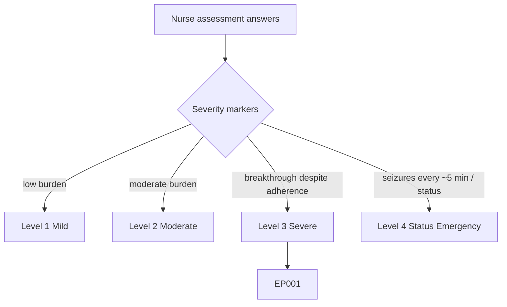
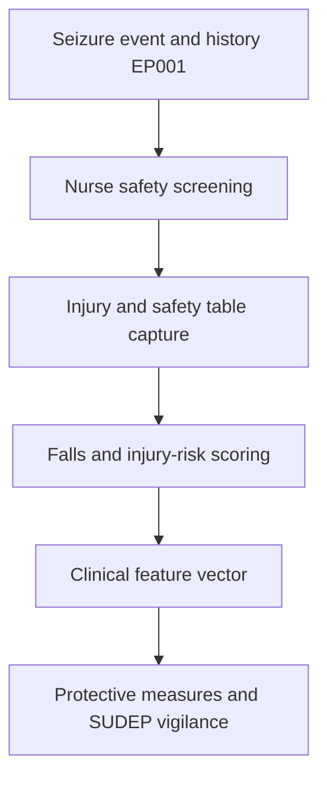
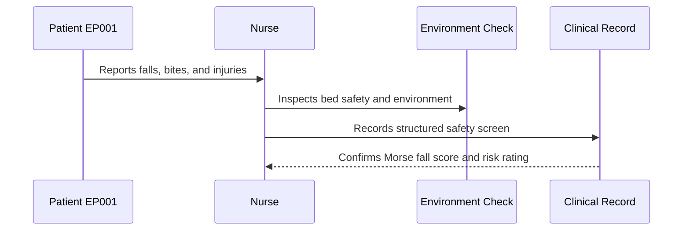
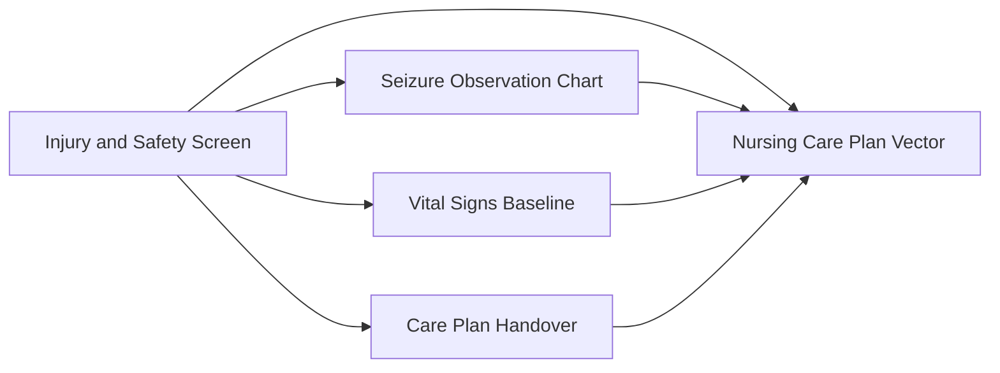
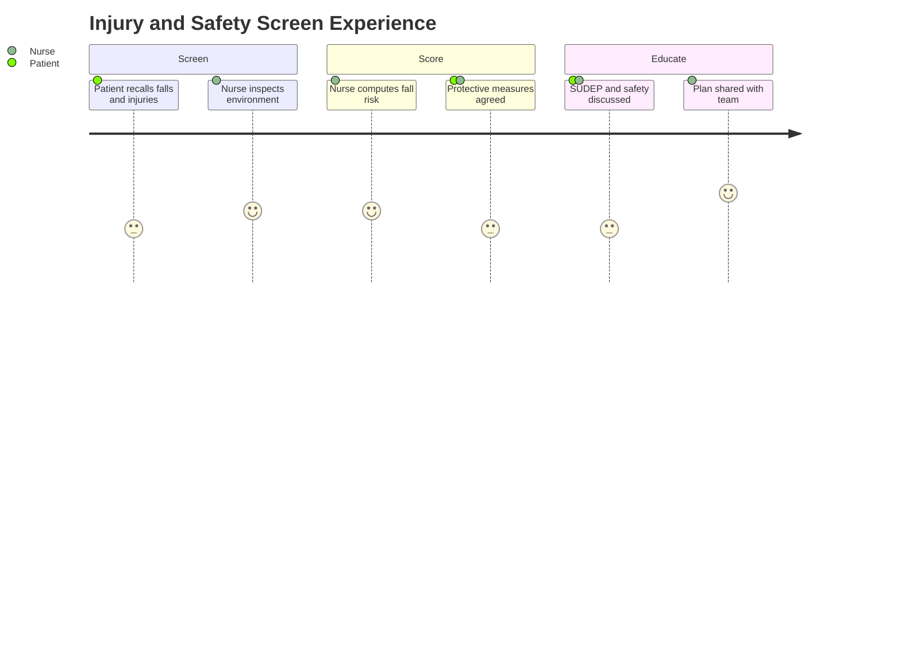

# Nurse Assessment — Section 4: Injury & Safety Screen (EP001)

> **Why (this doc):** The nursing injury and safety screen quantifies seizure-related harm risk; falls, tongue-bite, incontinence, and injury history determine bed-safety measures, supervision level, and SUDEP-risk vigilance. **How:** The epilepsy nurse records structured injury and safety variables for patient EP001 into a fixed variable/value table that feeds the downstream clinical vector and safety pipeline.

**Problem:** Unscreened seizure-related injury risk leads to preventable falls, aspiration, and status events; without a structured nursing safety screen, protective measures are inconsistent.

**Research Objective:** Capture standardized falls, injury, and safety variables for EP001 so risk-proportionate protective measures and SUDEP-risk flags can be reliably assigned across the assessment.

**Role:** Nurse · **Type:** Primary (nursing) data

*Caption - Core injury and safety-screen variables for EP001, recorded by the epilepsy nurse. These values drive supervision level, bed-safety measures, and injury-prevention planning for the rest of the nursing workup.*

| Variable | Value |
|---|---|
| Falls (last 12 months) | 1 |
| Fall Injury Severity | Moderate (bruising, no fracture) |
| Tongue/Cheek Biting | Yes (lateral, minor) |
| Incontinence During Seizure | No |
| Burns/Scalds History | No |
| Head Injury from Seizure | No |
| Injury Risk Rating | Moderate |
| Morse Fall Scale Score | 45 (Moderate) |
| Bed Rails / Padding | Padded rails in place |
| Supervision Level | Intermittent (15-min checks) |
| Driving Status | Restricted |
| Bathing Supervision Advised | Yes (shower, not bath) |
| SUDEP Risk Discussed | Yes |
| Safe Environment Checklist | Completed |

## Severity Scenario Model — Nurse View

*Caption - The same assessment answered across four epilepsy severity levels from the nurse's point of view; each variable shifts with severity. EP001 corresponds to Level 3 (Severe). Level 4 is the operational emergency — status epilepticus with seizures recurring about every 5 minutes.*

### Level 1 — Mild (Well-Controlled)
| Variable | Value |
|---|---|
| Falls (last 12 months) | 0 |
| Fall Injury Severity | None |
| Tongue/Cheek Biting | No |
| Incontinence During Seizure | No |
| Burns/Scalds History | No |
| Head Injury from Seizure | No |
| Injury Risk Rating | Low |
| Morse Fall Scale Score | 15 (Low) |
| Bed Rails / Padding | Not required |
| Supervision Level | Routine |
| Driving Status | Permitted (seizure-free criteria met) |
| Bathing Supervision Advised | No |
| SUDEP Risk Discussed | Yes (low risk) |
| Safe Environment Checklist | Completed |

### Level 2 — Moderate (Intermediate)
| Variable | Value |
|---|---|
| Falls (last 12 months) | 0 |
| Fall Injury Severity | None |
| Tongue/Cheek Biting | Occasional (minor) |
| Incontinence During Seizure | No |
| Burns/Scalds History | No |
| Head Injury from Seizure | No |
| Injury Risk Rating | Low-Moderate |
| Morse Fall Scale Score | 30 (Low-Moderate) |
| Bed Rails / Padding | One rail up |
| Supervision Level | Standard |
| Driving Status | Conditional (under review) |
| Bathing Supervision Advised | Shower preferred |
| SUDEP Risk Discussed | Yes |
| Safe Environment Checklist | Completed |

### Level 3 — Severe (Poorly Controlled) — EP001
| Variable | Value |
|---|---|
| Falls (last 12 months) | 1 |
| Fall Injury Severity | Moderate (bruising, no fracture) |
| Tongue/Cheek Biting | Yes (lateral, minor) |
| Incontinence During Seizure | No |
| Burns/Scalds History | No |
| Head Injury from Seizure | No |
| Injury Risk Rating | Moderate |
| Morse Fall Scale Score | 45 (Moderate) |
| Bed Rails / Padding | Padded rails in place |
| Supervision Level | Intermittent (15-min checks) |
| Driving Status | Restricted |
| Bathing Supervision Advised | Yes (shower, not bath) |
| SUDEP Risk Discussed | Yes |
| Safe Environment Checklist | Completed |

### Level 4 — Refractory / Status Epilepticus (Operational Emergency)
| Variable | Value |
|---|---|
| Falls (last 12 months) | 3+ (recurrent, injurious) |
| Fall Injury Severity | High (laceration/head-strike risk) |
| Tongue/Cheek Biting | Deep lateral (this event) |
| Incontinence During Seizure | Yes |
| Burns/Scalds History | Under review |
| Head Injury from Seizure | Yes — cervical/head protection applied |
| Injury Risk Rating | Very High |
| Morse Fall Scale Score | 65+ (High) |
| Bed Rails / Padding | Full padding, floor-level safety, suction ready |
| Supervision Level | Continuous 1:1 (rapid-response team) |
| Driving Status | Prohibited |
| Bathing Supervision Advised | Full assistance (bed care only) |
| SUDEP Risk Discussed | Yes — high risk, escalated |
| Safe Environment Checklist | Emergency safety measures active |

### Severity Classification Logic

**Reason:** To let the nurse read injury and safety risk across the full severity range. **Why:** Because supervision intensity and protective measures must scale with documented harm risk. **What is happening:** Low-risk routine safety at Level 1 escalates to continuous 1:1 airway and injury protection at Level 4. **How it is happening:** The nurse raises Morse-driven precautions, padding, and supervision, and activates 1:1 emergency safety in status. **Reference:** Fisher et al. (2017).

## Data Flow in the Pipeline

**Reason:** To show where injury and safety data enters and travels through the epilepsy data pipeline. **Why:** Because protective measures must be proportionate to a scored, documented risk. **What is happening:** Raw injury history becomes structured, scored risk variables that populate the clinical vector. **How it is happening:** The nurse screens for each harm type, records it in the fixed table, and risk is scored and passed forward. **Reference:** Fisher et al. (2017).

## Role Capturing the Data

**Reason:** To make explicit which role captures each safety element. **Why:** Because supervision decisions require documented provenance and accountability. **What is happening:** The nurse integrates patient report and environmental inspection into a single verified record. **How it is happening:** Structured screening plus a bedside environment check is transcribed and scored into the record. **Reference:** Topol (2019).

## Linkage to Other Assessment Sections

**Reason:** To show how the safety screen connects to the wider nursing vector. **Why:** Because observed seizures and vitals directly inform injury risk and supervision level. **What is happening:** The safety screen links laterally to observation, vitals, and handover data and feeds the composite care-plan vector. **How it is happening:** Shared patient identifiers and risk scores join these sections into one record. **Reference:** Topol (2019).

## Patient and Role Experience

**Reason:** To surface the lived experience of safety screening. **Why:** Because frank disclosure of injuries and acceptance of restrictions depend on sensitive communication. **What is happening:** Patient injury history is shaped into a confirmed, actionable safety record. **How it is happening:** A supportive screen plus environmental inspection balances safety with patient autonomy. **Reference:** APA (2020).

## Professor Readiness (Defense Q&A)

**Q1: Why score falls with a validated tool like the Morse Fall Scale?** Because a standardized score (45, moderate) converts subjective injury history into a reproducible risk level that reliably triggers proportionate supervision and bed-safety measures across staff and shifts.

**Q2: Why advise showering rather than bathing for an epilepsy patient?** Because impaired-awareness seizures during immersion carry drowning risk; showering with supervision markedly reduces this hazard while preserving independence.

**Q3: Why document that SUDEP risk was discussed?** Because SUDEP counselling is a recognized nursing responsibility; documenting the discussion evidences informed safety planning and prompts adherence and nocturnal-monitoring interventions.

## References

American Psychological Association. (2020). *Publication manual of the American Psychological Association* (7th ed.). American Psychological Association. https://doi.org/10.1037/0000165-000

Fisher, R. S., Cross, J. H., French, J. A., Higurashi, N., Hirsch, E., Jansen, F. E., Lagae, L., Moshé, S. L., Peltola, J., Roulet Perez, E., Scheffer, I. E., & Zuberi, S. M. (2017). Operational classification of seizure types by the International League Against Epilepsy. *Epilepsia, 58*(4), 522–530. https://doi.org/10.1111/epi.13670

Topol, E. J. (2019). *Deep medicine: How artificial intelligence can make healthcare human again*. Basic Books.
