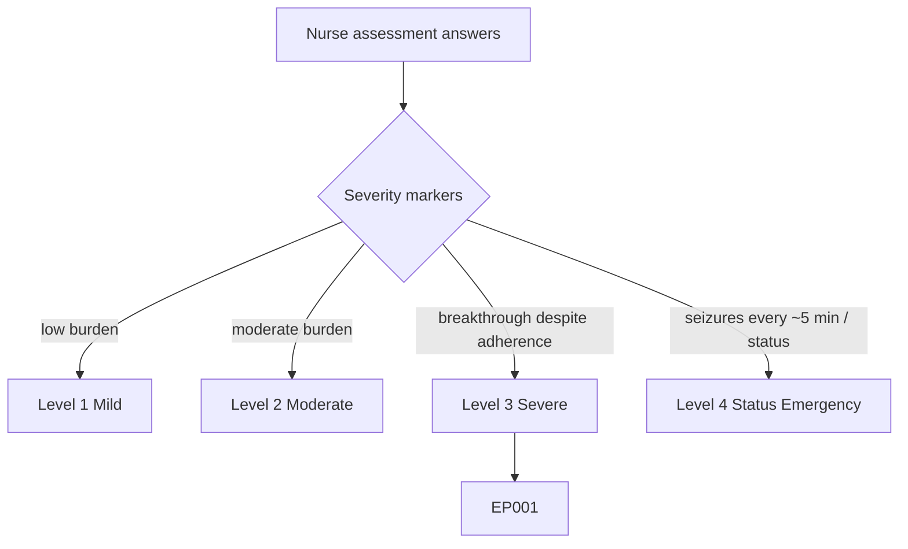
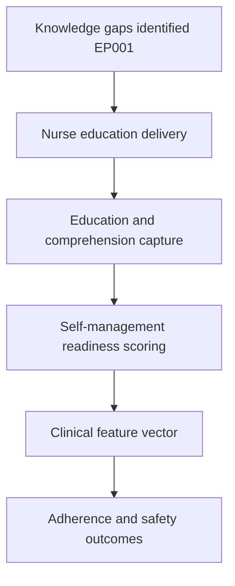
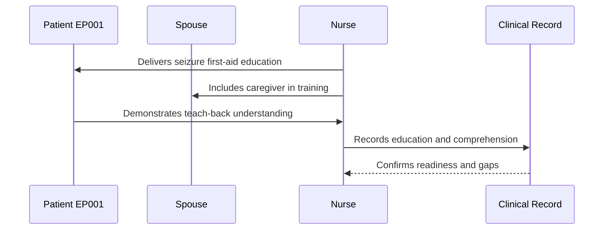
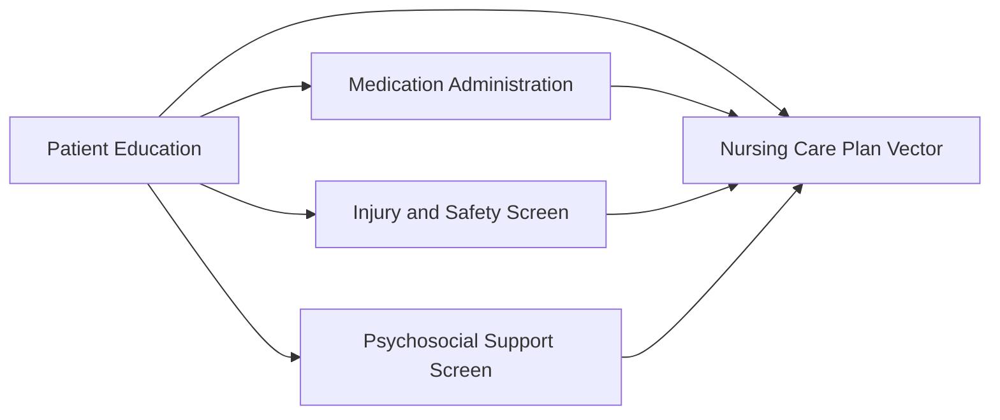
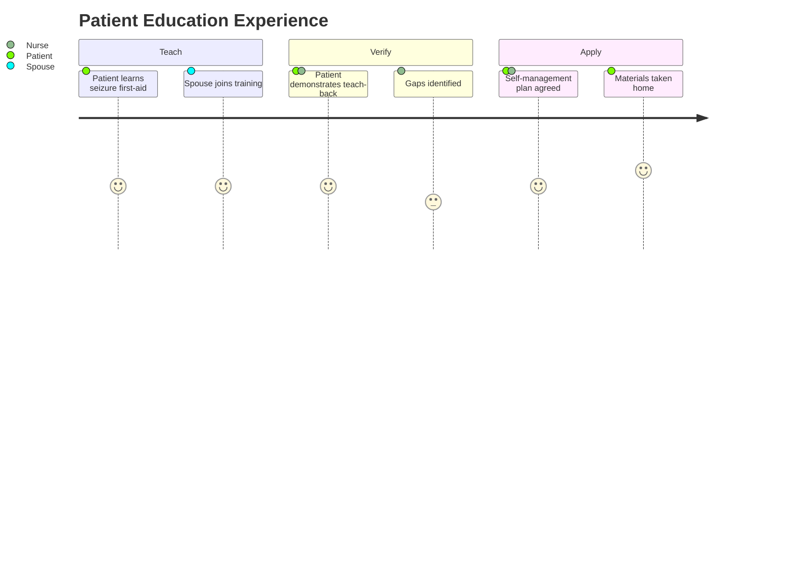

# Nurse Assessment — Section 5: Patient Education (EP001)

> **Why (this doc):** Patient education is the nursing lever on self-management; seizure first-aid knowledge, trigger avoidance, and adherence coaching directly influence seizure burden, safety, and quality of life. **How:** The epilepsy nurse records structured education-delivery and comprehension variables for patient EP001 into a fixed variable/value table that feeds the downstream clinical vector and self-management pipeline.

**Problem:** Poor seizure literacy and unaddressed trigger behaviors sustain avoidable seizures; without a documented education record, self-management gaps go unmeasured and unclosed.

**Research Objective:** Capture standardized education-delivery and comprehension variables for EP001 so knowledge gaps and self-management readiness can be reliably tracked and linked to adherence and safety outcomes.

**Role:** Nurse · **Type:** Primary (nursing) data

*Caption - Core patient-education variables for EP001, recorded by the epilepsy nurse. These values quantify seizure literacy, self-management readiness, and education gaps for the rest of the nursing workup.*

| Variable | Value |
|---|---|
| Seizure First-Aid Taught | Yes (recovery position, timing, when to call) |
| Trigger Avoidance Discussed | Yes (sleep, stress, missed meds) |
| Sleep Hygiene Education | Yes (target 7-8 hrs; currently 5.2 hrs) |
| Medication Adherence Coaching | Yes (alarms, pill organizer) |
| Rescue Medication Training | Buccal midazolam demonstrated |
| Driving Regulations Explained | Yes (restriction understood) |
| Seizure Diary Training | Mobile app reinforced |
| Aura Recognition Education | Metallic taste, déjà vu as warning |
| Alcohol/Caffeine Advice | Provided |
| Teaching Method | Verbal + written leaflet + teach-back |
| Comprehension (Teach-Back) | Adequate |
| Educational Materials Given | Epilepsy self-management booklet |
| Caregiver/Spouse Included | Yes (wife present) |
| Follow-Up Education Needed | Sleep and stress management |

## Severity Scenario Model — Nurse View

*Caption - The same assessment answered across four epilepsy severity levels from the nurse's point of view; each variable shifts with severity. EP001 corresponds to Level 3 (Severe). Level 4 is the operational emergency — status epilepticus with seizures recurring about every 5 minutes.*

### Level 1 — Mild (Well-Controlled)
| Variable | Value |
|---|---|
| Seizure First-Aid Taught | Yes (basic refresher) |
| Trigger Avoidance Discussed | Yes (general advice) |
| Sleep Hygiene Education | Yes (sleep adequate ~7-8 hrs) |
| Medication Adherence Coaching | Minimal (already adherent) |
| Rescue Medication Training | Not required (none prescribed) |
| Driving Regulations Explained | Yes (eligible) |
| Seizure Diary Training | Optional (few events) |
| Aura Recognition Education | Reinforced |
| Alcohol/Caffeine Advice | Provided |
| Teaching Method | Verbal + leaflet |
| Comprehension (Teach-Back) | Good |
| Educational Materials Given | Epilepsy overview leaflet |
| Caregiver/Spouse Included | Optional |
| Follow-Up Education Needed | Routine review only |

### Level 2 — Moderate (Intermediate)
| Variable | Value |
|---|---|
| Seizure First-Aid Taught | Yes (recovery position, timing) |
| Trigger Avoidance Discussed | Yes (sleep, stress) |
| Sleep Hygiene Education | Yes (target 7-8 hrs) |
| Medication Adherence Coaching | Yes (reminders) |
| Rescue Medication Training | Buccal midazolam explained |
| Driving Regulations Explained | Yes (conditional) |
| Seizure Diary Training | Mobile app introduced |
| Aura Recognition Education | Metallic taste as warning |
| Alcohol/Caffeine Advice | Provided |
| Teaching Method | Verbal + written leaflet |
| Comprehension (Teach-Back) | Adequate |
| Educational Materials Given | Self-management booklet |
| Caregiver/Spouse Included | Yes |
| Follow-Up Education Needed | Adherence reinforcement |

### Level 3 — Severe (Poorly Controlled) — EP001
| Variable | Value |
|---|---|
| Seizure First-Aid Taught | Yes (recovery position, timing, when to call) |
| Trigger Avoidance Discussed | Yes (sleep, stress, missed meds) |
| Sleep Hygiene Education | Yes (target 7-8 hrs; currently 5.2 hrs) |
| Medication Adherence Coaching | Yes (alarms, pill organizer) |
| Rescue Medication Training | Buccal midazolam demonstrated |
| Driving Regulations Explained | Yes (restriction understood) |
| Seizure Diary Training | Mobile app reinforced |
| Aura Recognition Education | Metallic taste, déjà vu as warning |
| Alcohol/Caffeine Advice | Provided |
| Teaching Method | Verbal + written leaflet + teach-back |
| Comprehension (Teach-Back) | Adequate |
| Educational Materials Given | Epilepsy self-management booklet |
| Caregiver/Spouse Included | Yes (wife present) |
| Follow-Up Education Needed | Sleep and stress management |

### Level 4 — Refractory / Status Epilepticus (Operational Emergency)
| Variable | Value |
|---|---|
| Seizure First-Aid Taught | Directed to caregiver (patient obtunded) |
| Trigger Avoidance Discussed | Deferred until recovery |
| Sleep Hygiene Education | Deferred |
| Medication Adherence Coaching | Deferred; emergency meds explained to family |
| Rescue Medication Training | Caregiver shown buccal midazolam use urgently |
| Driving Regulations Explained | Reinforced post-event (prohibited) |
| Seizure Diary Training | Event logged by nurse for patient |
| Aura Recognition Education | Not applicable during emergency |
| Alcohol/Caffeine Advice | Deferred |
| Teaching Method | Family briefing + emergency instruction |
| Comprehension (Teach-Back) | Caregiver confirms emergency steps |
| Educational Materials Given | Status epilepticus / emergency action leaflet |
| Caregiver/Spouse Included | Yes — primary recipient during event |
| Follow-Up Education Needed | Post-status debrief and safety re-education |

### Severity Classification Logic

**Reason:** To let the nurse read education needs across the full severity range. **Why:** Because the target audience and urgency of teaching shift as the patient loses capacity. **What is happening:** Patient-directed self-management at Level 1 becomes caregiver-directed emergency instruction at Level 4. **How it is happening:** The nurse redirects teaching to the spouse and delivers urgent rescue-medication and emergency-action guidance during status. **Reference:** Fisher et al. (2017).

## Data Flow in the Pipeline

**Reason:** To show where patient-education data enters and travels through the epilepsy data pipeline. **Why:** Because self-management outcomes depend on documented, comprehended education. **What is happening:** Raw teaching sessions become structured comprehension variables that populate the clinical vector. **How it is happening:** The nurse delivers education, verifies understanding by teach-back, records it in the fixed table, and readiness is scored and passed forward. **Reference:** Fisher et al. (2017).

## Role Capturing the Data

**Reason:** To make explicit which role delivers and captures education. **Why:** Because comprehension provenance and caregiver involvement are essential for safe self-management. **What is happening:** The nurse integrates patient and caregiver understanding into a single verified record. **How it is happening:** Structured teaching plus teach-back verification is transcribed into the record. **Reference:** Topol (2019).

## Linkage to Other Assessment Sections

**Reason:** To show how education connects to the wider nursing vector. **Why:** Because education targets adherence, safety, and coping simultaneously. **What is happening:** Education links laterally to medication, safety, and psychosocial data and feeds the composite care-plan vector. **How it is happening:** Shared patient identifiers and readiness scores join these sections into one record. **Reference:** Topol (2019).

## Patient and Role Experience

**Reason:** To surface the lived experience of receiving education. **Why:** Because engagement and confidence determine whether knowledge becomes behavior. **What is happening:** Teaching sessions are shaped into a confirmed, applied self-management record. **How it is happening:** Verbal, written, and teach-back methods plus caregiver involvement reinforce retention. **Reference:** APA (2020).

## Professor Readiness (Defense Q&A)

**Q1: Why use the teach-back method rather than simply providing a leaflet?** Because teach-back verifies actual comprehension by having the patient restate first-aid and adherence steps, closing the gap between information delivered and information understood.

**Q2: Why include the spouse in seizure first-aid training?** Because impaired-awareness seizures leave EP001 unable to self-manage during events; a trained caregiver ensures correct recovery positioning, timing, and rescue-medication use.

**Q3: Why prioritize sleep-hygiene education for this patient?** Because EP001 sleeps only 5.2 hours with a high trigger burden, and sleep deprivation is a potent, modifiable seizure trigger that education can directly target.

## References

American Psychological Association. (2020). *Publication manual of the American Psychological Association* (7th ed.). American Psychological Association. https://doi.org/10.1037/0000165-000

Fisher, R. S., Cross, J. H., French, J. A., Higurashi, N., Hirsch, E., Jansen, F. E., Lagae, L., Moshé, S. L., Peltola, J., Roulet Perez, E., Scheffer, I. E., & Zuberi, S. M. (2017). Operational classification of seizure types by the International League Against Epilepsy. *Epilepsia, 58*(4), 522–530. https://doi.org/10.1111/epi.13670

Topol, E. J. (2019). *Deep medicine: How artificial intelligence can make healthcare human again*. Basic Books.
