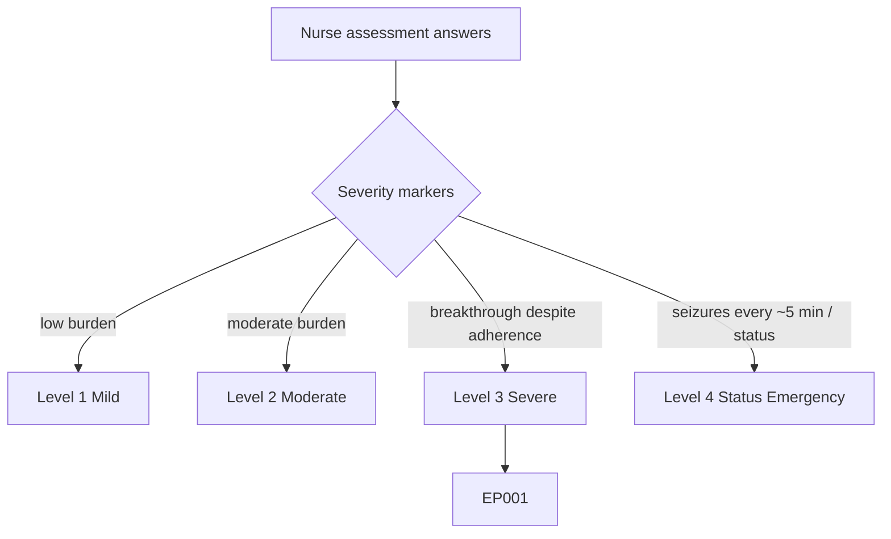
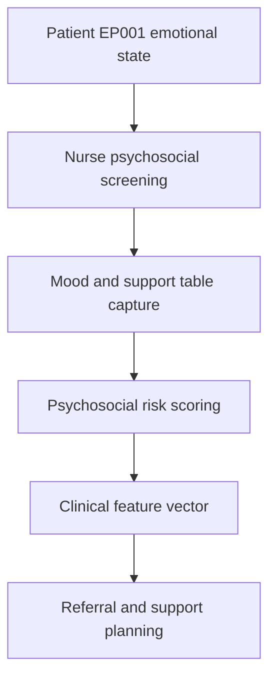
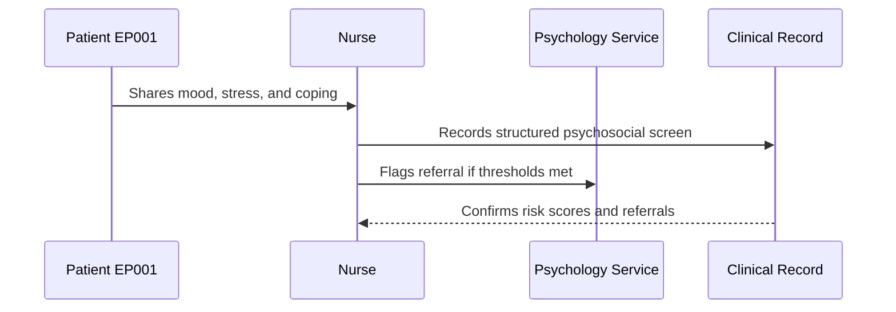
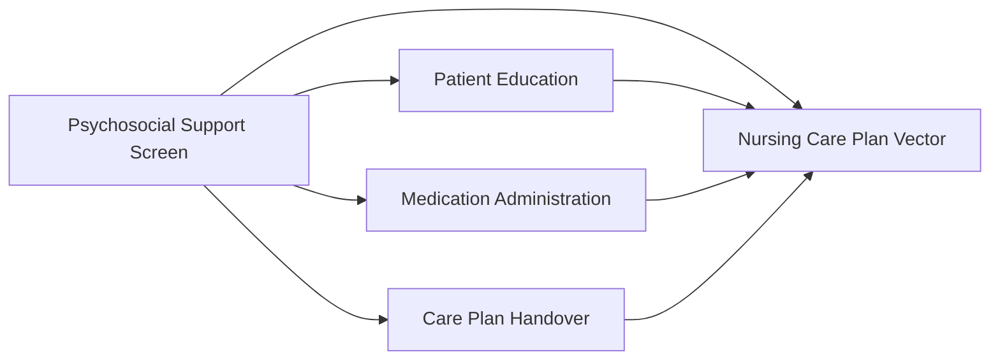
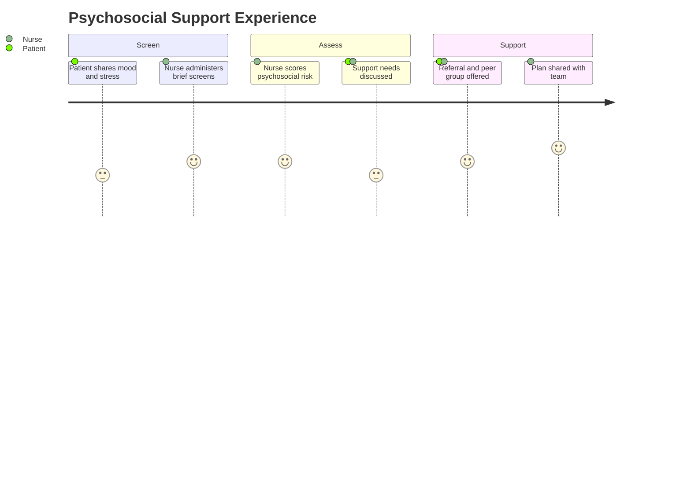

# Nurse Assessment — Section 6: Psychosocial Support Screen (EP001)

> **Why (this doc):** The psychosocial support screen captures the emotional and social dimension of epilepsy; mood, coping, stigma, and support networks influence adherence, seizure triggers, and quality of life as strongly as pharmacology. **How:** The epilepsy nurse records structured mood, coping, and social-support variables for patient EP001 into a fixed variable/value table that feeds the downstream clinical vector and support pipeline.

**Problem:** Unscreened depression, anxiety, and social isolation in epilepsy worsen adherence and seizure control; without a nursing psychosocial screen these modifiable factors are missed.

**Research Objective:** Capture standardized mood, coping, and social-support variables for EP001 so psychosocial risk can be reliably identified and linked to adherence, trigger, and quality-of-life data.

**Role:** Nurse · **Type:** Primary (nursing) data

*Caption - Core psychosocial support-screen variables for EP001, recorded by the epilepsy nurse. These values surface mood, coping, and support risks that shape referral, education, and care-plan priorities.*

| Variable | Value |
|---|---|
| Mood Screen (PHQ-2) | 2 (mild low mood) |
| Anxiety Screen (GAD-2) | 3 (mild anxiety) |
| Reported Stress Level | High (work + seizure worry) |
| Coping Style | Problem-focused, some avoidance |
| Employment Impact | Software engineer; concentration concerns |
| Marital/Social Support | Married; supportive spouse |
| Perceived Stigma | Moderate (discloses selectively) |
| Driving Loss Impact | Significant (independence, commute) |
| Sleep-Related Distress | Yes (5.2 hrs, worry-driven) |
| Social Isolation | Low |
| Suicidal Ideation Screen | Negative |
| Support Group Referral | Offered (epilepsy peer group) |
| Psychology Referral Needed | Consider (mood + stress) |
| QOLIE-31 Referenced | Yes |

## Severity Scenario Model — Nurse View

*Caption - The same assessment answered across four epilepsy severity levels from the nurse's point of view; each variable shifts with severity. EP001 corresponds to Level 3 (Severe). Level 4 is the operational emergency — status epilepticus with seizures recurring about every 5 minutes.*

### Level 1 — Mild (Well-Controlled)
| Variable | Value |
|---|---|
| Mood Screen (PHQ-2) | 0 (no low mood) |
| Anxiety Screen (GAD-2) | 1 (minimal) |
| Reported Stress Level | Low |
| Coping Style | Problem-focused |
| Employment Impact | None |
| Marital/Social Support | Strong |
| Perceived Stigma | Low |
| Driving Loss Impact | None (eligible to drive) |
| Sleep-Related Distress | No |
| Social Isolation | None |
| Suicidal Ideation Screen | Negative |
| Support Group Referral | Not required |
| Psychology Referral Needed | No |
| QOLIE-31 Referenced | Yes (high score) |

### Level 2 — Moderate (Intermediate)
| Variable | Value |
|---|---|
| Mood Screen (PHQ-2) | 1 (mild) |
| Anxiety Screen (GAD-2) | 2 (mild) |
| Reported Stress Level | Moderate |
| Coping Style | Problem-focused |
| Employment Impact | Minor (occasional time off) |
| Marital/Social Support | Supportive spouse |
| Perceived Stigma | Mild |
| Driving Loss Impact | Moderate (under review) |
| Sleep-Related Distress | Occasional |
| Social Isolation | Low |
| Suicidal Ideation Screen | Negative |
| Support Group Referral | Offered |
| Psychology Referral Needed | Monitor |
| QOLIE-31 Referenced | Yes |

### Level 3 — Severe (Poorly Controlled) — EP001
| Variable | Value |
|---|---|
| Mood Screen (PHQ-2) | 2 (mild low mood) |
| Anxiety Screen (GAD-2) | 3 (mild anxiety) |
| Reported Stress Level | High (work + seizure worry) |
| Coping Style | Problem-focused, some avoidance |
| Employment Impact | Software engineer; concentration concerns |
| Marital/Social Support | Married; supportive spouse |
| Perceived Stigma | Moderate (discloses selectively) |
| Driving Loss Impact | Significant (independence, commute) |
| Sleep-Related Distress | Yes (5.2 hrs, worry-driven) |
| Social Isolation | Low |
| Suicidal Ideation Screen | Negative |
| Support Group Referral | Offered (epilepsy peer group) |
| Psychology Referral Needed | Consider (mood + stress) |
| QOLIE-31 Referenced | Yes |

### Level 4 — Refractory / Status Epilepticus (Operational Emergency)
| Variable | Value |
|---|---|
| Mood Screen (PHQ-2) | Deferred (patient obtunded) |
| Anxiety Screen (GAD-2) | Deferred |
| Reported Stress Level | Not assessable; acute family distress high |
| Coping Style | Not assessable during emergency |
| Employment Impact | Severe (hospitalization, likely leave) |
| Marital/Social Support | Spouse present, distressed — support provided |
| Perceived Stigma | Not addressed during acute event |
| Driving Loss Impact | Prohibited; long-term impact anticipated |
| Sleep-Related Distress | Not applicable (acute) |
| Social Isolation | Risk post-event |
| Suicidal Ideation Screen | Deferred; screen post-recovery |
| Support Group Referral | Family signposted; post-event referral planned |
| Psychology Referral Needed | Yes — post-status psychological support |
| QOLIE-31 Referenced | Deferred to recovery phase |

### Severity Classification Logic

**Reason:** To let the nurse read psychosocial burden across the full severity range. **Why:** Because mood, stigma, and support strain intensify with seizure burden and acute crises. **What is happening:** Minimal psychosocial impact at Level 1 becomes deferred screening with acute family distress at Level 4. **How it is happening:** The nurse escalates from routine screening to supporting a distressed spouse and planning post-status psychological referral. **Reference:** Fisher et al. (2017).

## Data Flow in the Pipeline

**Reason:** To show where psychosocial data enters and travels through the epilepsy data pipeline. **Why:** Because mood and support strongly modulate adherence and seizure triggers. **What is happening:** Raw emotional and social report becomes structured, scored variables that populate the clinical vector. **How it is happening:** The nurse screens mood and support, records it in the fixed table, and risk is scored and passed forward for referral. **Reference:** Fisher et al. (2017).

## Role Capturing the Data

**Reason:** To make explicit which role captures each psychosocial element. **Why:** Because sensitive disclosure requires clear ownership and referral pathways. **What is happening:** The nurse integrates patient disclosure into a single verified, actionable record. **How it is happening:** Validated brief screens plus supportive interview are transcribed and scored into the record. **Reference:** Topol (2019).

## Linkage to Other Assessment Sections

**Reason:** To show how the psychosocial screen connects to the wider nursing vector. **Why:** Because mood and stress feed adherence coaching, education, and handover priorities. **What is happening:** The screen links laterally to education, medication, and handover data and feeds the composite care-plan vector. **How it is happening:** Shared patient identifiers and risk scores join these sections into one record. **Reference:** Topol (2019).

## Patient and Role Experience

**Reason:** To surface the lived experience of psychosocial screening. **Why:** Because trust and privacy determine the honesty of mood disclosure. **What is happening:** Emotional experience is shaped into a confirmed, supportive record. **How it is happening:** Validated screens plus an empathetic interview reduce disclosure barriers. **Reference:** APA (2020).

## Professor Readiness (Defense Q&A)

**Q1: Why screen mood and anxiety in an epilepsy nursing assessment?** Because depression and anxiety are highly prevalent in epilepsy and independently worsen adherence, trigger burden, and quality of life, making them modifiable targets the nurse must detect early.

**Q2: Why always include a suicidal-ideation screen?** Because suicidality risk is elevated in epilepsy and can be amplified by certain ASMs; a documented negative screen confirms safety while a positive screen triggers urgent escalation.

**Q3: Why link the psychosocial screen to QOLIE-31?** Because QOLIE-31 captures the emotional and social domains of epilepsy-specific quality of life, and the nursing screen provides the actionable, real-time signals that the questionnaire quantifies.

## References

American Psychological Association. (2020). *Publication manual of the American Psychological Association* (7th ed.). American Psychological Association. https://doi.org/10.1037/0000165-000

Fisher, R. S., Cross, J. H., French, J. A., Higurashi, N., Hirsch, E., Jansen, F. E., Lagae, L., Moshé, S. L., Peltola, J., Roulet Perez, E., Scheffer, I. E., & Zuberi, S. M. (2017). Operational classification of seizure types by the International League Against Epilepsy. *Epilepsia, 58*(4), 522–530. https://doi.org/10.1111/epi.13670

Topol, E. J. (2019). *Deep medicine: How artificial intelligence can make healthcare human again*. Basic Books.
