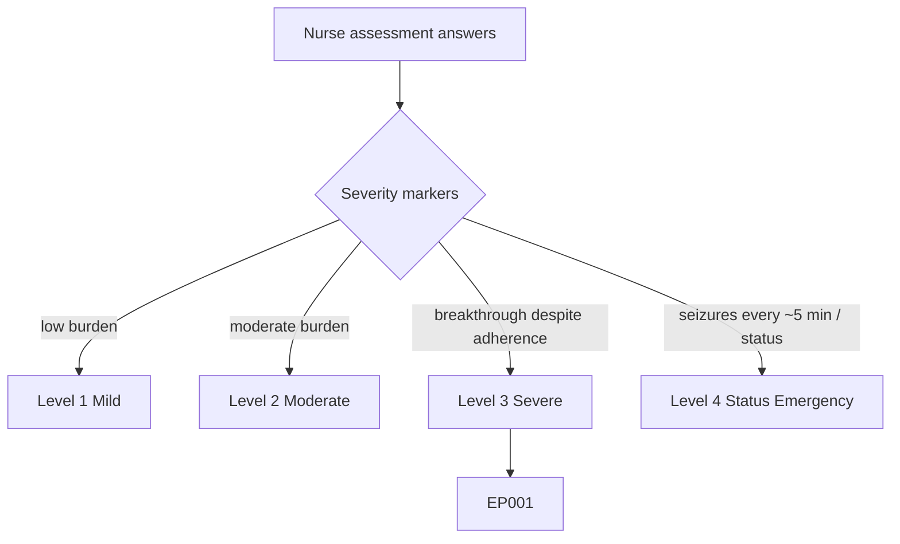
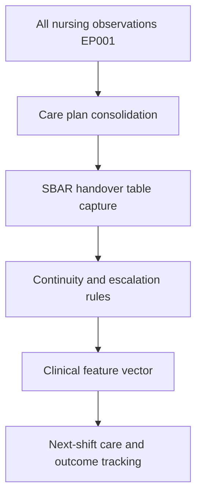
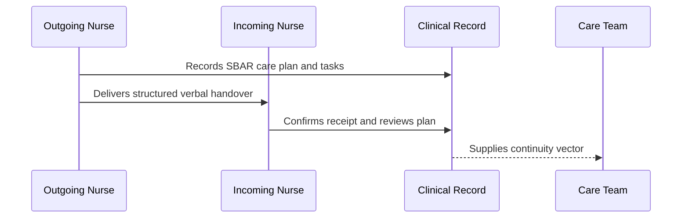
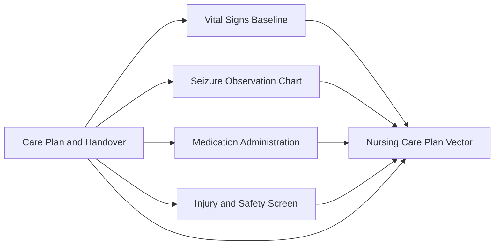
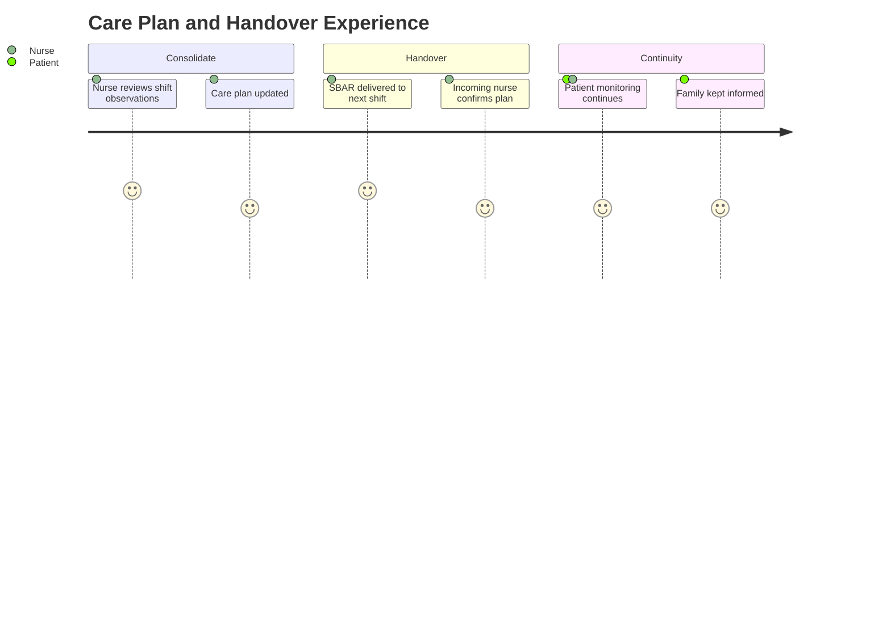

# Nurse Assessment — Section 7: Care Plan & Shift Handover (EP001)

> **Why (this doc):** The nursing care plan and shift handover consolidate every nursing observation into a continuity-of-care record; structured handover prevents information loss between shifts and ensures seizure-safety measures persist around the clock. **How:** The epilepsy nurse records structured care-plan and handover variables for patient EP001 into a fixed variable/value table that feeds the downstream clinical vector and continuity pipeline.

**Problem:** Fragmented, unstructured handover causes safety measures and monitoring priorities to be lost between shifts, risking unwitnessed seizures and missed doses.

**Research Objective:** Capture standardized, SBAR-aligned care-plan and handover variables for EP001 so nursing priorities and safety measures are reliably transferred across shifts and linked to the wider clinical record.

**Role:** Nurse · **Type:** Primary (nursing) data

*Caption - Core care-plan and shift-handover variables for EP001, recorded by the epilepsy nurse. These values ensure continuity of seizure-safety, medication, and monitoring priorities across shifts and into the clinical vector.*

| Variable | Value |
|---|---|
| Handover Format | SBAR |
| Situation | 29M, focal impaired-awareness epilepsy, breakthrough seizures |
| Background | Left-temporal onset; CBZ + LEV; 88% adherence |
| Assessment | 1 observed seizure this shift; vitals stable |
| Recommendation | Continue 15-min checks; monitor SpO2 |
| Active Nursing Diagnoses | Risk of injury; risk of ineffective coping |
| Seizure Precautions | Padded rails, recovery position, suction ready |
| Monitoring Frequency | 15-min visual + hourly vitals overnight |
| Medications Due Next Shift | CBZ 400 mg + LEV 500 mg at 20:00 |
| Rescue Plan | Buccal midazolam if seizure > 5 min |
| Outstanding Tasks | Sleep-hygiene follow-up; psychology referral |
| Falls Precaution | Morse 45; call bell in reach |
| Escalation Criteria | NEWS2 >= 3, cluster, or status |
| Family Updated | Yes (spouse) |
| Care Plan Reviewed | Yes (this shift) |

## Severity Scenario Model — Nurse View

*Caption - The same assessment answered across four epilepsy severity levels from the nurse's point of view; each variable shifts with severity. EP001 corresponds to Level 3 (Severe). Level 4 is the operational emergency — status epilepticus with seizures recurring about every 5 minutes.*

### Level 1 — Mild (Well-Controlled)
| Variable | Value |
|---|---|
| Handover Format | SBAR |
| Situation | 29M, well-controlled focal epilepsy, seizure-free |
| Background | Levetiracetam monotherapy; 100% adherence |
| Assessment | No events; vitals stable |
| Recommendation | Routine observation; discharge planning |
| Active Nursing Diagnoses | Health maintenance (stable) |
| Seizure Precautions | Standard awareness only |
| Monitoring Frequency | Routine shift observation |
| Medications Due Next Shift | LEV 500 mg at 20:00 |
| Rescue Plan | None prescribed |
| Outstanding Tasks | Routine education review |
| Falls Precaution | Morse 15; none required |
| Escalation Criteria | Any new seizure |
| Family Updated | Yes |
| Care Plan Reviewed | Yes (this shift) |

### Level 2 — Moderate (Intermediate)
| Variable | Value |
|---|---|
| Handover Format | SBAR |
| Situation | 29M, focal epilepsy, ~1 seizure/month |
| Background | CBZ + LEV; 95% adherence |
| Assessment | 1 brief focal-aware event; stable |
| Recommendation | Standard obs; reinforce adherence |
| Active Nursing Diagnoses | Risk of injury (low-moderate) |
| Seizure Precautions | One rail up, awareness |
| Monitoring Frequency | Standard obs + hourly if symptomatic |
| Medications Due Next Shift | CBZ 200 mg + LEV 500 mg at 20:00 |
| Rescue Plan | Buccal midazolam if seizure > 5 min |
| Outstanding Tasks | Adherence coaching; diary setup |
| Falls Precaution | Morse 30; call bell in reach |
| Escalation Criteria | Cluster or NEWS2 >= 3 |
| Family Updated | Yes |
| Care Plan Reviewed | Yes (this shift) |

### Level 3 — Severe (Poorly Controlled) — EP001
| Variable | Value |
|---|---|
| Handover Format | SBAR |
| Situation | 29M, focal impaired-awareness epilepsy, breakthrough seizures |
| Background | Left-temporal onset; CBZ + LEV; 88% adherence |
| Assessment | 1 observed seizure this shift; vitals stable |
| Recommendation | Continue 15-min checks; monitor SpO2 |
| Active Nursing Diagnoses | Risk of injury; risk of ineffective coping |
| Seizure Precautions | Padded rails, recovery position, suction ready |
| Monitoring Frequency | 15-min visual + hourly vitals overnight |
| Medications Due Next Shift | CBZ 400 mg + LEV 500 mg at 20:00 |
| Rescue Plan | Buccal midazolam if seizure > 5 min |
| Outstanding Tasks | Sleep-hygiene follow-up; psychology referral |
| Falls Precaution | Morse 45; call bell in reach |
| Escalation Criteria | NEWS2 >= 3, cluster, or status |
| Family Updated | Yes (spouse) |
| Care Plan Reviewed | Yes (this shift) |

### Level 4 — Refractory / Status Epilepticus (Operational Emergency)
| Variable | Value |
|---|---|
| Handover Format | SBAR + emergency escalation |
| Situation | 29M in status epilepticus; seizures every ~5 min, no recovery |
| Background | Left-temporal focal epilepsy; refractory this admission |
| Assessment | Ongoing seizures; SpO2 84%, tachycardic, obtunded |
| Recommendation | Continuous 1:1; O2, suction, IV/buccal rescue meds; ICU review |
| Active Nursing Diagnoses | Ineffective airway; high injury risk; impaired gas exchange |
| Seizure Precautions | Full padding, airway support, suction, floor safety |
| Monitoring Frequency | Continuous (cardiac, SpO2, 1:1 observation) |
| Medications Due Next Shift | IV benzodiazepine + LEV load per status protocol |
| Rescue Plan | Buccal midazolam GIVEN; escalate to IV per protocol |
| Outstanding Tasks | Rapid-response active; ICU/anaesthetics review; urgent bloods |
| Falls Precaution | Morse 65+; continuous supervision |
| Escalation Criteria | Already escalated — resuscitation team at bedside |
| Family Updated | Yes — spouse supported during emergency |
| Care Plan Reviewed | Emergency care plan active |

### Severity Classification Logic

**Reason:** To let the nurse read the care plan and handover across the full severity range. **Why:** Because monitoring intensity, escalation, and diagnoses transform as severity rises. **What is happening:** Routine SBAR handover at Level 1 becomes a continuous 1:1 emergency care plan with resuscitation-team escalation at Level 4. **How it is happening:** The nurse scales precautions, monitoring frequency, and escalation criteria, invoking status-epilepticus protocol and ICU review at Level 4. **Reference:** Fisher et al. (2017).

## Data Flow in the Pipeline

**Reason:** To show where care-plan and handover data enters and travels through the epilepsy data pipeline. **Why:** Because round-the-clock safety depends on structured continuity between shifts. **What is happening:** All nursing observations are consolidated into a structured handover that populates the clinical vector. **How it is happening:** The nurse aggregates observations, records them in SBAR format, and escalation rules are attached and passed forward. **Reference:** Fisher et al. (2017).

## Role Capturing the Data

**Reason:** To make explicit which role transfers each care element. **Why:** Because continuity accountability prevents dropped tasks and unmonitored seizures. **What is happening:** The outgoing nurse hands a verified, structured plan to the incoming nurse. **How it is happening:** SBAR verbal handover plus a written record read-back transfers ownership safely. **Reference:** Topol (2019).

## Linkage to Other Assessment Sections

**Reason:** To show how the care plan integrates every other nursing section. **Why:** Because handover is the convergence point of all nursing data for continuity. **What is happening:** The care plan consolidates baseline, observation, medication, and safety data into the composite care-plan vector. **How it is happening:** Shared patient identifiers and the SBAR structure join all sections into one continuity record. **Reference:** Topol (2019).

## Patient and Role Experience

**Reason:** To surface the lived experience of care-plan continuity. **Why:** Because patients feel safer when monitoring and communication persist seamlessly across shifts. **What is happening:** Shift-end knowledge is shaped into a confirmed, transferable continuity record. **How it is happening:** Structured SBAR handover plus family updates maintain trust and safety overnight. **Reference:** APA (2020).

## Professor Readiness (Defense Q&A)

**Q1: Why use SBAR for nursing handover in epilepsy care?** Because SBAR (Situation, Background, Assessment, Recommendation) standardizes the transfer of seizure precautions, medication timing, and escalation criteria, minimizing the information loss that causes unwitnessed seizures and missed doses.

**Q2: Why define explicit escalation criteria in the handover?** Because pre-agreed triggers (NEWS2 >= 3, seizure clusters, status epilepticus) remove ambiguity for the incoming nurse and ensure rapid, consistent response regardless of who is on shift.

**Q3: How does the care plan close the loop from assessment to outcome?** By consolidating every nursing section into active diagnoses, precautions, and outstanding tasks, the care plan converts captured data into continuous, accountable action that feeds outcome tracking.

## References

American Psychological Association. (2020). *Publication manual of the American Psychological Association* (7th ed.). American Psychological Association. https://doi.org/10.1037/0000165-000

Fisher, R. S., Cross, J. H., French, J. A., Higurashi, N., Hirsch, E., Jansen, F. E., Lagae, L., Moshé, S. L., Peltola, J., Roulet Perez, E., Scheffer, I. E., & Zuberi, S. M. (2017). Operational classification of seizure types by the International League Against Epilepsy. *Epilepsia, 58*(4), 522–530. https://doi.org/10.1111/epi.13670

Topol, E. J. (2019). *Deep medicine: How artificial intelligence can make healthcare human again*. Basic Books.
