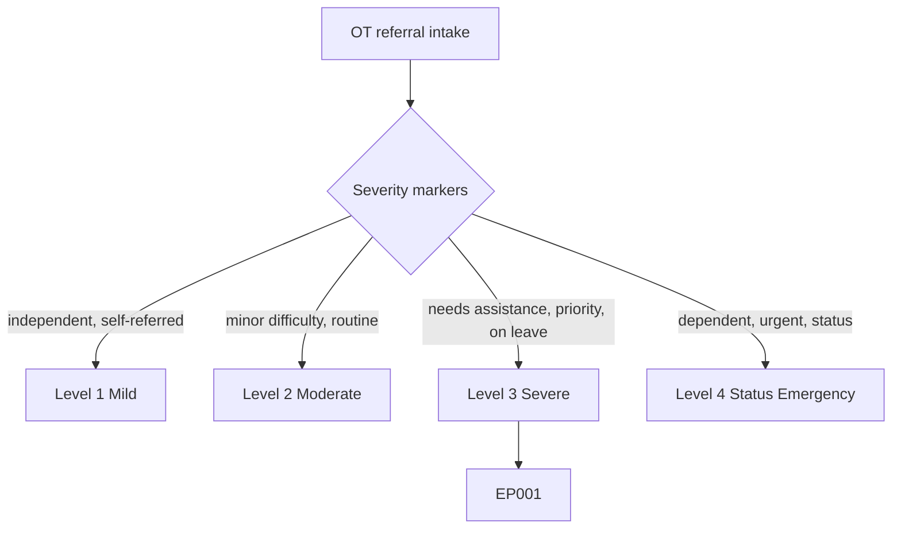
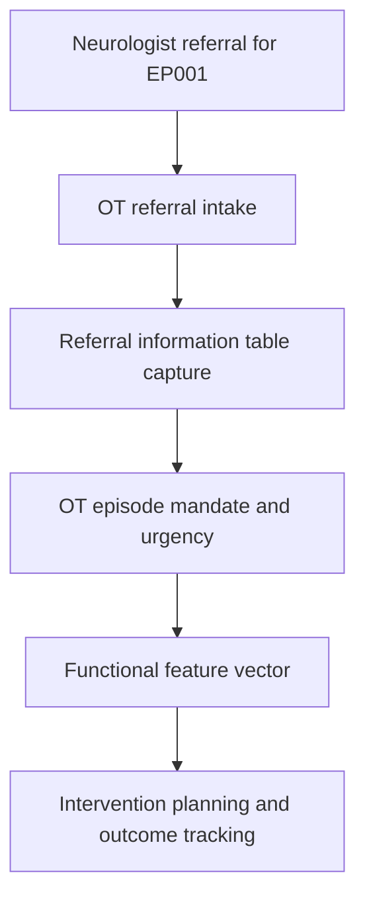
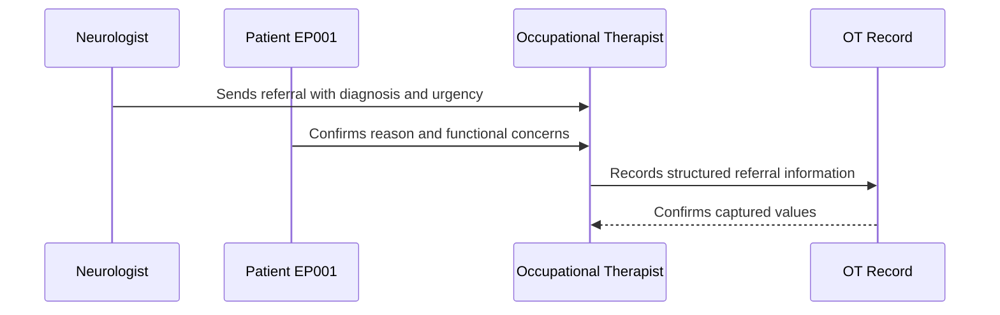
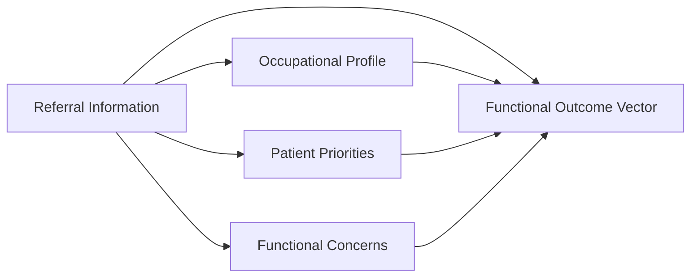
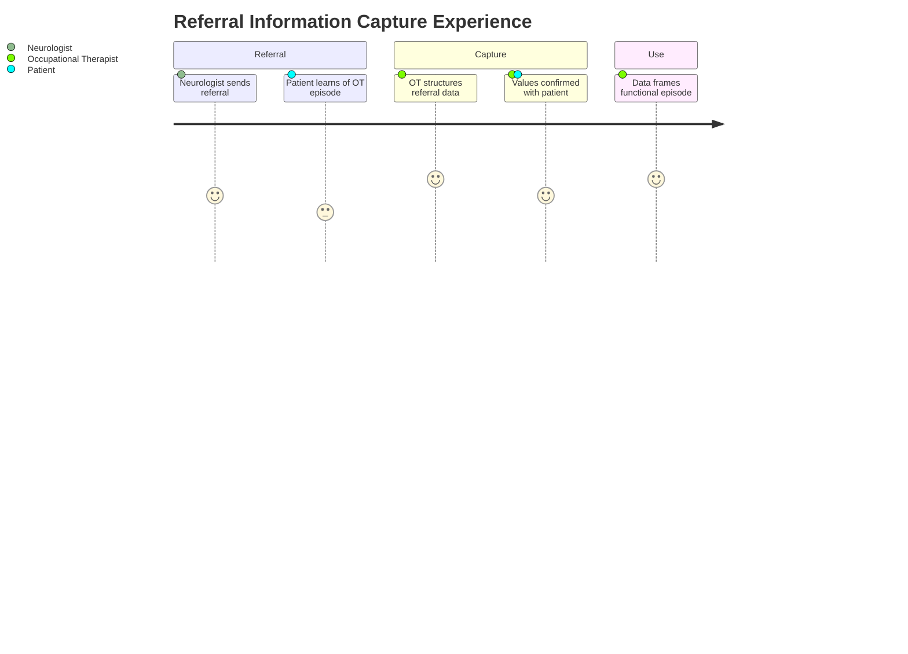

# Occupational Therapist Assessment — Section 1: Referral Information (EP001)

> **Why (this doc):** Referral information establishes the provenance, purpose, and clinical starting point of the occupational therapy episode; it fixes who referred EP001, why, and what epilepsy diagnosis and urgency frame the functional work that follows. **How:** The occupational therapist captures structured referral variables for patient EP001 into a fixed variable/value table that feeds the downstream functional assessment and analytics pipeline.

**Problem:** Missing or unstructured referral detail leaves occupational therapy without a clear mandate, diagnosis context, or urgency, causing misdirected functional assessment in focal epilepsy.

**Research Objective:** Capture standardized referral variables for EP001 so the occupational therapy episode is traceably linked to the neurologist's diagnosis, seizure classification, and urgency across the assessment.

**Role:** Occupational Therapist · **Type:** Primary (functional) data

*Caption - Core referral variables for EP001, recorded by the occupational therapist. These values anchor the mandate, diagnosis context, and urgency that direct the rest of the functional workup.*

| Variable | Value |
|---|---|
| OT001 Referral Source | Neurologist |
| OT002 Referral Reason | Functional decline and safety concerns limiting daily occupations |
| OT003 Primary Diagnosis | Focal Epilepsy (left-temporal) |
| OT004 Date of Diagnosis | 2024-03-12 |
| OT005 Current Seizure Classification | Focal Impaired Awareness (from neurologist) |
| OT006 Referral Urgency | Priority |
| OT007 Previous OT Assessment Available | No |
| OT008 Previous OT Records Reviewed | Not applicable (no prior records) |
| OT009 Referral Summary | 29M with poorly controlled focal impaired-awareness seizures (~5/month), on medical leave, needing assistance with meal preparation; referred for functional and safety assessment |
| OT010 OT Electronic Signature | Signed — OT, 2026-07-11 |

## Questionnaire (Enterprise Form)

*Caption - The questions the occupational therapist asks for this section, with response type, validation, EP001's example answer, and the derived AI feature.*

| ID | Question | Response Type | Validation | EP001 (Example) | AI Feature |
|---|---|---|---|---|---|
| OT001 | Who referred the patient for occupational therapy? | Dropdown[Neurologist/Nurse/Self/Other] | Epilepsy-care referrer only (never psychiatry) | Neurologist | referral_source_class |
| OT002 | What is the reason for this OT referral? | Text | Free text, 10-300 chars | Functional decline and safety concerns limiting daily occupations | referral_reason_intent |
| OT003 | What is the primary epilepsy diagnosis? | Dropdown[Focal/Generalized/Combined/Unknown Epilepsy] | Must be an epilepsy diagnosis | Focal Epilepsy (left-temporal) | epilepsy_diagnosis_code |
| OT004 | When was epilepsy diagnosed? | Date | ISO-8601, not in future | 2024-03-12 | diagnosis_recency_index |
| OT005 | What is the current seizure classification? | Dropdown[Focal Aware/Focal Impaired Awareness/Focal to Bilateral Tonic-Clonic] | ILAE 2017 allowed set | Focal Impaired Awareness (from neurologist) | seizure_classification_code |
| OT006 | How urgent is this referral? | Dropdown[Routine/Priority/Urgent] | One of allowed set | Priority | referral_urgency_level |
| OT007 | Is a previous OT assessment available? | Yes-No | Yes or No | No | prior_ot_episode_flag |
| OT008 | Were previous OT records reviewed? | Dropdown[Yes/No/Not applicable] | One of allowed set | Not applicable (no prior records) | prior_records_reviewed_flag |
| OT009 | Summarize the referral in the patient's context. | Text | Free text, 20-500 chars | 29M with poorly controlled focal impaired-awareness seizures (~5/month), on medical leave, needing assistance with meal preparation; referred for functional and safety assessment | referral_summary_embedding |
| OT010 | OT electronic signature confirming referral capture. | Signature | Signed name + date | Signed — OT, 2026-07-11 | signature_verified_flag |

## Severity Scenario Model — Occupational Therapist View

*Caption - The same referral answered across four epilepsy severity levels from the occupational therapist's point of view; each variable shifts with severity. EP001 corresponds to Level 3 (Severe). Level 4 is the operational emergency — status epilepticus with seizures recurring about every 5 minutes.*

### Level 1 — Mild (Well-Controlled)
| Variable | Value |
|---|---|
| OT001 Referral Source | Self |
| OT002 Referral Reason | Wellness check; wishes to optimize routine |
| OT003 Primary Diagnosis | Focal Epilepsy (left-temporal) |
| OT004 Date of Diagnosis | 2024-03-12 |
| OT005 Current Seizure Classification | Focal Aware (from neurologist) |
| OT006 Referral Urgency | Routine |
| OT007 Previous OT Assessment Available | No |
| OT008 Previous OT Records Reviewed | Not applicable (no prior records) |
| OT009 Referral Summary | Fully independent, working, no safety incidents; brief functional review requested |
| OT010 OT Electronic Signature | Signed — OT, 2026-07-11 |

### Level 2 — Moderate (Intermediate)
| Variable | Value |
|---|---|
| OT001 Referral Source | Nurse |
| OT002 Referral Reason | Minor difficulty in one to two daily domains |
| OT003 Primary Diagnosis | Focal Epilepsy (left-temporal) |
| OT004 Date of Diagnosis | 2024-03-12 |
| OT005 Current Seizure Classification | Focal Impaired Awareness (from neurologist) |
| OT006 Referral Urgency | Routine |
| OT007 Previous OT Assessment Available | No |
| OT008 Previous OT Records Reviewed | Not applicable (no prior records) |
| OT009 Referral Summary | Occasional avoidance of a few tasks; still working; requests strategies for confidence |
| OT010 OT Electronic Signature | Signed — OT, 2026-07-11 |

### Level 3 — Severe (Poorly Controlled) — EP001
| Variable | Value |
|---|---|
| OT001 Referral Source | Neurologist |
| OT002 Referral Reason | Functional decline and safety concerns limiting daily occupations |
| OT003 Primary Diagnosis | Focal Epilepsy (left-temporal) |
| OT004 Date of Diagnosis | 2024-03-12 |
| OT005 Current Seizure Classification | Focal Impaired Awareness (from neurologist) |
| OT006 Referral Urgency | Priority |
| OT007 Previous OT Assessment Available | No |
| OT008 Previous OT Records Reviewed | Not applicable (no prior records) |
| OT009 Referral Summary | 29M with poorly controlled focal impaired-awareness seizures (~5/month), on medical leave, needing assistance with meal preparation; referred for functional and safety assessment |
| OT010 OT Electronic Signature | Signed — OT, 2026-07-11 |

### Level 4 — Refractory / Status Epilepticus (Operational Emergency)
| Variable | Value |
|---|---|
| OT001 Referral Source | Neurologist |
| OT002 Referral Reason | Dependent for most ADL; cannot be left alone; emergency supervision required |
| OT003 Primary Diagnosis | Focal Epilepsy (left-temporal), refractory |
| OT004 Date of Diagnosis | 2024-03-12 |
| OT005 Current Seizure Classification | Focal to Bilateral Tonic-Clonic (in status) |
| OT006 Referral Urgency | Urgent |
| OT007 Previous OT Assessment Available | Yes (prior episode on file) |
| OT008 Previous OT Records Reviewed | Yes — reviewed inpatient functional record |
| OT009 Referral Summary | Status epilepticus (seizures ~every 5 min); unable to work or drive; inpatient OT for supervised ADL and safety supervision |
| OT010 OT Electronic Signature | Signed — OT, 2026-07-11 |

### Severity Classification Logic

**Reason:** Referral urgency and mandate are graded along the same severity ladder as the clinical picture. **Why:** Source, reason, and urgency decide how fast and how intensively OT engages EP001. **What is happening:** The referral escalates from a self-requested wellness check to an urgent inpatient supervision mandate. **How it is happening:** The occupational therapist grades the referral descriptors against level thresholds tied to seizure control. **Reference:** Fisher et al. (2017).

## Data Flow in the Pipeline

**Reason:** To show where referral data enters and travels through the epilepsy data pipeline. **Why:** Because the OT mandate and priorities depend on this being captured before any functional step. **What is happening:** The neurologist's referral becomes a structured OT mandate that seeds the functional vector. **How it is happening:** The occupational therapist records the referral in the fixed table and maps diagnosis and urgency forward. **Reference:** American Occupational Therapy Association (2020).

## Role Capturing the Data

**Reason:** To make explicit which role captures each element of the referral. **Why:** Because provenance and accountability matter for clinical and research use. **What is happening:** The occupational therapist integrates neurologist and patient input into a single verified referral record. **How it is happening:** The referral letter plus patient confirmation is transcribed into the record and read back for confirmation. **Reference:** American Occupational Therapy Association (2020).

## Linkage to Other Assessment Sections

**Reason:** To show how referral information connects to the wider functional vector. **Why:** Because the mandate must frame the profile, priorities, and functional concerns to be valid. **What is happening:** Referral links laterally to the profile and priorities and feeds the composite functional vector. **How it is happening:** Shared patient identifiers and diagnosis codes join these sections into one record. **Reference:** Topol (2019).

## Patient and Role Experience

**Reason:** To surface the lived experience of capturing this data item. **Why:** Because clarity of mandate and urgency shapes patient engagement. **What is happening:** Neurologist and patient input is shaped into a confirmed, usable referral record. **How it is happening:** A structured intake plus referral-letter review reduces gaps and improves accuracy. **Reference:** APA (2020).

## Professor Readiness (Defense Q&A)

**Q1: Why translate the referral source into Neurologist/Nurse/Self/Other?** Standardizing the source into fixed categories keeps provenance machine-readable and lets any epilepsy referrer (never psychiatry) map cleanly into the functional vector.

**Q2: Why record referral urgency separately from diagnosis?** Urgency (Routine/Priority/Urgent) drives scheduling and intensity of OT engagement independently of the seizure classification, so it is captured as its own graded variable.

**Q3: Why capture whether previous OT records were reviewed?** Reviewing prior functional records prevents duplicated assessment and anchors change over time; its absence for EP001 signals a first OT episode.

## References

American Occupational Therapy Association. (2020). *Occupational therapy practice framework: Domain and process* (4th ed.). *American Journal of Occupational Therapy, 74*(Suppl. 2), 7412410010. https://doi.org/10.5014/ajot.2020.74S2001

American Psychological Association. (2020). *Publication manual of the American Psychological Association* (7th ed.). American Psychological Association.

Fisher, R. S., Cross, J. H., French, J. A., Higurashi, N., Hirsch, E., Jansen, F. E., Lagae, L., Moshé, S. L., Peltola, J., Roulet Perez, E., Scheffer, I. E., & Zuberi, S. M. (2017). Operational classification of seizure types by the International League Against Epilepsy. *Epilepsia, 58*(4), 522–530. https://doi.org/10.1111/epi.13670

Topol, E. J. (2019). *Deep medicine: How artificial intelligence can make healthcare human again*. Basic Books.
