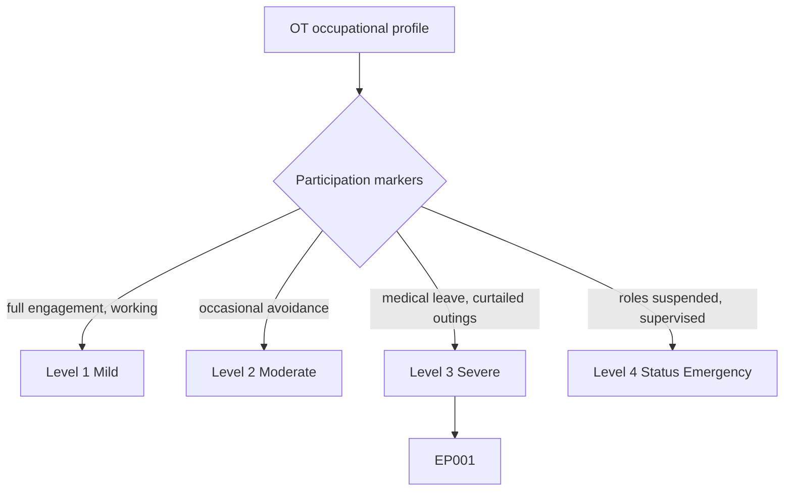
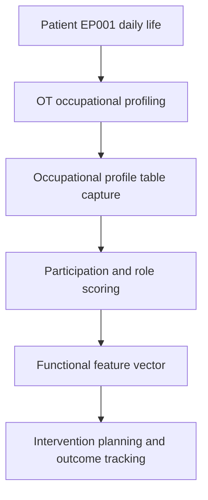
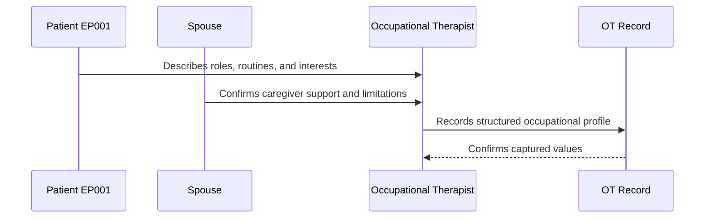
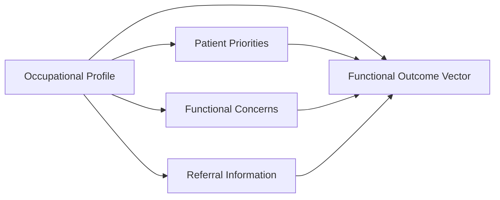
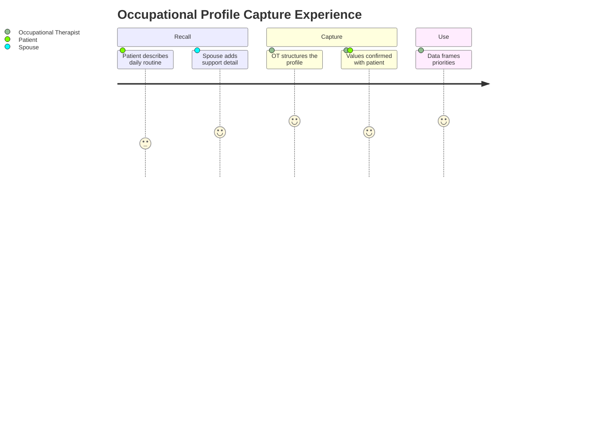

# Occupational Therapist Assessment — Section 2: Occupational Profile (EP001)

> **Why (this doc):** The occupational profile fixes who EP001 is as an occupational being — living arrangement, roles, routines, and interests — so functional concerns and priorities are interpreted in the context of a real daily life shaped by epilepsy. **How:** The occupational therapist captures structured profile variables for patient EP001 into a fixed variable/value table that feeds the downstream priorities and functional-concern analytics pipeline.

**Problem:** Without a structured occupational profile, functional findings float free of context, so interventions miss the roles and routines that matter most to a person with focal epilepsy.

**Research Objective:** Capture standardized occupational-profile variables for EP001 so participation and role data can be reliably linked to priorities, functional concerns, and outcomes across the assessment.

**Role:** Occupational Therapist · **Type:** Primary (functional) data

*Caption - Core occupational-profile variables for EP001, recorded by the occupational therapist. These values anchor the roles, routines, and participation context that frame the rest of the functional workup.*

| Variable | Value |
|---|---|
| OT011 Current Living Arrangement | Lives with spouse |
| OT012 Marital/Relationship Status | Married |
| OT013 Primary Caregiver | Spouse |
| OT014 Employment Status | On medical leave (affected) |
| OT015 Student Status | Not a student |
| OT016 Typical Daily Routine | Structured mornings, rests midday after fatigue, limited outings due to seizure fear |
| OT017 Hobbies/Leisure | Cooking, reading, walking with spouse |
| OT018 Most Important Roles | Spouse, worker, home contributor |
| OT019 Occupational Profile Summary | 29M married, living with supportive spouse; valued worker role interrupted by medical leave; routines and community outings curtailed by ~5 seizures/month |
| OT020 Occupational Participation Score (Auto) | 40/100 (reduced; ~80% occupational impact) |

## Severity Scenario Model — Occupational Therapist View

*Caption - The same occupational profile answered across four epilepsy severity levels from the occupational therapist's point of view; each variable shifts with severity. EP001 corresponds to Level 3 (Severe). Level 4 is the operational emergency — status epilepticus with seizures recurring about every 5 minutes.*

### Level 1 — Mild (Well-Controlled)
| Variable | Value |
|---|---|
| OT011 Current Living Arrangement | Lives with spouse |
| OT012 Marital/Relationship Status | Married |
| OT013 Primary Caregiver | None required |
| OT014 Employment Status | Employed full-time |
| OT015 Student Status | Not a student |
| OT016 Typical Daily Routine | Full workday, evening leisure, independent outings |
| OT017 Hobbies/Leisure | Cooking, reading, walking, cycling |
| OT018 Most Important Roles | Worker, spouse, community member |
| OT019 Occupational Profile Summary | Fully engaged across work, home, and community with no epilepsy-related restriction |
| OT020 Occupational Participation Score (Auto) | 95/100 (full participation) |

### Level 2 — Moderate (Intermediate)
| Variable | Value |
|---|---|
| OT011 Current Living Arrangement | Lives with spouse |
| OT012 Marital/Relationship Status | Married |
| OT013 Primary Caregiver | Spouse (occasional) |
| OT014 Employment Status | Employed with minor adjustments |
| OT015 Student Status | Not a student |
| OT016 Typical Daily Routine | Full days with occasional avoidance of high-risk tasks |
| OT017 Hobbies/Leisure | Cooking, reading, walking |
| OT018 Most Important Roles | Worker, spouse, home contributor |
| OT019 Occupational Profile Summary | Broadly engaged; occasional avoidance of one or two tasks after seizures |
| OT020 Occupational Participation Score (Auto) | 70/100 (mildly reduced) |

### Level 3 — Severe (Poorly Controlled) — EP001
| Variable | Value |
|---|---|
| OT011 Current Living Arrangement | Lives with spouse |
| OT012 Marital/Relationship Status | Married |
| OT013 Primary Caregiver | Spouse |
| OT014 Employment Status | On medical leave (affected) |
| OT015 Student Status | Not a student |
| OT016 Typical Daily Routine | Structured mornings, rests midday after fatigue, limited outings due to seizure fear |
| OT017 Hobbies/Leisure | Cooking, reading, walking with spouse |
| OT018 Most Important Roles | Spouse, worker, home contributor |
| OT019 Occupational Profile Summary | 29M married, living with supportive spouse; valued worker role interrupted by medical leave; routines and community outings curtailed by ~5 seizures/month |
| OT020 Occupational Participation Score (Auto) | 40/100 (reduced; ~80% occupational impact) |

### Level 4 — Refractory / Status Epilepticus (Operational Emergency)
| Variable | Value |
|---|---|
| OT011 Current Living Arrangement | Inpatient / supervised at home |
| OT012 Marital/Relationship Status | Married |
| OT013 Primary Caregiver | Spouse plus clinical staff (24-hour supervision) |
| OT014 Employment Status | Unable to work |
| OT015 Student Status | Not a student |
| OT016 Typical Daily Routine | Supervised ADL only; cannot be left alone |
| OT017 Hobbies/Leisure | Suspended during acute phase |
| OT018 Most Important Roles | Roles suspended; focus on safety and recovery |
| OT019 Occupational Profile Summary | Status epilepticus (seizures ~every 5 min); dependent for most ADL, requiring continuous supervision and unable to participate in prior roles |
| OT020 Occupational Participation Score (Auto) | 10/100 (minimal participation) |

### Severity Classification Logic

**Reason:** Occupational participation is graded along a severity ladder rather than a single label. **Why:** Employment, routine, and role engagement decide the functional impact for EP001. **What is happening:** Participation shifts from full engagement to fully suspended roles under supervision. **How it is happening:** The occupational therapist grades the profile descriptors against level thresholds tied to seizure control. **Reference:** Fisher et al. (2017).

## Data Flow in the Pipeline

**Reason:** To show where occupational-profile data enters and travels through the epilepsy data pipeline. **Why:** Because priorities and interventions depend on role context being captured first. **What is happening:** Daily-life detail becomes structured participation variables that populate the functional vector. **How it is happening:** The occupational therapist elicits the profile, records it in the fixed table, and scores participation forward. **Reference:** American Occupational Therapy Association (2020).

## Role Capturing the Data

**Reason:** To make explicit which role captures each element of the profile. **Why:** Because provenance of role and routine data matters for clinical and research use. **What is happening:** The occupational therapist integrates patient and spouse input into a single verified profile. **How it is happening:** A guided occupational-profile interview plus caregiver corroboration is transcribed and read back for confirmation. **Reference:** American Occupational Therapy Association (2020).

## Linkage to Other Assessment Sections

**Reason:** To show how the occupational profile connects to the wider functional vector. **Why:** Because roles and routines must correlate with priorities and concerns for a valid plan. **What is happening:** The profile links laterally to priorities and concerns and feeds the composite functional vector. **How it is happening:** Shared patient identifiers join these sections into one record. **Reference:** Topol (2019).

## Patient and Role Experience

**Reason:** To surface the lived experience of capturing this data item. **Why:** Because fatigue and seizure fear shape how routines are described. **What is happening:** Patient and spouse recall is shaped into a confirmed, usable profile. **How it is happening:** A guided interview plus caregiver input reduces gaps and improves accuracy. **Reference:** APA (2020).

## Professor Readiness (Defense Q&A)

**Q1: Why capture the occupational profile before functional concerns?** The profile provides the role and routine context that makes each functional concern interpretable, so it is elicited first per the AOTA (2020) process.

**Q2: Why does the participation score auto-derive rather than being entered by hand?** An auto-derived Occupational Participation Score keeps the measure reproducible and machine-readable, mapping directly into the functional vector.

**Q3: Why record the primary caregiver as a profile variable?** For EP001 the spouse is both caregiver and support for community participation; capturing this identifies who to involve in the safety and intervention plan.

## References

American Occupational Therapy Association. (2020). *Occupational therapy practice framework: Domain and process* (4th ed.). *American Journal of Occupational Therapy, 74*(Suppl. 2), 7412410010. https://doi.org/10.5014/ajot.2020.74S2001

American Psychological Association. (2020). *Publication manual of the American Psychological Association* (7th ed.). American Psychological Association.

Fisher, R. S., Cross, J. H., French, J. A., Higurashi, N., Hirsch, E., Jansen, F. E., Lagae, L., Moshé, S. L., Peltola, J., Roulet Perez, E., Scheffer, I. E., & Zuberi, S. M. (2017). Operational classification of seizure types by the International League Against Epilepsy. *Epilepsia, 58*(4), 522–530. https://doi.org/10.1111/epi.13670

Topol, E. J. (2019). *Deep medicine: How artificial intelligence can make healthcare human again*. Basic Books.
