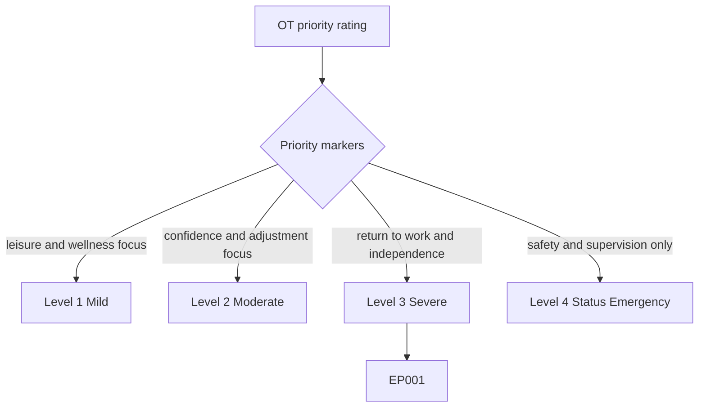
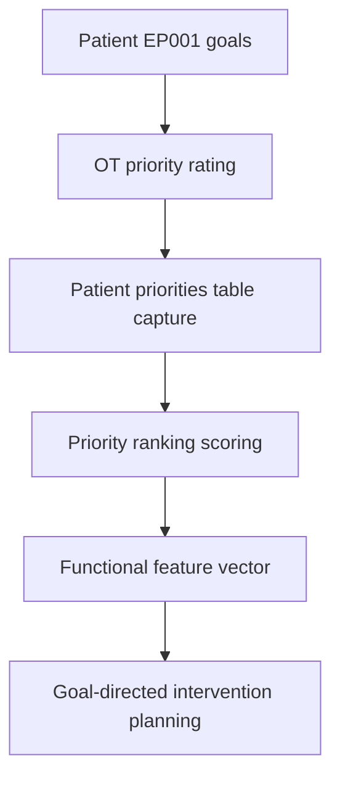
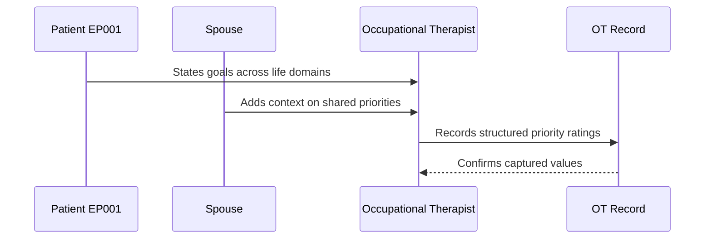
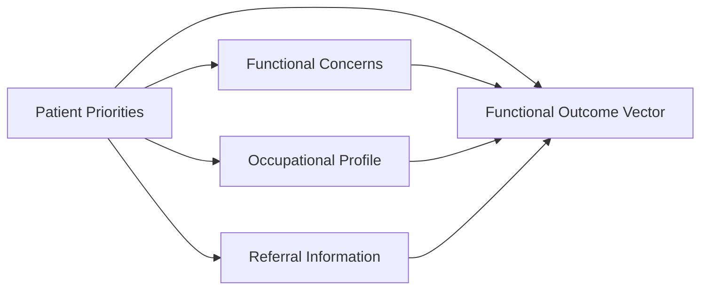
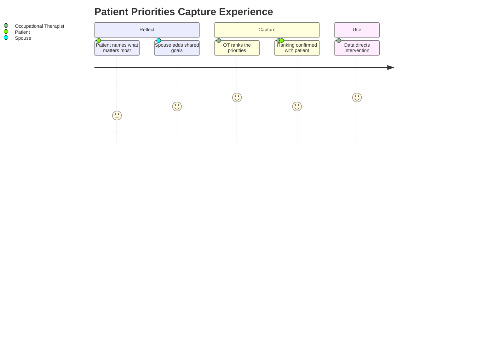

# Occupational Therapist Assessment — Section 3: Patient Priorities (EP001)

> **Why (this doc):** Patient priorities fix what EP001 most wants to change across life domains, so intervention is client-centred rather than clinician-imposed; they turn the occupational profile into a ranked target list. **How:** The occupational therapist captures structured priority ratings for patient EP001 into a fixed variable/value table that feeds the downstream functional-concern and intervention analytics pipeline.

**Problem:** Without ranked patient priorities, occupational therapy risks treating clinician-selected goals that do not match the domains a person with focal epilepsy values most.

**Research Objective:** Capture standardized, client-centred priority ratings for EP001 so goal targets can be reliably linked to functional concerns and outcomes across the assessment.

**Role:** Occupational Therapist · **Type:** Primary (functional) data

*Caption - Client-centred priority ratings for EP001 across life domains, recorded by the occupational therapist. These values anchor the ranked goal targets that direct the rest of the functional workup.*

| Variable | Value |
|---|---|
| OT021 Self-care | Medium priority — mostly independent |
| OT022 Household Activities | High priority — safer meal preparation wanted |
| OT023 Work | High priority — return to work is top goal |
| OT024 School | Not applicable |
| OT025 Driving/Transportation | Medium priority — currently not driving |
| OT026 Social Participation | Medium priority — limited by seizure fear |
| OT027 Leisure | Low priority — maintained with spouse |
| OT028 Community Participation | Medium priority — outings curtailed |
| OT029 Other Priorities | Improve overall independence |
| OT030 Priority Ranking Score (Auto) | Top 3: Return to Work, Improve Independence, Safer Meal Preparation |

## Questionnaire (Enterprise Form)

*Caption - The questions the occupational therapist asks for this section, with response type, validation, EP001's example answer, and the derived AI feature.*

| ID | Question | Response Type | Validation | EP001 (Example) | AI Feature |
|---|---|---|---|---|---|
| OT021 | How high a priority is improving self-care for the patient? | Dropdown[Low/Medium/High priority/Not applicable] | One of allowed set | Medium priority — mostly independent | selfcare_priority_weight |
| OT022 | How high a priority is improving household activities? | Dropdown[Low/Medium/High priority/Not applicable] | One of allowed set | High priority — safer meal preparation wanted | household_priority_weight |
| OT023 | How high a priority is returning to work? | Dropdown[Low/Medium/High priority/Not applicable] | One of allowed set | High priority — return to work is top goal | work_priority_weight |
| OT024 | How high a priority is school participation? | Dropdown[Low/Medium/High priority/Not applicable] | One of allowed set | Not applicable | school_priority_weight |
| OT025 | How high a priority is driving/transportation? | Dropdown[Low/Medium/High priority/Not applicable] | One of allowed set | Medium priority — currently not driving | transport_priority_weight |
| OT026 | How high a priority is social participation? | Dropdown[Low/Medium/High priority/Not applicable] | One of allowed set | Medium priority — limited by seizure fear | social_priority_weight |
| OT027 | How high a priority is leisure? | Dropdown[Low/Medium/High priority/Not applicable] | One of allowed set | Low priority — maintained with spouse | leisure_priority_weight |
| OT028 | How high a priority is community participation? | Dropdown[Low/Medium/High priority/Not applicable] | One of allowed set | Medium priority — outings curtailed | community_priority_weight |
| OT029 | What other priorities does the patient identify? | Text | Free text, 5-300 chars | Improve overall independence | other_priorities_intent |
| OT030 | Ranked top priorities for the patient. | Read-only(Auto) | System-derived top 3 | Top 3: Return to Work, Improve Independence, Safer Meal Preparation | priority_ranking_score |

## Severity Scenario Model — Occupational Therapist View

*Caption - The same priorities answered across four epilepsy severity levels from the occupational therapist's point of view; each variable shifts with severity. EP001 corresponds to Level 3 (Severe). Level 4 is the operational emergency — status epilepticus with seizures recurring about every 5 minutes.*

### Level 1 — Mild (Well-Controlled)
| Variable | Value |
|---|---|
| OT021 Self-care | Low priority — fully independent |
| OT022 Household Activities | Low priority — fully independent |
| OT023 Work | Low priority — working without issue |
| OT024 School | Not applicable |
| OT025 Driving/Transportation | Low priority — driving eligible |
| OT026 Social Participation | Low priority — full social life |
| OT027 Leisure | Medium priority — wants more leisure time |
| OT028 Community Participation | Low priority — unrestricted |
| OT029 Other Priorities | Maintain wellness routine |
| OT030 Priority Ranking Score (Auto) | Top 3: Leisure Expansion, Wellness, Time Management |

### Level 2 — Moderate (Intermediate)
| Variable | Value |
|---|---|
| OT021 Self-care | Low priority — independent |
| OT022 Household Activities | Medium priority — some avoidance |
| OT023 Work | Medium priority — minor adjustments wanted |
| OT024 School | Not applicable |
| OT025 Driving/Transportation | Medium priority — cautious driving |
| OT026 Social Participation | Medium priority — occasional avoidance |
| OT027 Leisure | Low priority — maintained |
| OT028 Community Participation | Low priority — mostly unrestricted |
| OT029 Other Priorities | Build confidence after seizures |
| OT030 Priority Ranking Score (Auto) | Top 3: Work Adjustment, Confidence, Household Safety |

### Level 3 — Severe (Poorly Controlled) — EP001
| Variable | Value |
|---|---|
| OT021 Self-care | Medium priority — mostly independent |
| OT022 Household Activities | High priority — safer meal preparation wanted |
| OT023 Work | High priority — return to work is top goal |
| OT024 School | Not applicable |
| OT025 Driving/Transportation | Medium priority — currently not driving |
| OT026 Social Participation | Medium priority — limited by seizure fear |
| OT027 Leisure | Low priority — maintained with spouse |
| OT028 Community Participation | Medium priority — outings curtailed |
| OT029 Other Priorities | Improve overall independence |
| OT030 Priority Ranking Score (Auto) | Top 3: Return to Work, Improve Independence, Safer Meal Preparation |

### Level 4 — Refractory / Status Epilepticus (Operational Emergency)
| Variable | Value |
|---|---|
| OT021 Self-care | High priority — dependent, needs supervised ADL |
| OT022 Household Activities | Not feasible during acute phase |
| OT023 Work | Not feasible — unable to work |
| OT024 School | Not applicable |
| OT025 Driving/Transportation | Not feasible — unable to drive |
| OT026 Social Participation | Deferred until stabilized |
| OT027 Leisure | Deferred until stabilized |
| OT028 Community Participation | Not feasible during acute phase |
| OT029 Other Priorities | Safety and continuous supervision |
| OT030 Priority Ranking Score (Auto) | Top 3: Safety Supervision, Supported Self-care, Stabilization |

### Severity Classification Logic

**Reason:** Patient priorities are graded along the same severity ladder as function. **Why:** The mix of high-priority domains signals how disabling epilepsy is for EP001. **What is happening:** Priorities shift from leisure optimization to survival-level safety supervision. **How it is happening:** The occupational therapist grades priority ratings against level thresholds tied to seizure control. **Reference:** Fisher et al. (2017).

## Data Flow in the Pipeline

**Reason:** To show where priority data enters and travels through the epilepsy data pipeline. **Why:** Because intervention goals must be client-centred and captured before planning. **What is happening:** Stated goals become ranked, structured priorities that populate the functional vector. **How it is happening:** The occupational therapist elicits priorities, records them in the fixed table, and ranks them forward. **Reference:** American Occupational Therapy Association (2020).

## Role Capturing the Data

**Reason:** To make explicit which role captures each priority element. **Why:** Because client-centred provenance matters for valid goal setting. **What is happening:** The occupational therapist integrates patient and spouse input into a single ranked priority record. **How it is happening:** A structured priority interview is transcribed and read back for confirmation. **Reference:** American Occupational Therapy Association (2020).

## Linkage to Other Assessment Sections

**Reason:** To show how priorities connect to the wider functional vector. **Why:** Because ranked goals must correlate with functional concerns to be actionable. **What is happening:** Priorities link laterally to concerns and the profile and feed the composite functional vector. **How it is happening:** Shared patient identifiers join these sections into one record. **Reference:** Topol (2019).

## Patient and Role Experience

**Reason:** To surface the lived experience of setting priorities. **Why:** Because motivation and adherence depend on goals the patient chose. **What is happening:** Patient reflection is shaped into a confirmed, ranked priority record. **How it is happening:** A guided priority interview plus caregiver input improves relevance. **Reference:** APA (2020).

## Professor Readiness (Defense Q&A)

**Q1: Why rank priorities rather than list them flat?** Ranking (via the auto Priority Ranking Score) concentrates limited intervention resources on the domains EP001 values most — return to work, independence, and safer meal preparation.

**Q2: Why is driving a medium rather than high priority for EP001?** EP001 is currently not driving due to seizure control; the patient prioritizes returning to work and independence first, so driving is captured but ranked below them.

**Q3: How do priorities stay client-centred and not clinician-driven?** Each domain is rated from the patient's stated goals and confirmed on read-back, keeping the ranking a faithful record of the patient's own priorities per AOTA (2020).

## References

American Occupational Therapy Association. (2020). *Occupational therapy practice framework: Domain and process* (4th ed.). *American Journal of Occupational Therapy, 74*(Suppl. 2), 7412410010. https://doi.org/10.5014/ajot.2020.74S2001

American Psychological Association. (2020). *Publication manual of the American Psychological Association* (7th ed.). American Psychological Association.

Fisher, R. S., Cross, J. H., French, J. A., Higurashi, N., Hirsch, E., Jansen, F. E., Lagae, L., Moshé, S. L., Peltola, J., Roulet Perez, E., Scheffer, I. E., & Zuberi, S. M. (2017). Operational classification of seizure types by the International League Against Epilepsy. *Epilepsia, 58*(4), 522–530. https://doi.org/10.1111/epi.13670

Topol, E. J. (2019). *Deep medicine: How artificial intelligence can make healthcare human again*. Basic Books.
