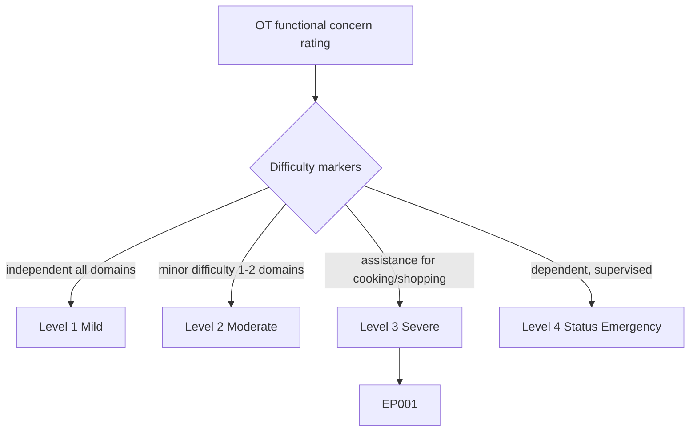
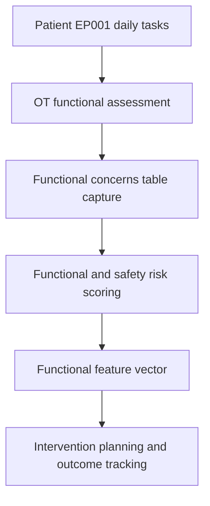
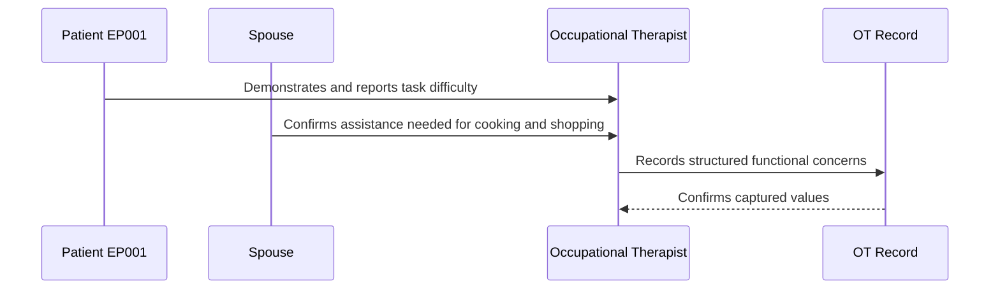
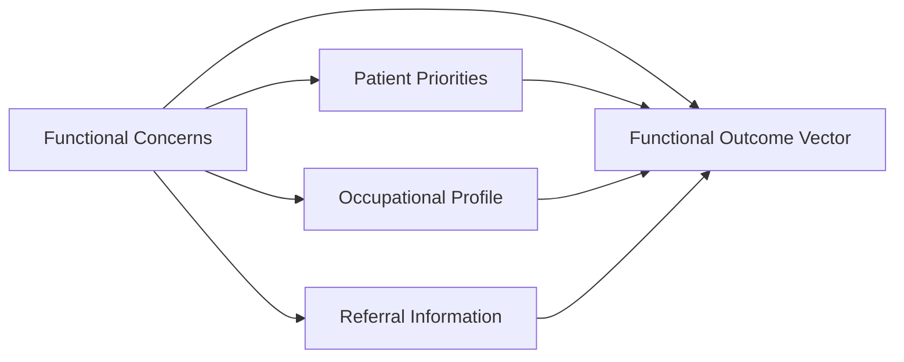
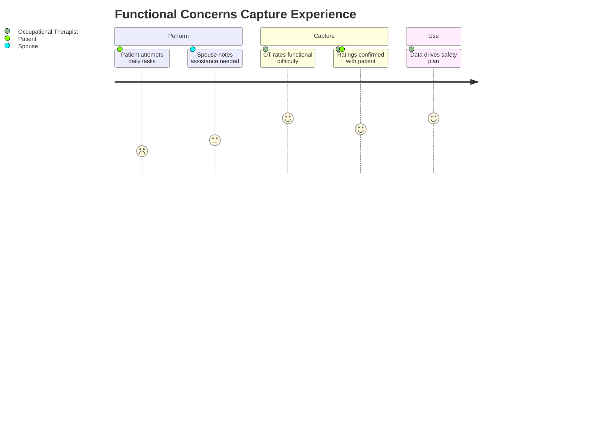

# Occupational Therapist Assessment — Section 4: Functional Concerns (EP001)

> **Why (this doc):** Functional concerns fix where EP001 actually struggles across ADL and IADL tasks, converting priorities into measured difficulty and safety risk that drive the intervention plan. **How:** The occupational therapist captures structured difficulty ratings for patient EP001 into a fixed variable/value table that feeds the downstream safety-risk and outcome analytics pipeline.

**Problem:** Without structured functional-concern ratings, safety and independence risks in focal epilepsy stay implicit, so interventions miss the tasks where seizures cause the greatest harm.

**Research Objective:** Capture standardized ADL/IADL difficulty ratings for EP001 so functional and safety risk can be reliably linked to priorities and outcomes across the assessment.

**Role:** Occupational Therapist · **Type:** Primary (functional) data

*Caption - ADL/IADL difficulty ratings for EP001, recorded by the occupational therapist. These values anchor the functional and safety risk profile that directs the intervention plan.*

| Variable | Value |
|---|---|
| OT031 Difficulty Dressing | Independent — minor difficulty |
| OT032 Difficulty Bathing | Independent — minor difficulty (seizure-safety aware) |
| OT033 Difficulty Cooking | Requires assistance (burn/seizure risk at stove) |
| OT034 Difficulty Shopping | Requires assistance (fatigue, crowds, transport) |
| OT035 Difficulty Managing Medications | Independent — minor difficulty (88% adherence) |
| OT036 Difficulty Using Technology | Independent |
| OT037 Difficulty Remembering Appointments | Independent — minor difficulty (post-ictal memory) |
| OT038 Difficulty Completing Tasks | Independent — minor difficulty (fatigue interrupts) |
| OT039 Functional Concern Summary | Independent with minor difficulty across most ADL; requires assistance with cooking and shopping due to seizure and safety risk |
| OT040 Functional Concern Score (Auto) | 62/100 (moderate-high concern; assistance needed in 2 IADL domains) |

## Severity Scenario Model — Occupational Therapist View

*Caption - The same functional concerns answered across four epilepsy severity levels from the occupational therapist's point of view; each variable shifts with severity. EP001 corresponds to Level 3 (Severe). Level 4 is the operational emergency — status epilepticus with seizures recurring about every 5 minutes.*

### Level 1 — Mild (Well-Controlled)
| Variable | Value |
|---|---|
| OT031 Difficulty Dressing | Independent |
| OT032 Difficulty Bathing | Independent |
| OT033 Difficulty Cooking | Independent |
| OT034 Difficulty Shopping | Independent |
| OT035 Difficulty Managing Medications | Independent |
| OT036 Difficulty Using Technology | Independent |
| OT037 Difficulty Remembering Appointments | Independent |
| OT038 Difficulty Completing Tasks | Independent |
| OT039 Functional Concern Summary | Fully independent across all ADL and IADL with no safety incidents |
| OT040 Functional Concern Score (Auto) | 10/100 (minimal concern) |

### Level 2 — Moderate (Intermediate)
| Variable | Value |
|---|---|
| OT031 Difficulty Dressing | Independent |
| OT032 Difficulty Bathing | Independent — minor difficulty |
| OT033 Difficulty Cooking | Independent — minor difficulty (cautious at stove) |
| OT034 Difficulty Shopping | Independent |
| OT035 Difficulty Managing Medications | Independent |
| OT036 Difficulty Using Technology | Independent |
| OT037 Difficulty Remembering Appointments | Independent — minor difficulty |
| OT038 Difficulty Completing Tasks | Independent |
| OT039 Functional Concern Summary | Independent overall with minor difficulty in one to two tasks and occasional avoidance |
| OT040 Functional Concern Score (Auto) | 32/100 (mild concern) |

### Level 3 — Severe (Poorly Controlled) — EP001
| Variable | Value |
|---|---|
| OT031 Difficulty Dressing | Independent — minor difficulty |
| OT032 Difficulty Bathing | Independent — minor difficulty (seizure-safety aware) |
| OT033 Difficulty Cooking | Requires assistance (burn/seizure risk at stove) |
| OT034 Difficulty Shopping | Requires assistance (fatigue, crowds, transport) |
| OT035 Difficulty Managing Medications | Independent — minor difficulty (88% adherence) |
| OT036 Difficulty Using Technology | Independent |
| OT037 Difficulty Remembering Appointments | Independent — minor difficulty (post-ictal memory) |
| OT038 Difficulty Completing Tasks | Independent — minor difficulty (fatigue interrupts) |
| OT039 Functional Concern Summary | Independent with minor difficulty across most ADL; requires assistance with cooking and shopping due to seizure and safety risk |
| OT040 Functional Concern Score (Auto) | 62/100 (moderate-high concern; assistance needed in 2 IADL domains) |

### Level 4 — Refractory / Status Epilepticus (Operational Emergency)
| Variable | Value |
|---|---|
| OT031 Difficulty Dressing | Dependent — requires assistance |
| OT032 Difficulty Bathing | Dependent — requires supervised assistance |
| OT033 Difficulty Cooking | Not permitted — safety risk, cannot be left alone |
| OT034 Difficulty Shopping | Dependent — unable to perform |
| OT035 Difficulty Managing Medications | Dependent — administered by carers/staff |
| OT036 Difficulty Using Technology | Dependent — requires assistance |
| OT037 Difficulty Remembering Appointments | Dependent — managed by carers |
| OT038 Difficulty Completing Tasks | Dependent — unable to sustain tasks |
| OT039 Functional Concern Summary | Status epilepticus (seizures ~every 5 min); dependent for most ADL, cannot be left alone, emergency supervision required |
| OT040 Functional Concern Score (Auto) | 95/100 (critical concern) |

### Severity Classification Logic

**Reason:** Functional difficulty is graded along the same severity ladder as seizure control. **Why:** The level of assistance needed signals safety risk and independence loss for EP001. **What is happening:** Difficulty escalates from full independence to dependence requiring supervision. **How it is happening:** The occupational therapist grades each task rating against level thresholds tied to seizure control. **Reference:** Fisher et al. (2017).

## Data Flow in the Pipeline

**Reason:** To show where functional-concern data enters and travels through the epilepsy data pipeline. **Why:** Because safety and intervention targets depend on structured difficulty being captured. **What is happening:** Observed task difficulty becomes structured risk variables that populate the functional vector. **How it is happening:** The occupational therapist rates each task, records it in the fixed table, and scores risk forward. **Reference:** American Occupational Therapy Association (2020).

## Role Capturing the Data

**Reason:** To make explicit which role captures each functional element. **Why:** Because provenance of difficulty and safety data matters for valid risk scoring. **What is happening:** The occupational therapist integrates observation, patient report, and spouse input into one verified record. **How it is happening:** Task observation plus caregiver corroboration is transcribed and read back for confirmation. **Reference:** American Occupational Therapy Association (2020).

## Linkage to Other Assessment Sections

**Reason:** To show how functional concerns connect to the wider functional vector. **Why:** Because measured difficulty must correlate with priorities and profile for a valid plan. **What is happening:** Functional concerns link laterally to priorities and profile and feed the composite functional vector. **How it is happening:** Shared patient identifiers join these sections into one record. **Reference:** Topol (2019).

## Patient and Role Experience

**Reason:** To surface the lived experience behind each functional rating. **Why:** Because fear of seizures during tasks affects both performance and reporting. **What is happening:** Task performance is shaped into a confirmed, usable risk record. **How it is happening:** Observation plus caregiver input reduces under-reporting and improves accuracy. **Reference:** APA (2020).

## Professor Readiness (Defense Q&A)

**Q1: Why does EP001 need assistance specifically for cooking and shopping?** Cooking carries burn and seizure risk at the stove and shopping involves fatigue, crowds, and transport barriers, so these two IADL domains require assistance while other ADL remain independent with minor difficulty.

**Q2: Why capture medication management as a functional concern here when adherence is a clinical variable?** OT rates the practical difficulty of managing medications (routine, reminders); EP001's 88% adherence with minor difficulty flags an opportunity for functional support without duplicating the neurologist's adherence measure.

**Q3: How does the Functional Concern Score support the safety plan?** The auto score aggregates task-level difficulty into a single moderate-high value, concentrating the safety plan on the highest-risk tasks (cooking, shopping) for EP001.

## References

American Occupational Therapy Association. (2020). *Occupational therapy practice framework: Domain and process* (4th ed.). *American Journal of Occupational Therapy, 74*(Suppl. 2), 7412410010. https://doi.org/10.5014/ajot.2020.74S2001

American Psychological Association. (2020). *Publication manual of the American Psychological Association* (7th ed.). American Psychological Association.

Fisher, R. S., Cross, J. H., French, J. A., Higurashi, N., Hirsch, E., Jansen, F. E., Lagae, L., Moshé, S. L., Peltola, J., Roulet Perez, E., Scheffer, I. E., & Zuberi, S. M. (2017). Operational classification of seizure types by the International League Against Epilepsy. *Epilepsia, 58*(4), 522–530. https://doi.org/10.1111/epi.13670

Topol, E. J. (2019). *Deep medicine: How artificial intelligence can make healthcare human again*. Basic Books.
