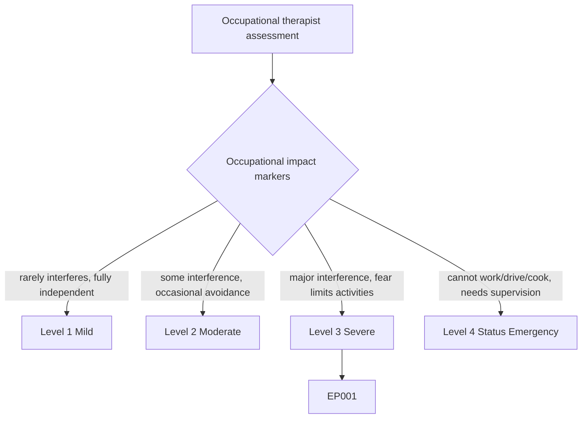
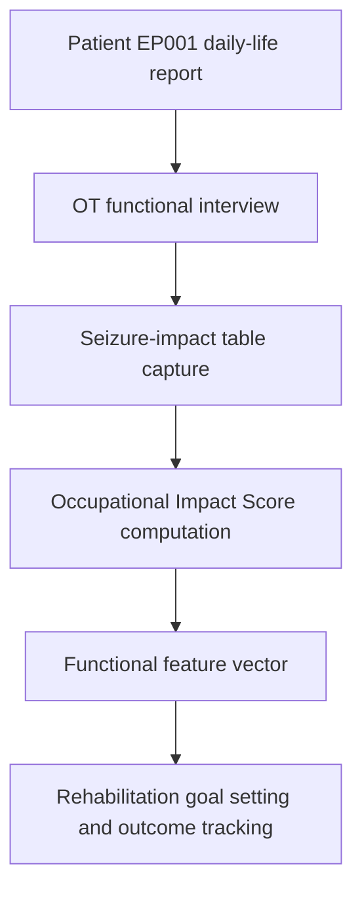
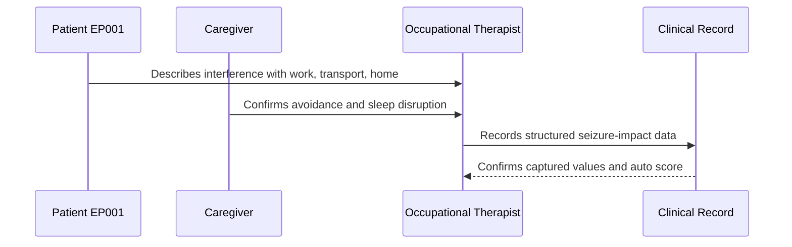
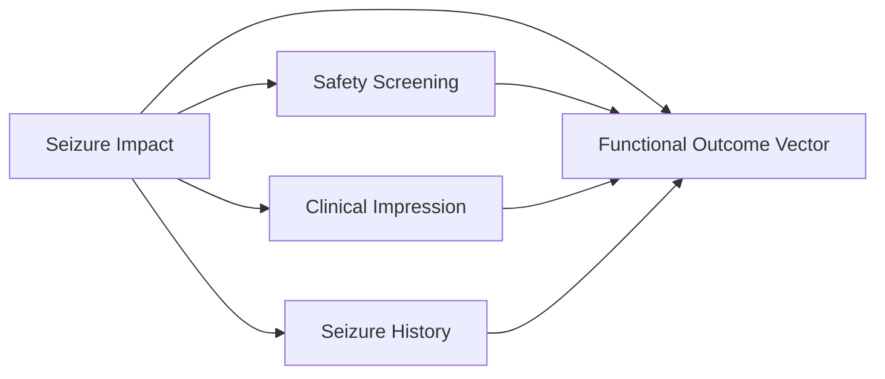
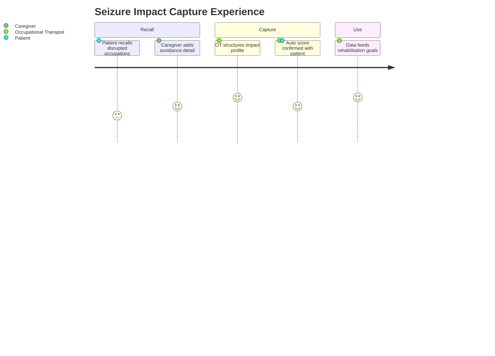

# Occupational Therapist Assessment — Section 5: Seizure Impact on Daily Life (EP001)

> **Why (this doc):** Seizure impact on daily life is the functional core of the occupational-therapy record; it converts seizure burden into measurable interference with work, self-care, and participation so that rehabilitation goals can be targeted. **How:** The occupational therapist captures structured occupational-impact descriptors for patient EP001 into a fixed variable/value table that feeds the downstream functional vector and analytics pipeline.

**Problem:** Seizure frequency alone does not reveal how epilepsy disrupts a patient's everyday occupations, so impact on work, driving, and participation is often under-recorded and under-treated.

**Research Objective:** Capture standardized, occupation-focused impact variables for EP001 so they can be reliably linked to safety, clinical-impression, and outcome data across the assessment.

**Role:** Occupational Therapist · **Type:** Primary (functional) data

*Caption - Core seizure-impact variables for EP001, recorded by the occupational therapist. These values quantify how focal seizures interfere with the patient's occupations and anchor the functional profile for the rest of the epilepsy workup.*

| Variable | Value |
|---|---|
| OT041 Seizures interfere with work | Yes — on medical leave |
| OT042 Seizures interfere with school | N/A — not a student |
| OT043 Seizures interfere with driving/transportation | Yes — driving restricted, uses public transport/lifts |
| OT044 Seizures interfere with household activities | Yes — cooking/meal-prep affected |
| OT045 Seizures interfere with social participation | Yes — reduced community participation |
| OT046 Seizures interfere with sleep | Yes — nocturnal seizures affect sleep |
| OT047 Fear of seizures limits activities | Yes |
| OT048 Patient avoids activities due to seizure concerns | Yes — avoids solo cooking and swimming |
| OT049 Impact summary | Major interference across work, transport, and home occupations; fear-driven avoidance present |
| OT050 Occupational Impact Score (Auto) | 80% (High) |

## Questionnaire (Enterprise Form)

*Caption - The questions the occupational therapist asks for this section, with response type, validation, EP001's example answer, and the derived AI feature.*

| ID | Question | Response Type | Validation | EP001 (Example) | AI Feature |
|---|---|---|---|---|---|
| OT041 | Do seizures interfere with the patient's work? | Dropdown[Yes/No/N/A] | One of allowed set | Yes — on medical leave | work_interference_flag |
| OT042 | Do seizures interfere with the patient's school participation? | Dropdown[Yes/No/N/A] | One of allowed set | N/A — not a student | school_interference_flag |
| OT043 | Do seizures interfere with driving/transportation? | Dropdown[Yes/No/N/A] | One of allowed set | Yes — driving restricted, uses public transport/lifts | transport_interference_flag |
| OT044 | Do seizures interfere with household activities? | Dropdown[Yes/No/N/A] | One of allowed set | Yes — cooking/meal-prep affected | household_interference_flag |
| OT045 | Do seizures interfere with social participation? | Dropdown[Yes/No/N/A] | One of allowed set | Yes — reduced community participation | social_interference_flag |
| OT046 | Do seizures interfere with the patient's sleep? | Dropdown[Yes/No/N/A] | One of allowed set | Yes — nocturnal seizures affect sleep | sleep_interference_flag |
| OT047 | Does fear of seizures limit the patient's activities? | Yes-No | Yes or No | Yes | seizure_fear_limitation_flag |
| OT048 | Does the patient avoid activities due to seizure concerns? | Yes-No | Yes or No | Yes — avoids solo cooking and swimming | activity_avoidance_flag |
| OT049 | Summarize the occupational impact of seizures. | Text | Free text, 20-500 chars | Major interference across work, transport, and home occupations; fear-driven avoidance present | seizure_impact_embedding |
| OT050 | Occupational impact score for the patient. | Read-only(Auto) | 0-100%, system-derived | 80% (High) | occupational_impact_score |

## Severity Scenario Model — Occupational Therapist View

*Caption - The same assessment answered across four epilepsy severity levels from the occupational therapist's point of view; each variable shifts with severity. EP001 corresponds to Level 3 (Severe). Level 4 is the operational emergency — status epilepticus with seizures recurring about every 5 minutes.*

### Level 1 — Mild (Well-Controlled)
| Variable | Value |
|---|---|
| OT041 Seizures interfere with work | No — works full-time |
| OT042 Seizures interfere with school | N/A |
| OT043 Seizures interfere with driving/transportation | No — drives, meets licence criteria |
| OT044 Seizures interfere with household activities | No |
| OT045 Seizures interfere with social participation | No |
| OT046 Seizures interfere with sleep | No |
| OT047 Fear of seizures limits activities | No |
| OT048 Patient avoids activities due to seizure concerns | No |
| OT049 Impact summary | Seizures rarely interfere; fully independent in all occupations |
| OT050 Occupational Impact Score (Auto) | 10% (Minimal) |

### Level 2 — Moderate (Intermediate)
| Variable | Value |
|---|---|
| OT041 Seizures interfere with work | Sometimes — occasional missed days |
| OT042 Seizures interfere with school | N/A |
| OT043 Seizures interfere with driving/transportation | Sometimes — cautious, avoids long drives |
| OT044 Seizures interfere with household activities | Occasionally |
| OT045 Seizures interfere with social participation | Occasionally |
| OT046 Seizures interfere with sleep | Occasionally |
| OT047 Fear of seizures limits activities | Mild |
| OT048 Patient avoids activities due to seizure concerns | Occasional avoidance |
| OT049 Impact summary | Some interference and occasional avoidance; independence largely preserved |
| OT050 Occupational Impact Score (Auto) | 40% (Moderate) |

### Level 3 — Severe (Poorly Controlled) — EP001
| Variable | Value |
|---|---|
| OT041 Seizures interfere with work | Yes — on medical leave |
| OT042 Seizures interfere with school | N/A — not a student |
| OT043 Seizures interfere with driving/transportation | Yes — driving restricted, uses public transport/lifts |
| OT044 Seizures interfere with household activities | Yes — cooking/meal-prep affected |
| OT045 Seizures interfere with social participation | Yes — reduced community participation |
| OT046 Seizures interfere with sleep | Yes — nocturnal seizures affect sleep |
| OT047 Fear of seizures limits activities | Yes |
| OT048 Patient avoids activities due to seizure concerns | Yes — avoids solo cooking and swimming |
| OT049 Impact summary | Major interference across work, transport, and home occupations; fear-driven avoidance present |
| OT050 Occupational Impact Score (Auto) | 80% (High) |

### Level 4 — Refractory / Status Epilepticus (Operational Emergency)
| Variable | Value |
|---|---|
| OT041 Seizures interfere with work | Yes — cannot work at all |
| OT042 Seizures interfere with school | N/A |
| OT043 Seizures interfere with driving/transportation | Yes — cannot travel unaccompanied |
| OT044 Seizures interfere with household activities | Yes — cannot cook or self-care safely |
| OT045 Seizures interfere with social participation | Yes — housebound, fully supervised |
| OT046 Seizures interfere with sleep | Yes — continuous nocturnal and daytime events |
| OT047 Fear of seizures limits activities | Severe — near-total activity restriction |
| OT048 Patient avoids activities due to seizure concerns | All independent activities avoided/prohibited |
| OT049 Impact summary | Cannot work, drive, or cook safely; requires constant supervision during status epilepticus |
| OT050 Occupational Impact Score (Auto) | 100% (Total dependence) |

### Severity Classification Logic

**Reason:** Occupational impact is graded along a severity ladder rather than a single yes/no. **Why:** The degree of interference with work, transport, and home occupations decides rehabilitation urgency for EP001. **What is happening:** Impact escalates from rare interference to total occupational dependence in status. **How it is happening:** The occupational therapist grades interference and avoidance descriptors against level thresholds. **Reference:** American Occupational Therapy Association (2020).

## Data Flow in the Pipeline

**Reason:** To show where seizure-impact data enters and travels through the epilepsy data pipeline. **Why:** Because rehabilitation goals depend on impact being captured before any intervention step. **What is happening:** Reported daily-life disruption becomes structured, scored impact variables that populate the functional vector. **How it is happening:** The occupational therapist elicits impact, records it in the fixed table, computes the auto score, and passes the values forward. **Reference:** American Occupational Therapy Association (2020).

## Role Capturing the Data

**Reason:** To make explicit which role captures each element of occupational impact. **Why:** Because accountability and provenance matter for functional and research use. **What is happening:** The occupational therapist integrates patient and caregiver input into a single verified record. **How it is happening:** Structured functional interview plus caregiver corroboration is transcribed into the record and read back for confirmation. **Reference:** Fisher et al. (2017).

## Linkage to Other Assessment Sections

**Reason:** To show how seizure impact connects to the wider functional vector. **Why:** Because occupational impact must correlate with safety risk and clinical impression for a valid OT plan. **What is happening:** Impact links laterally to safety and impression sections and feeds the composite functional outcome vector. **How it is happening:** Shared patient identifiers and OT variable codes join these sections into one record. **Reference:** Topol (2019).

## Patient and Role Experience

**Reason:** To surface the lived experience of capturing this data item. **Why:** Because fear and avoidance strongly shape how patients report daily-life impact. **What is happening:** Patient and caregiver recall is shaped into a confirmed, scored record. **How it is happening:** A guided functional interview plus daily-activity examples reduces under-reporting and improves accuracy. **Reference:** APA (2020).

## Professor Readiness (Defense Q&A)

**Q1: Why measure occupational impact separately from seizure frequency?** Two patients with identical seizure counts can have very different functional lives; impact on work, transport, and self-care is what OT treats, so it must be recorded independently.

**Q2: Why record fear-driven avoidance explicitly?** Anticipatory fear can restrict activity more than the seizures themselves, and unrecorded avoidance leads to underestimation of disability and missed rehabilitation targets.

**Q3: Why compute an auto Occupational Impact Score?** A structured composite score standardizes severity grading across raters and lets impact be tracked longitudinally against interventions.

## References

American Occupational Therapy Association. (2020). *Occupational therapy practice framework: Domain and process* (4th ed.). *American Journal of Occupational Therapy, 74*(Suppl. 2), 7412410010. https://doi.org/10.5014/ajot.2020.74S2001

American Psychological Association. (2020). *Publication manual of the American Psychological Association* (7th ed.). American Psychological Association.

Fisher, R. S., Cross, J. H., French, J. A., Higurashi, N., Hirsch, E., Jansen, F. E., Lagae, L., Moshé, S. L., Peltola, J., Roulet Perez, E., Scheffer, I. E., & Zuberi, S. M. (2017). Operational classification of seizure types by the International League Against Epilepsy. *Epilepsia, 58*(4), 522–530. https://doi.org/10.1111/epi.13670

Topol, E. J. (2019). *Deep medicine: How artificial intelligence can make healthcare human again*. Basic Books.
