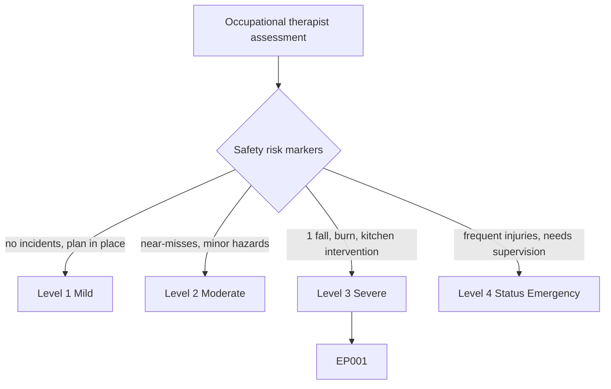
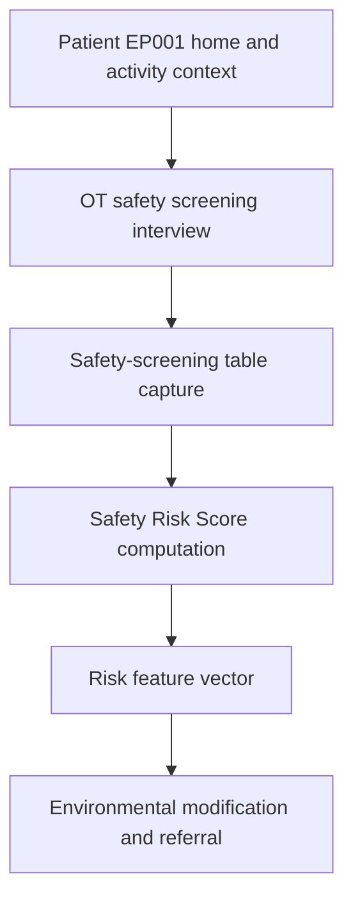
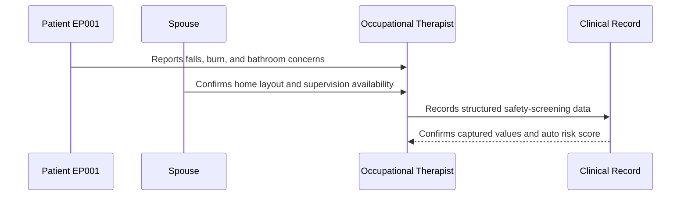
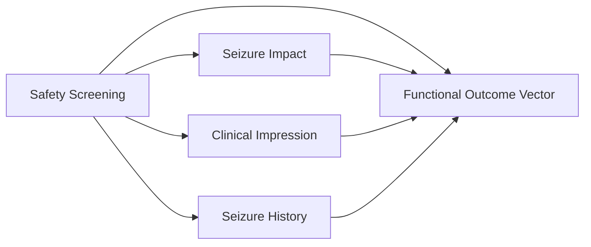
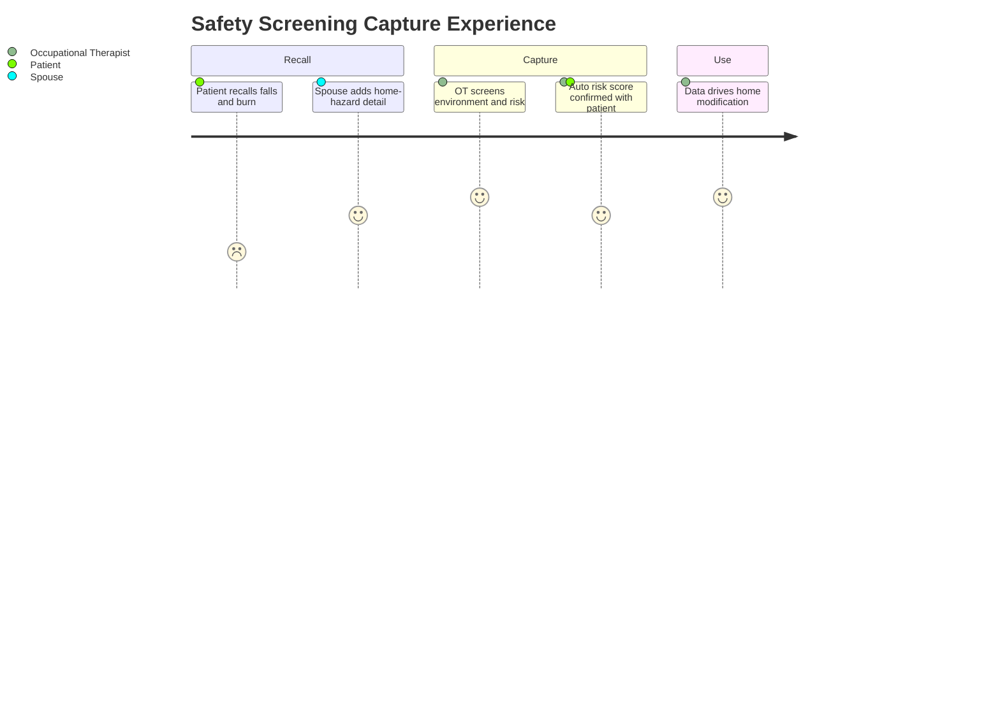

# Occupational Therapist Assessment — Section 6: Initial Safety Screening (EP001)

> **Why (this doc):** Initial safety screening is the risk-detection core of the occupational-therapy record; seizures create fall, burn, and drowning hazards during everyday tasks, so the home and activity environment must be screened before any occupation is resumed. **How:** The occupational therapist captures structured safety-risk descriptors for patient EP001 into a fixed variable/value table that feeds the downstream risk vector and analytics pipeline.

**Problem:** Seizure-related injuries frequently occur during routine activities such as cooking, bathing, and using stairs, yet environmental and personal safety risks are often not screened systematically at first contact.

**Research Objective:** Capture standardized safety-screening variables for EP001 so that immediate hazards can be reliably linked to impact, clinical-impression, and outcome data across the assessment.

**Role:** Occupational Therapist · **Type:** Primary (functional) data

*Caption - Core safety-screening variables for EP001, recorded by the occupational therapist. These values flag environmental and personal hazards and anchor the safety-risk profile for the rest of the epilepsy workup.*

| Variable | Value |
|---|---|
| OT051 Falls within past 12 months | Yes — 1 fall |
| OT052 Burns/kitchen accidents | Yes — minor burn during cooking |
| OT053 Bathroom safety concerns | Yes — no grab rails, uses bathtub |
| OT054 Stairs present at home | Yes |
| OT055 Lives alone | No — lives with spouse |
| OT056 Uses mobility aids | No |
| OT057 Emergency response plan available | Partial — informal plan, not documented |
| OT058 Immediate OT intervention required | Yes — kitchen safety |
| OT059 Safety notes | Priority hazard is unsupervised cooking; recommend hob guards, kettle/meal-prep modification, bathroom grab rails |
| OT060 Safety Risk Score (Auto) | 70% (High) |

## Questionnaire (Enterprise Form)

*Caption - The questions the occupational therapist asks for this section, with response type, validation, EP001's example answer, and the derived AI feature.*

| ID | Question | Response Type | Validation | EP001 (Example) | AI Feature |
|---|---|---|---|---|---|
| OT051 | Has the patient had any falls in the past 12 months? | Yes-No | Yes or No (record count) | Yes — 1 fall | fall_history_flag |
| OT052 | Has the patient had any burns or kitchen accidents? | Yes-No | Yes or No | Yes — minor burn during cooking | burn_incident_flag |
| OT053 | Are there bathroom safety concerns? | Yes-No | Yes or No | Yes — no grab rails, uses bathtub | bathroom_hazard_flag |
| OT054 | Are stairs present at the patient's home? | Yes-No | Yes or No | Yes | stairs_present_flag |
| OT055 | Does the patient live alone? | Yes-No | Yes or No | No — lives with spouse | lives_alone_flag |
| OT056 | Does the patient use mobility aids? | Yes-No | Yes or No | No | mobility_aid_flag |
| OT057 | Is an emergency response plan available? | Dropdown[Yes/No/Partial] | One of allowed set | Partial — informal plan, not documented | emergency_plan_status |
| OT058 | Is immediate OT intervention required? | Yes-No | Yes or No | Yes — kitchen safety | immediate_intervention_flag |
| OT059 | Record safety notes and recommended modifications. | Text | Free text, 20-500 chars | Priority hazard is unsupervised cooking; recommend hob guards, kettle/meal-prep modification, bathroom grab rails | safety_notes_embedding |
| OT060 | Aggregate safety risk score for the patient. | Read-only(Auto) | 0-100%, system-derived | 70% (High) | safety_risk_score |

## Severity Scenario Model — Occupational Therapist View

*Caption - The same assessment answered across four epilepsy severity levels from the occupational therapist's point of view; each variable shifts with severity. EP001 corresponds to Level 3 (Severe). Level 4 is the operational emergency — status epilepticus with seizures recurring about every 5 minutes.*

### Level 1 — Mild (Well-Controlled)
| Variable | Value |
|---|---|
| OT051 Falls within past 12 months | No |
| OT052 Burns/kitchen accidents | No |
| OT053 Bathroom safety concerns | No |
| OT054 Stairs present at home | Yes |
| OT055 Lives alone | No |
| OT056 Uses mobility aids | No |
| OT057 Emergency response plan available | Yes — documented |
| OT058 Immediate OT intervention required | No |
| OT059 Safety notes | No active hazards; standard seizure-safety advice given |
| OT060 Safety Risk Score (Auto) | 10% (Low) |

### Level 2 — Moderate (Intermediate)
| Variable | Value |
|---|---|
| OT051 Falls within past 12 months | No |
| OT052 Burns/kitchen accidents | Near-miss only |
| OT053 Bathroom safety concerns | Minor — slippery surface |
| OT054 Stairs present at home | Yes |
| OT055 Lives alone | No |
| OT056 Uses mobility aids | No |
| OT057 Emergency response plan available | Partial |
| OT058 Immediate OT intervention required | No — monitor |
| OT059 Safety notes | Some hazards; advise caution with cooking and bathing, review at follow-up |
| OT060 Safety Risk Score (Auto) | 35% (Moderate) |

### Level 3 — Severe (Poorly Controlled) — EP001
| Variable | Value |
|---|---|
| OT051 Falls within past 12 months | Yes — 1 fall |
| OT052 Burns/kitchen accidents | Yes — minor burn during cooking |
| OT053 Bathroom safety concerns | Yes — no grab rails, uses bathtub |
| OT054 Stairs present at home | Yes |
| OT055 Lives alone | No — lives with spouse |
| OT056 Uses mobility aids | No |
| OT057 Emergency response plan available | Partial — informal plan, not documented |
| OT058 Immediate OT intervention required | Yes — kitchen safety |
| OT059 Safety notes | Priority hazard is unsupervised cooking; recommend hob guards, kettle/meal-prep modification, bathroom grab rails |
| OT060 Safety Risk Score (Auto) | 70% (High) |

### Level 4 — Refractory / Status Epilepticus (Operational Emergency)
| Variable | Value |
|---|---|
| OT051 Falls within past 12 months | Yes — frequent falls with injuries |
| OT052 Burns/kitchen accidents | Yes — cooking prohibited after burn events |
| OT053 Bathroom safety concerns | Yes — drowning risk, bathing must be supervised |
| OT054 Stairs present at home | Yes — hazardous, needs relocation/stair gate |
| OT055 Lives alone | No — cannot be left alone at any time |
| OT056 Uses mobility aids | Yes — protective helmet, wheelchair for fatigue |
| OT057 Emergency response plan available | Yes — active emergency/rescue-medication protocol |
| OT058 Immediate OT intervention required | Yes — full supervision and environmental lockdown |
| OT059 Safety notes | Constant supervision required; seizures recurring every ~5 min (status); all high-risk occupations suspended |
| OT060 Safety Risk Score (Auto) | 100% (Critical) |

### Severity Classification Logic

**Reason:** Safety risk is graded along a severity ladder rather than a single hazard flag. **Why:** The number and severity of incidents plus environmental exposure decide intervention urgency for EP001. **What is happening:** Risk escalates from no incidents to frequent injuries requiring constant supervision in status. **How it is happening:** The occupational therapist grades incident history and environmental hazards against level thresholds. **Reference:** American Occupational Therapy Association (2020).

## Data Flow in the Pipeline

**Reason:** To show where safety-screening data enters and travels through the epilepsy data pipeline. **Why:** Because environmental modification depends on hazards being captured before any occupation is resumed. **What is happening:** Reported incidents and home features become structured, scored risk variables that populate the risk vector. **How it is happening:** The occupational therapist screens the environment, records it in the fixed table, computes the auto score, and passes the values forward. **Reference:** American Occupational Therapy Association (2020).

## Role Capturing the Data

**Reason:** To make explicit which role captures each element of the safety screen. **Why:** Because accountability and provenance matter for risk mitigation and research use. **What is happening:** The occupational therapist integrates patient and spouse input into a single verified record. **How it is happening:** Structured safety interview plus cohabitant corroboration is transcribed into the record and read back for confirmation. **Reference:** Fisher et al. (2017).

## Linkage to Other Assessment Sections

**Reason:** To show how safety screening connects to the wider functional vector. **Why:** Because safety risk must correlate with occupational impact and clinical impression for a valid OT plan. **What is happening:** Safety data links laterally to impact and impression sections and feeds the composite functional outcome vector. **How it is happening:** Shared patient identifiers and OT variable codes join these sections into one record. **Reference:** Topol (2019).

## Patient and Role Experience

**Reason:** To surface the lived experience of capturing this data item. **Why:** Because patients may minimize incidents out of embarrassment or fear of losing independence. **What is happening:** Patient and spouse recall is shaped into a confirmed, scored risk record. **How it is happening:** A guided safety interview plus concrete room-by-room prompts reduces under-reporting and improves accuracy. **Reference:** APA (2020).

## Professor Readiness (Defense Q&A)

**Q1: Why prioritize kitchen and bathroom hazards in epilepsy?** Cooking (burns/scalds) and bathing (drowning) are the everyday activities most associated with serious seizure-related injury, so they receive the earliest OT intervention.

**Q2: Why record whether the patient lives alone and has an emergency plan?** Living situation and response planning determine how quickly help arrives after a seizure, which directly modifies injury and SUDEP risk.

**Q3: Why compute an auto Safety Risk Score?** A structured composite score standardizes hazard grading across raters and lets safety risk be tracked against environmental modifications over time.

## References

American Occupational Therapy Association. (2020). *Occupational therapy practice framework: Domain and process* (4th ed.). *American Journal of Occupational Therapy, 74*(Suppl. 2), 7412410010. https://doi.org/10.5014/ajot.2020.74S2001

American Psychological Association. (2020). *Publication manual of the American Psychological Association* (7th ed.). American Psychological Association.

Fisher, R. S., Cross, J. H., French, J. A., Higurashi, N., Hirsch, E., Jansen, F. E., Lagae, L., Moshé, S. L., Peltola, J., Roulet Perez, E., Scheffer, I. E., & Zuberi, S. M. (2017). Operational classification of seizure types by the International League Against Epilepsy. *Epilepsia, 58*(4), 522–530. https://doi.org/10.1111/epi.13670

Topol, E. J. (2019). *Deep medicine: How artificial intelligence can make healthcare human again*. Basic Books.
