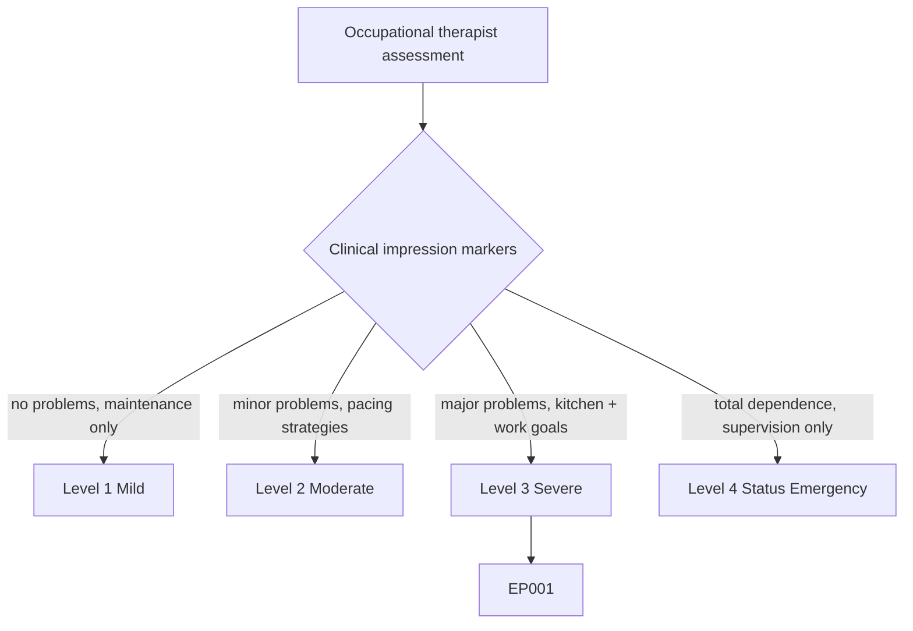
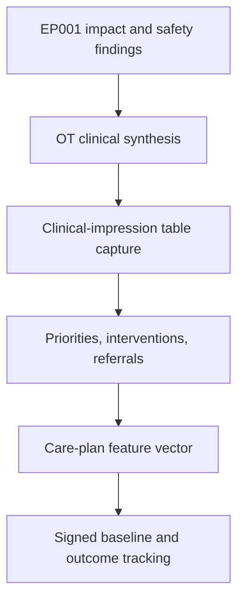
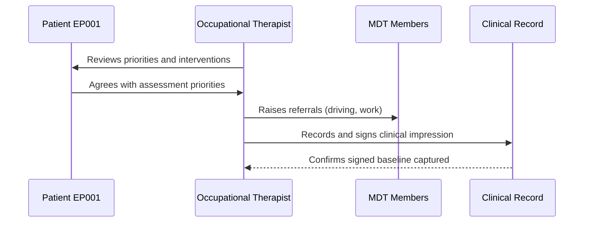
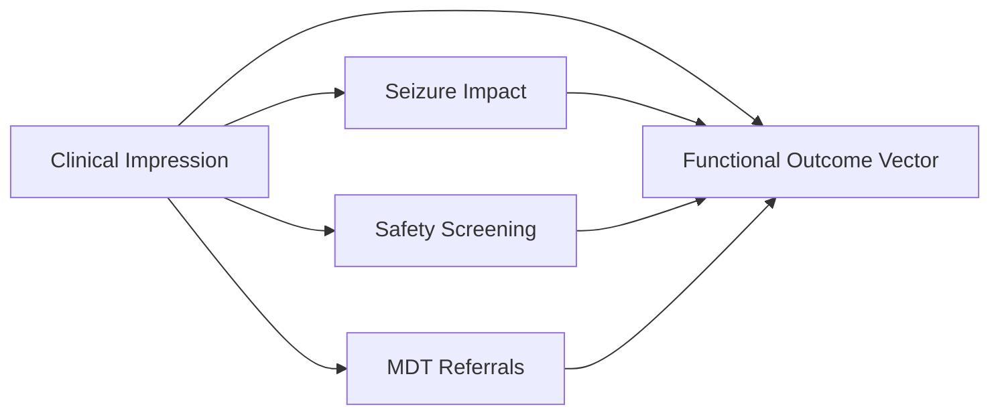
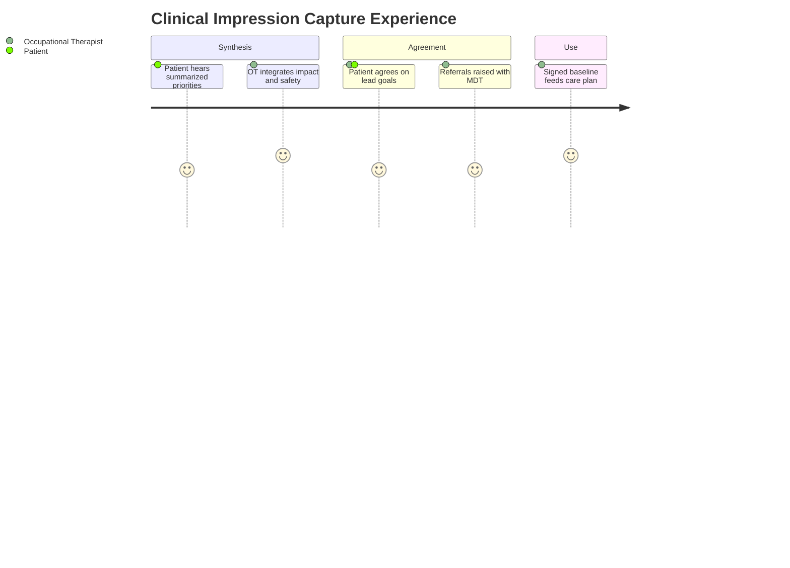

# Occupational Therapist Assessment — Section 7: Initial Clinical Impression (EP001)

> **Why (this doc):** Initial clinical impression is the synthesis point of the occupational-therapy record; it converts impact and safety findings into prioritized problems, interventions, and referrals, and closes the assessment with a signed baseline. **How:** The occupational therapist captures structured clinical-impression descriptors for patient EP001 into a fixed variable/value table that feeds the downstream care-plan vector and analytics pipeline.

**Problem:** Without a structured, signed OT impression, functional priorities and referral decisions vary between clinicians and the baseline needed to measure rehabilitation outcomes is lost.

**Research Objective:** Capture standardized clinical-impression variables for EP001 so that OT priorities, interventions, and baseline independence can be reliably linked to impact, safety, and outcome data across the assessment.

**Role:** Occupational Therapist · **Type:** Primary (functional) data

*Caption - Core clinical-impression variables for EP001, recorded by the occupational therapist. These values summarize occupational problems, set priorities and referrals, and establish the signed functional baseline for the rest of the epilepsy workup.*

| Variable | Value |
|---|---|
| OT061 Major occupational problems identified | Yes — work participation, meal-prep safety, community mobility |
| OT062 Highest-priority OT issue | Safe return to work + meal-prep (kitchen) safety |
| OT063 Immediate interventions recommended | Kitchen-safety modifications, energy/seizure-aware meal prep, graded return-to-work plan |
| OT064 Additional assessments required | Home safety assessment, driving/transport review |
| OT065 Referral to another MDT member recommended | Yes — neurologist (driving), social worker (work) |
| OT066 Patient agrees with assessment priorities | Yes |
| OT067 Baseline functional independence level | Independent with minor difficulty; needs assistance with cooking |
| OT068 Initial OT summary | Focal impaired-awareness epilepsy with high occupational impact and high safety risk; kitchen safety and return-to-work are lead goals |
| OT069 Assessment complete | Yes |
| OT070 Electronic signature | Signed — OT, 2026-07-11 |

## Questionnaire (Enterprise Form)

*Caption - The questions the occupational therapist asks for this section, with response type, validation, EP001's example answer, and the derived AI feature.*

| ID | Question | Response Type | Validation | EP001 (Example) | AI Feature |
|---|---|---|---|---|---|
| OT061 | Were major occupational problems identified? | Yes-No | Yes or No | Yes — work participation, meal-prep safety, community mobility | occupational_problem_flag |
| OT062 | What is the highest-priority OT issue? | Text | Free text, 5-300 chars | Safe return to work + meal-prep (kitchen) safety | priority_issue_intent |
| OT063 | Which immediate interventions are recommended? | Checklist | One or more interventions | Kitchen-safety modifications, energy/seizure-aware meal prep, graded return-to-work plan | recommended_intervention_set |
| OT064 | What additional assessments are required? | Checklist | Zero or more assessments | Home safety assessment, driving/transport review | additional_assessment_set |
| OT065 | Is referral to another MDT member recommended? | Yes-No | Yes or No | Yes — neurologist (driving), social worker (work) | mdt_referral_flag |
| OT066 | Does the patient agree with the assessment priorities? | Yes-No | Yes or No | Yes | patient_agreement_flag |
| OT067 | What is the baseline functional independence level? | Dropdown[Fully independent/Independent with minor difficulty/Requires assistance/Dependent] | One of allowed set | Independent with minor difficulty; needs assistance with cooking | baseline_independence_level |
| OT068 | Summarize the initial OT clinical impression. | Text | Free text, 20-500 chars | Focal impaired-awareness epilepsy with high occupational impact and high safety risk; kitchen safety and return-to-work are lead goals | clinical_impression_embedding |
| OT069 | Is the assessment complete? | Yes-No | Yes or No | Yes | assessment_complete_flag |
| OT070 | OT electronic signature closing the assessment. | Signature | Signed name + date | Signed — OT, 2026-07-11 | signature_verified_flag |

## Severity Scenario Model — Occupational Therapist View

*Caption - The same assessment answered across four epilepsy severity levels from the occupational therapist's point of view; each variable shifts with severity. EP001 corresponds to Level 3 (Severe). Level 4 is the operational emergency — status epilepticus with seizures recurring about every 5 minutes.*

### Level 1 — Mild (Well-Controlled)
| Variable | Value |
|---|---|
| OT061 Major occupational problems identified | No |
| OT062 Highest-priority OT issue | None — maintenance advice only |
| OT063 Immediate interventions recommended | Routine seizure-safety education |
| OT064 Additional assessments required | None |
| OT065 Referral to another MDT member recommended | No |
| OT066 Patient agrees with assessment priorities | Yes |
| OT067 Baseline functional independence level | Fully independent in all occupations |
| OT068 Initial OT summary | Well-controlled epilepsy; no functional limitation, discharge with advice |
| OT069 Assessment complete | Yes |
| OT070 Electronic signature | Signed — OT, 2026-07-11 |

### Level 2 — Moderate (Intermediate)
| Variable | Value |
|---|---|
| OT061 Major occupational problems identified | Minor — occasional work/home difficulty |
| OT062 Highest-priority OT issue | Energy management and activity pacing |
| OT063 Immediate interventions recommended | Pacing strategies, cautious cooking/bathing advice |
| OT064 Additional assessments required | Follow-up review |
| OT065 Referral to another MDT member recommended | Optional — monitor |
| OT066 Patient agrees with assessment priorities | Yes |
| OT067 Baseline functional independence level | Independent; minor supervision preferred for high-risk tasks |
| OT068 Initial OT summary | Moderate impact; independence preserved with strategies and review |
| OT069 Assessment complete | Yes |
| OT070 Electronic signature | Signed — OT, 2026-07-11 |

### Level 3 — Severe (Poorly Controlled) — EP001
| Variable | Value |
|---|---|
| OT061 Major occupational problems identified | Yes — work participation, meal-prep safety, community mobility |
| OT062 Highest-priority OT issue | Safe return to work + meal-prep (kitchen) safety |
| OT063 Immediate interventions recommended | Kitchen-safety modifications, energy/seizure-aware meal prep, graded return-to-work plan |
| OT064 Additional assessments required | Home safety assessment, driving/transport review |
| OT065 Referral to another MDT member recommended | Yes — neurologist (driving), social worker (work) |
| OT066 Patient agrees with assessment priorities | Yes |
| OT067 Baseline functional independence level | Independent with minor difficulty; needs assistance with cooking |
| OT068 Initial OT summary | Focal impaired-awareness epilepsy with high occupational impact and high safety risk; kitchen safety and return-to-work are lead goals |
| OT069 Assessment complete | Yes |
| OT070 Electronic signature | Signed — OT, 2026-07-11 |

### Level 4 — Refractory / Status Epilepticus (Operational Emergency)
| Variable | Value |
|---|---|
| OT061 Major occupational problems identified | Yes — total loss of independent occupation |
| OT062 Highest-priority OT issue | Safe supervision and injury prevention during status |
| OT063 Immediate interventions recommended | Full environmental lockdown, protective equipment, 24-hour supervision plan |
| OT064 Additional assessments required | Urgent inpatient review; carer capacity assessment |
| OT065 Referral to another MDT member recommended | Yes — emergency neurology, nursing, caregiver support |
| OT066 Patient agrees with assessment priorities | Unable — decisions via caregiver/next of kin |
| OT067 Baseline functional independence level | Dependent; requires assistance for all activities |
| OT068 Initial OT summary | Refractory status epilepticus; occupations suspended, care is safety and supervision only |
| OT069 Assessment complete | Yes — flagged for urgent escalation |
| OT070 Electronic signature | Signed — OT, 2026-07-11 |

### Severity Classification Logic

**Reason:** Clinical impression is graded along a severity ladder rather than a single verdict. **Why:** The number of major problems and level of baseline independence decide the OT care plan for EP001. **What is happening:** The impression escalates from maintenance advice to supervision-only care in status. **How it is happening:** The occupational therapist synthesizes impact and safety findings against level thresholds. **Reference:** American Occupational Therapy Association (2020).

## Data Flow in the Pipeline

**Reason:** To show where clinical-impression data enters and travels through the epilepsy data pipeline. **Why:** Because the care plan and outcome baseline depend on the impression being captured and signed before intervention. **What is happening:** Synthesized findings become structured priorities and referrals that populate the care-plan vector. **How it is happening:** The occupational therapist integrates prior sections, records the impression in the fixed table, signs it, and passes the values forward. **Reference:** American Occupational Therapy Association (2020).

## Role Capturing the Data

**Reason:** To make explicit which role captures each element of the clinical impression. **Why:** Because accountability and provenance matter for care planning and research use. **What is happening:** The occupational therapist agrees priorities with the patient and records a signed impression. **How it is happening:** Shared decision-making plus MDT referral is transcribed into the record and electronically signed. **Reference:** Fisher et al. (2017).

## Linkage to Other Assessment Sections

**Reason:** To show how clinical impression connects to the wider functional vector. **Why:** Because the impression must integrate impact and safety findings and drive referrals for a valid OT plan. **What is happening:** The impression links back to impact and safety sections and forward to MDT referrals and the outcome vector. **How it is happening:** Shared patient identifiers and OT variable codes join these sections into one record. **Reference:** Topol (2019).

## Patient and Role Experience

**Reason:** To surface the lived experience of capturing this data item. **Why:** Because agreeing priorities with the patient improves engagement and adherence to the OT plan. **What is happening:** Clinician synthesis and patient agreement are shaped into a confirmed, signed baseline. **How it is happening:** A shared-decision conversation plus electronic signature closes the assessment and sets the outcome baseline. **Reference:** APA (2020).

## Professor Readiness (Defense Q&A)

**Q1: Why record a baseline functional independence level?** The baseline is the reference against which all rehabilitation outcomes are measured; without it, improvement or decline cannot be quantified.

**Q2: Why require patient agreement with priorities?** Occupational therapy is goal-driven and collaborative; documented agreement improves engagement and makes the plan person-centred and defensible.

**Q3: Why capture an electronic signature and completion flag?** The signature provides accountability and provenance, and the completion flag confirms the assessment is finished and ready to hand off to the MDT and pipeline.

## References

American Occupational Therapy Association. (2020). *Occupational therapy practice framework: Domain and process* (4th ed.). *American Journal of Occupational Therapy, 74*(Suppl. 2), 7412410010. https://doi.org/10.5014/ajot.2020.74S2001

American Psychological Association. (2020). *Publication manual of the American Psychological Association* (7th ed.). American Psychological Association.

Fisher, R. S., Cross, J. H., French, J. A., Higurashi, N., Hirsch, E., Jansen, F. E., Lagae, L., Moshé, S. L., Peltola, J., Roulet Perez, E., Scheffer, I. E., & Zuberi, S. M. (2017). Operational classification of seizure types by the International League Against Epilepsy. *Epilepsia, 58*(4), 522–530. https://doi.org/10.1111/epi.13670

Topol, E. J. (2019). *Deep medicine: How artificial intelligence can make healthcare human again*. Basic Books.
