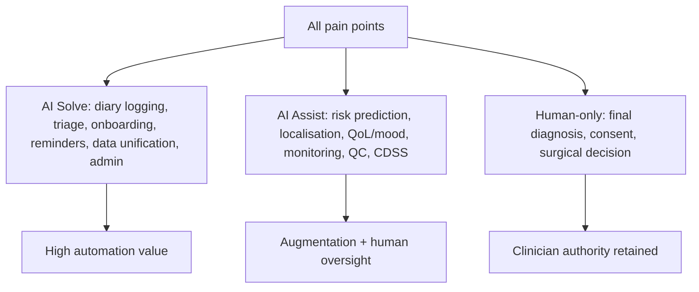

# Pain-Point Matrix — Scored & AI-Solvability (Patient-First)

> **Why (this doc):** Prioritises every stakeholder pain by impact × frequency and declares
> whether AI can **Solve** (largely automate), **Assist** (support the human), or is **Human-only**
> — so the roadmap targets the highest-value, AI-addressable problems. **How:** scored matrix with
> the **patient as the primary focus**, then supporting roles; links to the
> [pain-point register](pain-points-register.md) and [stakeholder matrix](../stakeholder-matrix.md).

Scoring: Impact 1–5 · Frequency 1–5 · **Priority = Impact × Frequency** (max 25).
AI role: **Solve** = AI can largely automate · **Assist** = AI augments a human · **Human** = needs a clinician/human.

## 1. PATIENT — primary focus

*Caption - The patient's lived pain points for EP001, scored and mapped to an AI capability and platform feature.*

| # | Patient pain point | Impact | Freq | Priority | AI role | Platform feature |
|---|---|---|---|---|---|---|
| P1 | Breakthrough seizures despite adherence | 5 | 4 | **20** | Assist | Risk prediction + regimen-optimisation support |
| P2 | Fear of seizures limits daily activities | 4 | 5 | **20** | Assist | Seizure-likelihood + remote monitoring + education |
| P3 | Loss of driving / independence | 5 | 3 | 15 | Assist | Seizure-freedom tracking + counselling |
| P4 | Seizure-diary burden / recall bias | 3 | 5 | 15 | **Solve** | Wearable auto-logging + app diary |
| P5 | Medication side-effects (dizziness, fatigue) | 3 | 4 | 12 | Assist | Side-effect self-report + alerts |
| P6 | Poor sleep / trigger exposure | 3 | 4 | 12 | Assist | Sleep/trigger monitoring + nudges |
| P7 | Anxiety & low mood (GAD-7=9, NDDI-E↑) | 4 | 3 | 12 | Assist | Automated screening + referral |
| P8 | Not knowing when to seek help | 4 | 3 | 12 | **Solve** | Thresholded alerts + triage |
| P9 | Slow / incomplete onboarding | 3 | 3 | 9 | **Solve** | GenAI intake agent |
| P10 | Reduced quality of life (QOLIE-31 ~55) | 4 | 4 | **16** | Assist | PRO tracking + care-plan targeting |

**Patient summary:** highest-priority AI-addressable pains are **P1/P2 (20), P10 (16), P3/P4 (15)** —
all *Assist* except diary auto-logging, triage, and onboarding which AI can largely *Solve*.

## 2. Caregiver

| Pain | Impact | Freq | Priority | AI role | Feature |
|---|---|---|---|---|---|
| Witnessed-seizure burden / distress | 4 | 4 | 16 | Assist | Home monitoring + rescue guidance |
| Uncertainty when to call emergency | 5 | 2 | 10 | Solve | Status/cluster alert |
| Medication reminders at home | 2 | 5 | 10 | Solve | Reminder + adherence tracking |

## 3. Neurologist

| Pain | Impact | Freq | Priority | AI role | Feature |
|---|---|---|---|---|---|
| Fragmented multi-role data | 4 | 5 | 20 | Solve | Unified clinical vector |
| Localising the epileptogenic focus | 5 | 3 | 15 | Assist | Explainable localisation (SHAP + region) |
| Breakthrough despite adherence | 5 | 3 | 15 | Assist | Drug-resistance risk + CDSS |
| Consultation time pressure | 3 | 5 | 15 | Assist | Pre-visit summary + triage |

## 4. EEG Technician / Radiologist (secondary)

| Pain | Impact | Freq | Priority | AI role | Feature |
|---|---|---|---|---|---|
| High impedance / artifact | 4 | 4 | 16 | Assist | Real-time QC scoring |
| Non-epilepsy-protocol / low-field MRI misses MTS | 5 | 3 | 15 | Assist | Protocol check + concordance (future scope) |
| Imaging–EEG discordance | 4 | 3 | 12 | Assist | Multimodal concordance view |

## 5. Nurse · Neuropsychologist · Pharmacist · OT · Administrator (condensed)

| Role | Top pain | Priority | AI role |
|---|---|---|---|
| Nurse | Injury/fall & adherence risk | 15 | Assist |
| Neuropsychologist | Long test batteries / comorbidity load | 12 | Assist |
| Pharmacist | Drug resistance & interactions (CBZ inducer) | 16 | Assist |
| Occupational Therapist | Return-to-work & home safety | 12 | Assist |
| Administrator | Scheduling / coding / authorisation | 12 | Solve |

## AI-solvability summary

*Caption - Distribution of pain points by what AI can do — most are Assist (human-in-the-loop), a minority fully Solve.*

**Reason:** To route each pain to the right AI posture. **Why:** Over-automating clinical judgment is unsafe; under-using AI wastes value. **What is happening:** Logging/triage/admin pains are automatable; clinical-judgment pains are assist-only; diagnosis stays human. **How it is happening:** Each pain is scored and tagged; the platform implements Solve/Assist features while the neurologist retains authority. **Reference:** Topol (2019).

## Professor Readiness (Defense Q&A)

**Q1: Why is the patient the primary focus?** Patient outcomes (seizure freedom, QoL, independence) are the ultimate KPI; the highest-priority pains (P1/P2/P10) are patient-centred.

**Q2: Why are most pains "Assist" not "Solve"?** Clinical safety and regulation require human-in-the-loop; AI augments judgment (risk, localisation, monitoring) rather than replacing it.

**Q3: How is priority computed?** Impact × Frequency (max 25); it ranks the roadmap so AI-Solve, high-priority items (e.g., diary auto-logging, triage) are built first.

## References

Topol, E. J. (2019). *Deep medicine: How artificial intelligence can make healthcare human again*. Basic Books.

American Psychological Association. (2020). *Publication manual of the American Psychological Association* (7th ed.).
