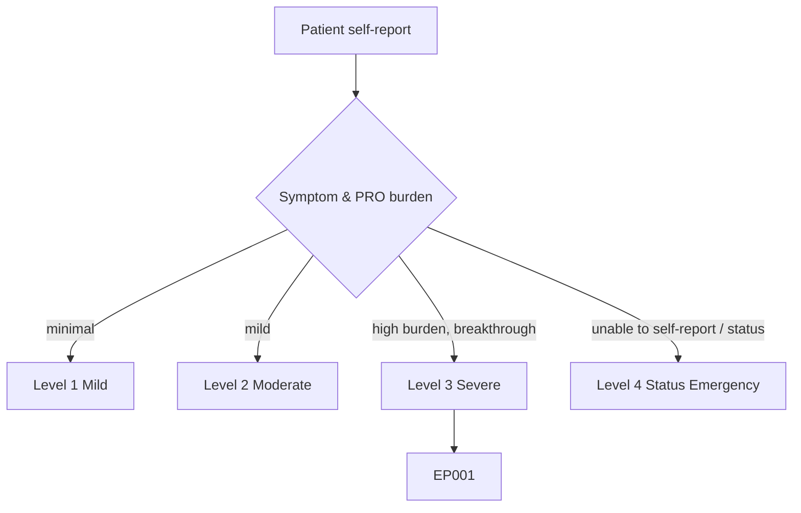
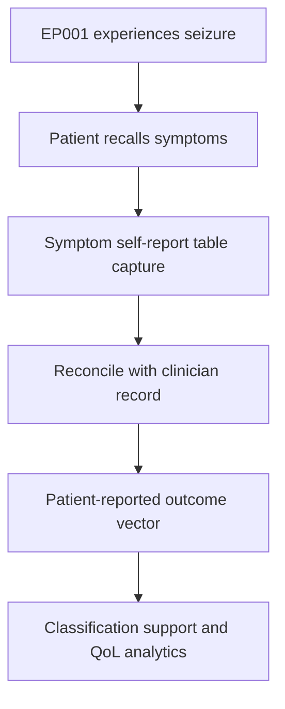
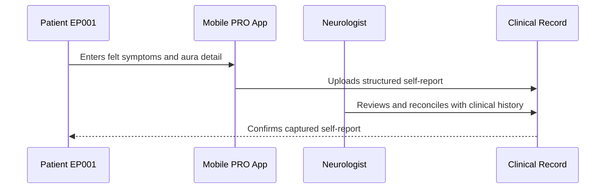
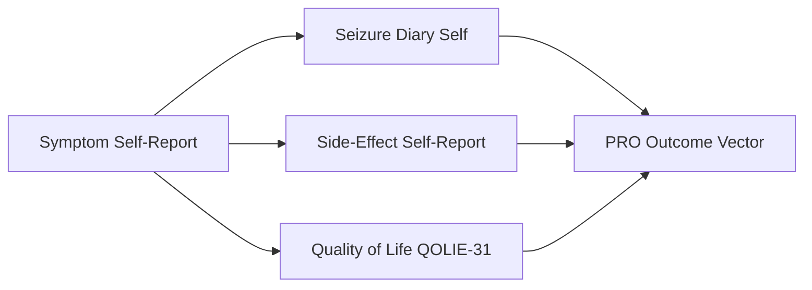
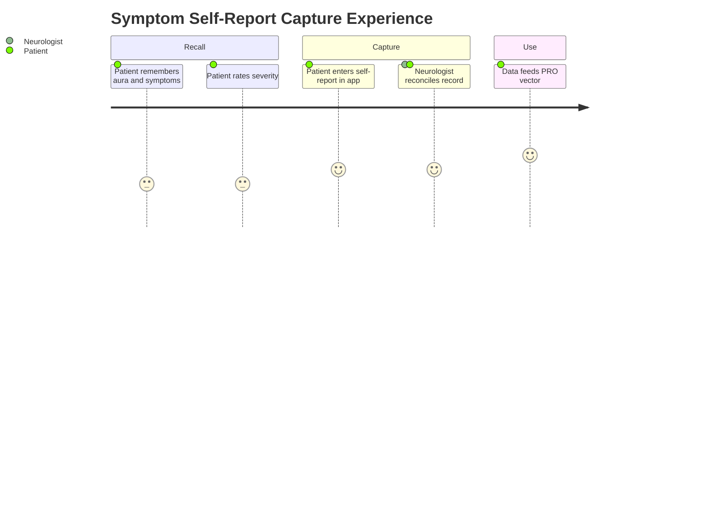

# Patient Self-Report — Section 1: Symptom Self-Report (EP001)

> **Why (this doc):** The patient's own account of what a seizure feels like is the primary experiential signal in the epilepsy record; it captures subjective symptoms — auras, awareness, and post-ictal state — that only the person living with the seizures can report. **How:** Patient EP001 enters structured first-person symptom descriptors into a fixed variable/value table that is reconciled with the clinical record and feeds the downstream patient-reported-outcome (PRO) vector.

**Problem:** Clinician-only records miss the subjective symptom detail (aura quality, felt severity, recovery burden) that shapes classification and quality-of-life estimates in focal epilepsy.

**Research Objective:** Capture standardized, first-person symptom self-report variables for EP001 so subjective seizure experience can be linked to clinical, therapeutic, and outcome data across the assessment.

**Role:** Patient · **Type:** Primary (patient-reported outcome) data

*Caption - Core symptom self-report variables as described by EP001 in his own words. These values anchor the subjective side of seizure classification and burden, complementing the neurologist's clinical record.*

| Variable | Value |
|---|---|
| What I Feel Before a Seizure | Metallic taste, then déjà vu |
| Warning Time Before Seizure | About 10–20 seconds |
| Speech During Warning | Words come out wrong or slow |
| Awareness During Seizure | I lose track, cannot respond |
| How Often (my count) | About 5 per month |
| Typical Length (my sense) | Roughly a minute or two |
| After a Seizure I Feel | Confused, headache, very tired |
| Recovery Time I Need | 30–60 minutes before I feel normal |
| Worst Symptom For Me | The confusion afterward |
| Do I Log Every Event | Yes, in my phone diary |
| Confidence In My Report | High for auras, medium for exact timing |

## Questionnaire (Enterprise Form)

*Caption - The self-report questions the patient answers for this section, with response type, validation, EP001's example answer, and the derived AI feature.*

| ID | Question | Response Type | Validation | EP001 (Example) | AI Feature |
|---|---|---|---|---|---|
| PAT-0101 | What do I feel just before a seizure? | Dropdown[Metallic taste/Déjà vu/Rising sensation/Fear/Visual change/None] | Free-text allowed; ≤200 chars | Metallic taste, then déjà vu | aura_symptom_profile |
| PAT-0102 | How much warning time do I get before a seizure? | Dropdown[None/<10 sec/10–30 sec/30–60 sec/>1 min] | Ordered category | About 10–20 seconds | aura_warning_window |
| PAT-0103 | What happens to my speech during the warning? | Dropdown[Normal/Slow/Words wrong/Cannot speak] | Ordered category | Words come out wrong or slow | ictal_speech_impairment |
| PAT-0104 | How aware am I during a seizure? | Dropdown[Fully aware/Partly aware/Lose track/Unconscious] | Ordered category | I lose track, cannot respond | awareness_impairment_level |
| PAT-0105 | How many seizures do I have per month (my count)? | Number | Integer 0–150/month | About 5 per month | self_reported_seizure_frequency |
| PAT-0106 | How long does a typical seizure last? | Dropdown[<1 min/1–2 min/2–5 min/>5 min] | Ordered category | Roughly a minute or two | typical_seizure_duration |
| PAT-0107 | How do I feel after a seizure? | Text | Free-text ≤200 chars | Confused, headache, very tired | postictal_symptom_profile |
| PAT-0108 | How long do I need to recover after a seizure? | Dropdown[<10 min/10–30 min/30–60 min/>1 hr] | Ordered category | 30–60 minutes before I feel normal | postictal_recovery_burden |
| PAT-0109 | Which symptom bothers me most? | Text | Free-text ≤120 chars | The confusion afterward | dominant_symptom_flag |
| PAT-0110 | Do I log every seizure event? | Yes-No | Boolean | Yes, in my phone diary | diary_logging_flag |
| PAT-0111 | How confident am I in my report? | Dropdown[Low/Medium/High/Mixed] | Ordered category | High for auras, medium for exact timing | self_report_confidence |

## Severity Scenario Model — Patient View

*Caption - The same self-report across four epilepsy severity levels from the patient's point of view; each self-reported variable shifts with severity. EP001 corresponds to Level 3 (Severe). Level 4 is the operational emergency — status epilepticus with seizures recurring about every 5 minutes.*

### Level 1 — Mild (Well-Controlled)
| Variable | Value |
|---|---|
| What I Feel Before a Seizure | Rare, faint metallic taste |
| Warning Time Before Seizure | Ample, over a minute |
| Speech During Warning | Normal |
| Awareness During Seizure | Fully aware (rare events) |
| How Often (my count) | Seizure-free or 1–2/year |
| Typical Length (my sense) | Under a minute |
| After a Seizure I Feel | Back to normal quickly |
| Recovery Time I Need | A few minutes |
| Worst Symptom For Me | Barely any |
| Do I Log Every Event | Yes, rarely needed |
| Confidence In My Report | High |

### Level 2 — Moderate (Intermediate)
| Variable | Value |
|---|---|
| What I Feel Before a Seizure | Metallic taste sometimes |
| Warning Time Before Seizure | About 30 seconds |
| Speech During Warning | Occasionally slow |
| Awareness During Seizure | Sometimes lose track briefly |
| How Often (my count) | About 1 per month |
| Typical Length (my sense) | About a minute |
| After a Seizure I Feel | Mildly tired |
| Recovery Time I Need | 10–20 minutes |
| Worst Symptom For Me | Mild tiredness |
| Do I Log Every Event | Yes |
| Confidence In My Report | High |

### Level 3 — Severe (Poorly Controlled) — EP001
| Variable | Value |
|---|---|
| What I Feel Before a Seizure | Metallic taste, then déjà vu |
| Warning Time Before Seizure | About 10–20 seconds |
| Speech During Warning | Words come out wrong or slow |
| Awareness During Seizure | I lose track, cannot respond |
| How Often (my count) | About 5 per month |
| Typical Length (my sense) | Roughly a minute or two |
| After a Seizure I Feel | Confused, headache, very tired |
| Recovery Time I Need | 30–60 minutes before I feel normal |
| Worst Symptom For Me | The confusion afterward |
| Do I Log Every Event | Yes, in my phone diary |
| Confidence In My Report | High for auras, medium for exact timing |

### Level 4 — Refractory / Status Epilepticus (Operational Emergency)
| Variable | Value |
|---|---|
| What I Feel Before a Seizure | No warning — seizures back-to-back |
| Warning Time Before Seizure | None; cannot perceive |
| Speech During Warning | Unable to speak |
| Awareness During Seizure | Unconscious / no awareness |
| How Often (my count) | Every ~5 minutes (cannot count) |
| Typical Length (my sense) | Continuous / unable to judge |
| After a Seizure I Feel | Cannot report (emergency care) |
| Recovery Time I Need | Hospitalized, prolonged |
| Worst Symptom For Me | Cannot self-report during status |
| Do I Log Every Event | No — logged retrospectively by proxy |
| Confidence In My Report | N/A — report by family/paramedic |

### Severity Classification Logic

**Reason:** To show how the patient's own symptom account scales across severity. **Why:** Because felt aura, awareness, and recovery burden grow heavier as control worsens. **What is happening:** EP001 sits at Level 3 with reliable self-report, while Level 4 removes the ability to self-report at all. **How it is happening:** Rising symptom and recovery burden move the patient down the ladder until status forces proxy reporting. **Reference:** Fisher et al. (2017).

## Data Flow in the Pipeline

**Reason:** To show where subjective symptom data enters and travels through the epilepsy pipeline. **Why:** Because felt symptoms such as aura quality are only knowable from the patient and must be captured before reconciliation. **What is happening:** Lived seizure experience becomes structured PRO variables that join the clinical vector. **How it is happening:** EP001 records first-person descriptors that are mapped to standardized fields and merged with the neurologist record. **Reference:** Fisher et al. (2017).

## Role Capturing the Data

**Reason:** To make explicit that the patient is the capturing role for subjective symptoms. **Why:** Because provenance of experiential data must be attributed to the patient. **What is happening:** EP001 self-enters symptoms that the neurologist later reconciles. **How it is happening:** The app transcribes first-person input into structured fields that the record reads back for confirmation. **Reference:** Fisher et al. (2017).

## Linkage to Other Assessment Sections

**Reason:** To show how symptom self-report connects to the wider PRO vector. **Why:** Because subjective symptoms must correlate with diary frequency and quality-of-life scores. **What is happening:** Self-reported symptoms link laterally to diary and QoL sections and feed the composite PRO vector. **How it is happening:** Shared patient identifiers join these sections into one record. **Reference:** Topol (2019).

## Patient and Role Experience

**Reason:** To surface the lived experience of reporting symptoms. **Why:** Because recall effort and post-ictal confusion affect self-report quality. **What is happening:** EP001's felt experience is shaped into a confirmed, usable record. **How it is happening:** A guided app template plus prompt reminders reduce recall gaps after post-ictal confusion. **Reference:** APA (2020).

## Professor Readiness (Defense Q&A)

**Q1: Why collect symptom data from the patient when the neurologist already documents it?** Aura quality, felt warning time, and recovery burden are subjective and only fully accessible to the patient; PRO capture adds signal the clinician record cannot fully hold.

**Q2: How do you handle post-ictal confusion affecting recall?** The app uses fixed templated prompts and allows entry once the patient feels able, and confidence flags mark fields (e.g., exact timing) that are less reliable.

**Q3: Why standardize the self-report into fixed variables?** Fixed variables make first-person input machine-readable and comparable across events, enabling reconciliation with the clinical vector and longitudinal PRO analytics.

## References

American Psychological Association. (2020). *Publication manual of the American Psychological Association* (7th ed.). American Psychological Association. https://doi.org/10.1037/0000165-000

Fisher, R. S., Cross, J. H., French, J. A., Higurashi, N., Hirsch, E., Jansen, F. E., Lagae, L., Moshé, S. L., Peltola, J., Roulet Perez, E., Scheffer, I. E., & Zuberi, S. M. (2017). Operational classification of seizure types by the International League Against Epilepsy. *Epilepsia, 58*(4), 522–530. https://doi.org/10.1111/epi.13670

Topol, E. J. (2019). *Deep medicine: How artificial intelligence can make healthcare human again*. Basic Books.
