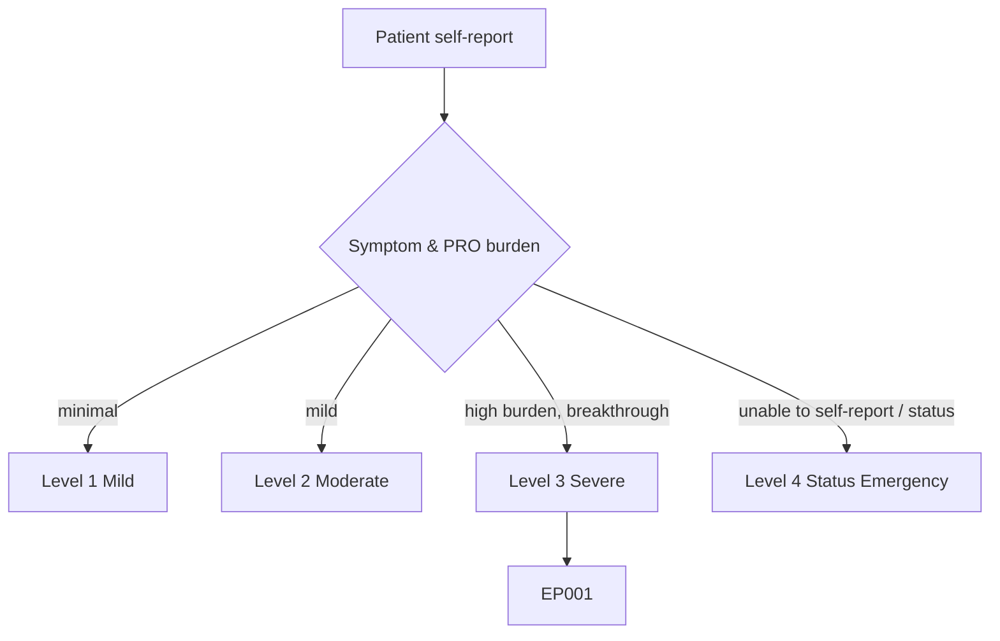
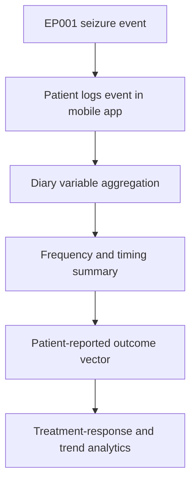
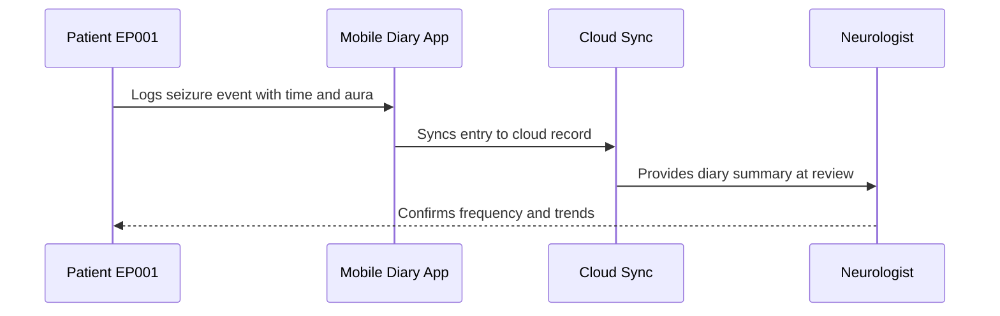
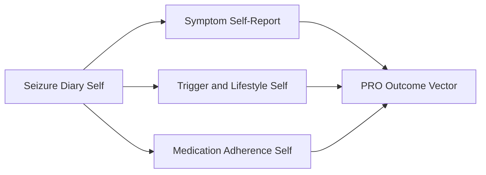
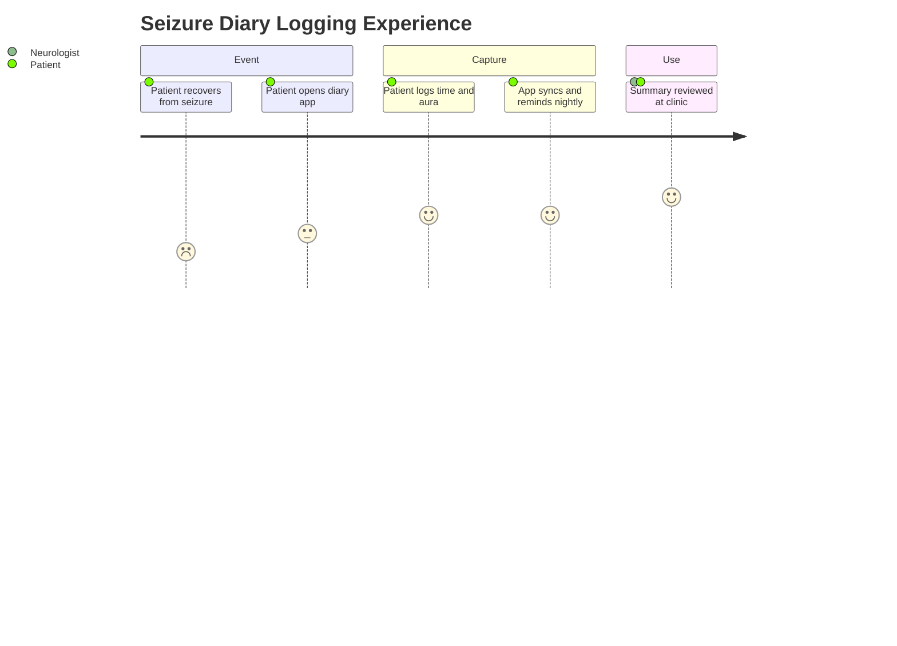

# Patient Self-Report — Section 2: Self-Logged Seizure Diary (Mobile App) (EP001)

> **Why (this doc):** A prospective, patient-logged seizure diary is the most reliable source of real-world seizure frequency and timing; it reduces the recall bias that distorts retrospective clinic counts. **How:** Patient EP001 logs each event in a mobile diary app, and the aggregated diary variables are captured into a fixed variable/value table that feeds the downstream patient-reported-outcome (PRO) vector.

**Problem:** Retrospective clinic recall systematically undercounts focal seizures, producing unreliable frequency estimates that misinform treatment decisions.

**Research Objective:** Capture standardized, prospectively logged seizure-diary variables for EP001 so real-world seizure burden can be reliably linked to clinical and outcome data.

**Role:** Patient · **Type:** Primary (patient-reported outcome) data

*Caption - Aggregated self-logged seizure-diary variables recorded by EP001 in his mobile app. These values quantify real-world seizure burden and timing that anchor treatment-response tracking.*

| Variable | Value |
|---|---|
| Diary Tool | Mobile App (daily) |
| Logging Method | Self-entry after each event |
| Events Logged This Month | 5 |
| Average Per Month (3-mo) | 5.0 |
| Most Recent Event | 2026-07-08 |
| Typical Time of Day | Late evening / night |
| Nocturnal Events Logged | 2 of 5 |
| Aura Logged Before Event | 4 of 5 |
| Missed-Dose Flag On Event Day | 1 of 5 |
| Average Logging Delay | Within 2 hours |
| Diary Adherence (days logged) | 27 of 30 days |
| Reminder Notifications | Enabled (nightly) |

## Severity Scenario Model — Patient View

*Caption - The same self-report across four epilepsy severity levels from the patient's point of view; each self-reported variable shifts with severity. EP001 corresponds to Level 3 (Severe). Level 4 is the operational emergency — status epilepticus with seizures recurring about every 5 minutes.*

### Level 1 — Mild (Well-Controlled)
| Variable | Value |
|---|---|
| Diary Tool | Mobile App (daily) |
| Logging Method | Self-entry (rarely needed) |
| Events Logged This Month | 0 |
| Average Per Month (3-mo) | 0–0.2 |
| Most Recent Event | None in 6+ months |
| Typical Time of Day | N/A |
| Nocturnal Events Logged | 0 |
| Aura Logged Before Event | N/A |
| Missed-Dose Flag On Event Day | N/A |
| Average Logging Delay | N/A |
| Diary Adherence (days logged) | 30 of 30 days |
| Reminder Notifications | Enabled (nightly) |

### Level 2 — Moderate (Intermediate)
| Variable | Value |
|---|---|
| Diary Tool | Mobile App (daily) |
| Logging Method | Self-entry after each event |
| Events Logged This Month | 1 |
| Average Per Month (3-mo) | 1.0 |
| Most Recent Event | 2026-06-20 |
| Typical Time of Day | Variable |
| Nocturnal Events Logged | 0 of 1 |
| Aura Logged Before Event | 1 of 1 |
| Missed-Dose Flag On Event Day | 0 of 1 |
| Average Logging Delay | Within 3 hours |
| Diary Adherence (days logged) | 29 of 30 days |
| Reminder Notifications | Enabled (nightly) |

### Level 3 — Severe (Poorly Controlled) — EP001
| Variable | Value |
|---|---|
| Diary Tool | Mobile App (daily) |
| Logging Method | Self-entry after each event |
| Events Logged This Month | 5 |
| Average Per Month (3-mo) | 5.0 |
| Most Recent Event | 2026-07-08 |
| Typical Time of Day | Late evening / night |
| Nocturnal Events Logged | 2 of 5 |
| Aura Logged Before Event | 4 of 5 |
| Missed-Dose Flag On Event Day | 1 of 5 |
| Average Logging Delay | Within 2 hours |
| Diary Adherence (days logged) | 27 of 30 days |
| Reminder Notifications | Enabled (nightly) |

### Level 4 — Refractory / Status Epilepticus (Operational Emergency)
| Variable | Value |
|---|---|
| Diary Tool | Hospital record (app not usable) |
| Logging Method | Proxy entry by family/clinician |
| Events Logged This Month | Uncountable (continuous) |
| Average Per Month (3-mo) | Status episode |
| Most Recent Event | Ongoing / status |
| Typical Time of Day | Continuous |
| Nocturnal Events Logged | N/A |
| Aura Logged Before Event | None perceived |
| Missed-Dose Flag On Event Day | Unknown |
| Average Logging Delay | Retrospective only |
| Diary Adherence (days logged) | Cannot self-log during status |
| Reminder Notifications | N/A — emergency care |

### Severity Classification Logic

**Reason:** To show how self-logged diary burden scales across severity. **Why:** Because logged event counts and timing rise as seizure control worsens. **What is happening:** EP001 logs about 5 events/month at Level 3, while Level 4 makes real-time logging impossible. **How it is happening:** Rising event frequency drives the patient down the ladder until status forces proxy, retrospective records. **Reference:** Fisher et al. (2017).

## Data Flow in the Pipeline

**Reason:** To show where prospectively logged diary data enters and travels through the pipeline. **Why:** Because real-world frequency depends on capture at the moment of the event, not at the next clinic visit. **What is happening:** Individual logged events aggregate into frequency and timing summaries that populate the PRO vector. **How it is happening:** EP001 records each event in the app, which computes rolling summaries passed forward. **Reference:** Fisher et al. (2017).

## Role Capturing the Data

**Reason:** To make explicit that the patient captures each diary event. **Why:** Because prospective self-logging is the provenance of reliable frequency data. **What is happening:** EP001 logs events that sync and surface at clinical review. **How it is happening:** The app timestamps and stores each entry, then computes summaries the neurologist reviews. **Reference:** Topol (2019).

## Linkage to Other Assessment Sections

**Reason:** To show how the diary connects to the wider PRO vector. **Why:** Because event timing must correlate with triggers and missed doses to be interpretable. **What is happening:** Diary events link laterally to trigger and adherence sections and feed the composite PRO vector. **How it is happening:** Shared patient identifiers and event timestamps join these sections into one record. **Reference:** Topol (2019).

## Patient and Role Experience

**Reason:** To surface the lived experience of daily logging. **Why:** Because logging burden and post-ictal state affect diary completeness. **What is happening:** EP001's events are captured close to real time despite recovery burden. **How it is happening:** Nightly reminders and a quick-entry template sustain 27-of-30-day diary adherence. **Reference:** APA (2020).

## Professor Readiness (Defense Q&A)

**Q1: Why is a prospective diary more reliable than clinic recall?** Prospective logging captures events near the time they occur, reducing recall bias that causes retrospective clinic counts to undercount focal seizures.

**Q2: How do you know the diary is complete?** Diary adherence is tracked (27 of 30 days logged) and reminder notifications are enabled, so gaps are visible and can be flagged rather than silently missing.

**Q3: How does the diary support treatment decisions?** Rolling frequency, nocturnal share, and missed-dose flags let the neurologist correlate breakthrough events with adherence and triggers when reviewing medication response.

## References

American Psychological Association. (2020). *Publication manual of the American Psychological Association* (7th ed.). American Psychological Association. https://doi.org/10.1037/0000165-000

Fisher, R. S., Cross, J. H., French, J. A., Higurashi, N., Hirsch, E., Jansen, F. E., Lagae, L., Moshé, S. L., Peltola, J., Roulet Perez, E., Scheffer, I. E., & Zuberi, S. M. (2017). Operational classification of seizure types by the International League Against Epilepsy. *Epilepsia, 58*(4), 522–530. https://doi.org/10.1111/epi.13670

Topol, E. J. (2019). *Deep medicine: How artificial intelligence can make healthcare human again*. Basic Books.
