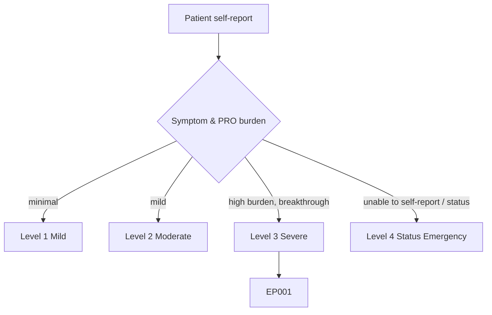
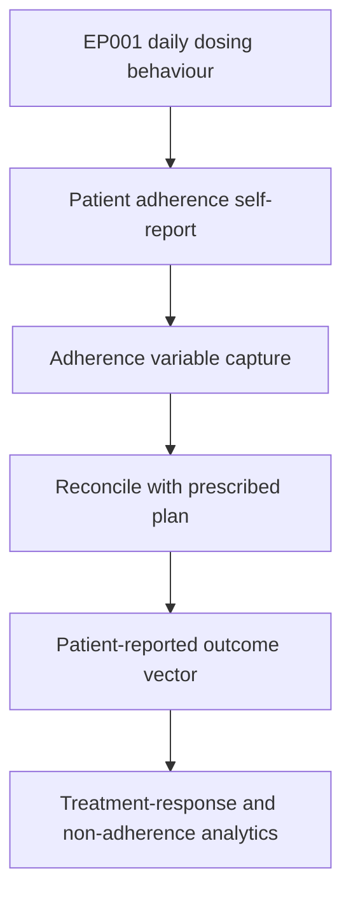
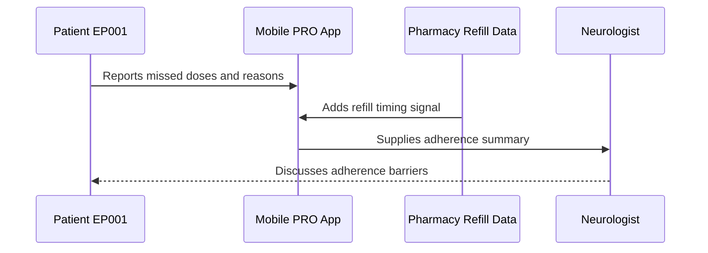
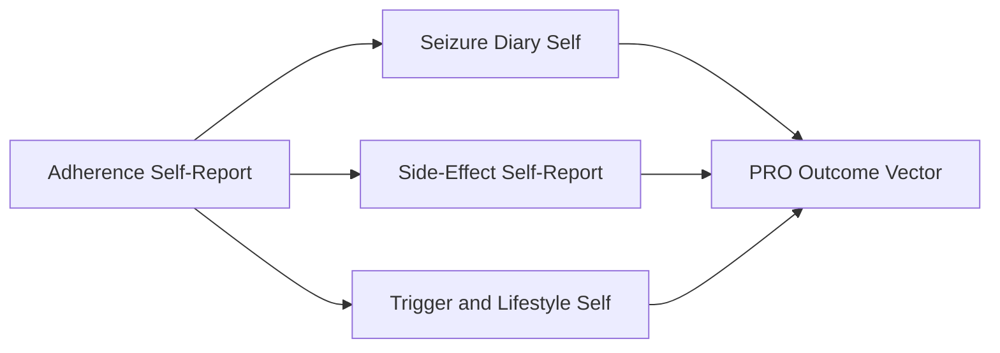
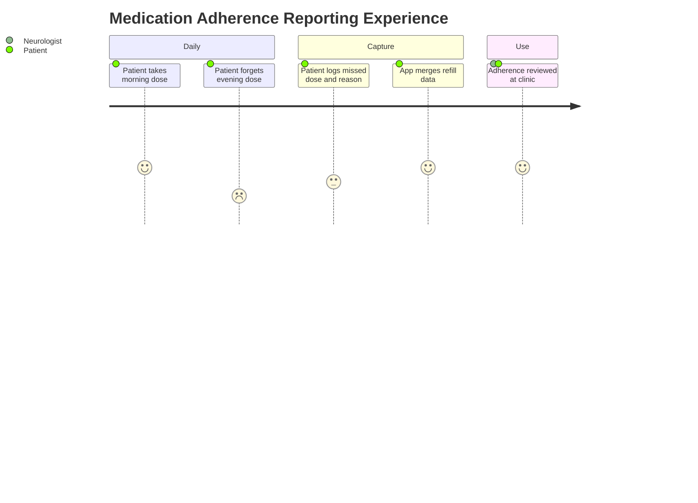

# Patient Self-Report — Section 3: Adherence Self-Report (EP001)

> **Why (this doc):** Self-reported medication-taking behaviour explains breakthrough seizures that clinical data alone cannot; it captures how consistently the patient actually takes his anti-seizure medication (ASM) and why doses are missed. **How:** Patient EP001 reports adherence behaviour into a fixed variable/value table that is reconciled with the medication plan and feeds the downstream patient-reported-outcome (PRO) vector.

**Problem:** Breakthrough seizures despite an adequate prescribed regimen are often driven by unreported non-adherence, which clinician records rarely quantify.

**Research Objective:** Capture standardized, first-person adherence variables for EP001 so real-world medication-taking behaviour can be linked to seizure control and treatment-response data.

**Role:** Patient · **Type:** Primary (patient-reported outcome) data

*Caption - First-person medication adherence variables reported by EP001. These values expose the behavioural gap between prescribed and taken ASM that helps explain breakthrough seizures.*

| Variable | Value |
|---|---|
| Prescribed Regimen (my understanding) | Carbamazepine 400 mg twice daily |
| Second ASM | Levetiracetam 500 mg twice daily |
| My Adherence (self-estimate) | 88% of doses |
| Doses I Usually Miss | Evening dose |
| Main Reason I Miss | Busy at work, forget |
| Second Reason | Away from home / travel |
| Do I Use Reminders | Phone alarm, sometimes ignore |
| Do I Use a Pillbox | Yes, weekly organizer |
| Missed Doses Last 2 Weeks | About 3 |
| Ever Stop When Feeling Well | No, I keep taking it |
| Confidence Taking Correctly | High for morning, medium for evening |
| Refill On Time | Yes, mail pharmacy |

## Severity Scenario Model — Patient View

*Caption - The same self-report across four epilepsy severity levels from the patient's point of view; each self-reported variable shifts with severity. EP001 corresponds to Level 3 (Severe). Level 4 is the operational emergency — status epilepticus with seizures recurring about every 5 minutes.*

### Level 1 — Mild (Well-Controlled)
| Variable | Value |
|---|---|
| Prescribed Regimen (my understanding) | Single ASM, low dose |
| Second ASM | None |
| My Adherence (self-estimate) | ~100% of doses |
| Doses I Usually Miss | None |
| Main Reason I Miss | N/A |
| Second Reason | N/A |
| Do I Use Reminders | Habit, no reminder needed |
| Do I Use a Pillbox | Yes |
| Missed Doses Last 2 Weeks | 0 |
| Ever Stop When Feeling Well | No |
| Confidence Taking Correctly | High, both doses |
| Refill On Time | Yes |

### Level 2 — Moderate (Intermediate)
| Variable | Value |
|---|---|
| Prescribed Regimen (my understanding) | Carbamazepine 400 mg twice daily |
| Second ASM | None |
| My Adherence (self-estimate) | ~95% of doses |
| Doses I Usually Miss | Occasional evening |
| Main Reason I Miss | Occasionally forget |
| Second Reason | Rare travel |
| Do I Use Reminders | Phone alarm |
| Do I Use a Pillbox | Yes, weekly organizer |
| Missed Doses Last 2 Weeks | About 1 |
| Ever Stop When Feeling Well | No |
| Confidence Taking Correctly | High |
| Refill On Time | Yes |

### Level 3 — Severe (Poorly Controlled) — EP001
| Variable | Value |
|---|---|
| Prescribed Regimen (my understanding) | Carbamazepine 400 mg twice daily |
| Second ASM | Levetiracetam 500 mg twice daily |
| My Adherence (self-estimate) | 88% of doses |
| Doses I Usually Miss | Evening dose |
| Main Reason I Miss | Busy at work, forget |
| Second Reason | Away from home / travel |
| Do I Use Reminders | Phone alarm, sometimes ignore |
| Do I Use a Pillbox | Yes, weekly organizer |
| Missed Doses Last 2 Weeks | About 3 |
| Ever Stop When Feeling Well | No, I keep taking it |
| Confidence Taking Correctly | High for morning, medium for evening |
| Refill On Time | Yes, mail pharmacy |

### Level 4 — Refractory / Status Epilepticus (Operational Emergency)
| Variable | Value |
|---|---|
| Prescribed Regimen (my understanding) | IV/rescue meds in hospital |
| Second ASM | Multiple ASMs + emergency benzodiazepine |
| My Adherence (self-estimate) | Cannot self-administer during status |
| Doses I Usually Miss | N/A — clinician-administered |
| Main Reason I Miss | Unconscious during status |
| Second Reason | N/A |
| Do I Use Reminders | N/A |
| Do I Use a Pillbox | N/A |
| Missed Doses Last 2 Weeks | Possible missed doses preceded crisis |
| Ever Stop When Feeling Well | N/A |
| Confidence Taking Correctly | N/A — report by proxy |
| Refill On Time | N/A |

### Severity Classification Logic

**Reason:** To show how self-reported adherence behaviour scales across severity. **Why:** Because missed-dose patterns and regimen complexity grow as control worsens. **What is happening:** EP001 reports 88% adherence with an evening-dose gap at Level 3, while Level 4 removes self-administration entirely. **How it is happening:** Widening adherence gaps and polytherapy move the patient down the ladder until clinicians administer rescue medication. **Reference:** Fisher et al. (2017).

## Data Flow in the Pipeline

**Reason:** To show where adherence behaviour enters and travels through the pipeline. **Why:** Because the gap between prescribed and taken doses is only knowable from the patient. **What is happening:** Daily dosing behaviour becomes structured adherence variables that join the clinical vector. **How it is happening:** EP001 reports adherence that is mapped to standardized fields and reconciled with the medication plan. **Reference:** Fisher et al. (2017).

## Role Capturing the Data

**Reason:** To make explicit that the patient reports adherence behaviour. **Why:** Because behavioural provenance must be attributed to the patient, supported by refill data. **What is happening:** EP001 self-reports adherence, corroborated by refill timing, which the neurologist reviews. **How it is happening:** The app combines self-report with refill signal into a summary read back to the patient. **Reference:** Topol (2019).

## Linkage to Other Assessment Sections

**Reason:** To show how adherence connects to the wider PRO vector. **Why:** Because missed doses must correlate with breakthrough events and side-effect burden. **What is happening:** Adherence links laterally to diary and side-effect sections and feeds the composite PRO vector. **How it is happening:** Shared patient identifiers join these sections into one record. **Reference:** Topol (2019).

## Patient and Role Experience

**Reason:** To surface the lived experience of taking daily ASM. **Why:** Because work routine and evening timing drive the missed-dose pattern. **What is happening:** EP001's honest reporting reveals a consistent evening-dose gap. **How it is happening:** A pillbox plus phone alarms partially close the gap while self-report keeps the barrier visible. **Reference:** APA (2020).

## Professor Readiness (Defense Q&A)

**Q1: Why trust self-reported adherence when patients overestimate it?** Self-report is combined with refill timing and diary missed-dose flags, so the 88% self-estimate is triangulated rather than taken at face value.

**Q2: How does adherence connect to breakthrough seizures?** The evening-dose gap coincides with late-day and nocturnal events in the diary, giving a behavioural explanation for breakthrough seizures despite an adequate regimen.

**Q3: What makes this actionable?** Capturing the specific barrier (busy at work, evening dose) targets the intervention — reminder timing and routine anchoring — rather than assuming the regimen itself is inadequate.

## References

American Psychological Association. (2020). *Publication manual of the American Psychological Association* (7th ed.). American Psychological Association. https://doi.org/10.1037/0000165-000

Fisher, R. S., Cross, J. H., French, J. A., Higurashi, N., Hirsch, E., Jansen, F. E., Lagae, L., Moshé, S. L., Peltola, J., Roulet Perez, E., Scheffer, I. E., & Zuberi, S. M. (2017). Operational classification of seizure types by the International League Against Epilepsy. *Epilepsia, 58*(4), 522–530. https://doi.org/10.1111/epi.13670

Cramer, J. A., Perrine, K., Devinsky, O., Bryant-Comstock, L., Meador, K., & Hermann, B. (1998). Development and cross-cultural translations of a 31-item quality of life in epilepsy inventory (QOLIE-31). *Epilepsia, 39*(1), 81–88. https://doi.org/10.1111/j.1528-1157.1998.tb01278.x
