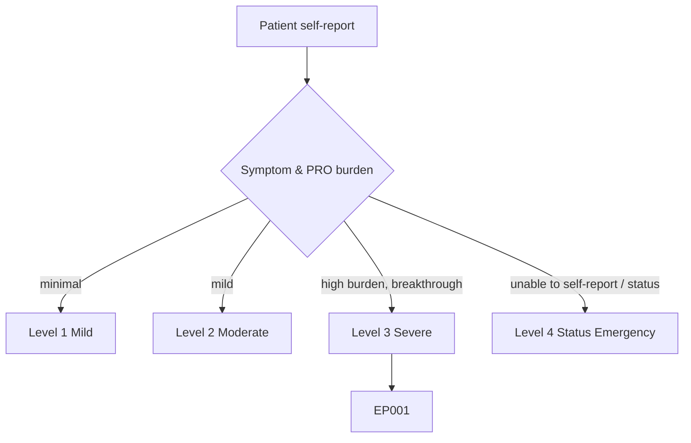
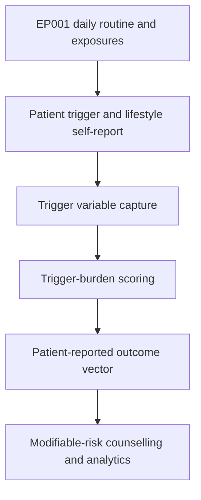
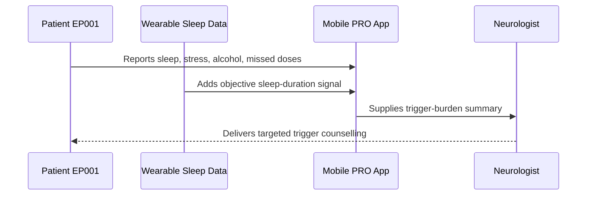
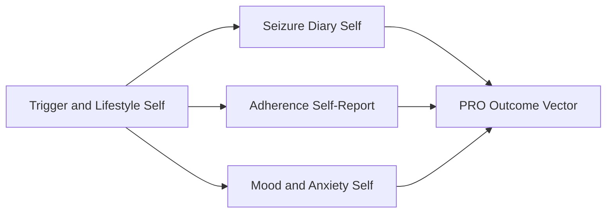
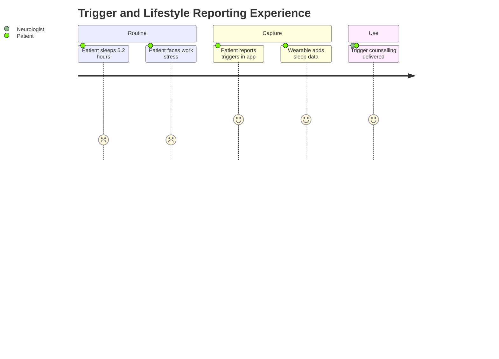

# Patient Self-Report — Section 4: Trigger & Lifestyle Self-Report (EP001)

> **Why (this doc):** The patient's own view of what provokes his seizures and how he lives day to day is the primary source of modifiable-risk information; triggers such as poor sleep and stress are only fully visible from lived routine. **How:** Patient EP001 reports triggers and lifestyle factors into a fixed variable/value table that feeds the downstream patient-reported-outcome (PRO) vector and trigger-burden scoring.

**Problem:** Modifiable seizure triggers (sleep deprivation, stress, alcohol, missed doses) go under-addressed when they are not systematically self-reported.

**Research Objective:** Capture standardized, first-person trigger and lifestyle variables for EP001 so modifiable risk can be quantified and linked to seizure frequency and outcome data.

**Role:** Patient · **Type:** Primary (patient-reported outcome) data

*Caption - First-person trigger and lifestyle variables reported by EP001. These values quantify modifiable seizure risk and feed the trigger-burden score used in counselling and analytics.*

| Variable | Value |
|---|---|
| Sleep I Usually Get | About 5.2 hours/night |
| Sleep Quality (my rating) | Poor |
| Work Stress Level | High (deadlines) |
| Alcohol | Occasionally, weekends |
| Missed Dose As Trigger | Sometimes, evening dose |
| Caffeine | 3–4 coffees/day |
| Screen Time Before Bed | High, late nights |
| Trigger I Notice Most | Poor sleep |
| Second Trigger | Work stress |
| Exercise | Light, irregular |
| Trigger Burden (my sense) | High |
| Willing To Change | Sleep schedule first |

## Questionnaire (Enterprise Form)

*Caption - The self-report questions the patient answers for this section, with response type, validation, EP001's example answer, and the derived AI feature.*

| ID | Question | Response Type | Validation | EP001 (Example) | AI Feature |
|---|---|---|---|---|---|
| PAT-0401 | How many hours of sleep do I usually get? | Number | Decimal 0–14 hrs/night | About 5.2 hours/night | average_sleep_hours |
| PAT-0402 | How would I rate my sleep quality? | Dropdown[Very poor/Poor/Fair/Good/Excellent] | Ordered category | Poor | sleep_quality_rating |
| PAT-0403 | How high is my work stress level? | Dropdown[None/Low/Moderate/High/Very high] | Ordered category | High (deadlines) | work_stress_level |
| PAT-0404 | How often do I drink alcohol? | Dropdown[Never/Occasionally/Weekly/Daily] | Ordered category | Occasionally, weekends | alcohol_frequency |
| PAT-0405 | Does a missed dose act as a trigger for me? | Dropdown[Never/Rarely/Sometimes/Often/Always] | Ordered category | Sometimes, evening dose | missed_dose_trigger_flag |
| PAT-0406 | How much caffeine do I consume daily? | Number | Integer 0–12 cups/day | 3–4 coffees/day | daily_caffeine_intake |
| PAT-0407 | How much screen time do I have before bed? | Dropdown[None/Low/Moderate/High] | Ordered category | High, late nights | pre_sleep_screen_time |
| PAT-0408 | Which trigger do I notice most? | Text | Free-text ≤120 chars | Poor sleep | primary_trigger |
| PAT-0409 | What is my second most noticed trigger? | Text | Free-text ≤120 chars | Work stress | secondary_trigger |
| PAT-0410 | How much do I exercise? | Dropdown[None/Light/Moderate/Regular] | Ordered category | Light, irregular | exercise_level |
| PAT-0411 | How would I rate my overall trigger burden? | Dropdown[Low/Moderate/High/Very high] | Ordered category | High | trigger_burden_score |
| PAT-0412 | What am I most willing to change? | Text | Free-text ≤120 chars | Sleep schedule first | modifiable_change_priority |

## Severity Scenario Model — Patient View

*Caption - The same self-report across four epilepsy severity levels from the patient's point of view; each self-reported variable shifts with severity. EP001 corresponds to Level 3 (Severe). Level 4 is the operational emergency — status epilepticus with seizures recurring about every 5 minutes.*

### Level 1 — Mild (Well-Controlled)
| Variable | Value |
|---|---|
| Sleep I Usually Get | 7–8 hours/night |
| Sleep Quality (my rating) | Good |
| Work Stress Level | Low–moderate |
| Alcohol | Rare / none |
| Missed Dose As Trigger | No |
| Caffeine | 1 coffee/day |
| Screen Time Before Bed | Low |
| Trigger I Notice Most | None obvious |
| Second Trigger | None |
| Exercise | Regular |
| Trigger Burden (my sense) | Low |
| Willing To Change | Maintain habits |

### Level 2 — Moderate (Intermediate)
| Variable | Value |
|---|---|
| Sleep I Usually Get | About 6.5 hours/night |
| Sleep Quality (my rating) | Fair |
| Work Stress Level | Moderate |
| Alcohol | Occasionally |
| Missed Dose As Trigger | Rarely |
| Caffeine | 2 coffees/day |
| Screen Time Before Bed | Moderate |
| Trigger I Notice Most | Occasional poor sleep |
| Second Trigger | Mild stress |
| Exercise | Some, semi-regular |
| Trigger Burden (my sense) | Moderate |
| Willing To Change | Improve sleep |

### Level 3 — Severe (Poorly Controlled) — EP001
| Variable | Value |
|---|---|
| Sleep I Usually Get | About 5.2 hours/night |
| Sleep Quality (my rating) | Poor |
| Work Stress Level | High (deadlines) |
| Alcohol | Occasionally, weekends |
| Missed Dose As Trigger | Sometimes, evening dose |
| Caffeine | 3–4 coffees/day |
| Screen Time Before Bed | High, late nights |
| Trigger I Notice Most | Poor sleep |
| Second Trigger | Work stress |
| Exercise | Light, irregular |
| Trigger Burden (my sense) | High |
| Willing To Change | Sleep schedule first |

### Level 4 — Refractory / Status Epilepticus (Operational Emergency)
| Variable | Value |
|---|---|
| Sleep I Usually Get | Severe deprivation preceding crisis |
| Sleep Quality (my rating) | Very poor / none |
| Work Stress Level | Extreme / overwhelmed |
| Alcohol | Possible binge / withdrawal trigger |
| Missed Dose As Trigger | Yes — missed doses preceding status |
| Caffeine | Excessive |
| Screen Time Before Bed | Very high |
| Trigger I Notice Most | Cannot report during status |
| Second Trigger | Multiple stacked triggers |
| Exercise | None |
| Trigger Burden (my sense) | Maximal (retrospective / proxy) |
| Willing To Change | Post-crisis; urgent trigger control |

### Severity Classification Logic

**Reason:** To show how self-reported triggers and lifestyle load scale across severity. **Why:** Because sleep deficit, stress, and stacked triggers intensify as control worsens. **What is happening:** EP001 reports high trigger burden driven by 5.2-hour sleep at Level 3, while Level 4 reflects maximal stacked triggers reported only in hindsight. **How it is happening:** Accumulating modifiable triggers move the patient down the ladder until a crisis makes self-report impossible. **Reference:** Fisher et al. (2017).

## Data Flow in the Pipeline

**Reason:** To show where trigger and lifestyle data enters and travels through the pipeline. **Why:** Because modifiable risk is only visible from the patient's lived routine. **What is happening:** Daily exposures become structured trigger variables that populate the PRO vector and burden score. **How it is happening:** EP001 reports routine factors that are mapped to standardized fields and scored for burden. **Reference:** Fisher et al. (2017).

## Role Capturing the Data

**Reason:** To make explicit that the patient reports trigger and lifestyle factors. **Why:** Because behavioural and lifestyle provenance belongs to the patient, supported by wearable data. **What is happening:** EP001 self-reports triggers, corroborated by wearable sleep signal, which the neurologist reviews. **How it is happening:** The app fuses self-report with objective sleep data into a burden summary. **Reference:** Topol (2019).

## Linkage to Other Assessment Sections

**Reason:** To show how triggers connect to the wider PRO vector. **Why:** Because sleep deficit and stress must correlate with event timing, adherence, and mood. **What is happening:** Trigger factors link laterally to diary, adherence, and mood sections and feed the composite PRO vector. **How it is happening:** Shared patient identifiers join these sections into one record. **Reference:** Topol (2019).

## Patient and Role Experience

**Reason:** To surface the lived experience behind modifiable triggers. **Why:** Because work demands and short sleep drive EP001's high trigger burden. **What is happening:** EP001's routine is captured honestly, exposing sleep as the top modifiable target. **How it is happening:** Combined self-report and wearable data make the sleep deficit concrete and actionable. **Reference:** APA (2020).

## Professor Readiness (Defense Q&A)

**Q1: Why prioritize sleep among EP001's triggers?** Self-report and wearable data converge on a 5.2-hour average with poor quality, and sleep deprivation is a well-established provoking factor, making it the highest-yield modifiable target.

**Q2: How is trigger burden scored as High?** Multiple concurrent triggers (short sleep, high stress, occasional alcohol, occasional missed doses) combine into a composite burden rated High, consistent with the patient's own sense.

**Q3: Why capture willingness to change?** Recording that EP001 will address sleep first aligns the intervention with patient motivation, improving the odds that counselling changes behaviour.

## References

American Psychological Association. (2020). *Publication manual of the American Psychological Association* (7th ed.). American Psychological Association. https://doi.org/10.1037/0000165-000

Fisher, R. S., Cross, J. H., French, J. A., Higurashi, N., Hirsch, E., Jansen, F. E., Lagae, L., Moshé, S. L., Peltola, J., Roulet Perez, E., Scheffer, I. E., & Zuberi, S. M. (2017). Operational classification of seizure types by the International League Against Epilepsy. *Epilepsia, 58*(4), 522–530. https://doi.org/10.1111/epi.13670

Topol, E. J. (2019). *Deep medicine: How artificial intelligence can make healthcare human again*. Basic Books.
