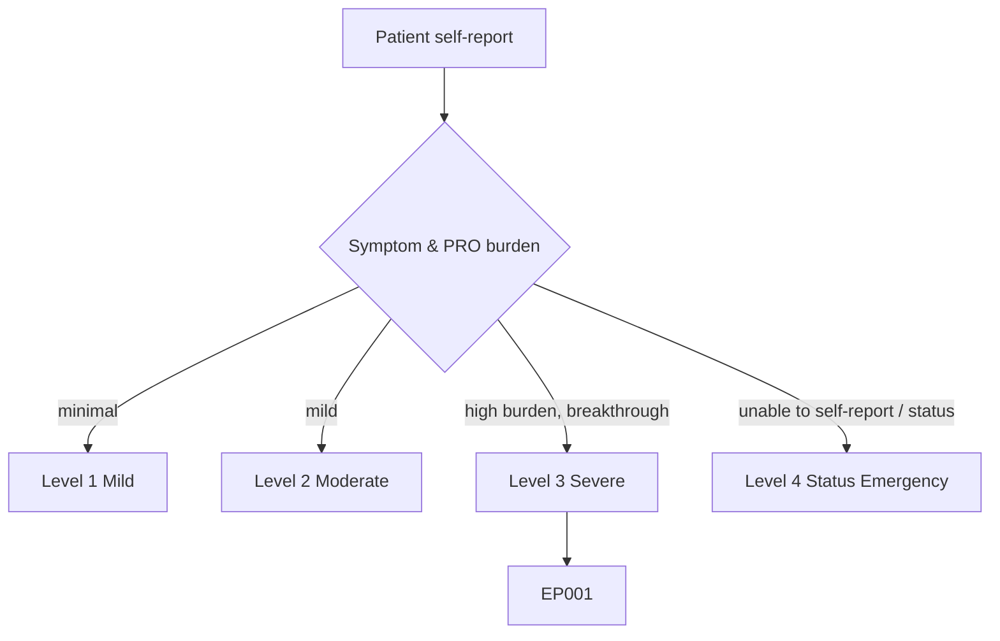
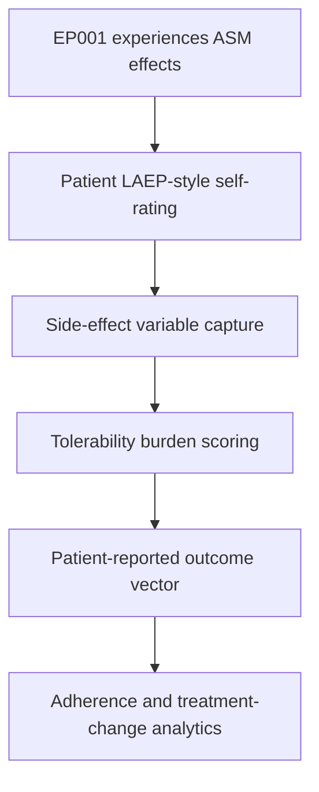
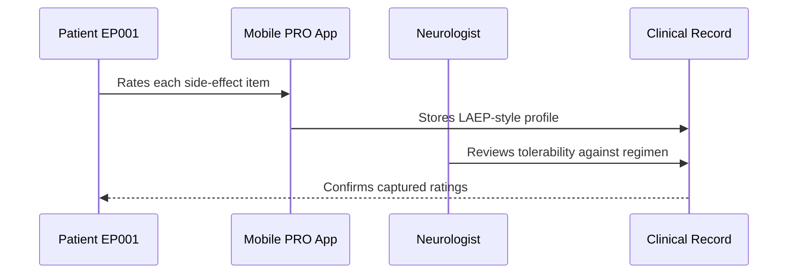
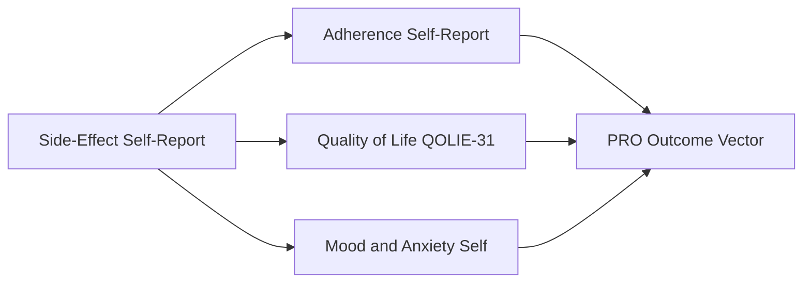
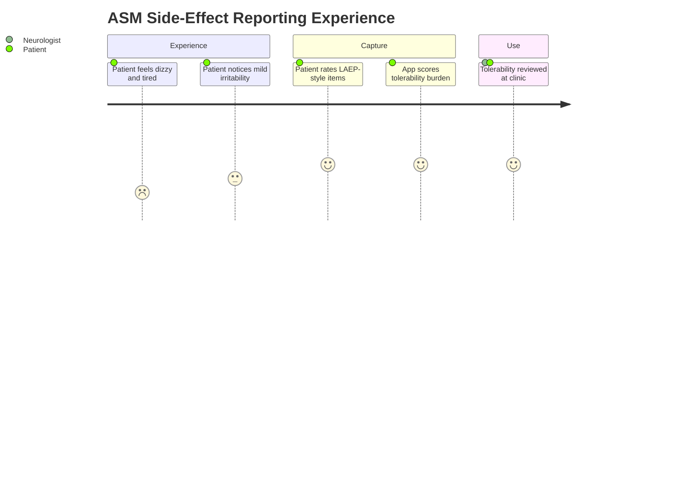

# Patient Self-Report — Section 5: ASM Side-Effect Self-Report (LAEP-style) (EP001)

> **Why (this doc):** The patient is the only reliable source for the felt burden of anti-seizure medication (ASM) side effects; a Liverpool Adverse Events Profile (LAEP)-style checklist captures the toxicity that shapes tolerability and adherence. **How:** Patient EP001 rates side effects on a structured LAEP-style scale captured into a fixed variable/value table that feeds the downstream patient-reported-outcome (PRO) vector.

**Problem:** Under-reported ASM side effects erode adherence and quality of life, yet clinician records rarely quantify the patient's felt toxicity burden.

**Research Objective:** Capture standardized, first-person ASM side-effect variables for EP001 so treatment tolerability can be quantified and linked to adherence and quality-of-life data.

**Role:** Patient · **Type:** Primary (patient-reported outcome) data

*Caption - LAEP-style side-effect ratings reported by EP001 (rated: Never / Rarely / Sometimes / Always as a felt burden). These values quantify ASM tolerability that drives adherence and treatment-change decisions.*

| Variable | Value |
|---|---|
| Dizziness / Unsteadiness | Sometimes |
| Tiredness / Fatigue | Sometimes |
| Irritability | Rarely–Sometimes (mild) |
| Difficulty Concentrating | Sometimes |
| Memory Problems | Rarely |
| Headache | Rarely |
| Sleepiness | Sometimes |
| Shaky Hands (tremor) | Never |
| Blurred / Double Vision | Rarely |
| Mood Feeling Low | Rarely |
| Overall Side-Effect Burden (my sense) | Moderate |
| Side Effect That Bothers Me Most | Dizziness |
| Do Side Effects Affect Adherence | Occasionally skip when very tired |

## Severity Scenario Model — Patient View

*Caption - The same self-report across four epilepsy severity levels from the patient's point of view; each self-reported variable shifts with severity. EP001 corresponds to Level 3 (Severe). Level 4 is the operational emergency — status epilepticus with seizures recurring about every 5 minutes.*

### Level 1 — Mild (Well-Controlled)
| Variable | Value |
|---|---|
| Dizziness / Unsteadiness | Never |
| Tiredness / Fatigue | Never |
| Irritability | Never |
| Difficulty Concentrating | Never |
| Memory Problems | Never |
| Headache | Never |
| Sleepiness | Never |
| Shaky Hands (tremor) | Never |
| Blurred / Double Vision | Never |
| Mood Feeling Low | Never |
| Overall Side-Effect Burden (my sense) | None |
| Side Effect That Bothers Me Most | None |
| Do Side Effects Affect Adherence | No |

### Level 2 — Moderate (Intermediate)
| Variable | Value |
|---|---|
| Dizziness / Unsteadiness | Rarely |
| Tiredness / Fatigue | Rarely |
| Irritability | Rarely |
| Difficulty Concentrating | Rarely |
| Memory Problems | Never |
| Headache | Rarely |
| Sleepiness | Rarely |
| Shaky Hands (tremor) | Never |
| Blurred / Double Vision | Never |
| Mood Feeling Low | Rarely |
| Overall Side-Effect Burden (my sense) | Mild |
| Side Effect That Bothers Me Most | Mild tiredness |
| Do Side Effects Affect Adherence | No |

### Level 3 — Severe (Poorly Controlled) — EP001
| Variable | Value |
|---|---|
| Dizziness / Unsteadiness | Sometimes |
| Tiredness / Fatigue | Sometimes |
| Irritability | Rarely–Sometimes (mild) |
| Difficulty Concentrating | Sometimes |
| Memory Problems | Rarely |
| Headache | Rarely |
| Sleepiness | Sometimes |
| Shaky Hands (tremor) | Never |
| Blurred / Double Vision | Rarely |
| Mood Feeling Low | Rarely |
| Overall Side-Effect Burden (my sense) | Moderate |
| Side Effect That Bothers Me Most | Dizziness |
| Do Side Effects Affect Adherence | Occasionally skip when very tired |

### Level 4 — Refractory / Status Epilepticus (Operational Emergency)
| Variable | Value |
|---|---|
| Dizziness / Unsteadiness | Cannot report (unconscious) |
| Tiredness / Fatigue | Profound post-status exhaustion |
| Irritability | N/A during status |
| Difficulty Concentrating | Severe post-ictal, cannot assess |
| Memory Problems | Marked post-status |
| Headache | Severe post-status |
| Sleepiness | Prolonged post-ictal unresponsiveness |
| Shaky Hands (tremor) | From high-dose rescue meds |
| Blurred / Double Vision | Cannot report |
| Mood Feeling Low | Cannot report during crisis |
| Overall Side-Effect Burden (my sense) | Not self-assessable — by proxy |
| Side Effect That Bothers Me Most | Cannot self-report during status |
| Do Side Effects Affect Adherence | N/A — clinician-administered |

### Severity Classification Logic

**Reason:** To show how self-rated ASM side-effect burden scales across severity. **Why:** Because felt toxicity rises with regimen intensity and worsening control. **What is happening:** EP001 reports a moderate LAEP-style burden led by dizziness at Level 3, while Level 4 leaves toxicity assessable only by proxy. **How it is happening:** Increasing dose load and polytherapy raise the side-effect burden until status removes the patient's ability to rate it. **Reference:** Cramer et al. (1998).

## Data Flow in the Pipeline

**Reason:** To show where side-effect data enters and travels through the pipeline. **Why:** Because felt toxicity is only knowable from the patient. **What is happening:** Experienced effects become structured LAEP-style ratings that populate the PRO vector. **How it is happening:** EP001 rates each item and the app scores an overall tolerability burden passed forward. **Reference:** Fisher et al. (2017).

## Role Capturing the Data

**Reason:** To make explicit that the patient rates side effects. **Why:** Because toxicity provenance belongs to the patient experiencing it. **What is happening:** EP001 self-rates effects that the neurologist reviews against the ASM regimen. **How it is happening:** The app transcribes ratings into a stored profile read back for confirmation. **Reference:** Topol (2019).

## Linkage to Other Assessment Sections

**Reason:** To show how side effects connect to the wider PRO vector. **Why:** Because tolerability must correlate with adherence, mood, and quality of life. **What is happening:** Side-effect ratings link laterally to adherence, QoL, and mood sections and feed the composite PRO vector. **How it is happening:** Shared patient identifiers join these sections into one record. **Reference:** Topol (2019).

## Patient and Role Experience

**Reason:** To surface the lived experience of ASM side effects. **Why:** Because felt dizziness and fatigue shape whether EP001 keeps taking his medication. **What is happening:** EP001's toxicity burden is captured as a structured, moderate-burden profile. **How it is happening:** A familiar LAEP-style checklist makes felt effects reportable and comparable over time. **Reference:** APA (2020).

## Professor Readiness (Defense Q&A)

**Q1: Why use a LAEP-style instrument?** The Liverpool Adverse Events Profile is a validated, epilepsy-specific self-report of ASM toxicity, giving a standardized and comparable measure of felt side-effect burden.

**Q2: How do side effects link to adherence?** EP001 reports occasionally skipping doses when very tired, so quantified toxicity provides a behavioural mechanism connecting tolerability to the evening-dose adherence gap.

**Q3: Why does this matter for treatment change?** A moderate burden dominated by dizziness on carbamazepine plus levetiracetam informs whether dose timing, dose reduction, or a regimen change is warranted.

## References

American Psychological Association. (2020). *Publication manual of the American Psychological Association* (7th ed.). American Psychological Association. https://doi.org/10.1037/0000165-000

Fisher, R. S., Cross, J. H., French, J. A., Higurashi, N., Hirsch, E., Jansen, F. E., Lagae, L., Moshé, S. L., Peltola, J., Roulet Perez, E., Scheffer, I. E., & Zuberi, S. M. (2017). Operational classification of seizure types by the International League Against Epilepsy. *Epilepsia, 58*(4), 522–530. https://doi.org/10.1111/epi.13670

Cramer, J. A., Perrine, K., Devinsky, O., Bryant-Comstock, L., Meador, K., & Hermann, B. (1998). Development and cross-cultural translations of a 31-item quality of life in epilepsy inventory (QOLIE-31). *Epilepsia, 39*(1), 81–88. https://doi.org/10.1111/j.1528-1157.1998.tb01278.x
