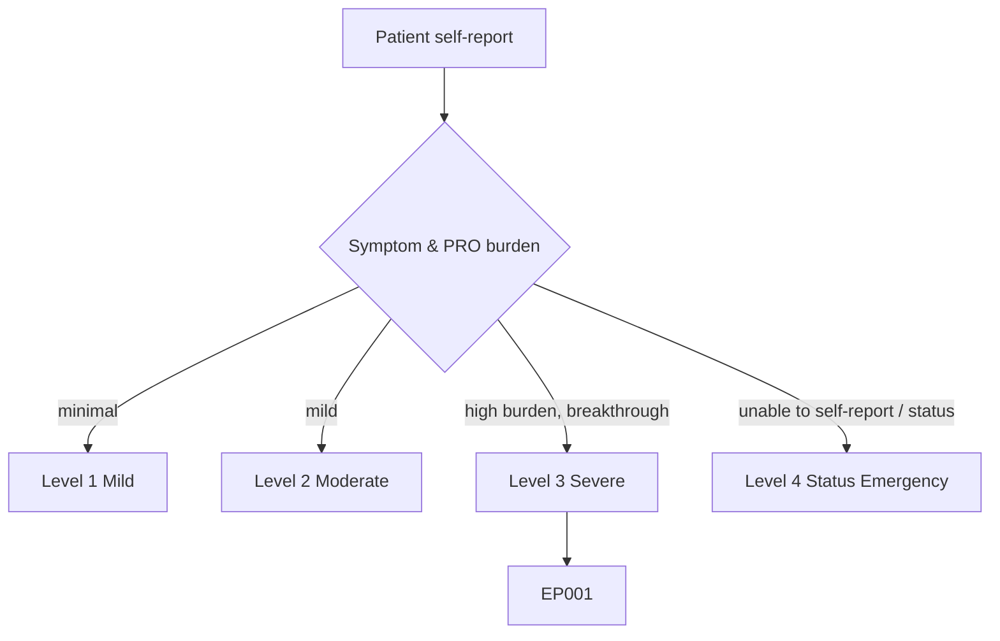
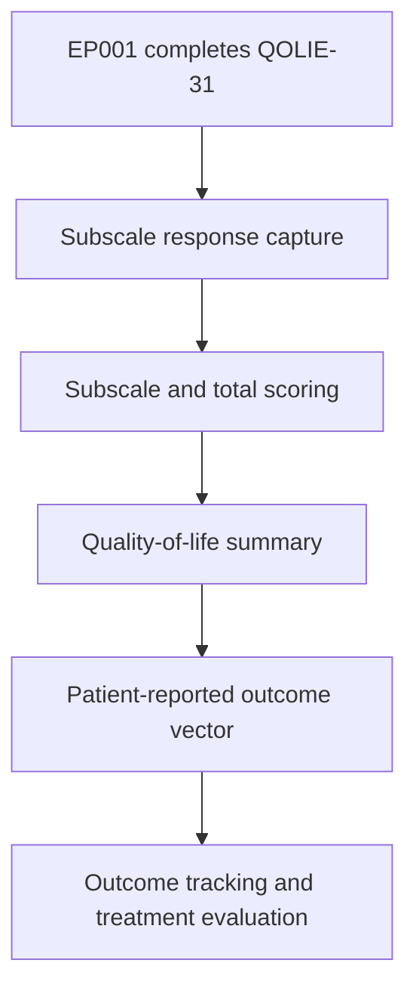
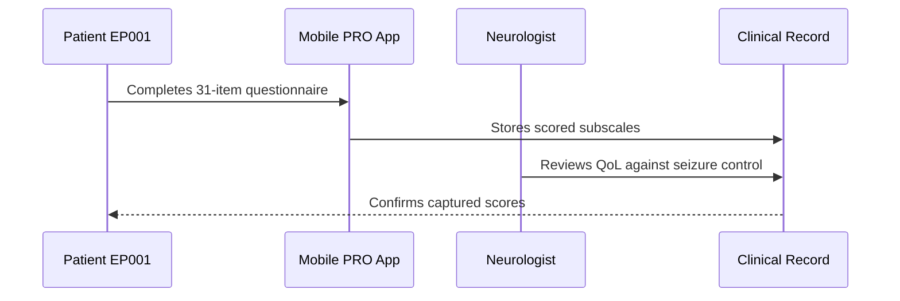
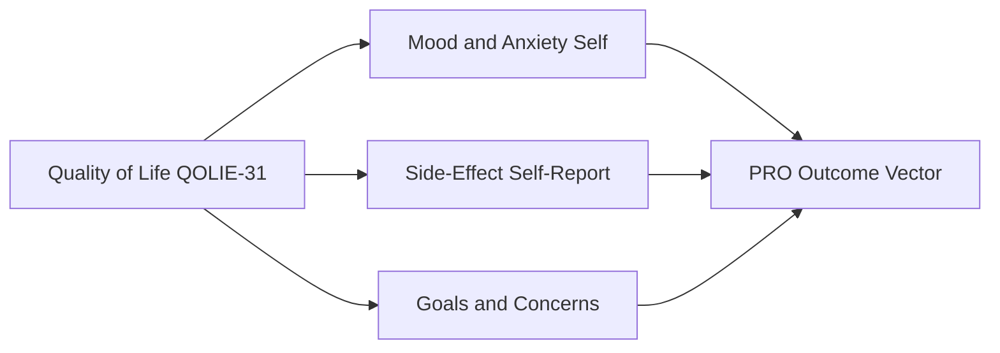
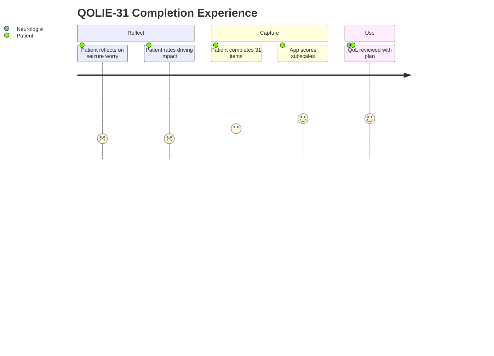

# Patient Self-Report — Section 6: Quality of Life (QOLIE-31) (EP001)

> **Why (this doc):** Quality of life is the ultimate patient-centred outcome in epilepsy; the QOLIE-31 is the validated, epilepsy-specific instrument that quantifies how seizures and treatment affect daily living. **How:** Patient EP001 completes the QOLIE-31 subscales, captured into a fixed variable/value table that feeds the downstream patient-reported-outcome (PRO) vector.

**Problem:** Seizure counts alone do not capture the daily-living impact of epilepsy, so treatment success cannot be judged without a validated quality-of-life measure.

**Research Objective:** Capture standardized QOLIE-31 subscale scores for EP001 so overall quality of life can be quantified and linked to seizure control, side effects, and mood data.

**Role:** Patient · **Type:** Primary (patient-reported outcome) data

*Caption - QOLIE-31 subscale scores self-reported by EP001 (0–100, higher = better quality of life). These values quantify the daily-living impact of epilepsy that defines patient-centred treatment success.*

| Variable | Value |
|---|---|
| Seizure Worry | 42 (frequent worry) |
| Overall Quality of Life | 55 (moderately reduced) |
| Emotional Well-Being | 58 |
| Energy / Fatigue | 48 |
| Cognitive Functioning | 52 |
| Medication Effects | 50 |
| Social Functioning | 60 |
| QOLIE-31 Total Score | 53 (moderately reduced) |
| Biggest QoL Impact | Cannot drive independently |
| Second Impact | Seizure worry at work |
| Assessment Date | 2026-07-08 |
| Change Since Last (3-mo) | Slightly worse |

## Questionnaire (Enterprise Form)

*Caption - The self-report questions the patient answers for this section, with response type, validation, EP001's example answer, and the derived AI feature.*

| ID | Question | Response Type | Validation | EP001 (Example) | AI Feature |
|---|---|---|---|---|---|
| PAT-0601 | How much do I worry about having seizures? | Number | QOLIE-31 0–100 | 42 (frequent worry) | qolie_seizure_worry |
| PAT-0602 | How would I rate my overall quality of life? | Number | QOLIE-31 0–100 | 55 (moderately reduced) | qolie_overall_qol |
| PAT-0603 | How is my emotional well-being? | Number | QOLIE-31 0–100 | 58 | qolie_emotional_wellbeing |
| PAT-0604 | How are my energy and fatigue levels? | Number | QOLIE-31 0–100 | 48 | qolie_energy_fatigue |
| PAT-0605 | How is my cognitive functioning? | Number | QOLIE-31 0–100 | 52 | qolie_cognitive_function |
| PAT-0606 | How much do medication effects bother me? | Number | QOLIE-31 0–100 | 50 | qolie_medication_effects |
| PAT-0607 | How is my social functioning? | Number | QOLIE-31 0–100 | 60 | qolie_social_function |
| PAT-0608 | What is my QOLIE-31 total score? | Read-only(Auto) | QOLIE-31 0–100 | 53 (moderately reduced) | qolie_total_score |
| PAT-0609 | What has the biggest impact on my quality of life? | Text | Free-text ≤120 chars | Cannot drive independently | primary_qol_impact |
| PAT-0610 | What has the second biggest impact? | Text | Free-text ≤120 chars | Seizure worry at work | secondary_qol_impact |
| PAT-0611 | When did I complete this assessment? | Date | ISO date ≤ today | 2026-07-08 | assessment_date |
| PAT-0612 | How has my quality of life changed since last time? | Dropdown[Much better/Slightly better/Same/Slightly worse/Much worse] | Ordered category | Slightly worse | qol_change_trend |

## Severity Scenario Model — Patient View

*Caption - The same self-report across four epilepsy severity levels from the patient's point of view; each self-reported variable shifts with severity. EP001 corresponds to Level 3 (Severe). Level 4 is the operational emergency — status epilepticus with seizures recurring about every 5 minutes.*

### Level 1 — Mild (Well-Controlled)
| Variable | Value |
|---|---|
| Seizure Worry | 88 (little worry) |
| Overall Quality of Life | 90 |
| Emotional Well-Being | 88 |
| Energy / Fatigue | 85 |
| Cognitive Functioning | 88 |
| Medication Effects | 90 |
| Social Functioning | 92 |
| QOLIE-31 Total Score | 89 (high) |
| Biggest QoL Impact | Minimal |
| Second Impact | None |
| Assessment Date | 2026-07-08 |
| Change Since Last (3-mo) | Stable |

### Level 2 — Moderate (Intermediate)
| Variable | Value |
|---|---|
| Seizure Worry | 68 |
| Overall Quality of Life | 74 |
| Emotional Well-Being | 72 |
| Energy / Fatigue | 68 |
| Cognitive Functioning | 72 |
| Medication Effects | 70 |
| Social Functioning | 76 |
| QOLIE-31 Total Score | 72 (mildly reduced) |
| Biggest QoL Impact | Occasional seizure worry |
| Second Impact | Mild fatigue |
| Assessment Date | 2026-07-08 |
| Change Since Last (3-mo) | Stable |

### Level 3 — Severe (Poorly Controlled) — EP001
| Variable | Value |
|---|---|
| Seizure Worry | 42 (frequent worry) |
| Overall Quality of Life | 55 (moderately reduced) |
| Emotional Well-Being | 58 |
| Energy / Fatigue | 48 |
| Cognitive Functioning | 52 |
| Medication Effects | 50 |
| Social Functioning | 60 |
| QOLIE-31 Total Score | 53 (moderately reduced) |
| Biggest QoL Impact | Cannot drive independently |
| Second Impact | Seizure worry at work |
| Assessment Date | 2026-07-08 |
| Change Since Last (3-mo) | Slightly worse |

### Level 4 — Refractory / Status Epilepticus (Operational Emergency)
| Variable | Value |
|---|---|
| Seizure Worry | 10 (extreme) |
| Overall Quality of Life | 20 (severely reduced) |
| Emotional Well-Being | 22 |
| Energy / Fatigue | 15 |
| Cognitive Functioning | 20 |
| Medication Effects | 18 |
| Social Functioning | 20 |
| QOLIE-31 Total Score | 19 (severely reduced) |
| Biggest QoL Impact | Hospitalized; loss of independence |
| Second Impact | Cannot work or function |
| Assessment Date | Completed retrospectively / by proxy |
| Change Since Last (3-mo) | Markedly worse |

### Severity Classification Logic

**Reason:** To show how self-reported quality of life scales across severity. **Why:** Because QOLIE-31 subscales fall as seizure control and independence deteriorate. **What is happening:** EP001 reports a moderately reduced total of 53 at Level 3, while Level 4 collapses quality of life into the severe range. **How it is happening:** Rising seizure worry and lost independence lower subscale scores until a crisis makes the questionnaire completable only by proxy. **Reference:** Cramer et al. (1998).

## Data Flow in the Pipeline

**Reason:** To show where quality-of-life data enters and travels through the pipeline. **Why:** Because daily-living impact is only knowable from the patient's own ratings. **What is happening:** QOLIE-31 responses become scored subscales that populate the PRO vector. **How it is happening:** EP001 completes the instrument and the app applies standard scoring passed forward. **Reference:** Cramer et al. (1998).

## Role Capturing the Data

**Reason:** To make explicit that the patient completes the QOLIE-31. **Why:** Because quality-of-life provenance belongs to the patient. **What is happening:** EP001 self-completes the instrument that the neurologist reviews against control. **How it is happening:** The app scores responses into subscales stored and read back for confirmation. **Reference:** Cramer et al. (1998).

## Linkage to Other Assessment Sections

**Reason:** To show how quality of life connects to the wider PRO vector. **Why:** Because QoL must correlate with mood, side-effect burden, and personal goals. **What is happening:** QOLIE-31 subscales link laterally to mood, side-effect, and goals sections and feed the composite PRO vector. **How it is happening:** Shared patient identifiers join these sections into one record. **Reference:** Topol (2019).

## Patient and Role Experience

**Reason:** To surface the lived experience of rating quality of life. **Why:** Because seizure worry and lost driving independence dominate EP001's daily experience. **What is happening:** EP001's felt impact is quantified as a moderately reduced total score. **How it is happening:** A validated 31-item instrument converts lived impact into comparable subscale scores. **Reference:** APA (2020).

## Professor Readiness (Defense Q&A)

**Q1: Why use the QOLIE-31 specifically?** It is a validated, epilepsy-specific quality-of-life inventory (Cramer et al., 1998) with established subscales, making EP001's daily-living impact standardized and comparable over time.

**Q2: What does EP001's total score of 53 mean?** A total near the low-mid range indicates moderately reduced quality of life, driven chiefly by seizure worry and loss of driving independence rather than by seizure count alone.

**Q3: Why track change over time?** The slight worsening since the last assessment flags that current control and side-effect burden are not translating into improved daily living, informing treatment re-evaluation.

## References

American Psychological Association. (2020). *Publication manual of the American Psychological Association* (7th ed.). American Psychological Association. https://doi.org/10.1037/0000165-000

Fisher, R. S., Cross, J. H., French, J. A., Higurashi, N., Hirsch, E., Jansen, F. E., Lagae, L., Moshé, S. L., Peltola, J., Roulet Perez, E., Scheffer, I. E., & Zuberi, S. M. (2017). Operational classification of seizure types by the International League Against Epilepsy. *Epilepsia, 58*(4), 522–530. https://doi.org/10.1111/epi.13670

Cramer, J. A., Perrine, K., Devinsky, O., Bryant-Comstock, L., Meador, K., & Hermann, B. (1998). Development and cross-cultural translations of a 31-item quality of life in epilepsy inventory (QOLIE-31). *Epilepsia, 39*(1), 81–88. https://doi.org/10.1111/j.1528-1157.1998.tb01278.x
